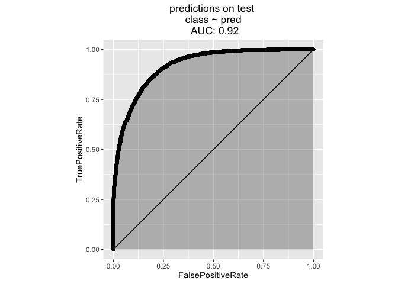
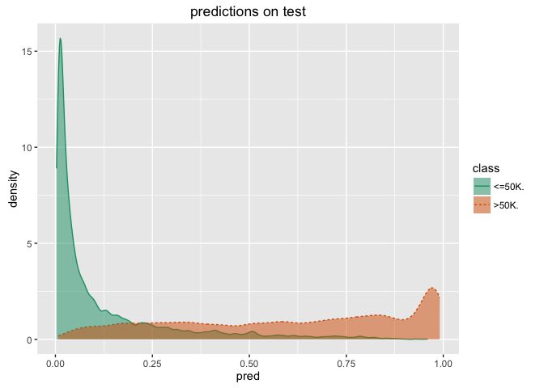

Example showing the [R](https://cran.r-project.org) [vtreat](https://github.com/WinVector/vtreat) variable preparation followed by caret training.

In previous writings we have gone to great lengths to [document, explain and motivate `vtreat`](https://github.com/WinVector/vtreat). That necessarily gets long and unnecessarily feels complicated.

In this example we are going to show what building a predictive model using `vtreat` best practices looks like assuming you are already in the habit if using vtreat for your data preparation step. We are deliberately not going to explain any steps, but just show the small number of steps we advise routinely using. This is a simple schematic, but not a guide. Of course we do not advise use without understanding (and we work hard to teach the concepts in our writing), but here is what small effort is required to add vtreat to your predictive modeling practice.

First we set things up: load libraries, initialize parallel processing.

``` r
library('vtreat')
library('caret')
library('gbm')
library('doMC')
library('WVPlots') # see https://github.com/WinVector/WVPlots

# parallel for vtreat
ncores <- parallel::detectCores()
parallelCluster <- parallel::makeCluster(ncores)
# parallel for caret
registerDoMC(cores=ncores)
```

The we load our data. In our case the data is taken from [here](http://archive.ics.uci.edu/ml/machine-learning-databases/adult/) and you can perform all of these steps if you download the contents of the [example git directory](https://github.com/WinVector/Examples/tree/master/CensusAdultIncomeExample). Obviously this has a lot of moving parts (R, R Markdown, Github, R packages)- but is very easy to do a second time (first time can be a bit of learning and preparation).

``` r
# load data
# data from: http://archive.ics.uci.edu/ml/machine-learning-databases/adult/
colnames <-
  c(
    'age',
    'workclass',
    'fnlwgt',
    'education',
    'education-num',
    'marital-status',
    'occupation',
    'relationship',
    'race',
    'sex',
    'capital-gain',
    'capital-loss',
    'hours-per-week',
    'native-country',
    'class'
  )
dTrain <- read.table(
  'adult.data.txt',
  header = FALSE,
  sep = ',',
  strip.white = TRUE,
  stringsAsFactors = FALSE,
  na.strings = c('NA', '?', '')
)
colnames(dTrain) <- colnames
dTest <- read.table(
  'adult.test.txt',
  skip = 1,
  header = FALSE,
  sep = ',',
  strip.white = TRUE,
  stringsAsFactors = FALSE,
  na.strings = c('NA', '?', '')
)
colnames(dTest) <- colnames
```

Now we use vtreat to prepare the data for analysis. The goal of vtreat is to ensure a ready-to-dance data frame in a statistically valid manner. We are respecting the test/train split and building our data preparation plan only on the training data (though we do apply it to the test data). This step hides a huge number of potential problems through automated repairs:

-   re-encoding missing values
-   dealing with large cardinality categorical variables
-   dealing with novel levels
-   fixing variable/column names to be "R safe"
-   looking for strange column types

``` r
# define problem
yName <- 'class'
yTarget <- '>50K'
varNames <- setdiff(colnames,yName)


# build variable encoding plan and prepare simulated out of sample
# training fame (cross-frame) 
# http://www.win-vector.com/blog/2016/05/vtreat-cross-frames/
cd <- vtreat::mkCrossFrameCExperiment(dTrain,varNames,yName,yTarget,
                                      parallelCluster=parallelCluster)
treatmentPlan <- cd$treatments
scoreFrame <- treatmentPlan$scoreFrame
dTrainTreated <- cd$crossFrame
# pick our variables
newVars <- scoreFrame$varName[scoreFrame$sig<1/nrow(scoreFrame)]
dTestTreated <- vtreat::prepare(treatmentPlan,dTest,
                                pruneSig=NULL,varRestriction=newVars)
print(newVars)
```

    ##  [1] "age_clean"                              
    ##  [2] "workclass_lev_NA"                       
    ##  [3] "workclass_lev_x.Federal.gov"            
    ##  [4] "workclass_lev_x.Local.gov"              
    ##  [5] "workclass_lev_x.Private"                
    ##  [6] "workclass_lev_x.Self.emp.inc"           
    ##  [7] "workclass_lev_x.Self.emp.not.inc"       
    ##  [8] "workclass_lev_x.State.gov"              
    ##  [9] "workclass_catP"                         
    ## [10] "workclass_catB"                         
    ## [11] "education_lev_x.10th"                   
    ## [12] "education_lev_x.11th"                   
    ## [13] "education_lev_x.Bachelors"              
    ## [14] "education_lev_x.HS.grad"                
    ## [15] "education_lev_x.Masters"                
    ## [16] "education_lev_x.Some.college"           
    ## [17] "education_catP"                         
    ## [18] "education_catB"                         
    ## [19] "education.num_clean"                    
    ## [20] "marital.status_lev_x.Divorced"          
    ## [21] "marital.status_lev_x.Married.civ.spouse"
    ## [22] "marital.status_lev_x.Never.married"     
    ## [23] "marital.status_lev_x.Separated"         
    ## [24] "marital.status_lev_x.Widowed"           
    ## [25] "marital.status_catP"                    
    ## [26] "marital.status_catB"                    
    ## [27] "occupation_lev_NA"                      
    ## [28] "occupation_lev_x.Adm.clerical"          
    ## [29] "occupation_lev_x.Exec.managerial"       
    ## [30] "occupation_lev_x.Farming.fishing"       
    ## [31] "occupation_lev_x.Handlers.cleaners"     
    ## [32] "occupation_lev_x.Machine.op.inspct"     
    ## [33] "occupation_lev_x.Other.service"         
    ## [34] "occupation_lev_x.Prof.specialty"        
    ## [35] "occupation_lev_x.Sales"                 
    ## [36] "occupation_lev_x.Tech.support"          
    ## [37] "occupation_lev_x.Transport.moving"      
    ## [38] "occupation_catP"                        
    ## [39] "occupation_catB"                        
    ## [40] "relationship_lev_x.Husband"             
    ## [41] "relationship_lev_x.Not.in.family"       
    ## [42] "relationship_lev_x.Other.relative"      
    ## [43] "relationship_lev_x.Own.child"           
    ## [44] "relationship_lev_x.Unmarried"           
    ## [45] "relationship_lev_x.Wife"                
    ## [46] "relationship_catP"                      
    ## [47] "relationship_catB"                      
    ## [48] "race_lev_x.Black"                       
    ## [49] "race_lev_x.White"                       
    ## [50] "race_catP"                              
    ## [51] "race_catB"                              
    ## [52] "sex_lev_x.Female"                       
    ## [53] "sex_lev_x.Male"                         
    ## [54] "capital.gain_clean"                     
    ## [55] "capital.loss_clean"                     
    ## [56] "hours.per.week_clean"                   
    ## [57] "native.country_lev_x.United.States"     
    ## [58] "native.country_catP"                    
    ## [59] "native.country_catB"

Now we train our model. In this case we are using the caret package to tune parameters.

``` r
# train our model using caret
yForm <- as.formula(paste(yName,paste(newVars,collapse=' + '),sep=' ~ '))
# from: http://topepo.github.io/caret/training.html
fitControl <- trainControl(## 10-fold CV
  method = "cv",
  number = 3)
model <- train(yForm,
               data = dTrainTreated,
               method = "gbm",
               trControl = fitControl,
               verbose = FALSE)
print(model)
```

    ## Stochastic Gradient Boosting 
    ## 
    ## 32561 samples
    ##    64 predictor
    ##     2 classes: '<=50K', '>50K' 
    ## 
    ## No pre-processing
    ## Resampling: Cross-Validated (3 fold) 
    ## Summary of sample sizes: 21708, 21707, 21707 
    ## Resampling results across tuning parameters:
    ## 
    ##   interaction.depth  n.trees  Accuracy   Kappa    
    ##   1                   50      0.8476091  0.5069744
    ##   1                  100      0.8549799  0.5541129
    ##   1                  150      0.8569454  0.5683597
    ##   2                   50      0.8560548  0.5601591
    ##   2                  100      0.8598016  0.5828506
    ##   2                  150      0.8625042  0.5936928
    ##   3                   50      0.8590645  0.5767326
    ##   3                  100      0.8636098  0.5966290
    ##   3                  150      0.8656368  0.6056444
    ## 
    ## Tuning parameter 'shrinkage' was held constant at a value of 0.1
    ## 
    ## Tuning parameter 'n.minobsinnode' was held constant at a value of 10
    ## Accuracy was used to select the optimal model using  the largest value.
    ## The final values used for the model were n.trees = 150,
    ##  interaction.depth = 3, shrinkage = 0.1 and n.minobsinnode = 10.

Finally we take a look at the results on the held-out data.

``` r
# apply predictions and plot
dTest$pred <- predict(model,newdata=dTestTreated,type='prob')[,yTarget]
WVPlots::ROCPlot(dTest,'pred',yName,'predictions on test')
```



``` r
WVPlots::DoubleDensityPlot(dTest,'pred',yName,'predictions on test')
```



``` r
confusionMatrix <- table(truth=dTest[[yName]],pred=dTest$pred>=0.5)
print(confusionMatrix)
```

    ##         pred
    ## truth    FALSE  TRUE
    ##   <=50K. 11747   688
    ##   >50K.   1452  2394

``` r
testAccuarcy <- (confusionMatrix[1,1]+confusionMatrix[2,2])/sum(confusionMatrix)
testAccuarcy
```

    ## [1] 0.8685584

Notice the achieved test accuracy is in the ballpark of what was reported for this dataset.

    (From http://archive.ics.uci.edu/ml/machine-learning-databases/adult/adult.names )
    Error Accuracy reported as follows, after removal of unknowns from
     |    train/test sets):
     |    C4.5       : 84.46+-0.30
     |    Naive-Bayes: 83.88+-0.30
     |    NBTree     : 85.90+-0.28

We can also compare accuracy on "complete cases":

``` r
dTestComplete <- dTest[complete.cases(dTest[,varNames]),]
confusionMatrixComplete <- table(truth=dTestComplete[[yName]],
                                 pred=dTestComplete$pred>=0.5)
print(confusionMatrixComplete)
```

    ##         pred
    ## truth    FALSE  TRUE
    ##   <=50K. 10681   679
    ##   >50K.   1378  2322

``` r
testAccuarcyComplete <- (confusionMatrixComplete[1,1]+confusionMatrixComplete[2,2])/
  sum(confusionMatrixComplete)
testAccuarcyComplete
```

    ## [1] 0.863413

This is consistent with our experience that missingness is often informative, so in addition to imputing missing values you would like to preserver some notation indicating the missingness (which `vtreat` does in fact do).

And that is all there is to this example. I'd like to emphasize that vtreat steps were only a few lines in one of the blocks of code. By design it is easy to add vtreat to your predictive analytics projects.

The point is we got competitive results on real world data, in a single try (using vtreat to prepare data and caret to tune parameters). The job of the data scientist is to work longer on a problem and do better. But having a good start helps.

The theory behind vtreat is fairly important and we would love for you to read through some of it: \* [vtreat: designing a package for variable treatment](http://www.win-vector.com/blog/2014/08/vtreat-designing-a-package-for-variable-treatment/) \* [vtreat Cross Frames](http://www.win-vector.com/blog/2016/05/vtreat-cross-frames/) \* [On Nested Models](http://www.win-vector.com/blog/2016/04/on-nested-models/) \* [vtreat manuals](http://winvector.github.io/vtreathtml/) \* [vtreat on Cran](https://cran.r-project.org/package=vtreat) \* [vtreat on Github](https://github.com/WinVector/vtreat)

But operationally, please think of it as just adding a couple of lines to your analysis scripts.

(Lastly clean up!)

``` r
# clean up
parallel::stopCluster(parallelCluster)
```
