Probility Density Model Examples
================

``` r
library(WVPlots)
```

    ## Loading required package: wrapr

    ## Warning: replacing previous import 'vctrs::data_frame' by 'tibble::data_frame'
    ## when loading 'dplyr'

``` r
d_uniform <- data.frame(x = runif(1000)) 
d_uniform$probabilistic_outcome <- d_uniform$x >= runif(nrow(d_uniform))

ROCPlot(
  d_uniform, 
  'x', 
  'probabilistic_outcome', 
  truthTarget = TRUE, 
  title = 'well calibrated probability model, uniform density')
```

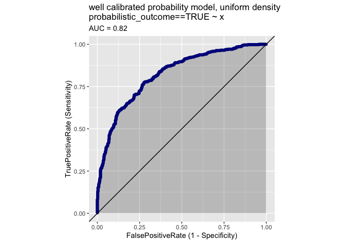<!-- -->

``` r
ThresholdPlot(
   d_uniform, 
  'x', 
  'probabilistic_outcome', truth_target = TRUE, 
  title = 'well calibrated probability model, uniform density')
```

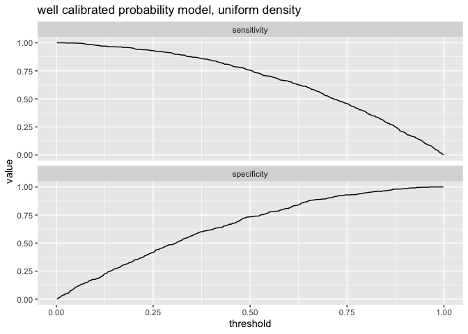<!-- -->

``` r
DoubleDensityPlot(
  d_uniform, 
  'x', 
  'probabilistic_outcome', truth_target = TRUE, 
  title = 'well calibrated probability model, uniform density')
```

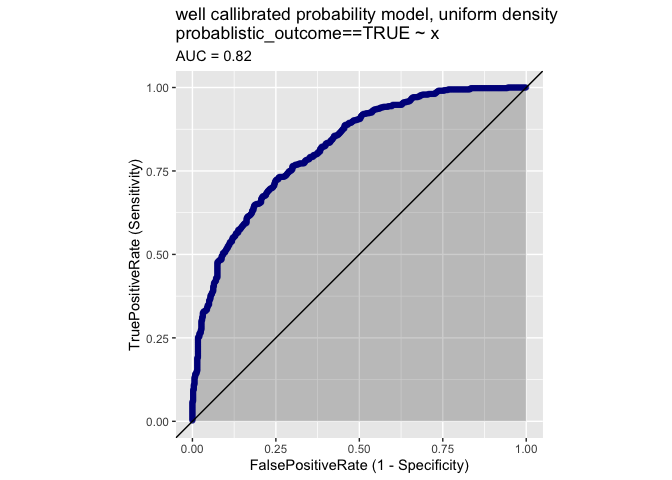<!-- -->

``` r
ShadowHist(
  d_uniform, 
  'x', 
  'probabilistic_outcome', 
  title = 'well calibrated probability model, uniform density')
```

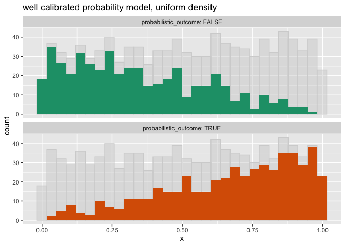<!-- -->

``` r
d_uniform$deterministic_outcome <- d_uniform$x >= 0.5

DoubleDensityPlot(d_uniform, 'x', 'deterministic_outcome', truth_target = TRUE, 
                  title = 'perfect classification rule, uniform density')
```

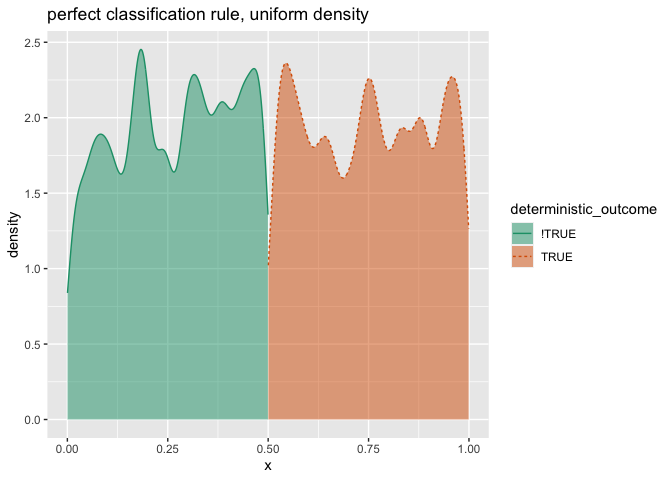<!-- -->

``` r
ShadowHist(d_uniform, 'x', 'deterministic_outcome', 
           title = 'perfect classification rule, uniform density')
```

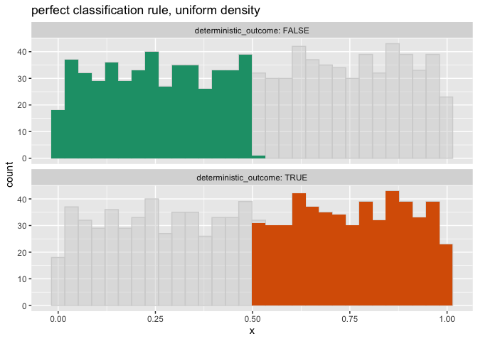<!-- -->

``` r
ROCPlot(d_uniform, 'x', 'deterministic_outcome', truthTarget = TRUE, 
        title = 'perfect classification rule, uniform density')
```

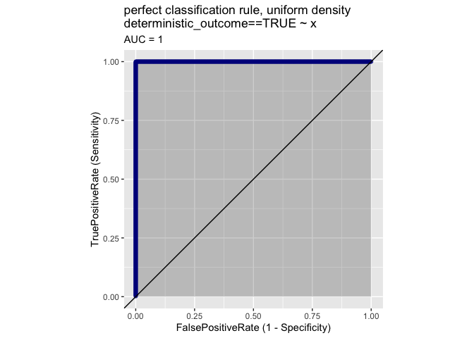<!-- -->

``` r
d_beta <- data.frame(x = rbeta(1000, shape1 = 0.5, shape2 = 0.5)) 
d_beta$probabilistic_outcome <- d_beta$x >= runif(nrow(d_beta))

DoubleDensityPlot(d_beta, 'x', 'probabilistic_outcome', truth_target = TRUE, 
                  title = 'well calibrated probability model, beta density')
```

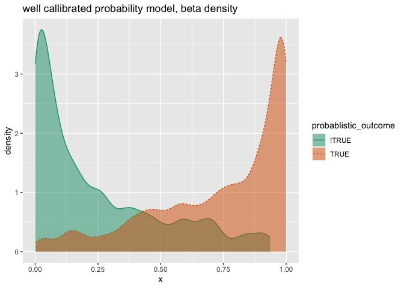<!-- -->

``` r
ShadowHist(d_beta, 'x', 'probabilistic_outcome', title = 'well calibrated probability model, beta density')
```

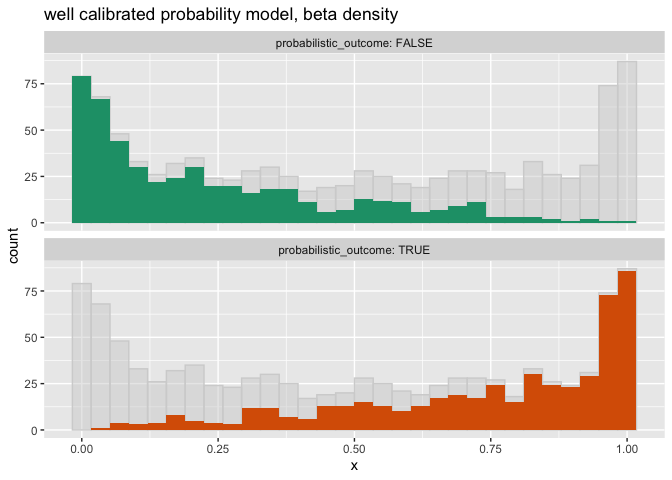<!-- -->

``` r
ROCPlot(d_beta, 'x', 'probabilistic_outcome', truthTarget = TRUE, 
        title = 'well calibrated probability model, beta density')
```

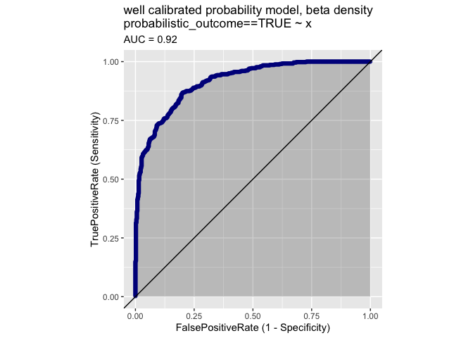<!-- -->

``` r
d_beta$deterministic_outcome <- d_beta$x >= 0.5

DoubleDensityPlot(d_beta, 'x', 'deterministic_outcome', truth_target = TRUE, 
                  title = 'perfect classification rule, beta density')
```

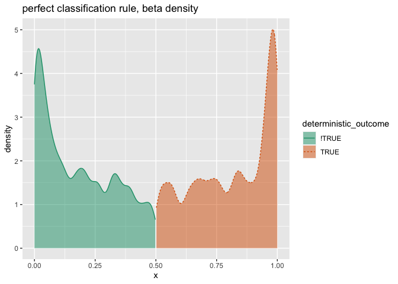<!-- -->

``` r
ShadowHist(d_beta, 'x', 'deterministic_outcome', 
           title = 'perfect classification rule, beta density')
```

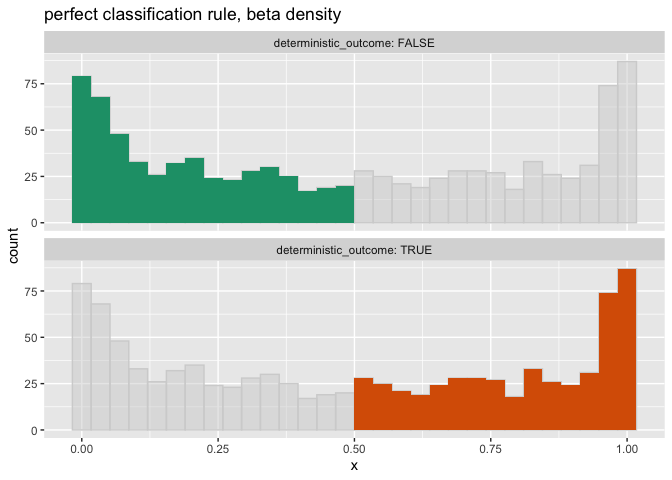<!-- -->

``` r
ROCPlot(d_beta, 'x', 'deterministic_outcome', truthTarget = TRUE, 
        title = 'perfect classification rule, beta density')
```

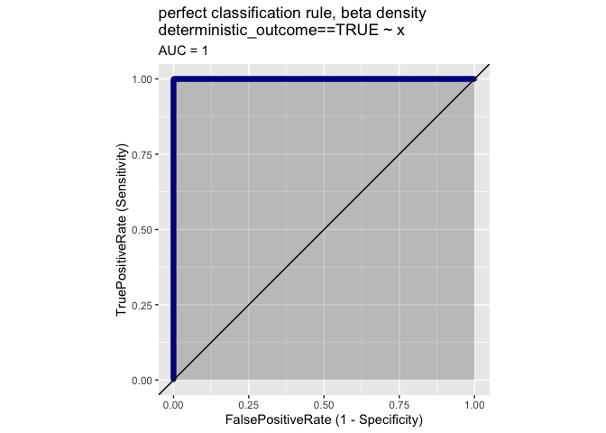<!-- -->
