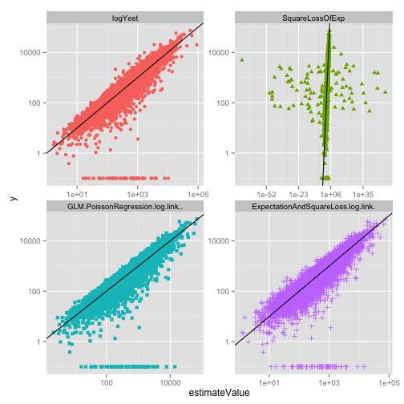

```r
# echo "library(knitr); knit('Poisson.Rmd')" | R --vanilla ; pandoc Poisson.md -o Poisson.html
library(ggplot2)
library(reshape2)
d <- read.table('expFit.tsv',sep='\t',stringsAsFactors=FALSE,header=TRUE)
ests <- c('logYest','SquareLossOfExp',
   'GLM.PoissonRegression.log.link..','ExpectationAndSquareLoss.log.link.')
runSummaries <- c()
for(runNum in unique(d$runNumber)) {                       
   dTrain <- subset(d,TestTrain=='train' & runNumber==runNum)
   dTest <- subset(d,TestTrain!='train' & runNumber==runNum)
   # confirm poisson fit
   model <- glm(y~x1+x2,family=quasipoisson(link='log'),data=dTrain)
   glmError <- sum((dTrain[,'GLM.PoissonRegression.log.link..'] -
      predict(model,type='response'))^2)
   names(glmError) <- 'glmDescrepancy'
   trainBalance <- sapply(ests,function(v) sum(dTrain$y-dTrain[,v]))
   names(trainBalance) <- paste('balance.train.',ests,sep='')
   trainSqError <- sapply(ests,function(v) sum((dTrain$y-dTrain[,v])^2))
   names(trainSqError) <- paste('sqError.train.',ests,sep='')
   testBalance <- sapply(ests,function(v) sum(dTest$y-dTest[,v]))
   names(testBalance) <- paste('balance.test.',ests,sep='')
   testSqError <- sapply(ests,function(v) sum((dTest$y-dTest[,v])^2))
   names(testSqError) <- paste('sqError.test.',ests,sep='')
   row <- c(glmError,trainBalance,trainSqError,testBalance,testSqError)
   runSummariesI <- data.frame(runNum=runNum)
   for(m in names(row)) {
      runSummariesI[1,m] <- row[m]
   }
   runSummaries <- rbind(runSummaries,runSummariesI);
}
for(v in colnames(runSummaries)) {
   print(v)
   print(summary(runSummaries[,v]))
}
```

```
## [1] "runNum"
##    Min. 1st Qu.  Median    Mean 3rd Qu.    Max. 
##     1.0    25.8    50.5    50.5    75.2   100.0 
## [1] "glmDescrepancy"
##     Min.  1st Qu.   Median     Mean  3rd Qu.     Max. 
## 1.15e-10 2.37e-10 3.01e-10 3.53e-10 4.20e-10 1.05e-09 
## [1] "balance.train.logYest"
##    Min. 1st Qu.  Median    Mean 3rd Qu.    Max. 
##  -20100    5370   11000   12600   16400   76400 
## [1] "balance.train.SquareLossOfExp"
##      Min.   1st Qu.    Median      Mean   3rd Qu.      Max. 
## -3.23e+60 -3.09e+03  1.43e+02 -3.23e+58  4.54e+03  2.86e+04 
## [1] "balance.train.GLM.PoissonRegression.log.link.."
##      Min.   1st Qu.    Median      Mean   3rd Qu.      Max. 
## -0.000124 -0.000121 -0.000120 -0.000120 -0.000119 -0.000117 
## [1] "balance.train.ExpectationAndSquareLoss.log.link."
##      Min.   1st Qu.    Median      Mean   3rd Qu.      Max. 
## -0.021900 -0.003020 -0.000217 -0.000927  0.001720  0.009540 
## [1] "sqError.train.logYest"
##     Min.  1st Qu.   Median     Mean  3rd Qu.     Max. 
## 7.35e+06 3.76e+07 5.41e+07 9.98e+07 9.96e+07 9.80e+08 
## [1] "sqError.train.SquareLossOfExp"
##      Min.   1st Qu.    Median      Mean   3rd Qu.      Max. 
##  6.80e+06  2.40e+07  3.48e+07 1.04e+119  5.10e+07 1.04e+121 
## [1] "sqError.train.GLM.PoissonRegression.log.link.."
##     Min.  1st Qu.   Median     Mean  3rd Qu.     Max. 
## 7.02e+06 2.60e+07 3.70e+07 5.37e+07 6.56e+07 3.32e+08 
## [1] "sqError.train.ExpectationAndSquareLoss.log.link."
##     Min.  1st Qu.   Median     Mean  3rd Qu.     Max. 
## 6.82e+06 2.40e+07 3.50e+07 4.65e+07 5.14e+07 2.68e+08 
## [1] "balance.test.logYest"
##    Min. 1st Qu.  Median    Mean 3rd Qu.    Max. 
##  -66800    2570   10900   13200   23900   83900 
## [1] "balance.test.SquareLossOfExp"
##      Min.   1st Qu.    Median      Mean   3rd Qu.      Max. 
## -1.37e+55 -8.87e+03  1.85e+03 -1.37e+53  1.01e+04  6.58e+04 
## [1] "balance.test.GLM.PoissonRegression.log.link.."
##    Min. 1st Qu.  Median    Mean 3rd Qu.    Max. 
##  -41200   -7860    1660    1550   11200   68900 
## [1] "balance.test.ExpectationAndSquareLoss.log.link."
##    Min. 1st Qu.  Median    Mean 3rd Qu.    Max. 
##  -59800   -8910    1170     917   10500   65500 
## [1] "sqError.test.logYest"
##     Min.  1st Qu.   Median     Mean  3rd Qu.     Max. 
## 1.17e+07 4.51e+07 8.24e+07 1.98e+08 1.47e+08 5.08e+09 
## [1] "sqError.test.SquareLossOfExp"
##      Min.   1st Qu.    Median      Mean   3rd Qu.      Max. 
##  1.75e+07  4.87e+07  8.29e+07 1.88e+108  1.63e+08 1.88e+110 
## [1] "sqError.test.GLM.PoissonRegression.log.link.."
##     Min.  1st Qu.   Median     Mean  3rd Qu.     Max. 
## 1.22e+07 3.96e+07 8.03e+07 1.43e+08 1.17e+08 1.61e+09 
## [1] "sqError.test.ExpectationAndSquareLoss.log.link."
##     Min.  1st Qu.   Median     Mean  3rd Qu.     Max. 
## 1.74e+07 4.64e+07 8.37e+07 1.74e+08 1.56e+08 1.67e+09
```

```r
nRuns <- dim(runSummaries)[[1]]

print(paste('probability train glm square error < ExpectationAndSquareLoss square error:',
      sum(runSummaries[,"sqError.train.GLM.PoissonRegression.log.link.."]<
          runSummaries[,"sqError.train.ExpectationAndSquareLoss.log.link."])/nRuns))
```

```
## [1] "probability train glm square error < ExpectationAndSquareLoss square error: 0"
```

```r
print(paste('probability test glm square error < ExpectationAndSquareLoss square error:',
      sum(runSummaries[,"sqError.test.GLM.PoissonRegression.log.link.."]<
          runSummaries[,"sqError.test.ExpectationAndSquareLoss.log.link."])/nRuns))
```

```
## [1] "probability test glm square error < ExpectationAndSquareLoss square error: 0.73"
```

```r
print(paste('probability train glm abs balance < ExpectationAndSquareLoss abs balance:',
      sum(abs(runSummaries[,"balance.train.GLM.PoissonRegression.log.link.." ])<
          abs(runSummaries[,"balance.train.ExpectationAndSquareLoss.log.link."]))/nRuns))
```

```
## [1] "probability train glm abs balance < ExpectationAndSquareLoss abs balance: 0.99"
```

```r
print(paste('probability test glm abs balance < ExpectationAndSquareLoss abs balance:',
      sum(abs(runSummaries[,"balance.test.GLM.PoissonRegression.log.link.." ])<
          abs(runSummaries[,"balance.test.ExpectationAndSquareLoss.log.link."]))/nRuns))
```

```
## [1] "probability test glm abs balance < ExpectationAndSquareLoss abs balance: 0.57"
```

```r
dplot <- melt(subset(d,TestTrain!='train'),
   id.vars=c('runNumber','x1','x2','TestTrain','y'),
   variable.name='estimateMethod',value.name='estimateValue')
ggplot(data=subset(dplot,TestTrain!='train'),
      aes(x=estimateValue,y=y,color=estimateMethod,shape=estimateMethod)) + 
   geom_point() + geom_abline() + facet_wrap(~estimateMethod,scales='free') + guides(colour=FALSE,shape=FALSE)
```

 

```r
ggplot(data=subset(dplot,TestTrain!='train'),
      aes(x=estimateValue,y=y,color=estimateMethod,shape=estimateMethod)) + 
   geom_point() + geom_abline() + facet_wrap(~estimateMethod,scales='free') + 
   scale_x_log10() + scale_y_log10() + guides(colour=FALSE,shape=FALSE)
```

 
