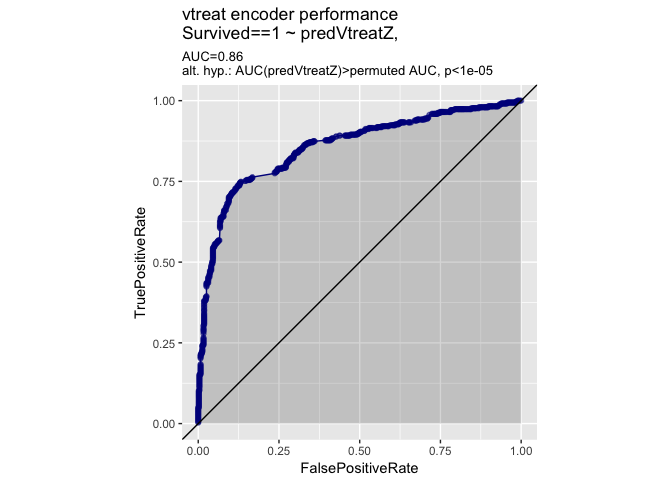
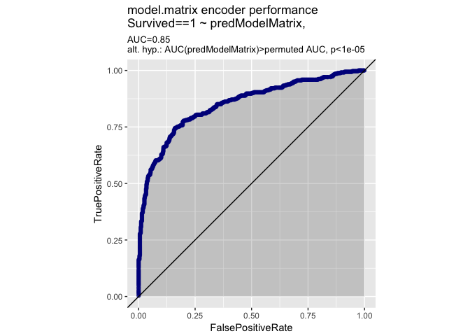
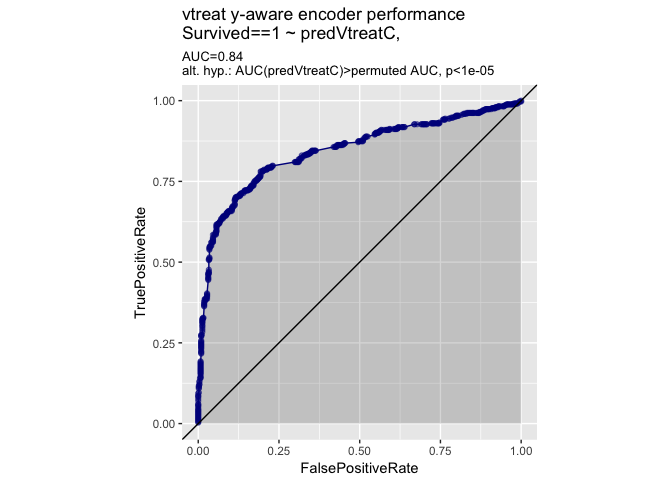

[`R`](https://cran.r-project.org) has "one-hot" encoding hidden it most of its modeling paths. Asking an `R` where one-hot encoding is used is like asking a fish where there is water; they can't point to it as it is everywhere.

``` r
dTrain <-  data.frame(x= c('a','b','b', 'c'),
                      y= c(1, 2, 1, 2))
summary(lm(y~x, data= dTrain))
```

    ## 
    ## Call:
    ## lm(formula = y ~ x, data = dTrain)
    ## 
    ## Residuals:
    ##          1          2          3          4 
    ## -2.914e-16  5.000e-01 -5.000e-01  2.637e-16 
    ## 
    ## Coefficients:
    ##             Estimate Std. Error t value Pr(>|t|)
    ## (Intercept)   1.0000     0.7071   1.414    0.392
    ## xb            0.5000     0.8660   0.577    0.667
    ## xc            1.0000     1.0000   1.000    0.500
    ## 
    ## Residual standard error: 0.7071 on 1 degrees of freedom
    ## Multiple R-squared:    0.5,  Adjusted R-squared:   -0.5 
    ## F-statistic:   0.5 on 2 and 1 DF,  p-value: 0.7071

Much of the encoding in `R` is essentially based on "contrasts" implemented in `stats::model.matrix` (note: do not use `base::data.matrix` or use [hashing](http://www.win-vector.com/blog/2014/12/a-comment-on-preparing-data-for-classifiers/) before modeling- you might get away with it but they are not in general good technique).

``` r
data.matrix(dTrain)
```

    ##      x y
    ## [1,] 1 1
    ## [2,] 2 2
    ## [3,] 2 1
    ## [4,] 3 2

Model matrix does not store its "one-hot" plan anywhere, so you can not safely assume the same formula applied to two different data sets (say train and application or test) are using compatible encodings!

``` r
dTrain <- data.frame(x= c('a','b','c'), 
                     stringsAsFactors = FALSE)
stats::model.matrix(~x, dTrain)
```

    ##   (Intercept) xb xc
    ## 1           1  0  0
    ## 2           1  1  0
    ## 3           1  0  1
    ## attr(,"assign")
    ## [1] 0 1 1
    ## attr(,"contrasts")
    ## attr(,"contrasts")$x
    ## [1] "contr.treatment"

``` r
dTest <- data.frame(x= c('b','c'), 
                     stringsAsFactors = FALSE)
stats::model.matrix(~x, dTest)
```

    ##   (Intercept) xc
    ## 1           1  0
    ## 2           1  1
    ## attr(,"assign")
    ## [1] 0 1
    ## attr(,"contrasts")
    ## attr(,"contrasts")$x
    ## [1] "contr.treatment"

The above is critical when you are building a model and then later using the model on new data (be it cross-validation data, test date, or future application data). Many `R` users are not familiar with the above issue as encoding is hidden in model training, and encoding new data is stored as part of the model. `Python` `scikit-learn` users coming to `R` often ask where the one-hot encoder is (as it isn't discussed as much in `R` as it is in `scikit-learn`) and even supply a number of one-off packages "porting one-hot encoding to `R`."

The main place an `R` user needs a proper encoder (and that is an encoder that stores its encoding plan in a conveniently re-usable form, which many of the "one-off" packages actually fail to do) is when using machine learning implementation that isn't completely `R`-centric. One such example is [`xgboost`](https://github.com/dmlc/xgboost) which requires (as is typical of machine learning in `scikit-learn`) data to already be encoded as a numeric matrix (instead of a heterogeneous structure such as a `data.frame`). The requires explicit conversion on the part of the `R` user, and many `R` users get it wrong (fail to store the encoding plan somewhere). To make this concrete let's work a simple example.

Let's try the Titanic data set to see encoding in action. Note: we are not working hard on this example (as in adding extra variables derived from cabin layout, commonality of names, and other sophisticated feature transforms)- just plugging the obvious variable into `xgboost`. As we said: `xgboost` requires a numeric matrix for its input, so unlike many `R` modeling methods we must manage the data encoding ourselves (instead of leaving that to `R` which often hides the encoding plan in the trained model).

``` r
library("titanic")

# select example data set
data(titanic_train)
str(titanic_train)
```

    ## 'data.frame':    891 obs. of  12 variables:
    ##  $ PassengerId: int  1 2 3 4 5 6 7 8 9 10 ...
    ##  $ Survived   : int  0 1 1 1 0 0 0 0 1 1 ...
    ##  $ Pclass     : int  3 1 3 1 3 3 1 3 3 2 ...
    ##  $ Name       : chr  "Braund, Mr. Owen Harris" "Cumings, Mrs. John Bradley (Florence Briggs Thayer)" "Heikkinen, Miss. Laina" "Futrelle, Mrs. Jacques Heath (Lily May Peel)" ...
    ##  $ Sex        : chr  "male" "female" "female" "female" ...
    ##  $ Age        : num  22 38 26 35 35 NA 54 2 27 14 ...
    ##  $ SibSp      : int  1 1 0 1 0 0 0 3 0 1 ...
    ##  $ Parch      : int  0 0 0 0 0 0 0 1 2 0 ...
    ##  $ Ticket     : chr  "A/5 21171" "PC 17599" "STON/O2. 3101282" "113803" ...
    ##  $ Fare       : num  7.25 71.28 7.92 53.1 8.05 ...
    ##  $ Cabin      : chr  "" "C85" "" "C123" ...
    ##  $ Embarked   : chr  "S" "C" "S" "S" ...

``` r
summary(titanic_train)
```

    ##   PassengerId       Survived          Pclass          Name          
    ##  Min.   :  1.0   Min.   :0.0000   Min.   :1.000   Length:891        
    ##  1st Qu.:223.5   1st Qu.:0.0000   1st Qu.:2.000   Class :character  
    ##  Median :446.0   Median :0.0000   Median :3.000   Mode  :character  
    ##  Mean   :446.0   Mean   :0.3838   Mean   :2.309                     
    ##  3rd Qu.:668.5   3rd Qu.:1.0000   3rd Qu.:3.000                     
    ##  Max.   :891.0   Max.   :1.0000   Max.   :3.000                     
    ##                                                                     
    ##      Sex                 Age            SibSp           Parch       
    ##  Length:891         Min.   : 0.42   Min.   :0.000   Min.   :0.0000  
    ##  Class :character   1st Qu.:20.12   1st Qu.:0.000   1st Qu.:0.0000  
    ##  Mode  :character   Median :28.00   Median :0.000   Median :0.0000  
    ##                     Mean   :29.70   Mean   :0.523   Mean   :0.3816  
    ##                     3rd Qu.:38.00   3rd Qu.:1.000   3rd Qu.:0.0000  
    ##                     Max.   :80.00   Max.   :8.000   Max.   :6.0000  
    ##                     NA's   :177                                     
    ##     Ticket               Fare           Cabin             Embarked        
    ##  Length:891         Min.   :  0.00   Length:891         Length:891        
    ##  Class :character   1st Qu.:  7.91   Class :character   Class :character  
    ##  Mode  :character   Median : 14.45   Mode  :character   Mode  :character  
    ##                     Mean   : 32.20                                        
    ##                     3rd Qu.: 31.00                                        
    ##                     Max.   :512.33                                        
    ## 

``` r
outcome <- 'Survived'
target <- 1
shouldBeCategorical <- c('PassengerId', 'Pclass', 'Parch')
for(v in shouldBeCategorical) {
  titanic_train[[v]] <- as.factor(titanic_train[[v]])
}
tooDetailed <- c("Ticket", "Cabin", "Name", "PassengerId")
vars <- setdiff(colnames(titanic_train), c(outcome, tooDetailed))

dTrain <- titanic_train
```

``` r
library("xgboost")
library("sigr")
library("WVPlots")

set.seed(4623762)
crossValPlan <- vtreat::kWayStratifiedY(nrow(dTrain), 
                                        10, 
                                        dTrain, 
                                        dTrain[[outcome]])

evaluateModelingProcedure <- function(xMatrix, outcomeV, crossValPlan) {
  preds <- rep(NA_real_, nrow(xMatrix))
  for(ci in crossValPlan) {
    nrounds <- 1000
    cv <- xgb.cv(data= xMatrix[ci$train, ],
                 label= outcomeV[ci$train],
                 objective= 'binary:logistic',
                 nrounds= nrounds,
                 verbose= 0,
                 nfold= 5)
    #nrounds  <- which.min(cv$evaluation_log$test_rmse_mean) # regression
    nrounds  <- which.min(cv$evaluation_log$test_error_mean) # classification
    model <- xgboost(data= xMatrix[ci$train, ],
                     label= outcomeV[ci$train],
                     objective= 'binary:logistic',
                     nrounds= nrounds,
                     verbose= 0)
    preds[ci$app] <-  predict(model, xMatrix[ci$app, ])
  }
  preds
}
```

Our preferred way to encode data is to use the `vtreat` package either in the "no variables mode" shown below differing from the powerful "y aware" modes we usually teach (which are not needed on this dataset until we introduce high-cardinality categorical variables).

``` r
library("vtreat")
set.seed(4623762)
tplan <- vtreat::designTreatmentsZ(dTrain, vars, 
                                   minFraction= 0,
                                   verbose=FALSE)
# restrict to common varaibles types
# see vignette('vtreatVariableTypes', package = 'vtreat') for details
sf <- tplan$scoreFrame
newvars <- sf$varName[sf$code %in% c("lev", "clean", "isBAD")] 
trainVtreat <- as.matrix(vtreat::prepare(tplan, dTrain, 
                                         varRestriction = newvars))
print(dim(trainVtreat))
```

    ## [1] 891  20

``` r
print(colnames(trainVtreat))
```

    ##  [1] "Pclass_lev_x.1"   "Pclass_lev_x.2"   "Pclass_lev_x.3"  
    ##  [4] "Sex_lev_x.female" "Sex_lev_x.male"   "Age_clean"       
    ##  [7] "Age_isBAD"        "SibSp_clean"      "Parch_lev_x.0"   
    ## [10] "Parch_lev_x.1"    "Parch_lev_x.2"    "Parch_lev_x.3"   
    ## [13] "Parch_lev_x.4"    "Parch_lev_x.5"    "Parch_lev_x.6"   
    ## [16] "Fare_clean"       "Embarked_lev_x."  "Embarked_lev_x.C"
    ## [19] "Embarked_lev_x.Q" "Embarked_lev_x.S"

``` r
dTrain$predVtreatZ <- evaluateModelingProcedure(trainVtreat,
                                                       dTrain[[outcome]]==target,
                                                       crossValPlan)
sigr::permTestAUC(dTrain, 
                  'predVtreatZ',
                  outcome, target)
```

    ## [1] "AUC test alt. hyp. AUC>AUC(permuted): (AUC=0.86, s.d.=0.017, p<1e-05)."

``` r
WVPlots::ROCPlot(dTrain, 
                 'predVtreatZ', 
                 outcome, target, 
                 'vtreat encoder performance')
```



Model matrix can perform similar encoding *when* we only have a single data set.

``` r
set.seed(4623762)
f <- paste('~ 0 + ', paste(vars, collapse = ' + '))
# model matrix skips rows with NAs by default,
# get control of this through an option
oldOpt <- getOption('na.action')
options(na.action='na.pass')
trainModelMatrix <- stats::model.matrix(as.formula(f), 
                                  dTrain)
# note model.matrix does not conveniently store the encoding
# plan, so you may run into difficulty if you were to encode
# new data which didn't have all the levels seen in the training
# data.
options(na.action=oldOpt)
print(dim(trainModelMatrix))
```

    ## [1] 891  16

``` r
print(colnames(trainModelMatrix))
```

    ##  [1] "Pclass1"   "Pclass2"   "Pclass3"   "Sexmale"   "Age"      
    ##  [6] "SibSp"     "Parch1"    "Parch2"    "Parch3"    "Parch4"   
    ## [11] "Parch5"    "Parch6"    "Fare"      "EmbarkedC" "EmbarkedQ"
    ## [16] "EmbarkedS"

``` r
dTrain$predModelMatrix <- evaluateModelingProcedure(trainModelMatrix,
                                                     dTrain[[outcome]]==target,
                                                     crossValPlan)
sigr::permTestAUC(dTrain, 
                  'predModelMatrix',
                  outcome, target)
```

    ## [1] "AUC test alt. hyp. AUC>AUC(permuted): (AUC=0.87, s.d.=0.019, p<1e-05)."

``` r
WVPlots::ROCPlot(dTrain, 
                 'predModelMatrix', 
                 outcome, target, 
                 'model.matrix encoder performance')
```



`caret` also supplies an encoding functionality properly split between training (`caret::dummyVars()`) and application (called `predict()`).

``` r
library("caret")
```

    ## Loading required package: lattice

    ## Loading required package: ggplot2

``` r
set.seed(4623762)
f <- paste('~', paste(vars, collapse = ' + '))
encoder <- caret::dummyVars(as.formula(f), dTrain)
trainCaret <- predict(encoder, dTrain)
print(dim(trainCaret))
```

    ## [1] 891  19

``` r
print(colnames(trainCaret))
```

    ##  [1] "Pclass.1"  "Pclass.2"  "Pclass.3"  "Sexfemale" "Sexmale"  
    ##  [6] "Age"       "SibSp"     "Parch.0"   "Parch.1"   "Parch.2"  
    ## [11] "Parch.3"   "Parch.4"   "Parch.5"   "Parch.6"   "Fare"     
    ## [16] "Embarked"  "EmbarkedC" "EmbarkedQ" "EmbarkedS"

``` r
dTrain$predCaret <- evaluateModelingProcedure(trainCaret,
                                                     dTrain[[outcome]]==target,
                                                     crossValPlan)
sigr::permTestAUC(dTrain, 
                  'predCaret',
                  outcome, target)
```

    ## [1] "AUC test alt. hyp. AUC>AUC(permuted): (AUC=0.85, s.d.=0.017, p<1e-05)."

``` r
WVPlots::ROCPlot(dTrain, 
                 'predCaret', 
                 outcome, target, 
                 'caret encoder performance')
```


We usually forget to teach `vtreat::designTreatmentsZ()` as it is often dominated by the more powerful y-aware methods `vtreat` supplies (though not for this simple example). `vtreat::designTreatmentsZ` has a number of useful properties:

-   Does not look at the outcome values, so does not require extra care in cross-validation.
-   Saves its encoding, so can be used correctly on new data.

The above two properties are shared with `caret::dummyVars()`. Additional features of `vtreat::designTreatmentsZ` (that differ from `caret::dummyVars()`'s choices) include:

-   No `NA` values are passed through by `vtreat::prepare()`.
-   `NA` presence is added as an additional informative column.
-   A few derived columns (such as pooling of rare levels are made available).
-   Rare dummy variables are pruned (under a user-controlled threshold) to prevent encoding explosion.
-   Novel levels (levels that occur during test or application, but not during training) are deliberately passed through as "no training level activated" by `vtreat::prepare()` (`caret::dummyVars()` considers this an error).

################## 

You can also try y-aware encoding, but it isn't adding anything positive in this situation as we have not introduced any high-cardinality categorical variables into this modeling example (the main place y-aware encoding helps).

``` r
set.seed(4623762)
# for y aware evaluation must cross-validate whole procedure, designing
# on data you intend to score on can leak information.
preds <- rep(NA_real_, nrow(dTrain))
for(ci in crossValPlan) {
  cfe <- vtreat::mkCrossFrameCExperiment(dTrain[ci$train, , drop=FALSE], 
                                         minFraction= 0,
                                         vars,
                                         outcome, target)
  tplan <- cfe$treatments
  sf <- tplan$scoreFrame
  newvars <- sf$varName[sf$sig < 1/nrow(sf)]
  trainVtreat <- cfe$crossFrame[ , c(newvars, outcome), drop=FALSE]
  nrounds <- 1000
  cv <- xgb.cv(data= as.matrix(trainVtreat[, newvars, drop=FALSE]),
                   label= trainVtreat[[outcome]]==target,
                   objective= 'binary:logistic',
                   nrounds= nrounds,
                   verbose= 0,
                   nfold= 5)
  #nrounds  <- which.min(cv$evaluation_log$test_rmse_mean) # regression
  nrounds  <- which.min(cv$evaluation_log$test_error_mean) # classification
  model <- xgboost(data= as.matrix(trainVtreat[, newvars, drop=FALSE]),
                   label= trainVtreat[[outcome]]==target,
                   objective= 'binary:logistic',
                   nrounds= nrounds,
                   verbose= 0)
  appVtreat <- vtreat::prepare(tplan, 
                               dTrain[ci$app, , drop=FALSE], 
                               varRestriction = newvars)
  preds[ci$app] <-  predict(model,
                            as.matrix(appVtreat[, newvars, drop=FALSE]))
}
dTrain$predVtreatC <- preds
sigr::permTestAUC(dTrain, 
                  'predVtreatC',
                  outcome, target)
```

    ## [1] "AUC test alt. hyp. AUC>AUC(permuted): (AUC=0.84, s.d.=0.02, p<1e-05)."

``` r
WVPlots::ROCPlot(dTrain, 
                 'predVtreatC', 
                 outcome, target, 
                 'vtreat y-aware encoder performance')
```


