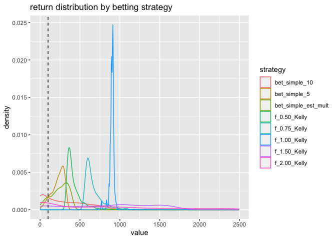

simple\_betting
================

I would like to write about
[Thorp](https://en.wikipedia.org/wiki/Edward_O._Thorp) style card
counting using the [Kelly betting
criterion](https://en.wikipedia.org/wiki/Kelly_criterion).

The example I will explore is: betting if the next card in a deck is red
or black. For a single deck version of this game, one can vary ones bets
to exploit knowledge of which cards remain in the deck.

A video of me playing the game can be found
[here](https://youtu.be/6xhjbgREGDA), and the blog announcement is
[here](https://win-vector.com/2021/02/25/kelly-thorp-betting/). I also
have a note showing how these techniques don’t apply to fair coin flip
games (or sampling with replacement): [When Profitable Betting Systems
are not
Possible](https://github.com/WinVector/Examples/blob/main/Kelly_Thorp_betting/When_Profitable_Betting_Systems_are_not_Possible.ipynb).

Let’s show how we develop such a betting stategy.

First we import packages and initialize state.

``` r
library(cdata)
```

    ## Loading required package: wrapr

``` r
library(ggplot2)
library(rqdatatable)
```

    ## Loading required package: rquery

    ## 
    ## Attaching package: 'rquery'

    ## The following object is masked from 'package:ggplot2':
    ## 
    ##     arrow

``` r
set.seed(2021)
```

We define our betting function. This function takes `na`, the number of
`A`-cards remaining, `nb` the number of `B`-cards remaining, and `stake`
our remaining dollars. It returns the Kelly bet, which in this case is
`2 (pa - 1/2)` where `pa` is the probability of drawing an `A`-card,
which in turn equals `na / (na + nb)`.

``` r
bet_Kelly <- function(na, nb, stake) {
  sign <- 1
  if(na < nb) {
    sign <- -1
    tmp <- na
    na <- nb
    nb <- tmp
  }
  ideal_bet_fraction <- 0
  bet <- 0
  if((stake > 1) && (na != nb) && ((na + nb) > 0)) {
     ideal_bet_fraction <- 2 * (na / (na + nb) - 1/2)
     bet <- min(stake - 1, round(stake * ideal_bet_fraction))
  }
  return(list(bet = sign * bet, ideal_bet_fraction = sign * ideal_bet_fraction))
}
```

With this function we can write down our betting card: the percent of
stake bets as a function of remaining `a`s and `b`s.

``` r
n_seq <- seq(0, 26, by = 2)
strategy_table <- matrix(data = NA, nrow = length(n_seq), ncol = length(n_seq))
for(nai in seq_len(length(n_seq))) {
  na <- n_seq[nai]
  for(nbi in seq_len(length(n_seq))) {
    nb <- n_seq[nbi]
    strategy_table[nai, nbi] = bet_Kelly(na, nb, 100)$bet
  }
}
rownames(strategy_table) <- paste0('na~', n_seq)
colnames(strategy_table) <- paste0('nb~', n_seq)
knitr::kable(strategy_table)
```

|        | nb\~0 | nb\~2 | nb\~4 | nb\~6 | nb\~8 | nb\~10 | nb\~12 | nb\~14 | nb\~16 | nb\~18 | nb\~20 | nb\~22 | nb\~24 | nb\~26 |
|:-------|------:|------:|------:|------:|------:|-------:|-------:|-------:|-------:|-------:|-------:|-------:|-------:|-------:|
| na\~0  |     0 |   -99 |   -99 |   -99 |   -99 |    -99 |    -99 |    -99 |    -99 |    -99 |    -99 |    -99 |    -99 |    -99 |
| na\~2  |    99 |     0 |   -33 |   -50 |   -60 |    -67 |    -71 |    -75 |    -78 |    -80 |    -82 |    -83 |    -85 |    -86 |
| na\~4  |    99 |    33 |     0 |   -20 |   -33 |    -43 |    -50 |    -56 |    -60 |    -64 |    -67 |    -69 |    -71 |    -73 |
| na\~6  |    99 |    50 |    20 |     0 |   -14 |    -25 |    -33 |    -40 |    -45 |    -50 |    -54 |    -57 |    -60 |    -62 |
| na\~8  |    99 |    60 |    33 |    14 |     0 |    -11 |    -20 |    -27 |    -33 |    -38 |    -43 |    -47 |    -50 |    -53 |
| na\~10 |    99 |    67 |    43 |    25 |    11 |      0 |     -9 |    -17 |    -23 |    -29 |    -33 |    -38 |    -41 |    -44 |
| na\~12 |    99 |    71 |    50 |    33 |    20 |      9 |      0 |     -8 |    -14 |    -20 |    -25 |    -29 |    -33 |    -37 |
| na\~14 |    99 |    75 |    56 |    40 |    27 |     17 |      8 |      0 |     -7 |    -12 |    -18 |    -22 |    -26 |    -30 |
| na\~16 |    99 |    78 |    60 |    45 |    33 |     23 |     14 |      7 |      0 |     -6 |    -11 |    -16 |    -20 |    -24 |
| na\~18 |    99 |    80 |    64 |    50 |    38 |     29 |     20 |     12 |      6 |      0 |     -5 |    -10 |    -14 |    -18 |
| na\~20 |    99 |    82 |    67 |    54 |    43 |     33 |     25 |     18 |     11 |      5 |      0 |     -5 |     -9 |    -13 |
| na\~22 |    99 |    83 |    69 |    57 |    47 |     38 |     29 |     22 |     16 |     10 |      5 |      0 |     -4 |     -8 |
| na\~24 |    99 |    85 |    71 |    60 |    50 |     41 |     33 |     26 |     20 |     14 |      9 |      4 |      0 |     -4 |
| na\~26 |    99 |    86 |    73 |    62 |    53 |     44 |     37 |     30 |     24 |     18 |     13 |      8 |      4 |      0 |

Let’s see this strategy in (simulated) action.

We define evaluation functions that draw the cards and simulate the
play.

``` r
simulate_draws <-  function(cards, steps = cards, replace = FALSE) {
  d <- data.frame(
    step = seq_len(steps + 1) - 1,
    na = floor(cards/2)
  )
  d$nb <- cards - d$na
  d$draw_is_a <- NA
  for(i in seq_len(steps)) {
    if(!replace) {
      d$draw_is_a[i] <- runif(n = 1) <= d$na[i] / (d$na[i] + d$nb[i])
    } else {
      d$draw_is_a[i] <- runif(n = 1) <= 0.5
    }
    if(d$draw_is_a[i]) {
      d$na[i+1] <- d$na[i] - 1
      d$nb[i+1] <- d$nb[i]
    } else {
      d$na[i+1] <- d$na[i]
      d$nb[i+1] <- d$nb[i] - 1
    }
  }
  return(d)
}

simulate_play <- function(
  d,
  stake,
  bet_fn) {
  d$stake <- stake
  d$bet <- NA
  d$ideal_bet_fraction <- NA
  for(i in seq_len(nrow(d)-1)) {
    beti <- bet_fn(na = d$na[i], nb = d$nb[i], stake = d$stake[i])
    d$bet[i] <- beti$bet
    d$ideal_bet_fraction[i] <- beti$ideal_bet_fraction
    if(d$bet[i] != 0) {
      if(abs(d$bet[i]) > d$stake[i]) {
        stop("bet more than stake")
      }
      d$stake[i+1] <- d$stake[i] + 
        sign(d$bet[i]) * ifelse(d$draw_is_a[i], 1, -1) * abs(d$bet[i])
    } else {
      d$stake[i+1] <- d$stake[i]
    }
  }
  return(d)
}
```

We show a couple of example plays.

``` r
simulate_draws(cards = 52) %.>%
  simulate_play(., stake = 100, bet_fn = bet_Kelly) %.>%
  knitr::kable(.)
```

| step |  na |  nb | draw\_is\_a | stake | bet | ideal\_bet\_fraction |
|-----:|----:|----:|:------------|------:|----:|---------------------:|
|    0 |  26 |  26 | TRUE        |   100 |   0 |            0.0000000 |
|    1 |  25 |  26 | FALSE       |   100 |  -2 |           -0.0196078 |
|    2 |  25 |  25 | FALSE       |   102 |   0 |            0.0000000 |
|    3 |  25 |  24 | TRUE        |   102 |   2 |            0.0204082 |
|    4 |  24 |  24 | FALSE       |   104 |   0 |            0.0000000 |
|    5 |  24 |  23 | FALSE       |   104 |   2 |            0.0212766 |
|    6 |  24 |  22 | FALSE       |   102 |   4 |            0.0434783 |
|    7 |  24 |  21 | TRUE        |    98 |   7 |            0.0666667 |
|    8 |  23 |  21 | FALSE       |   105 |   5 |            0.0454545 |
|    9 |  23 |  20 | FALSE       |   100 |   7 |            0.0697674 |
|   10 |  23 |  19 | TRUE        |    93 |   9 |            0.0952381 |
|   11 |  22 |  19 | FALSE       |   102 |   7 |            0.0731707 |
|   12 |  22 |  18 | FALSE       |    95 |  10 |            0.1000000 |
|   13 |  22 |  17 | FALSE       |    85 |  11 |            0.1282051 |
|   14 |  22 |  16 | FALSE       |    74 |  12 |            0.1578947 |
|   15 |  22 |  15 | TRUE        |    62 |  12 |            0.1891892 |
|   16 |  21 |  15 | TRUE        |    74 |  12 |            0.1666667 |
|   17 |  20 |  15 | FALSE       |    86 |  12 |            0.1428571 |
|   18 |  20 |  14 | FALSE       |    74 |  13 |            0.1764706 |
|   19 |  20 |  13 | TRUE        |    61 |  13 |            0.2121212 |
|   20 |  19 |  13 | TRUE        |    74 |  14 |            0.1875000 |
|   21 |  18 |  13 | FALSE       |    88 |  14 |            0.1612903 |
|   22 |  18 |  12 | TRUE        |    74 |  15 |            0.2000000 |
|   23 |  17 |  12 | TRUE        |    89 |  15 |            0.1724138 |
|   24 |  16 |  12 | FALSE       |   104 |  15 |            0.1428571 |
|   25 |  16 |  11 | FALSE       |    89 |  16 |            0.1851852 |
|   26 |  16 |  10 | FALSE       |    73 |  17 |            0.2307692 |
|   27 |  16 |   9 | FALSE       |    56 |  16 |            0.2800000 |
|   28 |  16 |   8 | FALSE       |    40 |  13 |            0.3333333 |
|   29 |  16 |   7 | FALSE       |    27 |  11 |            0.3913043 |
|   30 |  16 |   6 | TRUE        |    16 |   7 |            0.4545455 |
|   31 |  15 |   6 | FALSE       |    23 |  10 |            0.4285714 |
|   32 |  15 |   5 | FALSE       |    13 |   6 |            0.5000000 |
|   33 |  15 |   4 | FALSE       |     7 |   4 |            0.5789474 |
|   34 |  15 |   3 | TRUE        |     3 |   2 |            0.6666667 |
|   35 |  14 |   3 | TRUE        |     5 |   3 |            0.6470588 |
|   36 |  13 |   3 | FALSE       |     8 |   5 |            0.6250000 |
|   37 |  13 |   2 | TRUE        |     3 |   2 |            0.7333333 |
|   38 |  12 |   2 | FALSE       |     5 |   4 |            0.7142857 |
|   39 |  12 |   1 | TRUE        |     1 |   0 |            0.0000000 |
|   40 |  11 |   1 | TRUE        |     1 |   0 |            0.0000000 |
|   41 |  10 |   1 | TRUE        |     1 |   0 |            0.0000000 |
|   42 |   9 |   1 | TRUE        |     1 |   0 |            0.0000000 |
|   43 |   8 |   1 | FALSE       |     1 |   0 |            0.0000000 |
|   44 |   8 |   0 | TRUE        |     1 |   0 |            0.0000000 |
|   45 |   7 |   0 | TRUE        |     1 |   0 |            0.0000000 |
|   46 |   6 |   0 | TRUE        |     1 |   0 |            0.0000000 |
|   47 |   5 |   0 | TRUE        |     1 |   0 |            0.0000000 |
|   48 |   4 |   0 | TRUE        |     1 |   0 |            0.0000000 |
|   49 |   3 |   0 | TRUE        |     1 |   0 |            0.0000000 |
|   50 |   2 |   0 | TRUE        |     1 |   0 |            0.0000000 |
|   51 |   1 |   0 | TRUE        |     1 |   0 |            0.0000000 |
|   52 |   0 |   0 | NA          |     1 |  NA |                   NA |

``` r
simulate_draws(cards = 52) %.>%
  simulate_play(., stake = 100, bet_fn = bet_Kelly) %.>%
  knitr::kable(.)
```

| step |  na |  nb | draw\_is\_a | stake |  bet | ideal\_bet\_fraction |
|-----:|----:|----:|:------------|------:|-----:|---------------------:|
|    0 |  26 |  26 | TRUE        |   100 |    0 |            0.0000000 |
|    1 |  25 |  26 | FALSE       |   100 |   -2 |           -0.0196078 |
|    2 |  25 |  25 | TRUE        |   102 |    0 |            0.0000000 |
|    3 |  24 |  25 | TRUE        |   102 |   -2 |           -0.0204082 |
|    4 |  23 |  25 | TRUE        |   100 |   -4 |           -0.0416667 |
|    5 |  22 |  25 | TRUE        |    96 |   -6 |           -0.0638298 |
|    6 |  21 |  25 | FALSE       |    90 |   -8 |           -0.0869565 |
|    7 |  21 |  24 | FALSE       |    98 |   -7 |           -0.0666667 |
|    8 |  21 |  23 | TRUE        |   105 |   -5 |           -0.0454545 |
|    9 |  20 |  23 | FALSE       |   100 |   -7 |           -0.0697674 |
|   10 |  20 |  22 | TRUE        |   107 |   -5 |           -0.0476190 |
|   11 |  19 |  22 | TRUE        |   102 |   -7 |           -0.0731707 |
|   12 |  18 |  22 | FALSE       |    95 |  -10 |           -0.1000000 |
|   13 |  18 |  21 | TRUE        |   105 |   -8 |           -0.0769231 |
|   14 |  17 |  21 | TRUE        |    97 |  -10 |           -0.1052632 |
|   15 |  16 |  21 | FALSE       |    87 |  -12 |           -0.1351351 |
|   16 |  16 |  20 | TRUE        |    99 |  -11 |           -0.1111111 |
|   17 |  15 |  20 | TRUE        |    88 |  -13 |           -0.1428571 |
|   18 |  14 |  20 | TRUE        |    75 |  -13 |           -0.1764706 |
|   19 |  13 |  20 | FALSE       |    62 |  -13 |           -0.2121212 |
|   20 |  13 |  19 | TRUE        |    75 |  -14 |           -0.1875000 |
|   21 |  12 |  19 | FALSE       |    61 |  -14 |           -0.2258065 |
|   22 |  12 |  18 | TRUE        |    75 |  -15 |           -0.2000000 |
|   23 |  11 |  18 | FALSE       |    60 |  -14 |           -0.2413793 |
|   24 |  11 |  17 | FALSE       |    74 |  -16 |           -0.2142857 |
|   25 |  11 |  16 | TRUE        |    90 |  -17 |           -0.1851852 |
|   26 |  10 |  16 | FALSE       |    73 |  -17 |           -0.2307692 |
|   27 |  10 |  15 | FALSE       |    90 |  -18 |           -0.2000000 |
|   28 |  10 |  14 | FALSE       |   108 |  -18 |           -0.1666667 |
|   29 |  10 |  13 | TRUE        |   126 |  -16 |           -0.1304348 |
|   30 |   9 |  13 | FALSE       |   110 |  -20 |           -0.1818182 |
|   31 |   9 |  12 | FALSE       |   130 |  -19 |           -0.1428571 |
|   32 |   9 |  11 | TRUE        |   149 |  -15 |           -0.1000000 |
|   33 |   8 |  11 | TRUE        |   134 |  -21 |           -0.1578947 |
|   34 |   7 |  11 | FALSE       |   113 |  -25 |           -0.2222222 |
|   35 |   7 |  10 | FALSE       |   138 |  -24 |           -0.1764706 |
|   36 |   7 |   9 | FALSE       |   162 |  -20 |           -0.1250000 |
|   37 |   7 |   8 | TRUE        |   182 |  -12 |           -0.0666667 |
|   38 |   6 |   8 | TRUE        |   170 |  -24 |           -0.1428571 |
|   39 |   5 |   8 | FALSE       |   146 |  -34 |           -0.2307692 |
|   40 |   5 |   7 | FALSE       |   180 |  -30 |           -0.1666667 |
|   41 |   5 |   6 | FALSE       |   210 |  -19 |           -0.0909091 |
|   42 |   5 |   5 | TRUE        |   229 |    0 |            0.0000000 |
|   43 |   4 |   5 | FALSE       |   229 |  -25 |           -0.1111111 |
|   44 |   4 |   4 | FALSE       |   254 |    0 |            0.0000000 |
|   45 |   4 |   3 | FALSE       |   254 |   36 |            0.1428571 |
|   46 |   4 |   2 | FALSE       |   218 |   73 |            0.3333333 |
|   47 |   4 |   1 | TRUE        |   145 |   87 |            0.6000000 |
|   48 |   3 |   1 | TRUE        |   232 |  116 |            0.5000000 |
|   49 |   2 |   1 | TRUE        |   348 |  116 |            0.3333333 |
|   50 |   1 |   1 | TRUE        |   464 |    0 |            0.0000000 |
|   51 |   0 |   1 | FALSE       |   464 | -463 |           -1.0000000 |
|   52 |   0 |   0 | NA          |   927 |   NA |                   NA |

Our Thorp-style count based approximate betting rule can be found by
estimating what fraction of a stake simulates the exact Kelly rule on
average. I chose to use a linear model via `lm()` to get the
approximation.

``` r
# collect runs
simulations <- lapply(
  seq_len(1000),
  function(i) {
    v <- simulate_draws(cards = 52) %.>%
    simulate_play(., stake = 100, bet_fn = bet_Kelly)
    return(v)
  })

# buld observed delta count to bet tables
obs <- lapply(
  simulations,
  function(s) {
    return(data.frame(na = s$na, nb = s$nb, delta = s$na - s$nb, bet = s$bet))
  })
obs <- do.call(rbind, obs)
model <- lm(bet ~ 0 + delta, data = obs)
mult <- round(model$coefficients[[1]])
mult
```

    ## [1] 6

The result is: bet about 6 percent of your stake for each count of
imbalance (explained in the [video](https://youtu.be/6xhjbgREGDA)). In
the video we use a lower 5 percent target stake bet. Under-betting is
less dangerous than over-betting, and the under-betting strategy “half
Kelly” is actually quite common in finance.

We instantiate the simplified betting rule, and some over and under
betting variations.

``` r
bet_simple <- function(stake_mult) {
  force(stake_mult)
  return(
    function(na, nb, stake) {
      sign <- 1
      if(na < nb) {
        sign <- -1
        tmp <- na
        na <- nb
        nb <- tmp
      }
      ideal_bet_fraction <- 0
      bet <- 0
      if((stake > 1) && (na != nb) && ((na + nb) > 0)) {
         ideal_bet_fraction <- stake_mult * (na - nb) / 100
         bet <- min(stake - 1, round(stake * ideal_bet_fraction))
      }
      return(list(bet = sign * bet, ideal_bet_fraction = sign * ideal_bet_fraction))
    })
}

bet_simple_est_mult <- bet_simple(mult)
bet_simple_10 <- bet_simple(10)
bet_bet_simple_10 <- bet_simple(5)
```

We show a couple of example plays.

``` r
simulate_draws(cards = 52) %.>%
  simulate_play(., stake = 100, bet_fn = bet_simple_est_mult) %.>%
  knitr::kable(.)
```

| step |  na |  nb | draw\_is\_a | stake | bet | ideal\_bet\_fraction |
|-----:|----:|----:|:------------|------:|----:|---------------------:|
|    0 |  26 |  26 | TRUE        |   100 |   0 |                 0.00 |
|    1 |  25 |  26 | FALSE       |   100 |  -6 |                -0.06 |
|    2 |  25 |  25 | TRUE        |   106 |   0 |                 0.00 |
|    3 |  24 |  25 | FALSE       |   106 |  -6 |                -0.06 |
|    4 |  24 |  24 | FALSE       |   112 |   0 |                 0.00 |
|    5 |  24 |  23 | TRUE        |   112 |   7 |                 0.06 |
|    6 |  23 |  23 | TRUE        |   119 |   0 |                 0.00 |
|    7 |  22 |  23 | TRUE        |   119 |  -7 |                -0.06 |
|    8 |  21 |  23 | TRUE        |   112 | -13 |                -0.12 |
|    9 |  20 |  23 | TRUE        |    99 | -18 |                -0.18 |
|   10 |  19 |  23 | FALSE       |    81 | -19 |                -0.24 |
|   11 |  19 |  22 | FALSE       |   100 | -18 |                -0.18 |
|   12 |  19 |  21 | FALSE       |   118 | -14 |                -0.12 |
|   13 |  19 |  20 | TRUE        |   132 |  -8 |                -0.06 |
|   14 |  18 |  20 | TRUE        |   124 | -15 |                -0.12 |
|   15 |  17 |  20 | TRUE        |   109 | -20 |                -0.18 |
|   16 |  16 |  20 | TRUE        |    89 | -21 |                -0.24 |
|   17 |  15 |  20 | FALSE       |    68 | -20 |                -0.30 |
|   18 |  15 |  19 | FALSE       |    88 | -21 |                -0.24 |
|   19 |  15 |  18 | FALSE       |   109 | -20 |                -0.18 |
|   20 |  15 |  17 | TRUE        |   129 | -15 |                -0.12 |
|   21 |  14 |  17 | TRUE        |   114 | -21 |                -0.18 |
|   22 |  13 |  17 | FALSE       |    93 | -22 |                -0.24 |
|   23 |  13 |  16 | FALSE       |   115 | -21 |                -0.18 |
|   24 |  13 |  15 | TRUE        |   136 | -16 |                -0.12 |
|   25 |  12 |  15 | TRUE        |   120 | -22 |                -0.18 |
|   26 |  11 |  15 | FALSE       |    98 | -24 |                -0.24 |
|   27 |  11 |  14 | FALSE       |   122 | -22 |                -0.18 |
|   28 |  11 |  13 | FALSE       |   144 | -17 |                -0.12 |
|   29 |  11 |  12 | TRUE        |   161 | -10 |                -0.06 |
|   30 |  10 |  12 | TRUE        |   151 | -18 |                -0.12 |
|   31 |   9 |  12 | FALSE       |   133 | -24 |                -0.18 |
|   32 |   9 |  11 | FALSE       |   157 | -19 |                -0.12 |
|   33 |   9 |  10 | TRUE        |   176 | -11 |                -0.06 |
|   34 |   8 |  10 | FALSE       |   165 | -20 |                -0.12 |
|   35 |   8 |   9 | FALSE       |   185 | -11 |                -0.06 |
|   36 |   8 |   8 | TRUE        |   196 |   0 |                 0.00 |
|   37 |   7 |   8 | FALSE       |   196 | -12 |                -0.06 |
|   38 |   7 |   7 | FALSE       |   208 |   0 |                 0.00 |
|   39 |   7 |   6 | FALSE       |   208 |  12 |                 0.06 |
|   40 |   7 |   5 | FALSE       |   196 |  24 |                 0.12 |
|   41 |   7 |   4 | FALSE       |   172 |  31 |                 0.18 |
|   42 |   7 |   3 | TRUE        |   141 |  34 |                 0.24 |
|   43 |   6 |   3 | FALSE       |   175 |  32 |                 0.18 |
|   44 |   6 |   2 | TRUE        |   143 |  34 |                 0.24 |
|   45 |   5 |   2 | TRUE        |   177 |  32 |                 0.18 |
|   46 |   4 |   2 | FALSE       |   209 |  25 |                 0.12 |
|   47 |   4 |   1 | TRUE        |   184 |  33 |                 0.18 |
|   48 |   3 |   1 | TRUE        |   217 |  26 |                 0.12 |
|   49 |   2 |   1 | FALSE       |   243 |  15 |                 0.06 |
|   50 |   2 |   0 | TRUE        |   228 |  27 |                 0.12 |
|   51 |   1 |   0 | TRUE        |   255 |  15 |                 0.06 |
|   52 |   0 |   0 | NA          |   270 |  NA |                   NA |

``` r
simulate_draws(cards = 52) %.>%
  simulate_play(., stake = 100, bet_fn = bet_simple_est_mult) %.>%
  knitr::kable(.)
```

| step |  na |  nb | draw\_is\_a | stake | bet | ideal\_bet\_fraction |
|-----:|----:|----:|:------------|------:|----:|---------------------:|
|    0 |  26 |  26 | FALSE       |   100 |   0 |                 0.00 |
|    1 |  26 |  25 | FALSE       |   100 |   6 |                 0.06 |
|    2 |  26 |  24 | FALSE       |    94 |  11 |                 0.12 |
|    3 |  26 |  23 | TRUE        |    83 |  15 |                 0.18 |
|    4 |  25 |  23 | TRUE        |    98 |  12 |                 0.12 |
|    5 |  24 |  23 | FALSE       |   110 |   7 |                 0.06 |
|    6 |  24 |  22 | TRUE        |   103 |  12 |                 0.12 |
|    7 |  23 |  22 | TRUE        |   115 |   7 |                 0.06 |
|    8 |  22 |  22 | TRUE        |   122 |   0 |                 0.00 |
|    9 |  21 |  22 | TRUE        |   122 |  -7 |                -0.06 |
|   10 |  20 |  22 | FALSE       |   115 | -14 |                -0.12 |
|   11 |  20 |  21 | FALSE       |   129 |  -8 |                -0.06 |
|   12 |  20 |  20 | TRUE        |   137 |   0 |                 0.00 |
|   13 |  19 |  20 | TRUE        |   137 |  -8 |                -0.06 |
|   14 |  18 |  20 | FALSE       |   129 | -15 |                -0.12 |
|   15 |  18 |  19 | TRUE        |   144 |  -9 |                -0.06 |
|   16 |  17 |  19 | FALSE       |   135 | -16 |                -0.12 |
|   17 |  17 |  18 | FALSE       |   151 |  -9 |                -0.06 |
|   18 |  17 |  17 | FALSE       |   160 |   0 |                 0.00 |
|   19 |  17 |  16 | TRUE        |   160 |  10 |                 0.06 |
|   20 |  16 |  16 | FALSE       |   170 |   0 |                 0.00 |
|   21 |  16 |  15 | FALSE       |   170 |  10 |                 0.06 |
|   22 |  16 |  14 | TRUE        |   160 |  19 |                 0.12 |
|   23 |  15 |  14 | TRUE        |   179 |  11 |                 0.06 |
|   24 |  14 |  14 | FALSE       |   190 |   0 |                 0.00 |
|   25 |  14 |  13 | FALSE       |   190 |  11 |                 0.06 |
|   26 |  14 |  12 | FALSE       |   179 |  21 |                 0.12 |
|   27 |  14 |  11 | TRUE        |   158 |  28 |                 0.18 |
|   28 |  13 |  11 | TRUE        |   186 |  22 |                 0.12 |
|   29 |  12 |  11 | FALSE       |   208 |  12 |                 0.06 |
|   30 |  12 |  10 | FALSE       |   196 |  24 |                 0.12 |
|   31 |  12 |   9 | FALSE       |   172 |  31 |                 0.18 |
|   32 |  12 |   8 | TRUE        |   141 |  34 |                 0.24 |
|   33 |  11 |   8 | TRUE        |   175 |  32 |                 0.18 |
|   34 |  10 |   8 | FALSE       |   207 |  25 |                 0.12 |
|   35 |  10 |   7 | TRUE        |   182 |  33 |                 0.18 |
|   36 |   9 |   7 | TRUE        |   215 |  26 |                 0.12 |
|   37 |   8 |   7 | TRUE        |   241 |  14 |                 0.06 |
|   38 |   7 |   7 | FALSE       |   255 |   0 |                 0.00 |
|   39 |   7 |   6 | TRUE        |   255 |  15 |                 0.06 |
|   40 |   6 |   6 | TRUE        |   270 |   0 |                 0.00 |
|   41 |   5 |   6 | FALSE       |   270 | -16 |                -0.06 |
|   42 |   5 |   5 | FALSE       |   286 |   0 |                 0.00 |
|   43 |   5 |   4 | FALSE       |   286 |  17 |                 0.06 |
|   44 |   5 |   3 | TRUE        |   269 |  32 |                 0.12 |
|   45 |   4 |   3 | FALSE       |   301 |  18 |                 0.06 |
|   46 |   4 |   2 | FALSE       |   283 |  34 |                 0.12 |
|   47 |   4 |   1 | TRUE        |   249 |  45 |                 0.18 |
|   48 |   3 |   1 | TRUE        |   294 |  35 |                 0.12 |
|   49 |   2 |   1 | TRUE        |   329 |  20 |                 0.06 |
|   50 |   1 |   1 | TRUE        |   349 |   0 |                 0.00 |
|   51 |   0 |   1 | FALSE       |   349 | -21 |                -0.06 |
|   52 |   0 |   0 | NA          |   370 |  NA |                   NA |

And we define some over and under Kelly betting functions.

``` r
lambda_Kelly <- function(lambda) {
  force(lambda)
  return(
    function(na, nb, stake) {
      bk <- bet_Kelly(na = na, nb = nb, stake = stake)
      return(list(
        bet = sign(bk$bet) * min(stake - 1, round(lambda * abs(bk$bet))),
        ideal_bet_fraction = bk$ideal_bet_fraction))
    })
}
```

We now simulate all the betting strategies on the same card draws.

``` r
fns = list(
  # bet_Kelly = bet_Kelly,
  bet_simple_est_mult = bet_simple_est_mult,
  bet_simple_10 = bet_simple(10),
  bet_simple_5 = bet_simple(5),
  f_0.50_Kelly = lambda_Kelly(0.5),
  f_0.75_Kelly = lambda_Kelly(0.75),
  f_1.00_Kelly = lambda_Kelly(1.0),
  f_1.50_Kelly = lambda_Kelly(1.5),
  f_2.00_Kelly = lambda_Kelly(2.0)
)

runs <- lapply(
  seq_len(1000),
  function(i) {
    d <- simulate_draws(cards = 52)
    sims <- lapply(
      fns,
      function(f) {
        simulate_play(d, stake = 100, bet_fn = f)
      })
    return(as.data.frame(lapply(
      sims,
      function(d) {
        d$stake[nrow(d)]
      })))
  })
runs <- do.call(rbind, runs)

summary(runs)
```

    ##  bet_simple_est_mult bet_simple_10     bet_simple_5    f_0.50_Kelly   
    ##  Min.   :  1.0       Min.   :   1.0   Min.   :  1.0   Min.   : 313.0  
    ##  1st Qu.:165.0       1st Qu.:  56.0   1st Qu.:175.0   1st Qu.: 360.0  
    ##  Median :260.0       Median : 250.0   Median :240.0   Median : 390.0  
    ##  Mean   :241.9       Mean   : 301.2   Mean   :223.4   Mean   : 429.5  
    ##  3rd Qu.:333.0       3rd Qu.: 503.2   3rd Qu.:287.0   3rd Qu.: 458.0  
    ##  Max.   :436.0       Max.   :1052.0   Max.   :345.0   Max.   :1820.0  
    ##   f_0.75_Kelly     f_1.00_Kelly    f_1.50_Kelly     f_2.00_Kelly   
    ##  Min.   : 540.0   Min.   :  1.0   Min.   :   1.0   Min.   :   1.0  
    ##  1st Qu.: 594.0   1st Qu.:893.0   1st Qu.: 429.5   1st Qu.:   1.0  
    ##  Median : 631.0   Median :903.0   Median : 934.0   Median : 615.0  
    ##  Mean   : 675.2   Mean   :897.7   Mean   : 867.8   Mean   : 865.7  
    ##  3rd Qu.: 715.0   3rd Qu.:913.0   3rd Qu.:1321.0   3rd Qu.:1491.5  
    ##  Max.   :1839.0   Max.   :981.0   Max.   :1819.0   Max.   :3367.0

WE plot the distribution of results.

``` r
cols <- colnames(runs)

runs %.>%
  project_se(
    .,
    paste0('Sharpe_ratio_', cols, ' := mean(', cols, ') / sd(', cols, ')'),
    grouping = c()) %.>%
  knitr::kable(.)
```

| Sharpe\_ratio\_bet\_simple\_est\_mult | Sharpe\_ratio\_bet\_simple\_10 | Sharpe\_ratio\_bet\_simple\_5 | Sharpe\_ratio\_f\_0.50\_Kelly | Sharpe\_ratio\_f\_0.75\_Kelly | Sharpe\_ratio\_f\_1.00\_Kelly | Sharpe\_ratio\_f\_1.50\_Kelly | Sharpe\_ratio\_f\_2.00\_Kelly |
|--------------------------------------:|-------------------------------:|------------------------------:|------------------------------:|------------------------------:|------------------------------:|------------------------------:|------------------------------:|
|                              2.203264 |                       1.131105 |                      2.864469 |                        3.5962 |                      5.038622 |                      18.18094 |                       1.63659 |                     0.9381008 |

``` r
# prepare data to plot
# some of the ideas are here:
# https://win-vector.com/2021/02/20/plotting-multiple-curves-in-python/
plot_frame <- pivot_to_blocks(
  runs, 
  nameForNewKeyColumn = 'strategy', 
  nameForNewValueColumn = 'value', 
  columnsToTakeFrom = cols)

ggplot(
  data = plot_frame,
  aes(x = value, color = strategy)) +
  geom_density() + 
  geom_vline(xintercept = 100, linetype = 2) + 
  xlim(min(plot_frame$value), quantile(plot_frame$value, 0.99)) +
  ggtitle("return distribution by betting strategy")
```

    ## Warning: Removed 79 rows containing non-finite values (stat_density).

<!-- -->

Look at expected log-returns, what Kelly is designed to optimize.

``` r
runs_ln <- runs %.>% 
  extend_se(., 
            paste0('ln_', cols, ' := log(', cols, ')')) %.>%
  drop_columns(., cols)

summary(runs_ln)
```

    ##  ln_bet_simple_est_mult ln_bet_simple_10 ln_bet_simple_5 ln_f_0.50_Kelly
    ##  Min.   :0.000          Min.   :0.000    Min.   :0.000   Min.   :5.746  
    ##  1st Qu.:5.106          1st Qu.:4.025    1st Qu.:5.165   1st Qu.:5.886  
    ##  Median :5.561          Median :5.521    Median :5.481   Median :5.966  
    ##  Mean   :5.237          Mean   :4.552    Mean   :5.284   Mean   :6.035  
    ##  3rd Qu.:5.808          3rd Qu.:6.221    3rd Qu.:5.659   3rd Qu.:6.127  
    ##  Max.   :6.078          Max.   :6.958    Max.   :5.844   Max.   :7.507  
    ##  ln_f_0.75_Kelly ln_f_1.00_Kelly ln_f_1.50_Kelly ln_f_2.00_Kelly
    ##  Min.   :6.292   Min.   :0.000   Min.   :0.000   Min.   :0.000  
    ##  1st Qu.:6.387   1st Qu.:6.795   1st Qu.:6.063   1st Qu.:0.000  
    ##  Median :6.447   Median :6.806   Median :6.839   Median :6.422  
    ##  Mean   :6.500   Mean   :6.788   Mean   :6.031   Mean   :4.542  
    ##  3rd Qu.:6.572   3rd Qu.:6.817   3rd Qu.:7.186   3rd Qu.:7.308  
    ##  Max.   :7.517   Max.   :6.889   Max.   :7.506   Max.   :8.122

Simulate runs where sampling is with replacement, so no profitable
strategy is possible.

``` r
bad_runs <- lapply(
  seq_len(1000),
  function(i) {
    d <- simulate_draws(cards = 52, replace = TRUE)  # break relation of count to probability
    sims <- lapply(
      fns,
      function(f) {
        simulate_play(d, stake = 100, bet_fn = f)
      })
    return(as.data.frame(lapply(
      sims,
      function(d) {
        d$stake[nrow(d)]
      })))
  })
bad_runs <- do.call(rbind, bad_runs)

summary(bad_runs)
```

    ##  bet_simple_est_mult bet_simple_10     bet_simple_5    f_0.50_Kelly   
    ##  Min.   :  1.0       Min.   :   1.0   Min.   :  1.0   Min.   :  2.00  
    ##  1st Qu.:  1.0       1st Qu.:   1.0   1st Qu.:  5.0   1st Qu.:  8.00  
    ##  Median : 48.0       Median :   1.0   Median : 68.5   Median : 44.00  
    ##  Mean   :100.4       Mean   : 102.1   Mean   : 99.7   Mean   : 94.58  
    ##  3rd Qu.:185.0       3rd Qu.: 127.0   3rd Qu.:184.2   3rd Qu.:128.00  
    ##  Max.   :436.0       Max.   :1034.0   Max.   :343.0   Max.   :756.00  
    ##   f_0.75_Kelly      f_1.00_Kelly     f_1.50_Kelly      f_2.00_Kelly    
    ##  Min.   :   1.00   Min.   :  1.00   Min.   :   1.00   Min.   :   1.00  
    ##  1st Qu.:   1.00   1st Qu.:  1.00   1st Qu.:   1.00   1st Qu.:   1.00  
    ##  Median :  13.00   Median :  1.00   Median :   1.00   Median :   1.00  
    ##  Mean   :  93.45   Mean   : 92.83   Mean   :  88.04   Mean   :  82.12  
    ##  3rd Qu.:  89.00   3rd Qu.:  1.00   3rd Qu.:   1.00   3rd Qu.:   1.00  
    ##  Max.   :1072.00   Max.   :951.00   Max.   :1819.00   Max.   :3127.00

Notice we confirm the strategies do not work in this case.
