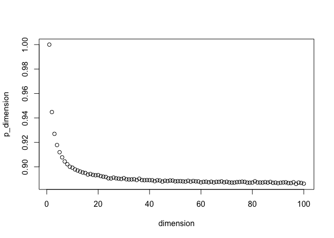

L1/L2 Metric Agreement
================
2023-06-06

Barry Rowlingson and John Mount asked the following question.

> For a positive integer $n$, take $v_1$, $v_2$ vectors in
> $\mathbb{R}^n$ with each coordinate generated IID normal mean zero,
> standard deviation 1. Call the probability that
> $(||v_1||_1 \ge ||v_2||_1) = (||v_1||_2 \ge ||v_2||_2)$ $p_n$. What is
> $\lim_{n \rightarrow \infty} p_n$?

Is this an obvious known result?

For $n = 1$ these to metrics are identical, so $p_1 = 1$. For large $n$
we expect disagreement, but strong correlation between the $L_1$ and
$L_2$ metrics above.

Let’s look at that empirically.

``` r
set.seed(2023)

experiment_reps <- 10000
f_l1 <- function(x) { sum(abs(x)) }
f_l2 <- function(x) { sqrt(sum(x^2)) }  # sqrt() doesn't affect order, so could leave it out.

estimate_p_n <- function(dimension) {  # noisy empirical estimate
  # define our experiment
  experiment <- function(ignored_argument) { 
    s1 <- rnorm(dimension)
    s2 <- rnorm(dimension)
    # abs(f_l2(s1) - f_l2(s2)) <= 1   # this converges to a constant, completing the proof
    (f_l1(s1) > f_l1(s2)) == (f_l2(s1) > f_l2(s2))  # value to return
  }
  
  # run our experiment many times, collecting results
  vec <- vapply(seq(experiment_reps), experiment, logical(1))
  
  # compute empirical estimate of p_dimension
  mean(vec)
}
```

$p_{100}$ is likely somewhere near the following.

``` r
estimate_p_n(100)
```

    ## [1] 0.8875

$p_{101}$ is likely somewhere near the following.

``` r
estimate_p_n(101)
```

    ## [1] 0.8797

A (noisy, empirical graph) of $p_n$ is given as follows.

``` r
d <- data.frame(
  dimension = seq(100)
)
d$p_dimension <- vapply(d$dimension, estimate_p_n, numeric(1))
```

``` r
plot(d)
```

<!-- -->

Some work on how to establish this can be found here: [The L2 Ball’s
View of the L1
Norm](https://github.com/WinVector/Examples/blob/main/L1L2/L1L2.ipynb).
