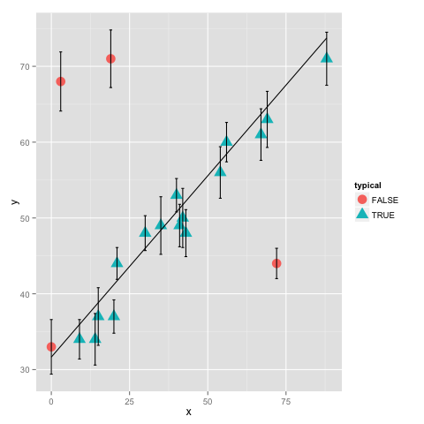

.. code:: python

    %load_ext rpy2.ipython
.. code:: python

    import numpy as np
    
    x = np.array([ 0,  3,  9, 14, 15, 19, 20, 21, 30, 35,
                  40, 41, 42, 43, 54, 56, 67, 69, 72, 88])
    y = np.array([33, 68, 34, 34, 37, 71, 37, 44, 48, 49,
                  53, 49, 50, 48, 56, 60, 61, 63, 44, 71])
    e = np.array([ 3.6, 3.9, 2.6, 3.4, 3.8, 3.8, 2.2, 2.1, 2.3, 3.8,
                   2.2, 2.8, 3.9, 3.1, 3.4, 2.6, 3.4, 3.7, 2.0, 3.5])
    
    import math, datetime
    import rpy2.robjects.lib.ggplot2 as ggplot2
    import rpy2.robjects as ro
    from rpy2.robjects.packages import importr
    rprint = ro.globalenv.get("print")
    base = importr('base')
    grdevices = importr('grDevices')
    r = ro.r
    
    df = ro.DataFrame({'x': ro.FloatVector(x), \
                       'y': ro.FloatVector(y), \
                       'e': ro.FloatVector(e), \
                       'ymin': ro.FloatVector(y-e), \
                       'ymax': ro.FloatVector(y+e)})
    rprint(df)

.. parsed-literal::

        y  x ymin   e ymax
    1  33  0 29.4 3.6 36.6
    2  68  3 64.1 3.9 71.9
    3  34  9 31.4 2.6 36.6
    4  34 14 30.6 3.4 37.4
    5  37 15 33.2 3.8 40.8
    6  71 19 67.2 3.8 74.8
    7  37 20 34.8 2.2 39.2
    8  44 21 41.9 2.1 46.1
    9  48 30 45.7 2.3 50.3
    10 49 35 45.2 3.8 52.8
    11 53 40 50.8 2.2 55.2
    12 49 41 46.2 2.8 51.8
    13 50 42 46.1 3.9 53.9
    14 48 43 44.9 3.1 51.1
    15 56 54 52.6 3.4 59.4
    16 60 56 57.4 2.6 62.6
    17 61 67 57.6 3.4 64.4
    18 63 69 59.3 3.7 66.7
    19 44 72 42.0 2.0 46.0
    20 71 88 67.5 3.5 74.5

.. parsed-literal::

    <DataFrame - Python:0x10711cb90 / R:0x7fabd678f6f0>
    [ndarray, ndarray, ndarray, ndarray, ndarray]
      y: <type 'numpy.ndarray'>
      array([ 33.,  68.,  34.,  34.,  37.,  71.,  37.,  44.,  48.,  49.,  53.,
            49.,  50.,  48.,  56.,  60.,  61.,  63.,  44.,  71.])
      x: <type 'numpy.ndarray'>
      array([  0.,   3.,   9.,  14.,  15.,  19.,  20.,  21.,  30.,  35.,  40.,
            41.,  42.,  43.,  54.,  56.,  67.,  69.,  72.,  88.])
      ymin: <type 'numpy.ndarray'>
      array([ 29.4,  64.1,  31.4,  30.6,  33.2,  67.2,  34.8,  41.9,  45.7,
            45.2,  50.8,  46.2,  46.1,  44.9,  52.6,  57.4,  57.6,  59.3,
            42. ,  67.5])
      e: <type 'numpy.ndarray'>
      array([ 3.6,  3.9,  2.6,  3.4,  3.8,  3.8,  2.2,  2.1,  2.3,  3.8,  2.2,
            2.8,  3.9,  3.1,  3.4,  2.6,  3.4,  3.7,  2. ,  3.5])
      ymax: <type 'numpy.ndarray'>
      array([ 36.6,  71.9,  36.6,  37.4,  40.8,  74.8,  39.2,  46.1,  50.3,
            52.8,  55.2,  51.8,  53.9,  51.1,  59.4,  62.6,  64.4,  66.7,
            46. ,  74.5])

.. code:: python

    %%R -i df
    df <- as.data.frame(df)
    gp <- ggplot(df) +
          aes_string(x='x', y='y', ymin='ymin', ymax='ymax') + 
         geom_point() + 
         geom_errorbar()
    print(gp)

.. image:: output_2_0.png

.. code:: python

    from scipy import optimize
    
    def squared_loss(theta, x=x, y=y, e=e):
        dy = y - theta[0] - theta[1] * x
        return np.sum(0.5 * (dy / e) ** 2)
    
    theta1 = optimize.fmin(squared_loss, [0, 0], disp=False)
    
    
    
    
    # theta will be an array of length 2 + N, where N is the number of points
    # theta[0] is the intercept, theta[1] is the slope,
    # and theta[2 + i] is the weight g_i
    
    from scipy.stats import beta
    
    priorGS = beta(0.1,0.9)
    
    def log_prior(theta):
        #g_i needs to be between 0 and 1
        gs = theta[2:]
        if (all(gs > 0) and all(gs < 1)):
            intercept = theta[0]
            slope = theta[1]
            return -len(gs)*priorGS.logpdf(np.mean(gs)) - \
               0.01*intercept**2 - 0.01*slope**2  # unscaled very rough priors
            # faster than summing -logpdf() over the individual gs
        else:
            return -np.inf  # recall log(0) = -inf
    
    def log_likelihood(theta, x, y, e, sigma_B):
        dy = y - theta[0] - theta[1] * x
        g = np.clip(theta[2:], 0, 1)  # g<0 or g>1 leads to NaNs in logarithm
        logL1 = np.log(g) - 0.5 * np.log(2 * np.pi * e ** 2) - 0.5 * (dy / e) ** 2
        logL2 = np.log(1 - g) - 0.5 * np.log(2 * np.pi * sigma_B ** 2) - 0.5 * (dy / sigma_B) ** 2
        return np.sum(np.logaddexp(logL1, logL2))
    
    def log_posterior(theta, x, y, e, sigma_B):
        return log_prior(theta) + log_likelihood(theta, x, y, e, sigma_B)
    
    
    
    ndim = 2 + len(x)  # number of parameters in the model
    nwalkers = 2*ndim+6  # number of MCMC walkers
    nburn = 10000   # "burn-in" period to let chains stabilize
    nsteps = 15000  # number of MCMC steps to take
    sigmaB = 50.0  # outlier sigma
    
    # set theta near the maximum likelihood, with
    np.random.seed(0)
    starting_guesses = np.zeros((nwalkers, ndim))
    starting_guesses[:, :2] = np.random.normal(theta1, 1, (nwalkers, 2))
    starting_guesses[:, 2:] = np.random.normal(0.5, 0.1, (nwalkers, ndim - 2))
.. code:: python

    # Note that this step will take a few minutes to run!
    import emcee
    sampler = emcee.EnsembleSampler(nwalkers, ndim, log_posterior, args=[x, y, e, sigmaB])
    sampler.run_mcmc(starting_guesses, nsteps)
    
    sample = sampler.chain  # shape = (nwalkers, nsteps, ndim)

.. parsed-literal::

    -c:35: RuntimeWarning: divide by zero encountered in log
    -c:34: RuntimeWarning: divide by zero encountered in log

.. code:: python

    ests = [ np.mean(sample[:,:,j]) for j in range(ndim) ]
    intercept = ests[0]
    slope = ests[1]
    gs = [ ests[j+2] for j in range(len(x)) ]
    print gs
    cut = min(0.5,np.percentile(gs,20))
    typical = [ g>=cut for g in gs ]
    
    
    pdf = ro.DataFrame({'x': ro.FloatVector(x), \
                       'y': ro.FloatVector(y), \
                       'e': ro.FloatVector(e), \
                       'ymin': ro.FloatVector(y-e), \
                       'ymax': ro.FloatVector(y+e), \
                       'yest': ro.FloatVector(slope*x+intercept), \
                       'typical': ro.BoolVector(typical)})
    rprint(pdf)

.. parsed-literal::

    [0.45746894550347345, 0.46127034622869856, 0.63957183624082059, 0.66453407329836289, 0.61777051305088004, 0.43355527406357042, 0.63282796508212646, 0.53217751060913976, 0.55214271684058891, 0.66904901356818081, 0.56539718160953634, 0.60668848496723682, 0.58699971068591683, 0.61972250635206261, 0.68161015412544579, 0.53031548234554637, 0.55797721076739282, 0.59442880332200598, 0.46158794846453771, 0.51763675054819724]
           yest   e ymax  y  x ymin typical
    1  31.64799 3.6 36.6 33  0 29.4   FALSE
    2  33.08287 3.9 71.9 68  3 64.1   FALSE
    3  35.95264 2.6 36.6 34  9 31.4    TRUE
    4  38.34412 3.4 37.4 34 14 30.6    TRUE
    5  38.82241 3.8 40.8 37 15 33.2    TRUE
    6  40.73559 3.8 74.8 71 19 67.2   FALSE
    7  41.21389 2.2 39.2 37 20 34.8    TRUE
    8  41.69218 2.1 46.1 44 21 41.9    TRUE
    9  45.99683 2.3 50.3 48 30 45.7    TRUE
    10 48.38831 3.8 52.8 49 35 45.2    TRUE
    11 50.77978 2.2 55.2 53 40 50.8    TRUE
    12 51.25808 2.8 51.8 49 41 46.2    TRUE
    13 51.73637 3.9 53.9 50 42 46.1    TRUE
    14 52.21467 3.1 51.1 48 43 44.9    TRUE
    15 57.47591 3.4 59.4 56 54 52.6    TRUE
    16 58.43250 2.6 62.6 60 56 57.4    TRUE
    17 63.69374 3.4 64.4 61 67 57.6    TRUE
    18 64.65033 3.7 66.7 63 69 59.3    TRUE
    19 66.08522 2.0 46.0 44 72 42.0   FALSE
    20 73.73794 3.5 74.5 71 88 67.5    TRUE

.. parsed-literal::

    <DataFrame - Python:0x10785dea8 / R:0x7fabd678f1a8>
    [ndarray, ndarray, ndarray, ..., ndarray, ndarray, ndarray]
      yest: <type 'numpy.ndarray'>
      array([ 31.64798846,  33.08287306,  35.95264226,  38.3441166 ,
            38.82241147,  40.73559094,  41.21388581,  41.69218067,
            45.99683448,  48.38830882,  50.77978315,  51.25807802,
            51.73637289,  52.21466776,  57.4759113 ,  58.43250103,
            63.69374457,  64.65033431,  66.08521891,  73.73793679])
      e: <type 'numpy.ndarray'>
      array([ 3.6,  3.9,  2.6,  3.4,  3.8,  3.8,  2.2,  2.1,  2.3,  3.8,  2.2,
            2.8,  3.9,  3.1,  3.4,  2.6,  3.4,  3.7,  2. ,  3.5])
      ymax: <type 'numpy.ndarray'>
      array([ 36.6,  71.9,  36.6,  37.4,  40.8,  74.8,  39.2,  46.1,  50.3,
            52.8,  55.2,  51.8,  53.9,  51.1,  59.4,  62.6,  64.4,  66.7,
            46. ,  74.5])
      ...
      yest: <type 'numpy.ndarray'>
      array([  0.,   3.,   9.,  14.,  15.,  19.,  20.,  21.,  30.,  35.,  40.,
            41.,  42.,  43.,  54.,  56.,  67.,  69.,  72.,  88.])
      e: <type 'numpy.ndarray'>
      array([ 29.4,  64.1,  31.4,  30.6,  33.2,  67.2,  34.8,  41.9,  45.7,
            45.2,  50.8,  46.2,  46.1,  44.9,  52.6,  57.4,  57.6,  59.3,
            42. ,  67.5])
      ymax: <type 'numpy.ndarray'>
      array([0, 0, 1, 1, 1, 0, 1, 1, 1, 1, 1, 1, 1, 1, 1, 1, 1, 1, 0, 1], dtype=int32)

.. code:: python

    %%R -i pdf
    pdf <- as.data.frame(pdf)
    gpf <- ggplot(pdf) +
       geom_point(aes_string(x='x', y='y',
         color='typical',shape='typical'),size=5) + 
      geom_errorbar(aes_string(x='x', ymin='ymin', ymax='ymax')) +
      geom_line(aes_string(x='x', y='yest'))
    print(gpf)

