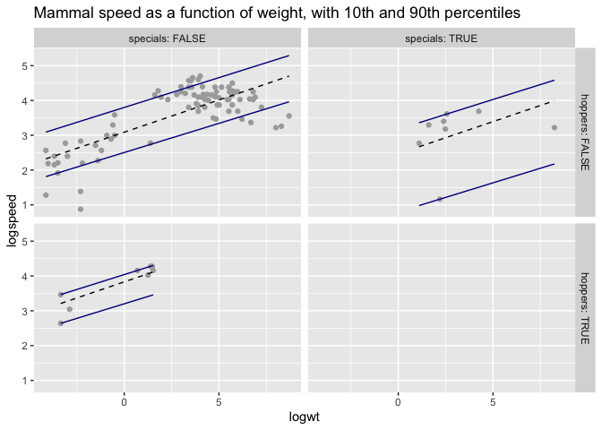
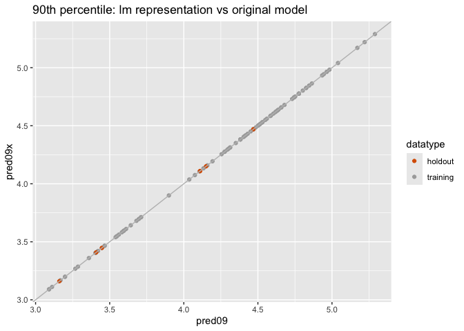
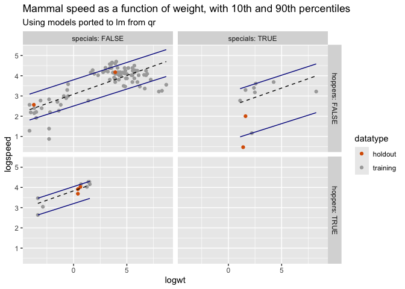

Linear Model Transfer
================
Nina Zumel
2024-07-08

## Quantile Regression

In this notebook, we’ll show an example of fitting quantile regressions
with the `quantreg` package, then transferring the model to another
linear framework: in this example `lm`. A similar procedure can be used
to transfer an R `quantreg` model to a framework in another language,
for example `scikit-learn` in Python, or `linfa` in Rust.

``` r
library(quantreg)
```

    ## Loading required package: SparseM

``` r
library(ggplot2)
```

We’ll use the Mammals dataset from the `quantreg` package for our
example, and explore the relationship between mammal weight and mammal
speed.

``` r
data(Mammals)
summary(Mammals)
```

    ##      weight             speed         hoppers         specials      
    ##  Min.   :   0.016   Min.   :  1.60   Mode :logical   Mode :logical  
    ##  1st Qu.:   1.700   1st Qu.: 22.50   FALSE:96        FALSE:97       
    ##  Median :  34.000   Median : 48.00   TRUE :11        TRUE :10       
    ##  Mean   : 278.688   Mean   : 46.21                                  
    ##  3rd Qu.: 142.500   3rd Qu.: 65.00                                  
    ##  Max.   :6000.000   Max.   :110.00

``` r
# let's compare log weight to log speed
Mammals = within(Mammals, 
                 {
                   logwt = log(weight)
                   logspeed = log(speed)
                 })

# hold out a few rows for didactic reasons
mammals = Mammals[1:100, ]
newmammals = Mammals[101:107, ]
```

We’ll use `rq()` to fit models for the 10th and 90th percentile of log
speed as a function of log weight, and whether or not the animal is a
hopper (like a kangaroo) or “special”: animals with “lifestyles in which
speed does not figure as an important factor”. Examples of “special”
animals include the porcupine, the skunk, and the raccoon.

Note that, as discussed
[here](http://www.econ.uiuc.edu/~roger/research/rq/FAQ), the calculated
percentile predictions from the model aren’t necessarily unique, but
they are correct. Hence you may get a “non-uniqueness” warning when
running `rq`.

``` r
# 90th percentile
model09 = rq(logspeed ~ logwt + hoppers + specials, data=mammals, tau=0.9)
summary(model09)
```

    ## 
    ## Call: rq(formula = logspeed ~ logwt + hoppers + specials, tau = 0.9, 
    ##     data = mammals)
    ## 
    ## tau: [1] 0.9
    ## 
    ## Coefficients:
    ##              coefficients   lower bd       upper bd      
    ## (Intercept)    3.799280e+00   3.554520e+00   4.927030e+00
    ## logwt          1.713400e-01  -8.509000e-02   2.666500e-01
    ## hoppersTRUE    2.408400e-01   1.514100e-01  1.797693e+308
    ## specialsTRUE  -6.278300e-01  -8.828700e-01  1.797693e+308

``` r
coef(model09)
```

    ##  (Intercept)        logwt  hoppersTRUE specialsTRUE 
    ##    3.7992807    0.1713355    0.2408416   -0.6278297

``` r
# 10th percentile
model01 = rq(logspeed ~ logwt + hoppers + specials, data=mammals, tau=0.1)
summary(model01)
```

    ## 
    ## Call: rq(formula = logspeed ~ logwt + hoppers + specials, tau = 0.1, 
    ##     data = mammals)
    ## 
    ## tau: [1] 0.1
    ## 
    ## Coefficients:
    ##              coefficients   lower bd       upper bd      
    ## (Intercept)    2.504370e+00   1.901140e+00   2.550920e+00
    ## logwt          1.675300e-01   1.331500e-01   2.474200e-01
    ## hoppersTRUE    6.963100e-01 -1.797693e+308   1.516360e+00
    ## specialsTRUE  -1.709310e+00 -1.797693e+308  -2.763500e-01

``` r
coef(model01)
```

    ##  (Intercept)        logwt  hoppersTRUE specialsTRUE 
    ##    2.5043689    0.1675279    0.6963102   -1.7093144

For comparison, we’ll fit a linear model for expected log speed as a
function of log weight, etc. This is mostly just to hammer in that the
models we fit above with `rq` aren’t the same.

``` r
lmmodel = lm(logspeed ~ logwt + hoppers + specials, data=mammals)
summary(lmmodel)
```

    ## 
    ## Call:
    ## lm(formula = logspeed ~ logwt + hoppers + specials, data = mammals)
    ## 
    ## Residuals:
    ##      Min       1Q   Median       3Q      Max 
    ## -1.78578 -0.25732  0.08315  0.32472  0.89710 
    ## 
    ## Coefficients:
    ##              Estimate Std. Error t value Pr(>|t|)    
    ## (Intercept)   3.08786    0.08096  38.139  < 2e-16 ***
    ## logwt         0.18527    0.01754  10.561  < 2e-16 ***
    ## hoppersTRUE   0.74307    0.21858   3.400 0.000984 ***
    ## specialsTRUE -0.62204    0.21044  -2.956 0.003923 ** 
    ## ---
    ## Signif. codes:  0 '***' 0.001 '**' 0.01 '*' 0.05 '.' 0.1 ' ' 1
    ## 
    ## Residual standard error: 0.5687 on 96 degrees of freedom
    ## Multiple R-squared:  0.556,  Adjusted R-squared:  0.5421 
    ## F-statistic: 40.07 on 3 and 96 DF,  p-value: < 2.2e-16

``` r
coef(lmmodel)
```

    ##  (Intercept)        logwt  hoppersTRUE specialsTRUE 
    ##    3.0878560    0.1852718    0.7430701   -0.6220364

Now let’s compare actual log speeds to the linear and percentile
predictions. We’ll plot outcomes and predictions as a function of
weight, with the data partitioned by the values of `specials` and
`hoppers`.

``` r
mammals$predmean = predict(lmmodel, newdata=mammals)
mammals$pred01 = predict(model01, newdata=mammals)
mammals$pred09 = predict(model09, newdata=mammals)

ggplot(mammals, aes(x=logwt, y=logspeed)) + 
  geom_point(color='darkgray') + 
  geom_line(aes(y=predmean), linetype="dashed") + 
  geom_line(aes(y=pred01), color='darkblue') +
  geom_line(aes(y=pred09), color='darkblue') + 
  facet_grid(hoppers ~ specials, labeller=label_both) + 
  ggtitle("Mammal speed as a function of weight, with 10th and 90th percentiles")
```

<!-- -->

## Transfer the quantile model to the `lm` framework

Now let’s transfer the coefficients from the `qr` models to `lm` models.
As discussed in our main article, we can do this by evaluating the
quantile models on a full rank set of rows. Since all the variables here
are numeric or logical (0/1), this only requires 4 independent rows: one
for each variable, plus the intercept.

Note that in the representation below, the intercept column is implicit,
so you can think of `evalframe` having an invisible intercept column
`c(1, 1, 1, 1)`, making `evalframe` a 4 by 4 full rank matrix.

First, transfer the 90th percentile model.

``` r
meanlogwt = mean(mammals$logwt) # not strictly necessary, but nice to keep the value in range

# you can build this frame any old way, this just happens to be readable
evalframe = wrapr::build_frame(
   'logwt', 'hoppers', 'specials' |
         0,  0,        0         | # for intercept
 meanlogwt,  0,        0         |
         0,  1,        0         |
         0,  0,        1
)

# hoppers and specials need to be logicals
evalframe$hoppers = as.logical(evalframe$hoppers)
evalframe$specials = as.logical(evalframe$specials)

# now add the predictions from the 90th percentile model
evalframe$logspeed = predict(model09, newdata=evalframe)

print(evalframe)
```

    ##      logwt hoppers specials logspeed
    ## 1 0.000000   FALSE    FALSE 3.799281
    ## 2 2.706184   FALSE    FALSE 4.262946
    ## 3 0.000000    TRUE    FALSE 4.040122
    ## 4 0.000000   FALSE     TRUE 3.171451

In the code above, I used `wrapr::build_frame` to specify the dataframe
in a row-wise fashion. This is of course completely optional; I just
didn’t want to transpose the frame in my head to write it down in the
default column-wise manner.

Now, let’s fit an `lm` model to the evaluation frame

``` r
model09lm = lm(logspeed ~ logwt + hoppers + specials, data=evalframe)

# compare the coefficients
data.frame(
  ported_model09 = coef(model09lm),
  original_model09 = coef(model09)
)
```

    ##              ported_model09 original_model09
    ## (Intercept)       3.7992807        3.7992807
    ## logwt             0.1713355        0.1713355
    ## hoppersTRUE       0.2408416        0.2408416
    ## specialsTRUE     -0.6278297       -0.6278297

The coefficients of the new `lm` model are the same as the original 90th
percentile model! It’s easy to prove that the predicted values are
exactly the same, even on new data.

``` r
Mammals$pred09 = predict(model09, newdata=Mammals)
Mammals$pred09x = predict(model09lm, newdata=Mammals)

# mark the training and holdout data
Mammals$datatype = c(rep('training', 100), rep('holdout', 7))

palette = c(training='darkgray', holdout='#d95f02')
ggplot(Mammals, aes(x=pred09, y=pred09x, color=datatype)) +
  geom_point() +
  geom_abline(color='gray') + 
  scale_color_manual(values=palette) + 
  ggtitle("90th percentile: lm representation vs original model")
```

<!-- -->

We’ll finish off by also re-fitting the 10th percentile model, and
replicating the mean and percentile plot we created above.

``` r
# get the 10th percentile predictions

evalframe$logspeed = predict(model01, newdata=evalframe)
model01lm = lm(logspeed ~ logwt + hoppers + specials, data=evalframe)

# compare the coefficients
data.frame(
  ported_model01 = coef(model01lm),
  original_model01 = coef(model01)
)
```

    ##              ported_model01 original_model01
    ## (Intercept)       2.5043689        2.5043689
    ## logwt             0.1675279        0.1675279
    ## hoppersTRUE       0.6963102        0.6963102
    ## specialsTRUE     -1.7093144       -1.7093144

``` r
# recreate the plot (including the holdout data)

Mammals$predmean = predict(lmmodel, newdata=Mammals)
Mammals$pred01 = predict(model01lm, newdata=Mammals)
Mammals$pred09 = predict(model09lm, newdata=Mammals)

ggplot(Mammals, aes(x=logwt, y=logspeed)) + 
  geom_point(aes(color=datatype)) + 
  geom_line(aes(y=predmean), linetype="dashed") + 
  geom_line(aes(y=pred01), color='darkblue') +
  geom_line(aes(y=pred09), color='darkblue') + 
  scale_color_manual(values=palette) + 
  facet_grid(hoppers ~ specials, labeller=label_both) + 
  ggtitle("Mammal speed as a function of weight, with 10th and 90th percentiles",
          subtitle="Using models ported to lm from qr")
```

<!-- -->
