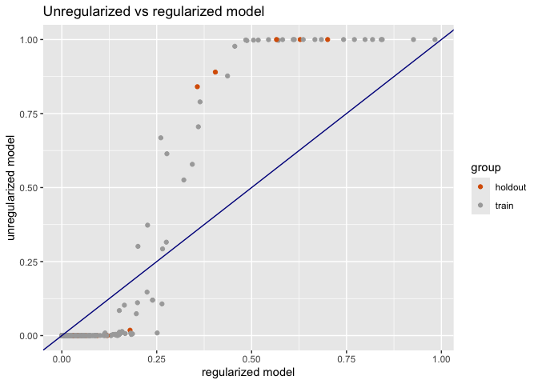
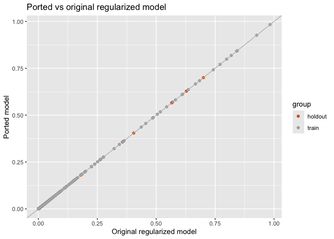

Logistic Model Transfer
================
Nina Zumel
2024-07-08

In this notebook, we’ll show an example of fitting a regularized
logistic model in R using the `glmnet`package, then transferring the
model to another generalized linear framework, in this example `glm`. A
similar procedure can be used to transfer an R `glmnet` model to a
framework in another language, for example `scikit-learn` or pytorch in
Python, or `linfa` in Rust.

First, we’ll simulate some data. This example is taken from the
[EPIB-621 course
notes](http://www.medicine.mcgill.ca/epidemiology/Joseph/courses/EPIB-621/logconfound.pdf)
by Lawrence Joseph at McGill University. The data is designed to
demonstrate the effects of collinear variables when fitting logistic
regression models.

``` r
library(ggplot2)

set.seed(20240707)

# Create any first independent variable (round to one decimal place)
x1 <- round(rnorm(400, mean=0, sd=1), 1)
# Create any second independent variable (round to one decimal place)
x2 <- round(rnorm(400, mean = 4, sd=2), 1)
# Now create a third independent variable that is a direct function
# of the first two variables
x3 <- 3*x1 + 2 *x2
# Create a binary outcome variable that depends on all three variables
# Note that the probability of the binomial is an inv.logit function
y <- rbinom(400, 1, exp(x1 + 2*x2 -3 * x3)/(1+ exp(x1 + 2*x2 -3 * x3)))

# Put all variables into a data frame
df <- data.frame(x1=x1, x2=x2, x3=x3, y=y)

# mark some of it as holdout data, for didactic reasons
df$gp = ifelse(runif(400) < 0.1, 'holdout', 'train')

dftrain = subset(df, gp=='train')
```

First, we’ll fit a logistic regression model to see the pathology.

``` r
# try to fit a logistic regression
mod1 = glm(y ~ x1 + x2 + x3, data=dftrain, family = binomial)
```

    ## Warning: glm.fit: fitted probabilities numerically 0 or 1 occurred

``` r
summary(mod1)
```

    ## 
    ## Call:
    ## glm(formula = y ~ x1 + x2 + x3, family = binomial, data = dftrain)
    ## 
    ## Coefficients: (1 not defined because of singularities)
    ##             Estimate Std. Error z value Pr(>|z|)   
    ## (Intercept)  -0.4986     1.2736  -0.392  0.69542   
    ## x1          -12.1873     4.4619  -2.731  0.00631 **
    ## x2           -5.5583     2.2202  -2.503  0.01230 * 
    ## x3                NA         NA      NA       NA   
    ## ---
    ## Signif. codes:  0 '***' 0.001 '**' 0.01 '*' 0.05 '.' 0.1 ' ' 1
    ## 
    ## (Dispersion parameter for binomial family taken to be 1)
    ## 
    ##     Null deviance: 200.50  on 352  degrees of freedom
    ## Residual deviance:  20.75  on 350  degrees of freedom
    ## AIC: 26.75
    ## 
    ## Number of Fisher Scoring iterations: 12

Note that `glm` is unable to assign a coefficient to `x3`, because it is
a linear combination of `x1` and `x2`.

This singularity is clearly an issue when the data scientist is
interested in correctly inferring the parameter values of the model (in
other words, in estimating the effect of a variable on the outcome). In
situations where predicting outcomes is the primary goal, such a model
*may* still give correct answers, but it can also be quite sensitive to
any deviations from the training data in the parameter distributions.
Logistic models fit to nearly collinear variables can also be unstable.

If you are more interested in stable prediction of outcome, rather than
correct inference of parameters, regularizing the regression is a
recommended procedure.

So we will try fitting a logistic model to this data with L2
regularization (AKA ridge regression), to manage the collinearity. We’ll
use `cv.glmnet` to automatically pick a good value for the
regularization parameter, and return the appropriate model.

``` r
library(glmnet)
```

    ## Loading required package: Matrix

    ## Loaded glmnet 4.1-8

``` r
# glmnet logistic regression needs a matrix for input, and factors for output
dmat = as.matrix(dftrain[, c('x1', 'x2', 'x3' )])
outcome = as.factor(dftrain$y)

# alpha = 0 : ridge regression
modglmn = cv.glmnet(dmat, outcome, alpha = 0, family=binomial)
modglmn
```

    ## 
    ## Call:  cv.glmnet(x = dmat, y = outcome, alpha = 0, family = binomial) 
    ## 
    ## Measure: GLM Deviance 
    ## 
    ##      Lambda Index Measure      SE Nonzero
    ## min 0.01500   100  0.1585 0.02864       3
    ## 1se 0.02621    94  0.1868 0.03147       3

``` r
coef(modglmn)
```

    ## 4 x 1 sparse Matrix of class "dgCMatrix"
    ##                     s1
    ## (Intercept) -1.4136573
    ## x1          -1.2248575
    ## x2          -0.2483632
    ## x3          -0.2244361

Let’s compare the predictions of the two models on all the data
(including holdout).

``` r
dmat_all = as.matrix(df[, c('x1', 'x2', 'x3' )])

# get the predicted probabilities from both model
cframe = data.frame(
  mod1 =  predict(mod1, newdata=df, type='response'),
  glmn = as.numeric(predict(modglmn, dmat_all, type='response')),
  group = df$gp
)

palette = c(train='darkgrey', holdout='#d95f02')

# unregularized model goes to 0/1 much faster
ggplot(cframe, aes(x=glmn, y=mod1, color=group)) + 
  geom_point() + geom_abline(color='darkblue') + 
  scale_color_manual(values=palette) + 
  xlab("regularized model") + ylab("unregularized model") + 
  ggtitle('Unregularized vs regularized model')
```

<!-- -->

Note that the unregularized model returns much larger link values,
leading the probabilities to saturate at nearly 0 or nearly 1 much
sooner than the regularized model. Regularization produces what you
might call a “more conservative” model.

## Transfer the `glmnet` model to the `glm` framework

If the resulting model is good enough for your needs, and you are
willing to work with your data as matrices and factors, then you’re
done. But you might want to keep the data as a data frame for other
reasons (for example, compatibility with the rest of the workflow). In
this case, you might find it useful to port the `glmnet` model to `glm`
for ease of use.

As discussed in our main article, this only requires evaluating the
`glmnet` model on a full rank set of rows. Since all the variables here
are numeric, we only need 4 independent rows: one for each variable,
plus the intercept.

Note that in the representation below, the intercept column is implicit,
so you can think of `evalframe` having an invisible intercept column
`c(1, 1, 1, 1)`, making `evalframe` a 4 by 4 full rank matrix.

``` r
# you can build this frame any old way, this just happens to be readable
evalframe = wrapr::build_frame(
  'x1', 'x2', 'x3'   |
    0,    0,    0    | # for intercept
    1,    0,    0    |
    0,    1,    0    |
    0,    0,    1
)

# attach predictions from glmnet model
emat = as.matrix(evalframe)
evalframe$y = as.numeric(predict(modglmn, emat, type='response'))

evalframe
```

    ##   x1 x2 x3          y
    ## 1  0  0  0 0.19565785
    ## 2  1  0  0 0.06670043
    ## 3  0  1  0 0.15949095
    ## 4  0  0  1 0.16272466

In the code above, I used `wrapr::build_frame` to specify the dataframe
in a row-wise fashion. This is of course completely optional; I just
didn’t want to transpose the frame in my head to write it down in the
default column-wise manner.

Now, let’s fit a `glm` model to the evaluation frame. In R, we can use
the predicted probabilities as outputs directly; the `glm` function will
complain, but the answer will be correct.

``` r
# fit the model using glm, family binomial. 
# It will complain, but the answer will be correct
modport = glm(y ~ x1 + x2 + x3, data=evalframe, family=binomial)
```

    ## Warning in eval(family$initialize): non-integer #successes in a binomial glm!

``` r
summary(modport)
```

    ## 
    ## Call:
    ## glm(formula = y ~ x1 + x2 + x3, family = binomial, data = evalframe)
    ## 
    ## Coefficients:
    ##             Estimate Std. Error z value Pr(>|z|)
    ## (Intercept)  -1.4137     2.5208  -0.561    0.575
    ## x1           -1.2249     4.7347  -0.259    0.796
    ## x2           -0.2484     3.7167  -0.067    0.947
    ## x3           -0.2244     3.7005  -0.061    0.952
    ## 
    ## (Dispersion parameter for binomial family taken to be 1)
    ## 
    ##     Null deviance:  8.3030e-02  on 3  degrees of freedom
    ## Residual deviance: -1.1549e-16  on 0  degrees of freedom
    ## AIC: 9.2762
    ## 
    ## Number of Fisher Scoring iterations: 5

``` r
# compare coefficients
data.frame(
  ported_model = coef(modport),
  original_model = as.numeric(coef(modglmn))
)
```

    ##             ported_model original_model
    ## (Intercept)   -1.4136573     -1.4136573
    ## x1            -1.2248575     -1.2248575
    ## x2            -0.2483632     -0.2483632
    ## x3            -0.2244361     -0.2244361

The coefficients are the same. We can check that the predictions are the
same, even on new data.

``` r
# compare the predictions on the original data
cframe = data.frame(
  modport =  predict(modport, newdata=df, type='response'),
  glmn = as.numeric(predict(modglmn, dmat_all, type='response')),
  group = df$gp
)

ggplot(cframe, aes(x=glmn, y=modport, color=group)) + 
  geom_point() + geom_abline(color='gray') + 
  scale_color_manual(values=palette) + 
  xlab("Original regularized model") + ylab("Ported model") + 
  ggtitle('Ported vs original regularized model')
```

<!-- -->

### Porting to `scikit-learn`

The above procedure should work fine when porting the model to a
framework like pytorch or tensorflow. However, there are caveats when
porting to scikit-learn.

First of all: scikit-learn `LogisticRegression` regularizes by default,
using ridge regression and a fairly large regularization (`C` = 1.0;
compare this to `cv.glmnet`, which, for our problem, chose
regularization `lambda` = 0.02621). So in our example scenario, you’d
probably prefer to fit the model directly in scikit-learn anyway. But
there are other situations where you might want to fit a logistic model
outside of scikit-learn and then port it. For example, you might prefer
to fit using `statsmodels` in python, or you have priors on the
coefficients that you want to enforce using Bayesian regression (either
in python or in R).

In any case, to port your model to scikit-learn’s `LogisticRegression`,
first, make sure to set `penalty=None` to turn off the regularization.
Second, augment your evaluation frame to a “weighted logistic
regression” representation. Here we show such a representation, in R.

``` r
# weights for positive examples
posframe = evalframe
posframe$wt = posframe$y  # probability of success
posframe$y = 1

# weights for negative examples
negframe = posframe
negframe$wt = 1 - negframe$wt # probability of failure
negframe$y = 0

wtframe = data.table::rbindlist(list(posframe, negframe)) |> as.data.frame()
wtframe
```

    ##   x1 x2 x3 y         wt
    ## 1  0  0  0 1 0.19565785
    ## 2  1  0  0 1 0.06670043
    ## 3  0  1  0 1 0.15949095
    ## 4  0  0  1 1 0.16272466
    ## 5  0  0  0 0 0.80434215
    ## 6  1  0  0 0 0.93329957
    ## 7  0  1  0 0 0.84050905
    ## 8  0  0  1 0 0.83727534

The new evaluation frame has two rows for every combination of features.
One row has outcome 1, and weight $p$, where $p$ is the predicted
probability of success from the original model. The other row has
outcome 0, and weight $1-p$, the predicted probability of failure. The
input data, outcome vector, and weight vector can all be passed to the
`fit()` call of `LogisticRegression`.

We can do the same thing in R, with `glm`.

``` r
# it still complains, but the answer is still correct
modport2 = glm(y ~ x1 + x2 + x3, data=wtframe, weights = wtframe$wt, family=binomial)
```

    ## Warning in eval(family$initialize): non-integer #successes in a binomial glm!

``` r
summary(modport2)
```

    ## 
    ## Call:
    ## glm(formula = y ~ x1 + x2 + x3, family = binomial, data = wtframe, 
    ##     weights = wtframe$wt)
    ## 
    ## Coefficients:
    ##             Estimate Std. Error z value Pr(>|z|)
    ## (Intercept)  -1.4137     2.5208  -0.561    0.575
    ## x1           -1.2249     4.7347  -0.259    0.796
    ## x2           -0.2484     3.7167  -0.067    0.947
    ## x3           -0.2244     3.7005  -0.061    0.952
    ## 
    ## (Dispersion parameter for binomial family taken to be 1)
    ## 
    ##     Null deviance: 3.3277  on 7  degrees of freedom
    ## Residual deviance: 3.2447  on 4  degrees of freedom
    ## AIC: 9.2762
    ## 
    ## Number of Fisher Scoring iterations: 5

``` r
# compare coefficients
data.frame(
  port_using_weights = coef(modport2),
  port_using_probs = coef(modport),
  original_model = as.numeric(coef(modglmn))
)
```

    ##             port_using_weights port_using_probs original_model
    ## (Intercept)         -1.4136573       -1.4136573     -1.4136573
    ## x1                  -1.2248575       -1.2248575     -1.2248575
    ## x2                  -0.2483632       -0.2483632     -0.2483632
    ## x3                  -0.2244361       -0.2244361     -0.2244361

Both ported models have the same coefficients as the original model that
was fit with `cv.glmnet`.
