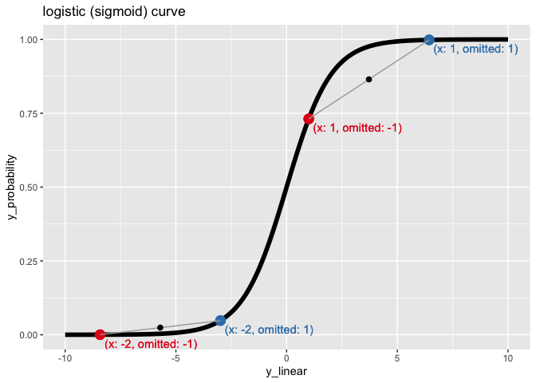

Omitted Variable Effects in Logistic Regression
================
John Mount, Win-Vector LLC
2023-08-18

## Introduction

I would like to illustrate a way which omitted variables interfere in
[logistic regression](https://en.wikipedia.org/wiki/Logistic_regression)
inference (or coefficient estimation). These effects are different than
what is seen in [linear
regression](https://en.wikipedia.org/wiki/Linear_regression), and
possibly different than some expectations or intuitions.

## Our Example Data

Let’s start with a data example in [`R`](https://www.r-project.org).

``` r
# example variable frame
x_frame <- data.frame(
  x = c(-2, 1),
  wt = 1
)
```

`x_frame` is a `data.frame` with a single variable called `x`, and an
example weight or row weight called `wt`.

``` r
# example variable frame
omitted_frame <- data.frame(
  omitted = c(-1, 1),
  wt = 1
)
```

`omitted_frame` is a `data.frame` with a single variable called
`omitted`, and an example weight called `wt`.

For our first example we take the cross-product of these data frames to
get every combination of variable values, and their relative proportions
(or weights) in the joined data frame.

``` r
# combine frames by cross product, and get new relative data weights
d <- merge(
  x_frame, 
  omitted_frame, 
  by = c())
d$wt = d$wt.x * d$wt.y
d$wt <- d$wt / sum(d$wt)
d$wt.x <- NULL
d$wt.y <- NULL
```

``` r
# our data
knitr::kable(d)
```

|   x | omitted |   wt |
|----:|--------:|-----:|
|  -2 |      -1 | 0.25 |
|   1 |      -1 | 0.25 |
|  -2 |       1 | 0.25 |
|   1 |       1 | 0.25 |

The idea is: `d` is specifying what proportion of an arbitrarily large
data set (with repeated rows) has each possible combination of values.
For us, `d` is not a sample- it is an entire population. This is just a
long-winded way of trying to explain why we have row weights and why we
are not concerned with observation counts, uncertainty bars, or
significances/p-values for this example.

Let’s define a few common constants: `Euler's constant`, `pi`, and `e`.

``` r
# 0.5772
(Euler_constant <- -digamma(1))
```

    ## [1] 0.5772157

``` r
# 3.1415
pi
```

    ## [1] 3.141593

``` r
# 2.7182
(e <- exp(1))
```

    ## [1] 2.718282

Please remember these constants in this order for later.

``` r
# show constants in an order will see again
c(Euler_constant, pi, e)
```

    ## [1] 0.5772157 3.1415927 2.7182818

## The Linear Case

For our example we call our outcome (or dependent variable) `y_linear`.
We say that it is exactly the following linear combination of a constant
plus the variables `x` and `omitted`.

``` r
# assign an example outcome or dependent variable
d$y_linear <- Euler_constant + pi * d$x + e * d$omitted
```

``` r
# our data with outcome
knitr::kable(d)
```

|   x | omitted |   wt |  y_linear |
|----:|--------:|-----:|----------:|
|  -2 |      -1 | 0.25 | -8.424252 |
|   1 |      -1 | 0.25 |  1.000527 |
|  -2 |       1 | 0.25 | -2.987688 |
|   1 |       1 | 0.25 |  6.437090 |

As we expect, linear regression can recover the constants of the linear
equation from data.

``` r
# inferring coefficients from data
lm(
  y_linear ~ x + omitted, 
  data = d, 
  weights = d$wt, 
  )$coef
```

    ## (Intercept)           x     omitted 
    ##   0.5772157   3.1415927   2.7182818

Notice the recovered coefficients are the three constants we specified.

This is nice, and as expected.

### Omitting a Variable

Now we ask: what happens if we omit from the model the variable named
“`omitted`”? This is a central problem in modeling. We are unlikely to
know, or be able to measure, all possible explanatory variables in many
real world settings. We are often omitting variables, as we don’t know
about them or have access to their values!

For this linear regression model, we do not expect [omitted variable
bias](https://en.wikipedia.org/wiki/Omitted-variable_bias) as the
variables `x` and `omitted`, by design, are fully [statistically
independent](https://en.wikipedia.org/wiki/Independence_(probability_theory)).

We can confirm `omitted` is nice, in that it is mean-`0` and has zero
correlation with `x` under the specified data distribution.

``` r
# mean 0 check
sum(d$omitted * d$wt) / sum(d$wt)
```

    ## [1] 0

``` r
# no correlation check
knitr::kable(
  cov.wt(
    d[, c('x', 'omitted')],
    wt = d$wt
  )$cov
)
```

|         |   x |  omitted |
|:--------|----:|---------:|
| x       |   3 | 0.000000 |
| omitted |   0 | 1.333333 |

All of this worrying pays off. If we fit a model with the `omitted`
variable left out, we still get the original estimates of the
`x`-coefficient and the intercept.

``` r
# inferring coefficients, with omitted variable
lm(
  y_linear ~ x, 
  data = d,
  weights = d$wt, 
  )$coef
```

    ## (Intercept)           x 
    ##   0.5772157   3.1415927

## The Logistic Case

Let’s convert this problem to modeling the probability distribution of a
new outcome variable, called `y_observed` that takes on the values
`TRUE` and `FALSE`. We use the encoding strategy from [“replicate linear
models”](https://win-vector.com/2019/07/03/replicating-a-linear-model/)
(which can simplify steps in many data science projects). How this
example arises isn’t critical, we want to investigate the properties of
this resulting data. So let’s take a moment and derive our data.

``` r
# converting "links" to probabilities
sigmoid <- function(x) {1 / (1 + exp(-x))}

d$y_probability <- sigmoid(d$y_linear)
```

``` r
# encoding effect as a probability model over a binary outcome
# method used for model replication
# ref: https://win-vector.com/2019/07/03/replicating-a-linear-model/
d_plus <- d
d_plus$y_observed <- TRUE
d_plus$wt <- d_plus$wt * d_plus$y_probability
d_minus <- d
d_minus$y_observed <- FALSE
d_minus$wt <- d_minus$wt * (1 - d_minus$y_probability)
d_logistic <- rbind(d_plus, d_minus)
d_logistic$wt <- d_logistic$wt / sum(d_logistic$wt)
```

``` r
# our data with binary outcome
knitr::kable(d_logistic)
```

|   x | omitted |        wt |  y_linear | y_probability | y_observed |
|----:|--------:|----------:|----------:|--------------:|:-----------|
|  -2 |      -1 | 0.0000549 | -8.424252 |     0.0002194 | TRUE       |
|   1 |      -1 | 0.1827905 |  1.000527 |     0.7311621 | TRUE       |
|  -2 |       1 | 0.0119963 | -2.987688 |     0.0479852 | TRUE       |
|   1 |       1 | 0.2496004 |  6.437090 |     0.9984015 | TRUE       |
|  -2 |      -1 | 0.2499451 | -8.424252 |     0.0002194 | FALSE      |
|   1 |      -1 | 0.0672095 |  1.000527 |     0.7311621 | FALSE      |
|  -2 |       1 | 0.2380037 | -2.987688 |     0.0479852 | FALSE      |
|   1 |       1 | 0.0003996 |  6.437090 |     0.9984015 | FALSE      |

The point is: this data has our original coefficients encoded in it as
the coefficients of the generative process for `y_observed`. We confirm
this by fitting a logistic regression.

``` r
# infer coefficients from binary outcome
# suppressWarnings() only to avoid "fractional weights message"
suppressWarnings(
  glm(
    y_observed ~ x + omitted, 
    data = d_logistic, 
    weights = d_logistic$wt, 
    family = binomial(link = "logit")
    )$coef
)
```

    ## (Intercept)           x     omitted 
    ##   0.5772151   3.1415914   2.7182800

Notice we recover the same coefficients as before. We could use these
inferred coefficients to answer questions about how probabilities of
outcomes varies with changes in variables in the data.

### Omitting a Variable, Again

Now, let’s try to (and fail to) repeat our omitted variable experiment.

First we confirm `omitted` is mean zero and uncorrelated with our
variable `x`, even in the new data set and new row weight distribution.

``` r
# check mean zero
sum(d_logistic$omitted * d_logistic$wt) / sum(d_logistic$wt)
```

    ## [1] 1.50162e-17

``` r
# check uncorrelated
knitr::kable(
  cov.wt(
    d_logistic[, c('x', 'omitted')],
    wt = d_logistic$wt
  )$cov
)
```

|         |        x |  omitted |
|:--------|---------:|---------:|
| x       | 2.882739 | 0.000000 |
| omitted | 0.000000 | 1.281217 |

We pass the check. But, as we will see, this doesn’t guarantee
non-entangled behavior for a logistic regression.

``` r
# infer coefficients from binary outcome, with omitted variable
# suppressWarnings() only to avoid "fractional weights message"
suppressWarnings(
  glm(
    y_observed ~ x, 
    data = d_logistic, 
    weights = d_logistic$wt, 
    family = binomial(link = "logit")
    )$coef
)
```

    ## (Intercept)           x 
    ##  0.00337503  1.85221234

Notice the new `x` coefficient is nowhere near the value we saw before.

### Explaining The Result

A stern way of interpreting our logistic experiment is:

> For a logistic regression model: an omitted explanatory variable can
> bias other coefficient estimates. This is true even when the omitted
> explanatory variable is mean zero, symmetric, and uncorrelated with
> the other model explanatory variables. This differs from the situation
> for linear models.

Another way of interpreting our logistic experiment is:

> For a logistic regression model: the correct inference for a given
> explanatory variable coefficient often depends on what other
> explanatory variables are present in the model.

That is: we didn’t get a wrong inference. We just got a different one,
as we are inferring in a different situation. The fallacy was thinking a
change in variable value has the same effect no matter what the values
of other explanatory variables are. This is not the case for logistic
regression, due to the non-linear shape of the logistic curve.

Diagrammatically what happened is the following.

<!-- -->

In the above diagram we portray the `sigmoid()`, or logistic curve. The
horizontal axis is the linear or “link space” for predictions and the
vertical axis is the probability or response space for predictions. The
curve is the transform the logistic regression’s linear or link
prediction is run through to get probabilities or responses. On this
curve we have added as dots the four different combinations of values
for `x` and `omitted` in our data set. The dots attached by lines differ
only by changes in `omitted`, i.e. those that have given value for `x`.

Without the extra variable `omitted` we can’t tell the joined pairs
apart, and we are forced to use compromise effect estimates. However,
the amount of interference is different for each value of `x`. For
`x = -2`, the probability is almost determined, and `omitted` changes
little. For `x = -1` things are less determined, and `omitted` can have
a substantial effect. How much probability effect `omitted` has depends
on the value of `x`, which obscures results much like a [statistical
interaction](https://en.wikipedia.org/wiki/Interaction_(statistics))
would.

This is a common observation in logistic regression: you can’t tell if a
variable and coefficient have large or small effects without knowing the
specific values of the complementary explanatory variables.

## My Interpretation

You get different estimates for variables depending on what other
variables are present in a logistic regression model. This looks a lot
like an interaction, and leads to effects similar to omitted variable
bias. This happens more often than in linear regression models. This is
also interpretable as: different column-views of the data having
fundamentally different models.

A possible source of surprise is: appealing to assumed independence is a
common way of assuring one is avoiding issues such as [Simpson’s
paradox](https://en.wikipedia.org/wiki/Simpson%27s_paradox) in linear
regression modeling. Thus it is possible an “independence implies
non-interference” intuition is part of some modeler’s toolboxes.

In conclusion: care has to be taken in taking inferred logistic
coefficients out of their surrounding context. The product of a logistic
regression coefficient and matching value is not directly an effect size
outside of context, this differs from the case for linear regression.

## Discussion Points

What are your opinions/experience? Some questions I feel are relevant
include:

- What is the correct value of the `x`-coefficient in the logistic
  regressions? `3.1415`, `1.8522`, both, or neither?
- Do you feel these effects are intrinsic to the modeling process, or
  introduced by attempted interpretation?
- Is the above important in your uses of inferred logistic regression
  coefficients?

<hr/>

`R` source for this article can be found
[here](https://github.com/WinVector/Examples/tree/main/LogisticOmit).
