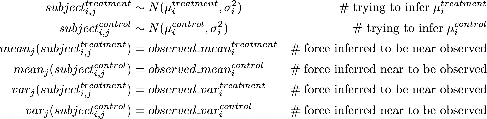
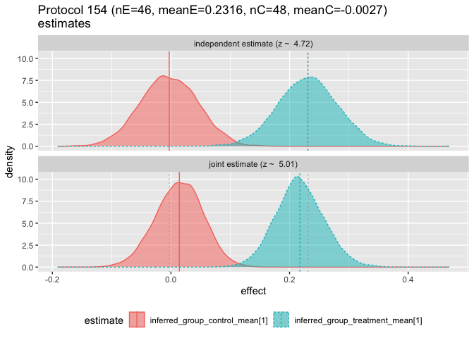
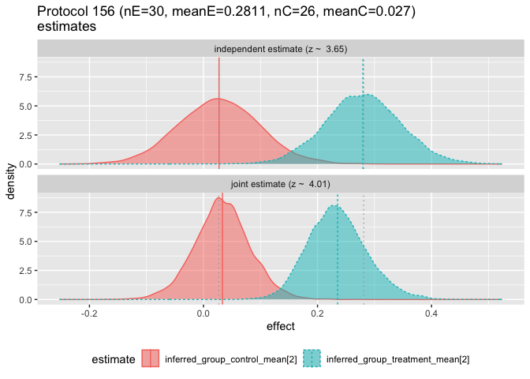
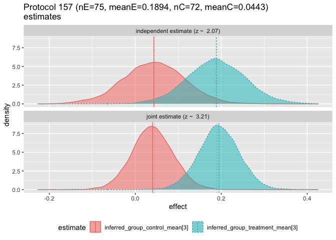
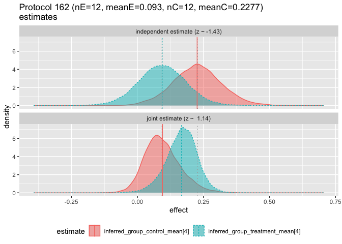
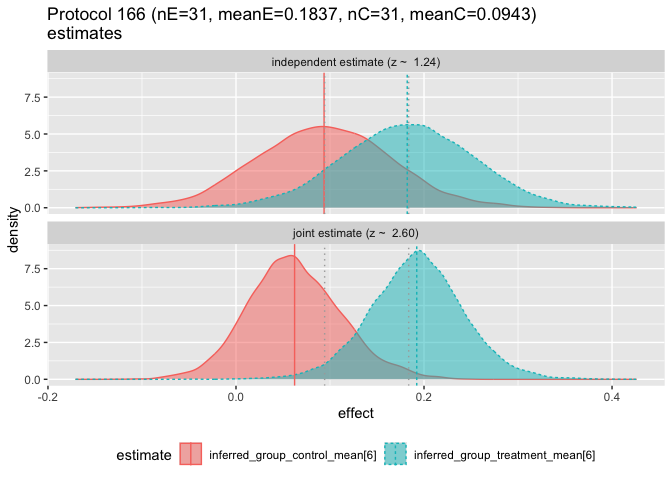
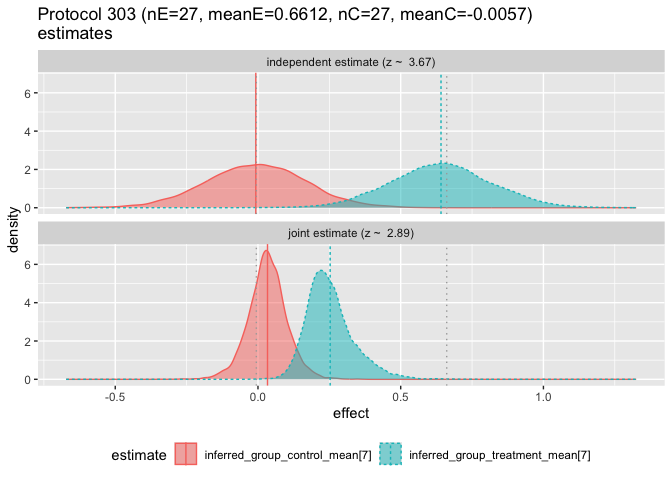
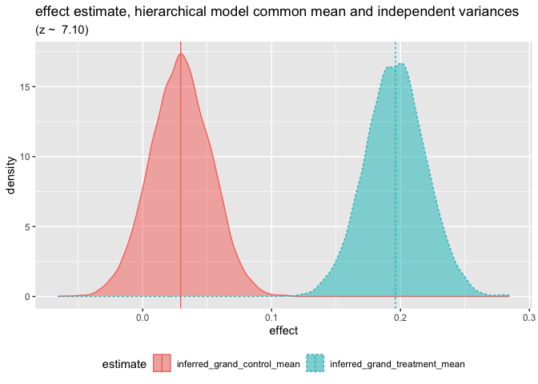

# Examining Meta-Analysis
John Mount, Joseph Rickert
2025-01-06

In this post (shared [here](https://rworks.dev/posts/meta-analysis/) and
[here](https://github.com/WinVector/Examples/blob/main/MetaAnalysis/Amlodipine/ExaminingMetaAnalysis.md))
we would like to review the idea of *meta-analysis* and compare a
traditional, frequentist style, random effects meta-analysis to Bayesian
methods. We will do this using the
[meta](https://cran.r-project.org/package=meta) R package and a Bayesian
analysis conducted with R but actually carried out by the
[Stan](https://mc-stan.org/) programming language on the back end. We
will use a small but interesting text book data set of summary data from
eight randomized controlled trials. These studies examined the
effectiveness of the calcium channel blocker amlodipine as compared to a
placebo in improving work capacity in patients with angina. The data set
and the analysis with the `meta` package come directly from the textbook
by Chen and Peace (2013) . Although there are several R packages that
are capable of doing the Bayesian meta-analysis, we chose to work in
[rstan](https://cran.r-project.org/package=rstan) to demonstrate its
flexibility and hint how one might go about doing a large complex study
that doesn’t quite fit with pre-programmed paradigms.

To follow our examples you really don’t need to know much more about
meta-analysis than the definition offered by Wikipedia contributors
(2024) : “meta-analysis is a method of synthesis of quantitative data
from multiple independent studies addressing a common research
question”. If you want to dig deeper, a good overview of the goals and
terminology can be found in Israel and Richter (2011) . The online text
book [Doing Meta-Analysis in R: A Hands-on
Guide](https://bookdown.org/MathiasHarrer/Doing_Meta_Analysis_in_R/) by
Mathias Harrier and Ebert (2021) will take you a long way in performing
your own work.

## Example

Let’s begin: load the required required packages and read in the data.

<details class="code-fold">
<summary>Show the code</summary>

``` r
library(meta)
library(wrapr)

angina <- read.csv(file = "AmlodipineData.csv", strip.white = TRUE, stringsAsFactors = FALSE)

angina |>
  knitr::kable()
```

</details>

| Protocol |  nE |  meanE |   varE |  nC |   meanC |   varC |
|---------:|----:|-------:|-------:|----:|--------:|-------:|
|      154 |  46 | 0.2316 | 0.2254 |  48 | -0.0027 | 0.0007 |
|      156 |  30 | 0.2811 | 0.1441 |  26 |  0.0270 | 0.1139 |
|      157 |  75 | 0.1894 | 0.1981 |  72 |  0.0443 | 0.4972 |
|      162 |  12 | 0.0930 | 0.1389 |  12 |  0.2277 | 0.0488 |
|      163 |  32 | 0.1622 | 0.0961 |  34 |  0.0056 | 0.0955 |
|      166 |  31 | 0.1837 | 0.1246 |  31 |  0.0943 | 0.1734 |
|      303 |  27 | 0.6612 | 0.7060 |  27 | -0.0057 | 0.9891 |
|      306 |  46 | 0.1366 | 0.1211 |  47 | -0.0057 | 0.1291 |

The data set contains eight rows each representing the measured effects
of treatment and control on different groups. The column definitions
are:

-   `Protocol` id number of the study the row is summarizing.
-   `nE` number of patients in the treatment group.
-   `meanE` mean treatment effect observed.
-   `varE` variance of treatment effect observed.
-   `nC` number of patients in the control group.
-   `meanC` mean control effect observed.
-   `varC` variance of control effect observed.

### Naive Pooling

A [statistically
inefficient](https://en.wikipedia.org/wiki/Efficiency_(statistics)),
naive technique to combine the studies would be to pool all of the data.
This is usually not even possible, as most studies don’t share data- and
at best share summaries. We might hope this is enough to get a good
estimate of the expected difference between treatment and non-treatment.
However this ignores variance and treats low-quality results on the same
footing as high quality results, yielding unreliable results. Naive
pooling also lacks standard diagnostic procedures and indications.

That being said let’s form the naive pooled estimate.

<details class="code-fold">
<summary>Show the code</summary>

``` r
sum(angina$nE * angina$meanE) / sum(angina$nE) - sum(angina$nC * angina$meanC) / sum(angina$nC)
```

</details>

    [1] 0.2012727

## A Fixed Effects Model

Perhaps the simplest reliable analysis is the fixed effects model. The
underlying assumption for the fixed-effects model is that the true
underlying effect or difference between treatment and control, *δ*, is
the same for all studies in the meta-analysis, and that all possible
risk factors are the same for all studies. Each study has its own
observed effect size $\hat{\delta_i}$. However, each is assumed to be a
noisy estimate of *δ*.

Such a study is summarized as follows.

<details class="code-fold">
<summary>Show the code</summary>

``` r
fixed.angina <- metacont(
  nE, meanE, sqrt(varE),
  nC, meanC, sqrt(varC),
  data = angina,
  study.lab = "Protocol",
  random = FALSE)

summary(fixed.angina)
```

</details>

           MD            95%-CI %W(common)
    1  0.2343 [ 0.0969; 0.3717]       21.2
    2  0.2541 [ 0.0663; 0.4419]       11.4
    3  0.1451 [-0.0464; 0.3366]       10.9
    4 -0.1347 [-0.3798; 0.1104]        6.7
    5  0.1566 [ 0.0072; 0.3060]       17.9
    6  0.0894 [-0.1028; 0.2816]       10.8
    7  0.6669 [ 0.1758; 1.1580]        1.7
    8  0.1423 [-0.0015; 0.2861]       19.4

    Number of studies: k = 8
    Number of observations: o = 596 (o.e = 299, o.c = 297)

                            MD           95%-CI    z  p-value
    Common effect model 0.1619 [0.0986; 0.2252] 5.01 < 0.0001

    Quantifying heterogeneity (with 95%-CIs):
     tau^2 = 0.0001 [0.0000; 0.1667]; tau = 0.0116 [0.0000; 0.4082]
     I^2 = 43.2% [0.0%; 74.9%]; H = 1.33 [1.00; 2.00]

    Test of heterogeneity:
         Q d.f. p-value
     12.33    7  0.0902

    Details of meta-analysis methods:
    - Inverse variance method
    - Restricted maximum-likelihood estimator for tau^2
    - Q-Profile method for confidence interval of tau^2 and tau
    - Calculation of I^2 based on Q

The primary result of the summary is: the overall estimate for *δ* is
`0.1619`, much smaller than the naive pooling estimate of `0.2013`.
Also, a number of diagnostics seem “okay.” From the forest plot it is
easy to see that the Amlodipine treatment is not statistically
significant for four of the protocols, but the overall effect of the
difference between the treatment and the control is statistically
significant. The plot also shows the test for heterogeneity which
indicates that there is no evidence against homogeneity.

<details class="code-fold">
<summary>Show the code</summary>

``` r
meta::forest(fixed.angina, layout = "RevMan5")
```

</details>


Notice the fixed effects model is not the earlier naive mean; it is also
not theoretically the same estimate as the random effects model, which
we now discuss.

## A Random Effects Model

The next level of modeling is a random effects model. In this style
model we admit that the studies may be in fact studying different
populations and different effects. A perhaps cleaner way to think about
this is not as a type of effect (fixed or random), but as a model
structured as a hierarchy (Gelman and Hill (2006)). The idea is that the
analyst claims the populations are related, and the different effects
are drawn from a common distribution, and observations are then drawn
from these *unobserved* per-population effects. Inference is possible as
the observed outcomes distributionally constrain the unobserved
parameters.

The underlying assumption for the random-effects model is that each
study has its own true underlying treatment effect, *δ*<sub>*i*</sub>,
with variance *σ*<sub>*i*</sub><sup>2</sup> that is estimated by
$\hat{\delta_i}$ Furthermore, all of the *δ*<sub>*i*</sub> follow a
*N*(*δ*, *τ*<sup>2</sup>) distribution. Hence,

$$
\begin{align\*}
\hat{\delta_i} &\sim N(\delta,\sigma_i^2) \\
\delta_i &\sim N(\delta,\tau^2)
\end{align\*}
$$

### Fit the Random-Effects Model

<details class="code-fold">
<summary>Show the code</summary>

``` r
random.angina <- metacont(
  nE, meanE, sqrt(varE),
  nC, meanC, sqrt(varC),
  data = angina,
  study.lab = "Protocol",
  random = TRUE)
summary(random.angina)
```

</details>

           MD            95%-CI %W(common) %W(random)
    1  0.2343 [ 0.0969; 0.3717]       21.2       21.1
    2  0.2541 [ 0.0663; 0.4419]       11.4       11.4
    3  0.1451 [-0.0464; 0.3366]       10.9       11.0
    4 -0.1347 [-0.3798; 0.1104]        6.7        6.7
    5  0.1566 [ 0.0072; 0.3060]       17.9       17.9
    6  0.0894 [-0.1028; 0.2816]       10.8       10.9
    7  0.6669 [ 0.1758; 1.1580]        1.7        1.7
    8  0.1423 [-0.0015; 0.2861]       19.4       19.3

    Number of studies: k = 8
    Number of observations: o = 596 (o.e = 299, o.c = 297)

                             MD           95%-CI    z  p-value
    Common effect model  0.1619 [0.0986; 0.2252] 5.01 < 0.0001
    Random effects model 0.1617 [0.0978; 0.2257] 4.96 < 0.0001

    Quantifying heterogeneity (with 95%-CIs):
     tau^2 = 0.0001 [0.0000; 0.1667]; tau = 0.0116 [0.0000; 0.4082]
     I^2 = 43.2% [0.0%; 74.9%]; H = 1.33 [1.00; 2.00]

    Test of heterogeneity:
         Q d.f. p-value
     12.33    7  0.0902

    Details of meta-analysis methods:
    - Inverse variance method
    - Restricted maximum-likelihood estimator for tau^2
    - Q-Profile method for confidence interval of tau^2 and tau
    - Calculation of I^2 based on Q

<details class="code-fold">
<summary>Show the code</summary>

``` r
meta::forest(random.angina, layout = "RevMan5")
```

</details>


The random effects result is a *δ* estimate of about `0.1617`. In this
case, not much different than the fixed effects estimate.

## Issues

Some issues associated with the above analyses include:

1.  Limited control of the distributional assumptions. What if we wanted
    to assume specific distributions on the un-observed individual
    outcomes? What if we want to change assumptions for a sensitivity
    analysis?
2.  The results are limited to point estimates of the distribution
    parameters.
3.  The results may depend on the underlying assumption of Normal
    distributions of published summaries.
4.  The reported significance is not necessarily the probability of
    positive effect for a new subject.

### Bayesian analysis

To try and get direct control of the model, graphs, and the model
explanation we will perform a direct hierarchical analysis using Stan
through the `rstan` package.

We want to estimate the unobserved true value of treatment effect by a
meta-analysis of different studies. The challenges of meta-analysis
include:

-   The studies may be of somewhat different populations, implying
    different mean and variance of treatment and control response.
-   We are working from summary data from the studies, and not data on
    individual patients.

We are going to make things simple for the analyst and ask only for
approximate distributional assumptions on the individual respondents in
terms of unknown, to-be-inferred parameters. Then we will use Stan to
sample individual patient outcomes (and unobserved parameters) that are
biased to be consistent with the known summaries. This saves having to
know or assume distributions of the summary statistics. And in fact we
could try individual distributions different than the “Normal” we plug
in here.

The advantage of working this way is that the modeling assumptions are
explicitly visible and controllable. The matching downside is that we
have to own our modeling assumptions; we lose the anonymity of the
implicit justification of invoking tradition and recognized authorities.

To get this to work we use two Stan tricks or patterns:

-   Instantiate many intermediate variables (such as individual
    effects).
-   Simulate equality enforcement by saying a specified difference tends
    to be small.

First, load the required packages.

<details class="code-fold">
<summary>Show the code</summary>

``` r
# attach packages
library(ggplot2)
library(rstan)
library(digest)
source("define_Stan_model.R")
```

</details>

And then, prepare the study names for display.

<details class="code-fold">
<summary>Show the code</summary>

``` r
n_studies = nrow(angina)
# make strings for later use
descriptions = vapply(
  seq(n_studies),
  function(i) { paste0(
    'Protocol ', angina[i, 'Protocol'], ' (',
    'nE=', angina[i, 'nE'], ', meanE=', angina[i, 'meanE'],
    ', nC=', angina[i, 'nC'], ', meanC=', angina[i, 'meanC'],
    ')') },
  character(1))
```

</details>

The modeling principles are as follows:

-   There are unobserved true treatment and control effects we want to
    estimate. Call these *μ*<sup>*t**r**e**a**t**m**e**n**t*</sup> and
    *μ*<sup>*c**o**n**t**r**o**l*</sup>. We assume a shared standard
    deviation *σ*. We can easily model without a shared standard
    deviation by introducing more parameters to the model specification.
-   For each protocol or study we have ideal unobserved mean treatment
    effects and mean control effects. Call these
    *μ*<sub>*i*</sub><sup>*t**r**e**a**t**m**e**n**t*</sup> and
    *μ*<sub>*i*</sub><sup>*c**o**n**t**r**o**l*</sup> for *i* = 1⋯8.

Here we define the Stan model in both Latex and Stan source code here.

<details class="code-fold">
<summary>Show the code</summary>

``` r
unpack[
  analysis_src_joint_Stan = src_Stan, 
  analysis_src_joint_Latex = src_Latex
  ] := define_Stan_model(n_studies = n_studies, model_style = "per group means")

write(analysis_src_joint_Latex, file = "analysis_src_joint_Latex.txt")
write(analysis_src_joint_Stan, file = "analysis_src_joint_Stan.txt")
```

</details>

The equations bringing each study *i* into our Bayesian model are as
follows.


The above equations are designed to be argued over. They need to be
believed to relate the unobserved true treatment and control effects to
the recorded study summaries. If they are not believed, is there a
correction that would fix that? If the equations are good enough, then
we can sample the implied posterior distribution of the unknown true
treatment and control effects, which would finish the meta-analysis. The
driving idea is that it may easier to discuss how unobserved individual
measurements may relate to observed and unobserved summaries and
parameters than to work out how to relate statistical summaries to other
statistical summaries. The lines marked “force inferred to be near
observed” are not distributional beliefs- but just a tool for enforcing
that the inferred individual data should match the claimed summary
statistics.

It is mechanical to translate the above relations into a Stan source
model to make the desired inferences. The Stan code is
[here](analysis_src_joint_Stan.txt).

<details class="code-fold">
<summary>Show the code</summary>

``` r
# the Stan data
stan_data = list(
  n_studies = n_studies,
  nE = array(angina$nE, dim = n_studies),  # deal with length 1 arrays confused with scalars in JSON path
  meanE = array(angina$meanE, dim = n_studies),
  varE = array(angina$varE, dim = n_studies), 
  nC = array(angina$nC, dim = n_studies), 
  meanC = array(angina$meanC, dim = n_studies), 
  varC = array(angina$varC, dim = n_studies))
```

</details>

This code runs the procedure. The function `run_cache()` runs the
standard `stan()` function, saving the result to a file cache for quick
and deterministic re-renderings of the notebook. The caching is not
required, but the runs took about five minutes on an old Intel based
Mac.

<details class="code-fold">
<summary>Show the code</summary>

``` r
# run the sampling procedure
fit_joint <- run_cached(
  stan,
  list(
  model_code = analysis_src_joint_Stan,  # Stan program
  data = stan_data,           # named list of data
  chains = 4,                 # number of Markov chains
  warmup = 2000,              # number of warmup iterations per chain
  iter = 4000,                # total number of iterations per chain
  cores = 4,                  # number of cores (could use one per chain)
  refresh = 0,                # no progress shown
  pars = c("lp__",  # parameters to bring back
         "inferred_grand_treatment_mean", "inferred_grand_control_mean", 
         "inferred_between_group_stddev",
         "inferred_group_treatment_mean", "inferred_group_control_mean",
         "inferred_in_group_stddev")
  ),
  prefix="Amlodipine_joint"
)
```

</details>

And then, we extract the results.

<details class="code-fold">
<summary>Show the code</summary>

``` r
# show primary inference
inference <- fit_joint |>
  as.data.frame() |>
  (`[`)(c("inferred_grand_treatment_mean", "inferred_grand_control_mean", "inferred_between_group_stddev")) |>
  colMeans() |>
  as.list() |>
  data.frame() 
inference['delta'] <- inference['inferred_grand_treatment_mean'] - inference['inferred_grand_control_mean']

inference |>
  knitr::kable()
```

</details>

| inferred_grand_treatment_mean | inferred_grand_control_mean | inferred_between_group_stddev | delta |
|---------------------:|--------------------:|---------------------:|-------:|
| 0.1999393 | 0.0382407 | 0.0633027 | 0.1616986 |

And our new estimate is: 0.1616986 which is very similar to the previous
results. We can graph the inferred posterior distribution of effect size
as follows.

First we plot the estimated posterior distribution of both the treatment
and control effects. This is the final result of the analysis, using all
of the data, simulated from the eight trials. In this result high
variance studies have a diminished influence on the overall estimated
effect sizes. Running all of the simulated data together without
maintaining the trial structure would produce an inflated `0.2` again.

<details class="code-fold">
<summary>Show the code</summary>

``` r
# plot the grand group inferences 
dual_density_plot(
  fit_joint, 
  c1 = 'inferred_grand_treatment_mean', 
  c2 = 'inferred_grand_control_mean',
  title = 'effect estimates, hierarchical model dependent means and independent variances')
```

</details>


### Watching the Pooling

We can examine how the hierarchical model changes the estimates as
follows. In each case we are plotting the posterior distribution of the
unknown treatment and control effect estimates, this time per original
study, with and without pooling analysis.

To do this we define an additional “the studies are unrelated model”.

<details class="code-fold">
<summary>Show the code</summary>

``` r
unpack[
  analysis_src_independent_Stan = src_Stan, 
  analysis_src_independent_Latex = src_Latex
  ] := define_Stan_model(n_studies = n_studies, model_style = "independent means")

write(analysis_src_independent_Latex, file = "analysis_src_independent_Latex.txt")
write(analysis_src_independent_Stan, file = "analysis_src_independent_Stan.txt")
```

</details>

The new equations are as follows.



The new Stan source code is [here](analysis_src_independent_Stan.txt).

We then fit the model, or use previously cached results.

<details class="code-fold">
<summary>Show the code</summary>

``` r
# run the sampling procedure
fit_independent <- run_cached(
  stan,
  list(
  model_code = analysis_src_independent_Stan,  # Stan program
  data = stan_data,           # named list of data
  chains = 4,                 # number of Markov chains
  warmup = 2000,              # number of warmup iterations per chain
  iter = 4000,                # total number of iterations per chain
  cores = 4,                  # number of cores (could use one per chain)
  refresh = 0,                # no progress shown
  pars = c("lp__",  # parameters to bring back
         "inferred_group_treatment_mean", "inferred_group_control_mean",
         "inferred_in_group_stddev")
  ),
  prefix="Amlodipine_independent"
)
```

</details>

Then we can plot the compared inferences of the hierarchical and
independent models.

The top plot shows the Bayesian inference that would result using only
data from a single study. The bottom plot shows the estimate made for
the given study, given the data from the the other studies. Notice that
in this first pair of plots the bottom plot sharpens the distributions,
and tends to pull the means together. The first two plots have the means
pulled in, the third pushed out, and behavior varies by group from then
on. Notice in Protocol 162, the inferred means are reversed. These
graphs are the Bayesian analogues of the forest plots above.

<details class="code-fold">
<summary>Show the code</summary>

``` r
# plot comparison inferences
for(i in seq(n_studies)) {
  print(double_dual_density_plot(
    fitA = fit_independent,
    fitB = fit_joint,
    c1 = gsub('{i}', as.character(i), 'inferred_group_treatment_mean[{i}]', fixed = TRUE), 
    c2 = gsub('{i}', as.character(i), 'inferred_group_control_mean[{i}]', fixed = TRUE), 
    title = gsub('{p}', descriptions[[i]], '{p}\nestimates', fixed = TRUE),
    vlines=c(angina[i, 'meanE'], angina[i, 'meanC'])))
}
```

</details>















## A Shared Mean Analysis

If desired, we can also try a shared mean, per-group variances approach.
Which approach is the more appropriate analysis is a matter of which one
most closely matches domain specific modeling assumptions.

<details class="code-fold">
<summary>Show the code</summary>

``` r
unpack[
  analysis_src_shared_mean_Stan = src_Stan, 
  analysis_src_shared_mean_Latex = src_Latex
  ] := define_Stan_model(n_studies = n_studies, model_style = "shared mean")

write(analysis_src_shared_mean_Latex, file = "analysis_src_shared_mean_Latex.txt")
write(analysis_src_shared_mean_Stan, file = "analysis_src_shared_mean_Stan.txt")

# run the sampling procedure
fit_shared_mean <- run_cached(
  stan,
  list(
  model_code = analysis_src_shared_mean_Stan,  # Stan program
  data = stan_data,           # named list of data
  chains = 4,                 # number of Markov chains
  warmup = 2000,              # number of warmup iterations per chain
  iter = 4000,                # total number of iterations per chain
  cores = 4,                  # number of cores (could use one per chain)
  refresh = 0,                # no progress shown
  pars = c("lp__",  # parameters to bring back
           "inferred_grand_treatment_mean", "inferred_grand_control_mean")
  ),
  prefix="Amlodipine_shared_mean"
)
```

</details>

The new equations are as follows.


The Stan source code is [here](analysis_src_shared_mean_Stan.txt).

The shared mean inference is as follows.

<details class="code-fold">
<summary>Show the code</summary>

``` r
inference_shared_mean <- fit_shared_mean |>
  as.data.frame() |>
  (`[`)(c("inferred_grand_treatment_mean", "inferred_grand_control_mean")) |>
  colMeans() |>
  as.list() |>
  data.frame() 
inference_shared_mean['delta'] <- inference_shared_mean['inferred_grand_treatment_mean'] - inference_shared_mean['inferred_grand_control_mean']

knitr::kable(inference_shared_mean)
```

</details>

| inferred_grand_treatment_mean | inferred_grand_control_mean |     delta |
|------------------------------:|----------------------------:|----------:|
|                     0.1958927 |                   0.0292242 | 0.1666686 |

We can plot the distribution of estimates as follows.

<details class="code-fold">
<summary>Show the code</summary>

``` r
# plot the grand group inferences 
dual_density_plot(
  fit_shared_mean, 
  c1 = 'inferred_grand_treatment_mean', 
  c2 = 'inferred_grand_control_mean',
  title = 'effect estimate, hierarchical model common mean and independent variances')
```

</details>



## Conclusion

It is a challenge to communicate exactly *what* meta-analysis a given
standard package actually implements. We believe we can in fact
communicate what hierarchical model is in fact implemented by a given
Stan Bayesian model. Difficulty in matching standard models to Bayesian
specification may be easy or hard, depending on documentation and
complexity of the model.

It is our assumption that many standard meta-analyses reflect the tools
available to the researchers, and not do not necessarily provide the
ability to implement distributions that reflect the modeling assumptions
they would prefer. Or to be blunt, you don’t really know what the
packaged models are doing until you can match them to a known
calculation.

Perhaps the greatest difference between the “standard” and Bayesian
approaches is that Bayesian modeling requires the analyst to really
*own* the modeling assumptions. This is why we wrote out so many of the
modeling distributional assumptions as formulas instead of as named
methodologies in our method descriptions.

We feel that there is a gap in the available practical literature. There
is room for more teaching materials making meta-analysis more
approachable by relating them to explicit model structures.

## References

Chen, Ding-Geng, and Karl E. Peace. 2013. *Applied Meta-Analysis with
R*. CRC Press.

Gelman, Andrew, and Jennifer Hill. 2006. *Data Analysis Using Regression
and Multilevel/Hierarchical Models*. Analytical Methods for Social
Research. Cambridge University Press.

Israel, Heidi, and Randy R. Richter. 2011. “A Guide to Understanding
Meta-Analysis.” *Journal of Orthopaedic & Sports Physical Therapy* 41
(7): 496–504. <https://doi.org/10.2519/jospt.2011.3333>.

Mathias Harrier, Toshi A. Furukawa, Pim Cuijpers, and David D. Ebert.
2021. *Doing Meta-Analysis with R: A Hands-on Guide*. CRC Press.

Wikipedia contributors. 2024. “Meta-Analysis — Wikipedia, the Free
Encyclopedia.”
<https://en.wikipedia.org/w/index.php?title=Meta-analysis&oldid=1251112044>.

## Appendix: Reproducing the Result

The files required to reproduce the result are:

1.  **[`ExaminingMetaAnalysis.qmd`](ExaminingMetaAnalysis.qmd)**: this
    notebook.
2.  **[`AmlodipineData.csv`](AmlodipineData.csv)**: the original data.
3.  **[`define_Stan_model.R`](define_Stan_model.R)**: helper functions.
4.  **[`references.bib`](references.bib)**: bibliography.
5.  (optional) **`cache_*.RDS`**: the cached result files.
    [`cache_Amlodipine_joint_8a08bdb07f5faa8dc737b0215956fef3.RDS`](cache_Amlodipine_joint_8a08bdb07f5faa8dc737b0215956fef3.RDS)
    [`cache_Amlodipine_shared_mean_d113b1a3383815fb7cd90d704b3f4ad8.RDS`](cache_Amlodipine_shared_mean_d113b1a3383815fb7cd90d704b3f4ad8.RDS)
    [`cache_Amlodipine_independent_60df94ba558fbccd0d3e10c2171abba0.RDS`](cache_Amlodipine_independent_60df94ba558fbccd0d3e10c2171abba0.RDS)
