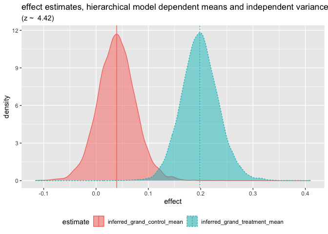
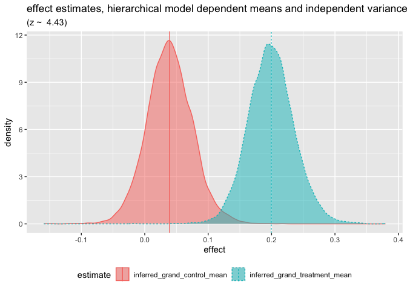

# Infering From Individuals
John Mount
2024-11-29

Joseph Rickert and I put together an experiment trying to both run a
standard meta-analysis and then reproduce similar results directly using
Bayesian methods. I think it came out really interesting and we share it
here at [R Works](https://rworks.dev/posts/meta-analysis/) and also
[here on
Github](https://github.com/WinVector/Examples/blob/main/MetaAnalysis/Amlodipine/ExaminingMetaAnalysis.md).

In this note we examine how inference would work *if studies shared the
data* instead of sharing summary statistics.

## Example

Let’s begin: load the required required packages and read in the data.

<details class="code-fold">
<summary>Show the code</summary>

``` r
library(wrapr)

angina <- read.csv(
  file = "AmlodipineData.csv", 
  strip.white = TRUE, 
  stringsAsFactors = FALSE)

angina |>
  knitr::kable()
```

</details>

| Protocol |  nE |  meanE |   varE |  nC |   meanC |   varC |
|---------:|----:|-------:|-------:|----:|--------:|-------:|
|      154 |  46 | 0.2316 | 0.2254 |  48 | -0.0027 | 0.0007 |
|      156 |  30 | 0.2811 | 0.1441 |  26 |  0.0270 | 0.1139 |
|      157 |  75 | 0.1894 | 0.1981 |  72 |  0.0443 | 0.4972 |
|      162 |  12 | 0.0930 | 0.1389 |  12 |  0.2277 | 0.0488 |
|      163 |  32 | 0.1622 | 0.0961 |  34 |  0.0056 | 0.0955 |
|      166 |  31 | 0.1837 | 0.1246 |  31 |  0.0943 | 0.1734 |
|      303 |  27 | 0.6612 | 0.7060 |  27 | -0.0057 | 0.9891 |
|      306 |  46 | 0.1366 | 0.1211 |  47 | -0.0057 | 0.1291 |

The data set contains eight rows each representing the measured effects
of treatment and control on different groups. The column definitions
are:

-   `Protocol` id number of the study the row is summarizing.
-   `nE` number of patients in the treatment group.
-   `meanE` mean treatment effect observed.
-   `varE` variance of treatment effect observed.
-   `nC` number of patients in the control group.
-   `meanC` mean control effect observed.
-   `varC` variance of control effect observed.

### Bayesian analysis

Let’s re-run the Bayesian analysis, this time capturing plausible
example data.

<details class="code-fold">
<summary>Show the code</summary>

``` r
# attach packages
library(ggplot2)
library(rstan)
library(digest)
source("define_Stan_model.R")

n_studies = nrow(angina)
# make strings for later use
descriptions = vapply(
  seq(n_studies),
  function(i) { paste0(
    'Protocol ', angina[i, 'Protocol'], ' (',
    'nE=', angina[i, 'nE'], ', meanE=', angina[i, 'meanE'],
    ', nC=', angina[i, 'nC'], ', meanC=', angina[i, 'meanC'],
    ')') },
  character(1))

unpack[
  analysis_src_joint_Stan = src_Stan, 
  analysis_src_joint_Latex = src_Latex
  ] := define_Stan_model(n_studies = n_studies, model_style = "per group means")

stan_data = list(
  n_studies = n_studies,
  nE = array(angina$nE, dim = n_studies),  # deal with length 1 arrays confused with scalars in JSON path
  meanE = array(angina$meanE, dim = n_studies),
  varE = array(angina$varE, dim = n_studies), 
  nC = array(angina$nC, dim = n_studies), 
  meanC = array(angina$meanC, dim = n_studies), 
  varC = array(angina$varC, dim = n_studies))

#| code-fold: true
#| code-summary: "Show the code"
# run the sampling procedure
fit_joint <- run_cached(
  stan,
  list(
  model_code = analysis_src_joint_Stan,  # Stan program
  data = stan_data,           # named list of data
  chains = 4,                 # number of Markov chains
  warmup = 2000,              # number of warmup iterations per chain
  iter = 4000,                # total number of iterations per chain
  cores = 4,                  # number of cores (could use one per chain)
  refresh = 0,                # no progress shown
  pars = c("lp__",  # parameters to bring back
         "inferred_grand_treatment_mean", "inferred_grand_control_mean", 
         "inferred_between_group_stddev",
         "inferred_group_treatment_mean", "inferred_group_control_mean",
         "inferred_in_group_stddev", 
         "sampled_meanE", "sampled_varE",
         "sampled_meanC", "sampled_varC",
         paste0('treatment_subject_', seq(n_studies)),
         paste0('control_subject_', seq(n_studies)))
  ),
  prefix="Amlodipine_joint"
)
```

</details>

And then, we extract the results.

<details class="code-fold">
<summary>Show the code</summary>

``` r
# show primary inference
fit_joint <- fit_joint |>
  as.data.frame() 
fit_joint['delta'] <- (
  fit_joint['inferred_grand_treatment_mean'] 
  - fit_joint['inferred_grand_control_mean'])

inference <- fit_joint |>
  (`[`)(c(
    "inferred_grand_treatment_mean", 
    "inferred_grand_control_mean", 
    "inferred_between_group_stddev",
    "delta")) |>
  colMeans() |>
  as.list() |>
  data.frame() 

inference |>
  knitr::kable()
```

</details>

| inferred_grand_treatment_mean | inferred_grand_control_mean | inferred_between_group_stddev | delta |
|---------------------:|--------------------:|---------------------:|-------:|
| 0.1985016 | 0.0394863 | 0.0640696 | 0.1590153 |

We can plot the estimated distribution effects in the treatment and
control groups.

<details class="code-fold">
<summary>Show the code</summary>

``` r
# plot the grand group inferences 
dual_density_plot(
  fit_joint, 
  c1 = 'inferred_grand_treatment_mean', 
  c2 = 'inferred_grand_control_mean',
  title = 'effect estimates, hierarchical model dependent means and independent variances')
```

</details>



We also plot the estimated net difference in treatment and control
effects.

<details class="code-fold">
<summary>Show the code</summary>

``` r
# plot the grand group inferences 
ggplot(
  data = fit_joint,
  mapping = aes(x=delta),
  ) +
  geom_density(fill='green', alpha=0.5) +
  geom_vline(
    xintercept = inference['delta'][[1]], 
    linetype=2,
    alpha=0.8) +
  ggtitle("estimated distribution of treatment minus control effect")
```

</details>


