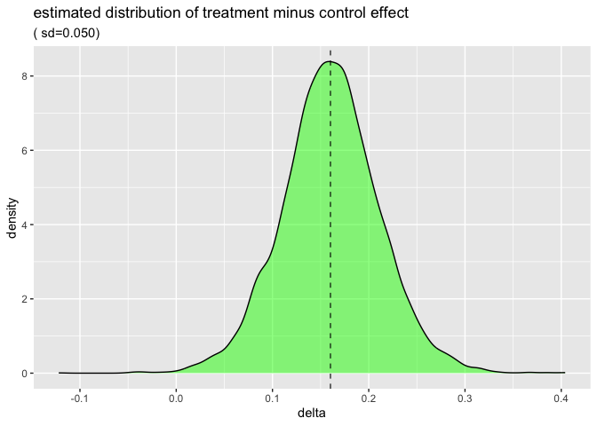

# Infering From Individuals
John Mount
2024-11-29

Joseph Rickert and I put together an experiment trying to both run a
standard meta-analysis and then reproduce similar results directly using
Bayesian methods. I think it came out really interesting and we share it
here at [R Works](https://rworks.dev/posts/meta-analysis/) and also
[here on
Github](https://github.com/WinVector/Examples/blob/main/MetaAnalysis/Amlodipine/ExaminingMetaAnalysis.md).

In this note we examine how inference would work *if studies shared the
data* instead of sharing summary statistics.

## Example

Let’s begin: load the required required packages and read in the data.

<details class="code-fold">
<summary>Show the code</summary>

``` r
library(wrapr)

angina <- read.csv(
  file = "AmlodipineData.csv", 
  strip.white = TRUE, 
  stringsAsFactors = FALSE)

angina |>
  knitr::kable()
```

</details>

| Protocol |  nE |  meanE |   varE |  nC |   meanC |   varC |
|---------:|----:|-------:|-------:|----:|--------:|-------:|
|      154 |  46 | 0.2316 | 0.2254 |  48 | -0.0027 | 0.0007 |
|      156 |  30 | 0.2811 | 0.1441 |  26 |  0.0270 | 0.1139 |
|      157 |  75 | 0.1894 | 0.1981 |  72 |  0.0443 | 0.4972 |
|      162 |  12 | 0.0930 | 0.1389 |  12 |  0.2277 | 0.0488 |
|      163 |  32 | 0.1622 | 0.0961 |  34 |  0.0056 | 0.0955 |
|      166 |  31 | 0.1837 | 0.1246 |  31 |  0.0943 | 0.1734 |
|      303 |  27 | 0.6612 | 0.7060 |  27 | -0.0057 | 0.9891 |
|      306 |  46 | 0.1366 | 0.1211 |  47 | -0.0057 | 0.1291 |

The data set contains eight rows each representing the measured effects
of treatment and control on different groups. The column definitions
are:

-   `Protocol` id number of the study the row is summarizing.
-   `nE` number of patients in the treatment group.
-   `meanE` mean treatment effect observed.
-   `varE` variance of treatment effect observed.
-   `nC` number of patients in the control group.
-   `meanC` mean control effect observed.
-   `varC` variance of control effect observed.

### Bayesian analysis

Let’s re-run the Bayesian analysis, this time capturing plausible
example data.

<details class="code-fold">
<summary>Show the code</summary>

``` r
# attach packages
library(ggplot2)
library(rstan)
library(digest)
source("define_Stan_model.R")

n_studies = nrow(angina)
# make strings for later use
descriptions = vapply(
  seq(n_studies),
  function(i) { paste0(
    'Protocol ', angina[i, 'Protocol'], ' (',
    'nE=', angina[i, 'nE'], ', meanE=', angina[i, 'meanE'],
    ', nC=', angina[i, 'nC'], ', meanC=', angina[i, 'meanC'],
    ')') },
  character(1))

unpack[
  analysis_src_joint_Stan = src_Stan, 
  analysis_src_joint_Latex = src_Latex
  ] := define_Stan_model(n_studies = n_studies, model_style = "per group means")

stan_data = list(
  n_studies = n_studies,
  nE = array(angina$nE, dim = n_studies),  # deal with length 1 arrays confused with scalars in JSON path
  meanE = array(angina$meanE, dim = n_studies),
  varE = array(angina$varE, dim = n_studies), 
  nC = array(angina$nC, dim = n_studies), 
  meanC = array(angina$meanC, dim = n_studies), 
  varC = array(angina$varC, dim = n_studies))
```

</details>
<details class="code-fold">
<summary>Show the code</summary>

``` r
whole_job_fn <- function() {
  # run the sampling procedure
  fit_joint <- stan(
    model_code = analysis_src_joint_Stan,  # Stan program
    data = stan_data,           # named list of data
    chains = 4,                 # number of Markov chains
    warmup = 2000,              # number of warmup iterations per chain
    iter = 4000,                # total number of iterations per chain
    cores = 4,                  # number of cores (could use one per chain)
    refresh = 0,                # no progress shown
    pars = c("lp__",  # parameters to bring back
           "inferred_grand_treatment_mean", "inferred_grand_control_mean", 
           "inferred_between_group_stddev",
           "inferred_group_treatment_mean", "inferred_group_control_mean",
           "inferred_in_group_stddev", 
           "sampled_meanE", "sampled_varE",
           "sampled_meanC", "sampled_varC",
           paste0('treatment_subject_', seq(n_studies)),
           paste0('control_subject_', seq(n_studies)))
    )
  # extract the results.
  # primary inference
  fit_joint <- fit_joint |>
    as.data.frame() 
  fit_joint['delta'] <- (
    fit_joint['inferred_grand_treatment_mean'] 
    - fit_joint['inferred_grand_control_mean'])
  inference <- fit_joint |>
    (`[`)(c(
      "inferred_grand_treatment_mean", 
      "inferred_grand_control_mean", 
      "inferred_between_group_stddev",
      "delta")) |>
    colMeans() |>
    as.list() |>
    data.frame()
  # extract enough to plot
  plt_frame <- fit_joint[ 
    , 
    c('inferred_grand_treatment_mean', 
      'inferred_grand_control_mean',
      'delta')]
  # extract a sample of individual subject data
  subject_column_names <- colnames(fit_joint)[
    grep('_subject_', colnames(fit_joint))]
  individual_sample <- fit_joint[1, subject_column_names]
  vector_names <- sort(unique(gsub('\\[.+\\]', '', subject_column_names)))
  vectors <- lapply(
    vector_names,
    function(nm) as.numeric(individual_sample[
      1,
      colnames(individual_sample)[grep(nm, colnames(individual_sample))]
    ]))
  names(vectors) <- vector_names
  return(list(
    inference = inference,
    plt_frame = plt_frame,
    vectors = vectors
  ))
}


unpack[    
  inference = inference,
  plt_frame = plt_frame,
  vectors = vectors] := run_cached(
  whole_job_fn,
  list(),
  prefix="Amlodipine_joint_individuals"
)
```

</details>
<details class="code-fold">
<summary>Show the code</summary>

``` r
# show primary inference
inference |>
  knitr::kable()
```

</details>

| inferred_grand_treatment_mean | inferred_grand_control_mean | inferred_between_group_stddev | delta |
|---------------------:|--------------------:|---------------------:|-------:|
| 0.1995514 | 0.0388138 | 0.062414 | 0.1607376 |

We can plot the estimated distribution effects in the treatment and
control groups.

<details class="code-fold">
<summary>Show the code</summary>

``` r
# plot the grand group inferences 
dual_density_plot(
  plt_frame, 
  c1 = 'inferred_grand_treatment_mean', 
  c2 = 'inferred_grand_control_mean',
  title = 'effect estimates, hierarchical model dependent means and independent variances')
```

</details>


We also plot the estimated net difference in treatment and control
effects.

<details class="code-fold">
<summary>Show the code</summary>

``` r
# plot the grand group inferences 
ggplot(
  data = plt_frame,
  mapping = aes(x=delta),
  ) +
  geom_density(fill='green', alpha=0.5) +
  geom_vline(
    xintercept = inference['delta'][[1]], 
    linetype=2,
    alpha=0.8) +
  ggtitle("estimated distribution of treatment minus control effect")
```

</details>



Let’s extract some sampled individuals to simulate how the analysis
would work if the individual outcomes had been shared. We don’t expect
we have de-censored or guessed the actual individual data. However we
know by our sampling specification these example are considired similar
to the actual data conditioned on the shared summary statistics. So if
we *pretend* these were the data we can estimate uncertainty that would
have been present when estimated parameters from this data and then
compare that to the uncertainty we just plotted when trying to estimate
parameters from statistical summaries.

<details class="code-fold">
<summary>Show the code</summary>

``` r
vectors
```

</details>

    $control_subject_1
     [1]  0.206626310  0.168256288 -0.180838164 -0.367844339 -0.035255938
     [6] -0.177745950 -0.002641526  0.228214671  0.036314425  0.246787506
    [11]  0.052053467  0.204126931  0.261636207 -0.235452140 -0.222815177
    [16] -0.060075449 -0.198442936 -0.145126131  0.104923599 -0.200981136
    [21]  0.150252231 -0.288563662  0.143632174  0.144069301 -0.354070588
    [26] -0.053221351 -0.178422988  0.349490219  0.118309368 -0.124464649
    [31] -0.295825049  0.259633516  0.064226663  0.138274871  0.159379630
    [36]  0.255042609  0.030572293  0.007230754  0.036754403  0.210696528
    [41]  0.226820401  0.141219680 -0.474434896 -0.071237755  0.262758781
    [46]  0.135805547 -0.185049352  0.157386754

    $control_subject_2
     [1]  0.47961695 -0.09402652 -0.27568136  0.02063142 -0.40638814  0.39281282
     [7]  0.04050989  0.07235370 -0.29166250  0.01778138 -0.31202972 -0.42108350
    [13]  0.34954519  0.27905323 -0.18563190  0.35679467  0.22523397 -0.73772017
    [19]  0.53378638  0.34914814  0.42641906  0.15539744  0.12769794 -0.36822044
    [25] -0.28678388  0.19435809

    $control_subject_3
     [1] -1.12726603 -1.20595607 -0.31499051 -0.72334344  0.35500546 -0.34633746
     [7] -0.11997795 -0.07549239  0.12545459 -0.82526696  0.34364657 -0.50278927
    [13]  0.55929565  1.36384932 -0.35729932  0.06703118  0.03008784 -0.83497416
    [19]  0.73029170  2.14447850  0.75724677 -0.03982797 -0.15802290  0.02265086
    [25] -0.58464092  0.57398836 -0.08581111  0.75571031  0.46588106  0.01850233
    [31] -0.11474499  0.13936178  0.79392188  0.46512967 -0.16961986  0.17390761
    [37]  0.18631749  0.58093326  1.03992055  0.50851457  0.82708753  0.90645182
    [43] -0.53159756  0.18131616  0.28132429 -0.90637357 -0.52500207 -0.90219649
    [49]  0.47070631  1.08842670 -0.95857655 -0.15848896 -0.75853383  0.07124793
    [55]  0.67764592  0.13154955 -0.53321659 -0.55566437  0.64706232  0.50590050
    [61]  0.35216100  0.00842020  2.08005248 -0.43620814 -0.53075144 -0.06009867
    [67] -1.72387985 -0.75802356  0.38388197 -0.04459705 -0.72375042  0.95370180

    $control_subject_4
     [1] -0.03804017  0.10707694  0.06885316  0.16032901  0.30586335 -0.23092606
     [7]  0.34251740  0.57136447  0.31572594  0.28772051  0.48499740  0.19158318

    $control_subject_5
     [1] -0.05591946 -0.44486800  0.25101671  0.09290762 -0.03436706  0.03837935
     [7]  0.34868761  0.07561613  0.18057037  0.29138715 -0.26915625 -0.37894328
    [13]  0.58910187 -0.19652838 -0.05255220 -0.20648187 -0.10502671 -0.11595009
    [19] -0.02885402  0.41286735 -0.20361248  0.36802733  0.04894300  0.24974264
    [25] -0.69186466 -0.08822701 -0.62281962  0.32041001 -0.22547952  0.37133526
    [31]  0.13965447 -0.10617165  0.12688150  0.05046866

    $control_subject_6
     [1] -0.094600086  0.889080453 -0.684852168 -0.211133924  0.042724916
     [6]  0.506984991 -0.321279901 -0.524934685 -0.437523142 -0.072029612
    [11]  0.167689175  0.519331604  0.366199096  0.400245475 -0.018654382
    [16] -0.254911436 -0.436421144  0.552323911 -0.019302875 -0.017297828
    [21]  0.840997318  0.833226787  0.151385477  0.198554178  0.736677390
    [26]  0.288104925 -0.114160381 -0.007332137 -0.334083798 -0.275084318
    [31]  0.455491446

    $control_subject_7
     [1]  2.02059524 -0.72214142  1.27666544  1.09323927 -0.41686725  0.19669676
     [7] -0.15685055  0.63718055 -2.45947135 -1.08115528  0.27382333 -0.65684707
    [13] -1.01992928 -0.83601604  1.07940603 -0.28352874  0.08948676 -0.35206974
    [19]  0.47904273 -0.46613172  1.68773782 -0.53630786 -0.61668077  0.16832544
    [25]  0.04403613 -0.91584778  1.43361918

    $control_subject_8
     [1] -0.27192796  0.06300203 -0.14552252  0.30569017 -0.24058417  0.30539455
     [7]  0.05299517 -0.04482930  0.22096118 -0.38206855 -0.61368475  0.06571364
    [13] -0.02954341 -0.04628667  0.59776545 -0.48522212  0.21638282 -0.03400788
    [19] -0.47611572 -0.18029947 -0.65325143 -0.33612215  0.10643250 -1.20469872
    [25]  0.19347972  0.08401866 -0.10412131  0.29611863  0.84747136 -0.13308653
    [31]  0.33940797  0.24036783  0.12778858  0.09081969  0.03252220  0.08762504
    [37]  0.21646548 -0.08285702 -0.36643833  0.02628229  0.49569031  0.30896963
    [43]  0.52058500  0.15939074  0.31720041 -0.54687808 -0.20168830

    $treatment_subject_1
     [1] -0.18045967 -0.34853786  0.84331489 -0.69161025  0.80569638  0.43339855
     [7] -0.06406316  0.38830651  0.13053026 -0.52831129  0.98734665  0.83985289
    [13]  0.15841184  0.18917645  0.39604121  0.29199026  0.26881682 -0.11610922
    [19]  0.28212807  0.08156828  0.32100780  0.16768117 -0.52448003  0.18000437
    [25] -0.13491040 -0.71338487 -0.09696381  0.15996110  0.26209949 -0.36025926
    [31]  0.39244680 -0.08474546  0.40800535  1.19713618  0.48194938  0.73572003
    [37]  0.26146987  0.71441622  0.33906459  1.15078943 -0.67908326  0.79213060
    [43]  0.05159327  1.15909432 -0.06692039  0.70799248

    $treatment_subject_2
     [1]  0.13014007  0.17558611  0.46221304  0.60734606  0.39197987 -0.01623235
     [7]  0.53381477 -0.24362721  0.31568913  0.36609601  0.18589653  0.57848924
    [13]  0.29950584  0.09607609  0.58681449 -0.16854477  0.42770964  0.75562345
    [19] -0.40894371  0.23646053  0.37980294  1.07413605 -0.06996842  0.11833537
    [25]  0.17998041  1.09345250 -0.03212505  0.55210954  0.04588387 -0.63092434

    $treatment_subject_3
     [1]  0.58232568  0.57536583 -0.20337113  0.37326342 -0.22035283 -0.86384763
     [7] -0.54744896  0.33160804 -0.37928132  0.30623636 -0.31508300  0.12779107
    [13]  0.61279364 -0.44860571  0.71079613 -0.11092007  0.31848716  0.97313888
    [19] -0.15658298 -0.27078592  1.06867216  0.76652119 -0.23407121  0.61110195
    [25]  0.61724540  0.31052625 -0.51598074  0.21923722  0.38456603  0.35412640
    [31]  0.20589695  0.71919027 -0.29699592  0.03800258  0.16465601  0.90729347
    [37] -0.13845793  0.24620121  0.30256781  0.53715071  0.07788123  0.23624795
    [43]  0.25417580  0.48500942  0.52895282 -0.38352784  0.09302058  0.17426041
    [49]  0.90861012  0.77803835  0.82016418  0.88661871  0.29843488  0.61729664
    [55] -0.01871075  0.09698303 -0.59255867 -0.37599667 -0.25933742 -0.29229266
    [61] -0.20570631  0.32392755 -0.01727629  0.01792671 -0.11478751  0.07769730
    [67] -0.52658591 -0.15094615  0.40015801  0.52586932  0.28978318  0.96396911
    [73]  0.10558593  0.62180928  0.38036151

    $treatment_subject_4
     [1]  0.44430248 -0.16339620  0.69493667 -0.13958987 -0.53442819  0.48838860
     [7]  0.04599155  0.23946433 -0.17427983  0.16953343  0.23981370 -0.11225293

    $treatment_subject_5
     [1]  0.009367706 -0.093596985  0.228556485  0.484468951 -0.106507226
     [6]  0.271990729 -0.037578789 -0.040008914 -0.306870714  0.510039849
    [11]  0.630155715  0.260474238  0.259181235  0.227622675 -0.302945916
    [16]  0.208414148  0.586871756  0.498809915 -0.449209164  0.105869780
    [21] -0.065892124 -0.318790536  0.208720304  0.714624524  0.509332677
    [26]  0.078849892  0.252777306  0.126816005 -0.069659066  0.147385052
    [31]  0.707990382 -0.015627794

    $treatment_subject_6
     [1]  0.008734449  0.710394228  0.038710001  0.084578179  0.246775241
     [6]  0.777689732 -0.002131260  0.484034448  0.176505001  0.224942233
    [11]  0.951765256  0.826592155  0.414404934  0.026814877  0.012193830
    [16]  0.408547190 -0.162292388 -0.419741644  0.284072150  0.191921102
    [21] -0.166045931  0.391120363 -0.128786442  0.132998197  0.573467041
    [26] -0.203716191  0.249679631 -0.149122373 -0.045043330 -0.299612495
    [31] -0.092319516

    $treatment_subject_7
     [1] -0.39065820  0.91363920  1.64768091  0.47221994  0.81855657  1.58500710
     [7]  2.50349469 -0.20031497  0.22701403  1.17106916  0.82985725  0.48777758
    [13]  0.92252433  0.76984779 -0.90833401  1.84940814  0.09204993  0.20872982
    [19]  0.20403610  0.22427921  1.12822399  0.06156754  1.85317300  1.37701921
    [25] -0.46559337  0.84109949 -0.76752906

    $treatment_subject_8
     [1]  0.4223374936 -0.0252150002  0.2427923736  0.0007987117 -0.0489629850
     [6]  0.0528392579  0.4285715021  0.3735030811  0.1316747101  1.1307088984
    [11]  0.3157114622  0.4355544219 -0.2598758143 -0.5733260706  0.5393066739
    [16]  0.2583538615  0.5844449952  0.0901211214 -0.0382731608  0.4793582690
    [21] -0.1325649837  0.2908555840  0.3484806578  0.7529063736 -0.2114637860
    [26] -0.1169788459 -0.2849077857  0.0214473646  0.1758148680  0.1937666019
    [31]  0.3063817856  0.0039541616 -0.0073295887  0.2557592502  0.1434186122
    [36]  0.2250497872 -0.2071918662 -0.7041411346  0.1796464677  0.2273561613
    [41] -0.3945318196  0.0649626196  0.5619645739  0.2968376668  0.3319700654
    [46] -0.1747811372
