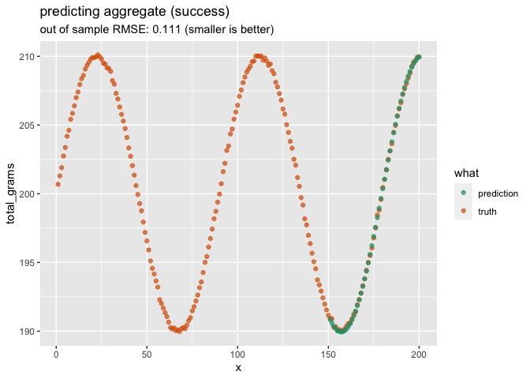
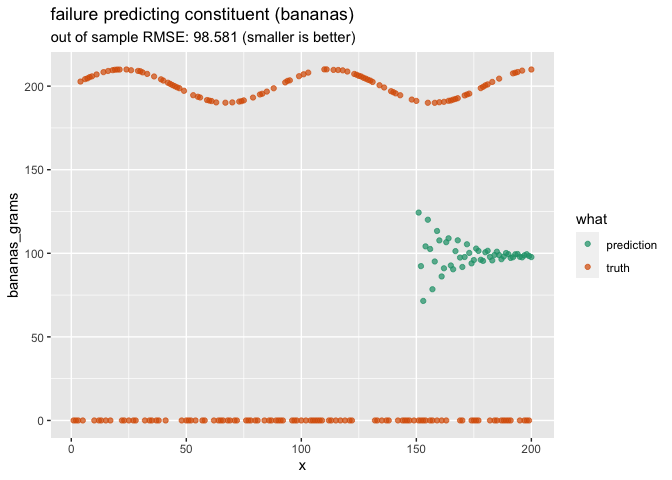
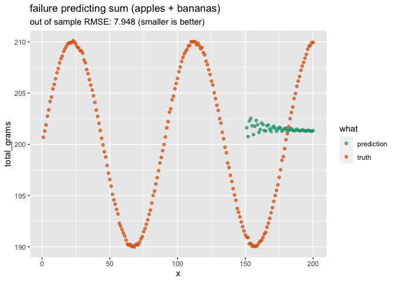
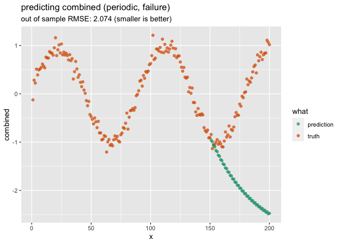
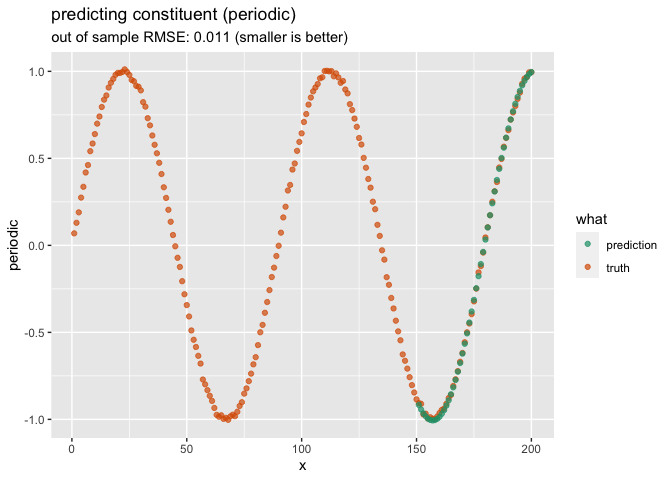
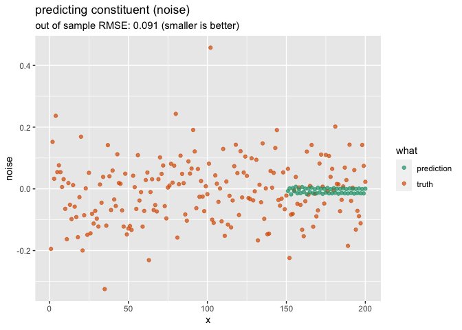
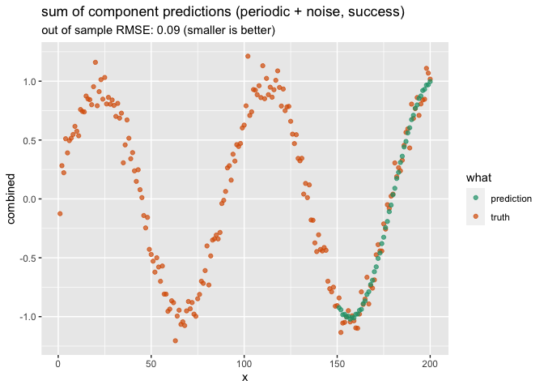

Forecasting in Aggregate Versus in Detail
================
2023-05-21

<br/>[John Mount](https://win-vector.com/john-mount/) <br/>[Win Vector
LLC](https://win-vector.com)

## Introduction

Inferring over mixtures of observations is a source of challenge in
statistics.

For many situations inferring over larger aggregates is easier. The [law
of large numbers](https://en.wikipedia.org/wiki/Law_of_large_numbers)
tends to make larger aggregates easier to predict. Also, [Stein’s
example](https://en.wikipedia.org/wiki/Stein%27s_example) can given the
(false) impression that introducing artificial aggregation can improve
inference quality (it in fact improves the *perceived* quality, not the
quality of the underlying items to be predicted).

## First Example: Buying Fruit

Suppose we are modeling a shopper who buys approximately 200 grams of
fruit every day. In the aggregate their behavior is very stable some
periodic variation and some noise.

### Setting up the first example

Let’s model this in [R](https://www.r-project.org).

We attach our packages.

``` r
library(ggplot2)
```

We generate some synthetic example data as a date/time series.

``` r
set.seed(2023)
d_alternatives <- data.frame(x = seq(200))
d_alternatives$is_train <- seq(nrow(d_alternatives)) <= 150
d_alternatives$total_grams <- 200 + 10 * sin(0.07 * d_alternatives$x) +
  0.1 * rnorm(n = nrow(d_alternatives))
```

### Sucessfuly modeling the aggregate or total

And we use ARIMA time series software to try and model the fruit
purchase as a function of time or recent history.

``` r
arima_order = c(4, 0, 4)
```

``` r
m_aggregate <- arima(
  d_alternatives$total_grams[d_alternatives$is_train], 
  method = "ML",
  order = arima_order)
```

And we now plot the out of sample (or future) predictions and purchases
as functions of date/time.

The predictions look very good.

``` r
plot_pred(
  d_alternatives, 
  models = list(m_aggregate), 
  truth_column = "total_grams", 
  title = "predicting aggregate (success)")
```

<!-- -->

### Details running the boat into the rocks

Now, suppose we measure more about our shopper. For instance if their
fruit purchase was apples or bananas. From a modeling point of view more
detailed *explanatory* variables are (modulo risks of over-fitting)
should always be considered a good opportunity. However, asking for more
detailed *dependent* predictions can be a harder problem.

In our case the apple/banana choice is a huge source of unexplainable
noise. Perhaps our shopper flips a coin to decide between apples and
bananas each day. Let’s add this to our problem.

``` r
d_alternatives$label <- sample(
  c("apple", "bananas"), 
  size = nrow(d_alternatives), 
  replace = TRUE)
d_alternatives$apples_grams <- ifelse(
  d_alternatives$label == "apple", 
  d_alternatives$total_grams, 
  0)
d_alternatives$bananas_grams <- ifelse(
  d_alternatives$label == "bananas", 
  d_alternatives$total_grams, 
  0)
```

Now if we try to model apple purchases alone we run into problems. The
apple purchase pattern doesn’t match the structural assumptions of ARIMA
time series modeling, and it also contains much more uncertainty than
the aggregate fruit purchase history did.

``` r
m_apples <- arima(
  d_alternatives$apples_grams[d_alternatives$is_train], 
  method = "ML",
  order = arima_order)

plot_pred(
  d_alternatives, 
  models = list(m_apples), 
  truth_column = "apples_grams", 
  title = "failure predicting constituent (apples)")
```

<!-- -->

We see the same problem modeling banana purchases alone.

``` r
m_bananas <- arima(
  d_alternatives$bananas_grams[d_alternatives$is_train], 
  method = "ML",
  order = arima_order)

plot_pred(
  d_alternatives, 
  models = list(m_bananas), 
  truth_column = "bananas_grams", 
  title = "failure predicting constituent (bananas)")
```

<!-- -->

And we see summing the apple and banana predictions does not recover a
good total prediction.

``` r
plot_pred(
  d_alternatives, 
  models = list(m_apples, m_bananas), 
  truth_column = "total_grams", 
  title = "failure predicting sum (apples + bananas)")
```

<!-- -->

To try and fix this we should model total fruit purchase (which is a
stable quantity) as a function of recent apple and recent banana
purchases. A linear model that sees both the apple and banana purchases
can work out how to combine them. This is another argument against
strict scalar time-series approaches and using more general vector
approaches as discussed in my earlier [“Time Series
Apologia”](https://github.com/WinVector/Examples/blob/main/TS/TS_example.md).

## Second Example: Avoiding Noise

There are cases where predicting the constituents is easier than
predicting an aggregate. But they don’t seem to be as common or natural
as the converse (discussed in our last section).

Let’s force an example anyway. Consider an aggregate that is the sum of
a nearly deterministic time series and another system that is noise.
Perhaps the predictable or periodic part of the system is driven by
known conditions or signaled by reservations, and perhaps the noise part
are a transient sub-population. I am not working overly hard to make
this a physical example, as it is a bit rare compared to the first
section. However, the point is going to be: “if the domain experts are
kind enough to supply labels that separate clean and noisy data, don’t
undo their good work!”

### Setting up our second example

``` r
set.seed(2023)
d_disjoint <- data.frame(x = seq(200))
d_disjoint$is_train <- seq(nrow(d_disjoint)) <= 150
d_disjoint$periodic <- sin(0.07 * d_disjoint$x) +
  0.01 * rnorm(n = nrow(d_alternatives))
d_disjoint$noise <- 0.1 * rnorm(n = nrow(d_disjoint))
d_disjoint$combined <- d_disjoint$periodic + d_disjoint$noise
```

### Modeling again at the aggregate level

The combined model for the combined or aggregated data is okay. The
noise makes inference a bit harder.

``` r
m_combined <- arima(
  d_disjoint$combined[d_disjoint$is_train], 
  method = "ML",
  order = arima_order)

plot_pred(
  d_disjoint, 
  models = list(m_combined), 
  truth_column = "combined", 
  title = "predicting combined (periodic, failure)")
```

<!-- -->

### Improving the predictions by modeling at a more detailed level

However if we separately model the constituent parts of the combined
total we get better results for each part.

``` r
m_periodic <- arima(
  d_disjoint$periodic[d_disjoint$is_train],
  method = "ML",
  order = arima_order)

plot_pred(
  d_disjoint, 
  models = list(m_periodic), 
  truth_column = "periodic", 
  title = "predicting constituent (periodic)")
```

<!-- -->

``` r
m_noise <- arima(
  d_disjoint$noise[d_disjoint$is_train], 
  method = "ML",
  order = arima_order)
```

    ## Warning in arima(d_disjoint$noise[d_disjoint$is_train], method = "ML", order =
    ## arima_order): possible convergence problem: optim gave code = 1

``` r
plot_pred(
  d_disjoint, 
  models = list(m_noise), 
  truth_column = "noise", 
  title = "predicting constituent (noise)")
```

<!-- -->

And we get better results by *combining* our per-part predictions into a
total!

``` r
plot_pred(
  d_disjoint, 
  models = list(m_periodic, m_noise), 
  truth_column = "combined", 
  title = "sum of component predictions (periodic + noise, success)")
```

<!-- -->

## Conclusion

Whether to model data as an aggregate or as separate sub-processes is an
important decision in statistical modeling. In general more detailed
*explanatory* variables represent opportunity (modulo the risk of
introducing over-fitting). However, trying to model quantities with
labels exposes the modeler to uncertainty *both* in quantities *and*
uncertainty in labels. The science of systematically moving
*continuously* between aggregate and separate models is called
“hierarchical modeling.”

Hierarchical modeling is developed beautifully in Andrew Gelman,
Jennifer Hill, \*Data Analysis Using Regression and
Multilevel/Hierarchical Models”, Cambridge 2006 (also unfortunately
confusingly called fixed/mixed-effects models by other authors). We
share a small video on some of the ideas [“Doing Better Than The
Average”](https://win-vector.com/2023/04/02/doing-better-than-the-average/).
We also discuss over-fitting and how it is easily overcome when you have
more data in [“How Much Data Do You
Need?](https://win-vector.com/2023/03/18/how-much-data-do-you-need/).
