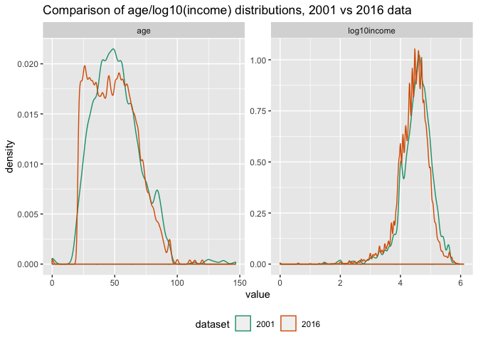
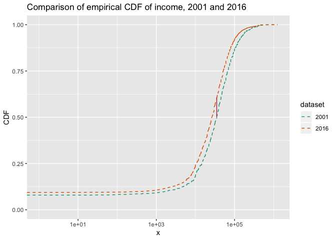
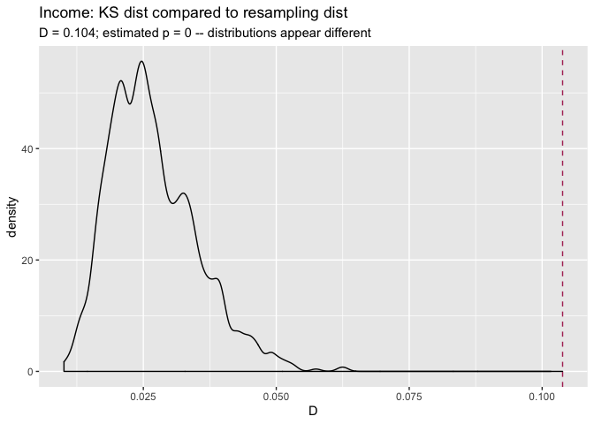
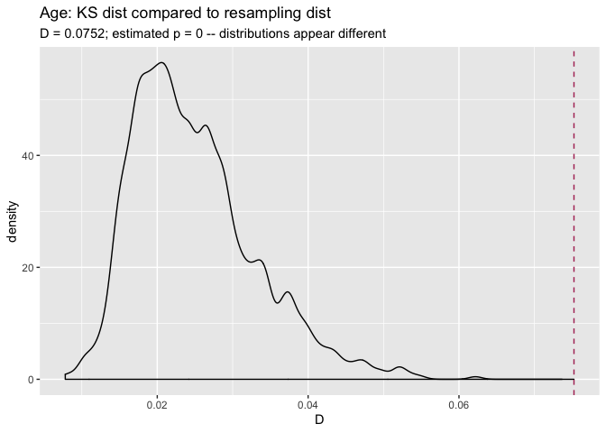
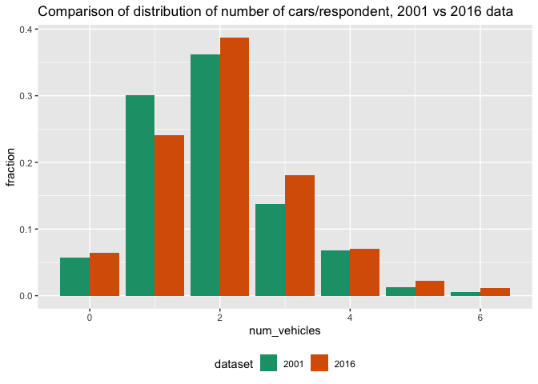
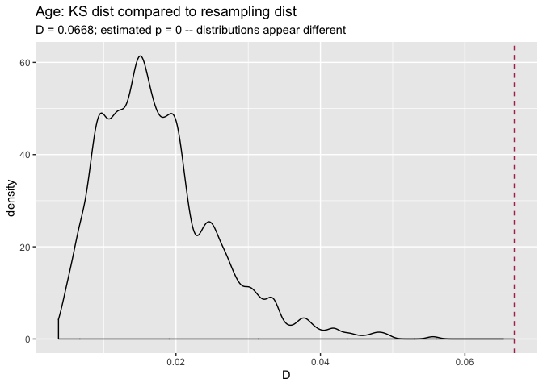

Monitoring for Changes in Distribution with Resampling Tests
================
Nina Zumel
1/16/2020

A client recently came to us with a question: what's a good way to monitor data or model output for changes? That is, how can you tell if new data is distributed differently from previous data, or if the distribution of scores returned by a model have changed? This client, like many others who have faced the same problem, simply checked whether the mean and standard deviation of the data had changed more than some amount, where the threshold value they checked against was selected in a more or less ad-hoc manner. But they were curious whether there was some other, perhaps more principled way, to check for a change in distribution.

Income and Age distributions in US Census Data
----------------------------------------------

Let's look at a concrete example. Below we plot the distribution of age and of income (plotted against a log10 scale for clarity) for two data samples. The "reference" sample is a small data set based on data from the 2001 US Census PUMS data; the "current" sample is a much larger data set based on data from the 2016 US Census PUMS data. (See the notes below for links and more details about the data).

Does it appear that distributions of age and income have changed from 2001 to 2016?



The distributions of age look quite different in shape. Surprisingly the difference in the summary statistics is not really that large:

| dataset          |       mean|        sd|  median|        IQR|
|:-----------------|----------:|---------:|-------:|----------:|
| 2001             |  51.699815|  18.86343|      50|  26.000000|
| 2016             |  49.164738|  18.08286|      48|  28.000000|
| % diff from 2001 |  -4.903455|  -4.13805|      -4|   7.692308|

In this table we are comparing the mean, standard deviation, median and interquartile range (the width of the range between the 25th and 75th percentiles). The mean and median have only moved by two years, or about 4-5% from the reference. The summary statistics don't clearly show the pulse of younger population that appears in the 2016 data, but not in the 2001 data.

The income distributions, on the other hand, don't visually appear that different, at least at this scale of the graph, but a look at the summary statistics shows a distinct downward trend in the mean and median, about 20-25%, from 2001 to 2016. (Note that both these data sets are example data sets for *Practical Data Science with R*, first and second editions respectively, and have been somewhat altered from the original PUMS data for didactic purposes, so differences we observe here may not be the same as in the original PUMS data).

| dataset          |         mean|           sd|       median|          IQR|
|:-----------------|------------:|------------:|------------:|------------:|
| 2001             |  53504.77100|  65478.06573|  35000.00000|  52400.00000|
| 2016             |  41764.14840|  58113.76466|  26200.00000|  41000.00000|
| % diff from 2001 |    -21.94313|    -11.24697|    -25.14286|    -21.75573|

Is there a way to detect differences in distributions other than comparing summary statistics?

Comparing Two Distributions
---------------------------

One way to check if two distributions are different is to define some sort of "distance" between distributions. If the distance is large, you can assume distributions are different, and if it is small, you can assume the distribution is the same. This gives us two questions: (1) How do you define distance and (2) How do you define "large" and "small"?

### Distances

There are several possible definitions of distance for distributions. The first one I thought of was the [Kullback-Leibler divergence](https://en.wikipedia.org/wiki/Kullback%E2%80%93Leibler_divergence), which is related to entropy. The KL divergence isn't a true distance, because it's not symmetric. However, there are symmetric variations (see the linked Wikipedia article), and if you are always measuring distance with respect to a fixed reference distribution, perhaps the asymmetry doesn't matter.

Other distances include the Hellinger coefficient, Bhattacharyya distance, Jeffreys distance, and the Chernoff coefficient. [This 1989 paper](https://www.sciencedirect.com/science/article/pii/0022247X89903351) by Chung, et.al gives a useful survey of various distances and their definitions.

In this article, we will use the [Kolmogorov–Smirnov statistic](https://en.wikipedia.org/wiki/Kolmogorov%E2%80%93Smirnov_test), or KS statistic, a simple distance defined by the cumulative distribution functions of the two distributions. This statistic is the basis for the eponymous test for differences of distributions (a "closed form" test that is present in R), but we will use it to demonstrate the permutation test based process below.

### KS Distance

The KS distance, or KS statistic, between two samples is the maximum vertical distance between the empirical cumulative distributions functions (ECDF) of each sample. Recall that the cumulative distribution function of a random variable X, `CDF(x)`, is the probability that *X* ≤ *x*. For example, for a normal distribution with mean 0, `CDF(0) = 0.5`, because the probability that any sample point drawn from that distribution is less than zero is one-half.

Here's a plot of the ECDFs of the incomes from the 2001 and 2016 samples, with the KS distance between them marked in red. We've put the plot on a log10 scale for clarity.



Now the question is: is the observed KS distance "large" or "small"?

Determining large vs small distances
------------------------------------

You can say the KS distance D that you observed is "large" if you wouldn't expect to see a distance larger than D very often when you draw two samples of the same size as your originals from the same underlying distribution. You can estimate how often that might happen with a permutation test:

1.  Treat both samples as if they were one large sample ("concatenate" them together), and randomly permute the index numbers of the observations.

2.  Split the permuted data into two sets, the same sizes as the original sets. This simulates drawing two appropriately sized samples from the same distribution.

3.  Compute the distance between the distributions of the two samples.

4.  Repeat N times

5.  Count how often the distances from the permutation tests are greater than D, and divide by N

This gives you an estimate of your "false positive" error: if you say that your two samples came from different distributions based on D, how often might you be wrong? This means you have to already have a false positive rate that you are willing to tolerate. If the false positive rate from the permutation test is smaller than the rate you are willing to tolerate, then call the two distributions "different," otherwise, assume they are the same.

The estimated false positive rate from the test is the estimated p-value, and the false positive rate that you are willing to tolerate is your p-value threshold, and we've just reinvented a permutation-based version of the two-sample KS test. The important point is that this procedure works with any distance, not just the KS distance.

Permutation tests are essentially sampling without replacement; you could also create your synthetic tests by sampling *with* replacement in step 2 (this is generally known as *bootstrapping*). However, permutation tests are the traditional procedure for hypothesis testing scenarios like the one we are discussing.

### How many permutation iterations?

In principle, you can run an exact permutation test by trying all `factorial(N+M)` permutations of the data (where N and M are the sizes of the samples), but you probably don't want to do that unless the data is really small. If you want a false positive rate of about *ϵ*, it's safer to do at least 2/*ϵ* iterations, to give yourself a reasonable chance of seeing an 1/*ϵ*-rare event.

In other words, if you can tolerate a false positive rate of about 1 in 500 (or 0.002), then do at least 1000 iterations. We'll use this false positive rate and that many iterations for our experiments, below.

If we permute the income distributions for 2001 and 2016 together for 1000 iterations, and compare it to the actual KS distance between the two samples, we get the following:



This graph shows the distribution of KS distances we got from the permutation test in black, and the actual KS distance between the 2001 and 2016 samples with the red dashed line. This KS distance was 0.104, which is larger than any of the distances observed in the permutation test. This gives us an estimated false positive rate of 0, which is certainly smaller than 0.002, so we can call the distributions of incomes in the 2016 sample "different" (or "significantly different") from the distribution of incomes in the 2001 sample.

We can do the same thing with age.



Again, the distributions appear to be significantly different.

### Alternative: Running the KS test with `ks.boot()`

A very similar procedure for using KS distance as a measure of difference is implemented by the `ks.boot()` function, in the package `Matching`. Let's try `ks.boot()` on income and age. Again, for a p-value threshold of 0.002, you want to use at least 1000 iterations.

``` r
library(Matching) # for ks.boot

# income
ks.boot(newdata$income, reference$income,
        nboots = 1000) # the default
```

    ## $ks.boot.pvalue
    ## [1] 0
    ## 
    ## $ks
    ## 
    ##  Two-sample Kolmogorov-Smirnov test
    ## 
    ## data:  Tr and Co
    ## D = 0.10385, p-value = 1.147e-09
    ## alternative hypothesis: two-sided
    ## 
    ## 
    ## $nboots
    ## [1] 1000
    ## 
    ## attr(,"class")
    ## [1] "ks.boot"

``` r
# age
ks.boot(newdata$age, reference$age, 1000)
```

    ## $ks.boot.pvalue
    ## [1] 0
    ## 
    ## $ks
    ## 
    ##  Two-sample Kolmogorov-Smirnov test
    ## 
    ## data:  Tr and Co
    ## D = 0.075246, p-value = 2.814e-05
    ## alternative hypothesis: two-sided
    ## 
    ## 
    ## $nboots
    ## [1] 1000
    ## 
    ## attr(,"class")
    ## [1] "ks.boot"

In both cases, the value `$ks.boot.pvalue` is less than 0.002, so we would say that both the age and income distributions from 2016 are significantly different from those in 2001.

The value `$ks` returns the output of the "closed-form" KS test (`stats::ks.test()`). One of the reasons that the KS test is popular for this application is that under certain conditions (large samples, continuous data with no ties), the exact distribution of the KS statistic is known, and so you can compute exact p-values and/or compute a rejection threshold for the KS distance in a closed-form way, which is faster than simulation.

With large data sets, the KS test seems fairly robust to ties in the data, and in this case the p-values returned by the closed-form estimate give decisions consistent with the estimates formed by resampling. However, using `ks.boot` means you don't have to worry if the closed form estimate for *p* is valid for your data. And of course, the resampling approach works for any distance estimate, not just the KS distance.

Discrete Distributions
----------------------

The nice thing about the resampling version of the KS test is that you can use it on discrete distributions, which are problematic for the closed form version of the test. Let's compare the number of vehicles per respondent in the 2001 sample compared to the 2016 sample. The graph below compares the fraction of the total datums in each bin, rather than the absolute counts.



(Note: the data is actually reporting the number of vehicles *per household*, and in reality there may be multiple respondents per household. But for the purposes of this exercise we will pretend that there is only one respondent per household in the samples).

Let's try the permutation and the bootstrap tests to decide if these samples are distributed the same way.



    ## $ks.boot.pvalue
    ## [1] 0
    ## 
    ## $ks
    ## 
    ##  Two-sample Kolmogorov-Smirnov test
    ## 
    ## data:  Tr and Co
    ## D = 0.066833, p-value = 0.0004856
    ## alternative hypothesis: two-sided
    ## 
    ## 
    ## $nboots
    ## [1] 1000
    ## 
    ## attr(,"class")
    ## [1] "ks.boot"

Both tests say that two distributions seem significantly different (relative to our tolerable false positive error rate of 0.002). `ks.test()` also gives a p-value that is smaller than 0.002, so it would also say that the two distributions are significantly different.

Conclusions
-----------

When you want to know whether the distribution of your data has changed, or simply want to know whether two data samples are distributed differently, checking summary statistics may not be sufficient. As we saw with the age example above, two data samples with similar summary statistics can still be distributed differently. So it may be preferable to find a metric that looks at the overall "distance" between two distributions.

In this article, we considered one such distance, the KS statistic, and used it to demonstrate a general resampling procedures for deciding if a specific distance is "large" or "small."

In R, you can use the function `ks.test()` to calculate KS distance (as `ks.test(...)$statistic`). If your data samples are large and sufficiently "continuous-looking" (zero or few ties), then `ks.test()` also provides a criterion (the p-value) to help you decide whether to call two distributions "different". Using this closed form test is certainly faster than resampling. However, if you have discrete data, or are otherwise not sure that the p-value estimate returned by `ks.test()` is valid, then resampling with `Matching::ks.boot()` is a more conservative approach. And of course, resampling approaches are generally applicable to what ever distance metric you choose.

Notes
-----

The complete code for the examples in this article can be found in the R Markdown document `KSDistance.Rmd` [here](https://github.com/WinVector/Examples/blob/master/MonitoringForChangesInDistributions/KSDistance.Rmd). The document calls a file of utility functions `KSUtils.R`, [here](https://github.com/WinVector/Examples/blob/master/MonitoringForChangesInDistributions/KSUtils.R).

You can also find another extended example of checking for changing distributions, using yearly samples of pollution data, in the same directory: [Pollution Example](https://github.com/WinVector/Examples/blob/master/MonitoringForChangesInDistributions/PollutionExample.md), and [R Markdown (with visible source) for example](https://github.com/WinVector/Examples/blob/master/MonitoringForChangesInDistributions/PollutionExample.Rmd).
