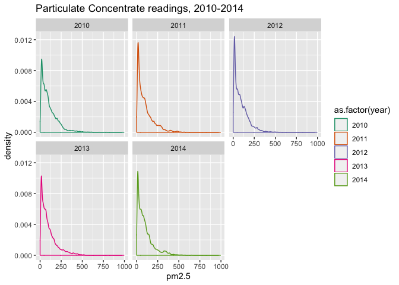
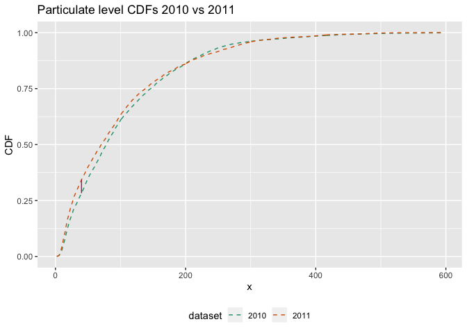
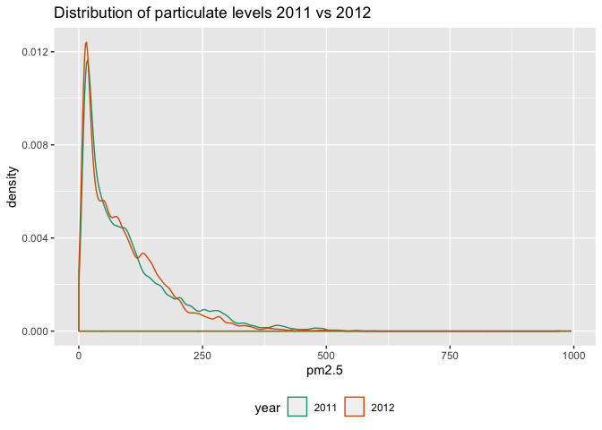
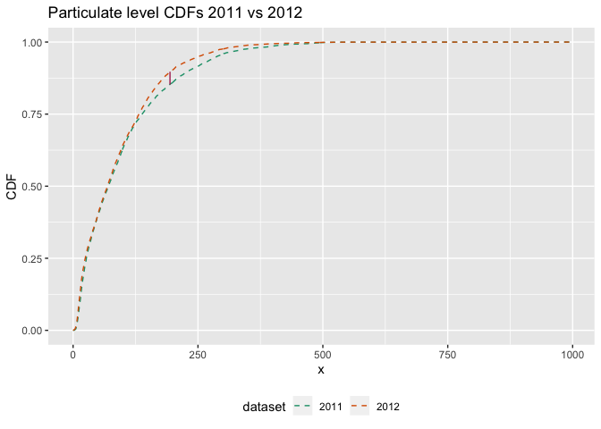
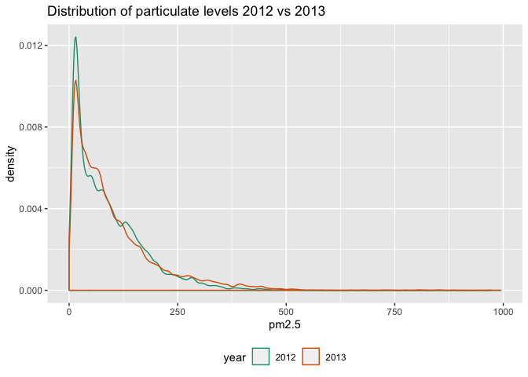
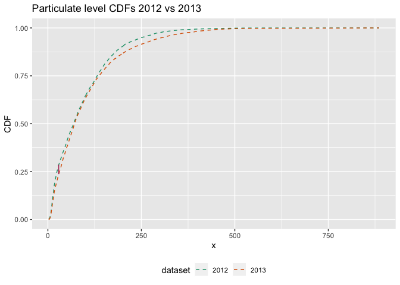
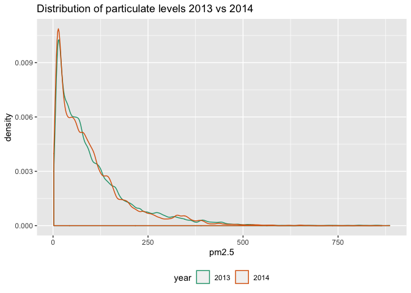
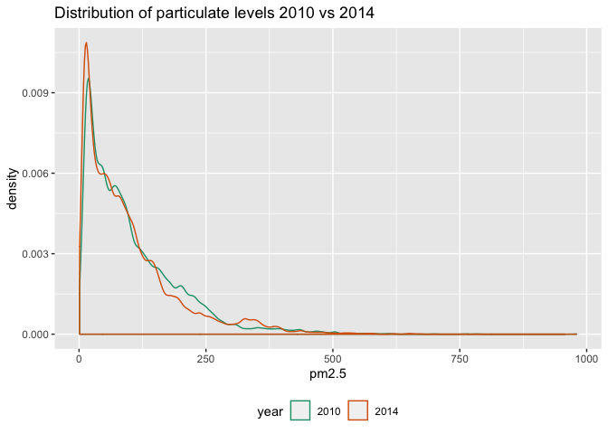
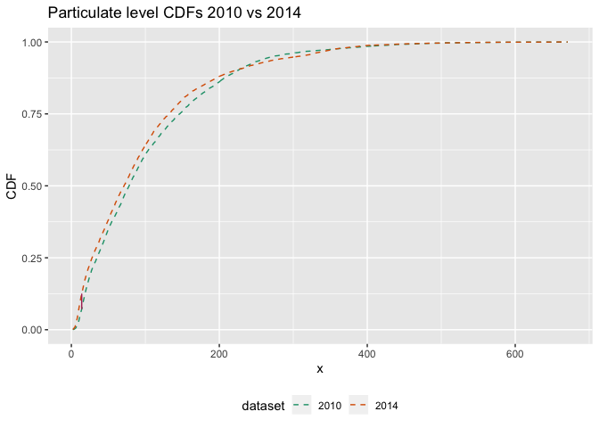

Pollution Example
================
Nina Zumel
1/29/2020

This is an extended example to accompany the Win-Vector blog article [*Monitoring for Changes in Distribution with Resampling Tests*](http://www.win-vector.com/blog/2020/02/monitoring-for-changes-in-distribution-with-resampling-tests/). In this example, we want to check whether overall yearly distribution of pollution readings in a certain locale changes from year to year.

Pollution data set
------------------

For this example we will use the [Beijing PM2.5 Data](http://archive.ics.uci.edu/ml/datasets/Beijing+PM2.5+Data) from the UCI Machine Learning Repository. This data records hourly PM2.5 particulate readings from the US Embassy in Beijing from January 1st, 2010 to December 31st, 2014. First, read in the data.

``` r
url = url("http://archive.ics.uci.edu/ml/machine-learning-databases/00381/PRSA_data_2010.1.1-2014.12.31.csv")
pollution = read.table(url,
                    header=TRUE, sep=",")
```

Let's see if the distribution (ignoring time of day) of particulate readings changes from year to year. Here's a plot of the yearly distribution of pm2.5 readings.



### 2010 vs 2011

First, let's compare 2010 to 2011. As in the blog article, we'll use the Kolmogorov-Smirnov statistic to test for changes in the distribution, so let's look at the distribution and the CDF of the particulate readings for the two years.



We can also compare the summary statistics:

| year             |        mean|          sd|     median|  IQR|
|:-----------------|-----------:|-----------:|----------:|----:|
| 2010             |  104.045730|  92.2811855|   79.00000|  112|
| 2011             |   99.071340|  92.9672978|   71.00000|  112|
| % diff from 2010 |   -4.780965|   0.7435018|  -10.12658|    0|

Now we can use the KS test to check if the distribution has changed from 2010 to 2011. As in the blog article, we will use a p-value threshold of 0.002, and call `Matching::ks.boot()` with 1000 iterations. Since `ks.boot()` also returns the results of the closed form test (`ks.test()`), we can also return those results, as well.

``` r
library(Matching)
library(wrapr)

# current: data from the current year
# reference: data from the reference year
# eps: p-value threshold
get_test_decisions = function(current, reference, eps) {
  nboot = round(2/eps)
  
  # call ks.boot
  unpack(ks.boot(current, reference, nboot), 
         pvalue = ks.boot.pvalue, kstest = ks)
  pvalue_kstest = kstest$p.value
  
  data.frame(ks_boot = ifelse(pvalue < eps,
                              "different", "not different"),
             ks_test = ifelse(pvalue_kstest < eps,
                              "different", "not different"))
}

curyear = 2011
refyear = 2010
get_test_decisions(pollution$pm2.5[pollution$year==curyear],
                   pollution$pm2.5[pollution$year==refyear],
                   0.002) %.>%  
  knitr::kable(., caption="Test decisions") %.>%
  print(.)
```

| ks\_boot  | ks\_test  |
|:----------|:----------|
| different | different |

Both tests have ruled that the particulate distribution has changed significantly from 2010 to 2011.

Now let's do the same for the rest of the data, comparing each year to the previous year.

### 2011 vs 2012



| year             |       mean|         sd|     median|         IQR|
|:-----------------|----------:|----------:|----------:|-----------:|
| 2011             |  99.071340|   92.96730|  71.000000|  112.000000|
| 2012             |  90.545871|   81.74509|  69.000000|  107.000000|
| % diff from 2011 |  -8.605383|  -12.07114|  -2.816901|   -4.464286|

| ks\_boot  | ks\_test  |
|:----------|:----------|
| different | different |

### 2012 vs 2013



| year             |       mean|        sd|     median|          IQR|
|:-----------------|----------:|---------:|----------:|------------:|
| 2012             |   90.54587|  81.74509|  69.000000|  107.0000000|
| 2013             |  101.71238|  98.07048|  71.500000|  106.0000000|
| % diff from 2012 |   12.33243|  19.97110|   3.623188|   -0.9345794|

| ks\_boot  | ks\_test  |
|:----------|:----------|
| different | different |

### 2013 vs 2014



| year             |       mean|         sd|      median|          IQR|
|:-----------------|----------:|----------:|-----------:|------------:|
| 2013             |  101.71238|  98.070477|  71.5000000|  106.0000000|
| 2014             |   97.73456|  93.531528|  72.0000000|  105.0000000|
| % diff from 2013 |   -3.91085|  -4.628252|   0.6993007|   -0.9433962|

| ks\_boot      | ks\_test      |
|:--------------|:--------------|
| not different | not different |

Judging from the plots and summary statistics, what appears to have happened is that overall pollution levels fell yearly from 2010 to 2012, increased in 2013, and then held steady in 2014.

For one last test, let's compare pollution levels from 2010 to those of 2014.

### 2010 vs 2014



| year             |        mean|         sd|    median|     IQR|
|:-----------------|-----------:|----------:|---------:|-------:|
| 2010             |  104.045730|  92.281186|  79.00000|  112.00|
| 2014             |   97.734557|  93.531528|  72.00000|  105.00|
| % diff from 2010 |   -6.065768|   1.354927|  -8.86076|   -6.25|

| ks\_boot  | ks\_test  |
|:----------|:----------|
| different | different |

The distributions are indeed significantly different, and judging by summary statistics, overall pollution is lower in 2014 than 2010. Good news for Beijing!
