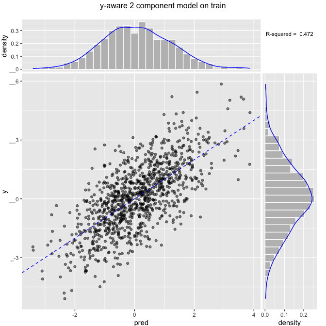
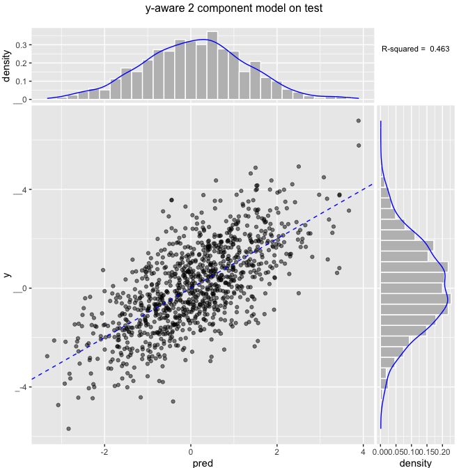
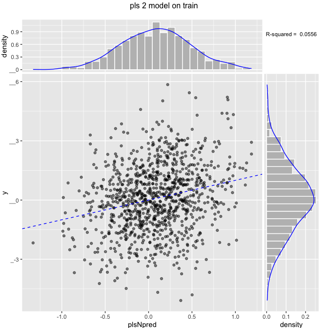
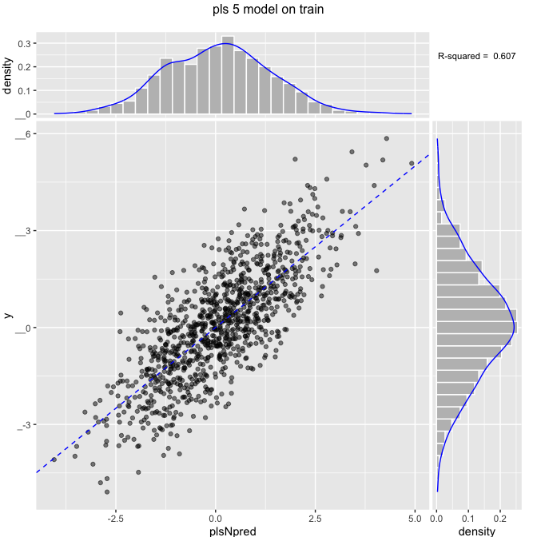
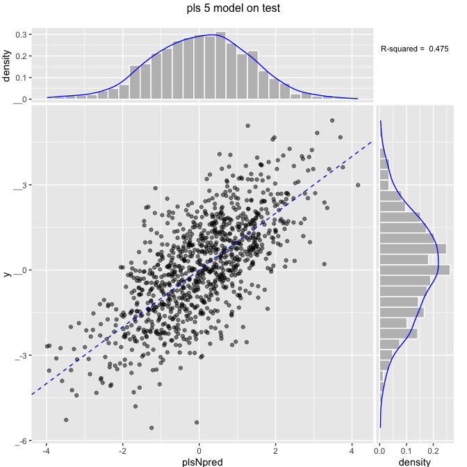
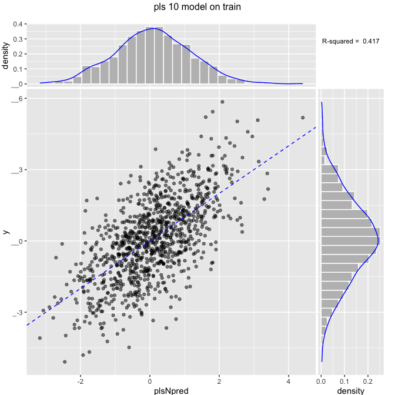
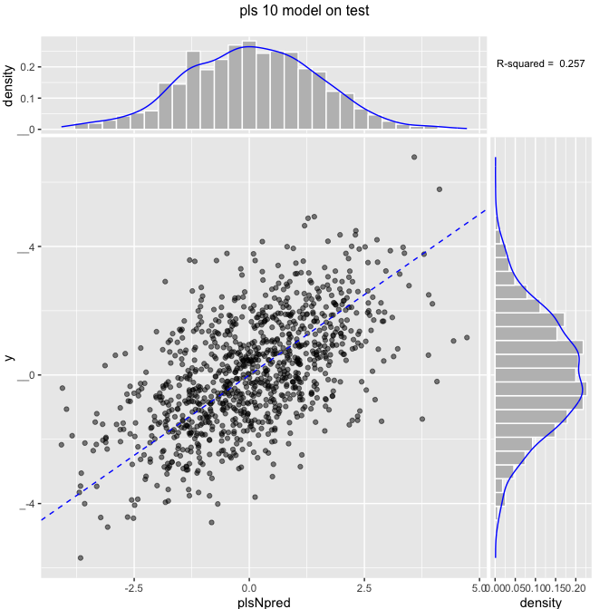

Partial least squares on similar data to [Principal Components Regression, Pt. 2: Y-Aware Methods](https://github.com/WinVector/Examples/blob/master/PCR/YAwarePCA.md).

``` r
# build example where even and odd variables are bringing in noisy images
# of two different signals.
mkData <- function(n) {
  for(group in 1:50) {
    # y is the sum of two effects yA and yB
    yA <- rnorm(n)
    yB <- rnorm(n)
    if(group==1) {
      d <- data.frame(y=yA+yB+rnorm(n))
      code <- 'x'
    } else {
      code <- paste0('noise',group-1)
    }
    yS <- list(yA,yB)
    # these variables are correlated with y in group 1,
    # but only to each other (and not y) in other groups
    for(i in 1:5) {
      vi <- yS[[1+(i%%2)]] + rnorm(nrow(d))
      d[[paste(code,formatC(i,width=2,flag=0),sep='.')]] <- ncol(d)*vi
    }
  }
  d
}
```

``` r
# make data
set.seed(23525)
dTrain <- mkData(1000)
dTest <- mkData(1000)
```

Use *y*-aware scaling.

``` r
ncores <- parallel::detectCores()
pClus <- parallel::makeCluster(ncores)
vars <- setdiff(colnames(dTrain),'y')
print(length(vars))
```

    ## [1] 250

``` r
formula <- paste('y',paste(vars,collapse=' + '),sep=' ~ ')
pruneSig = NULL # leaving null to prevent (useful) pruning, in practice set to 1/length(vars) or some such.
useCrossMethod <- TRUE
if(useCrossMethod) {
  cfe <- vtreat::mkCrossFrameNExperiment(dTrain,vars,'y',scale=TRUE,parallelCluster=pClus)
  treatmentPlan <- cfe$treatments
  newvars <- treatmentPlan$scoreFrame$varName
  dmTrain <- as.matrix(cfe$crossFrame[,newvars])
} else {
  treatmentPlan <- vtreat::designTreatmentsN(dTrain,vars,'y',verbose=FALSE,parallelCluster=pClus)
  newvars <- treatmentPlan$scoreFrame$varName
  dmTrain <-  as.matrix(vtreat::prepare(treatmentPlan,dTrain,scale=TRUE,pruneSig=pruneSig)[,newvars],
                        parallelCluster=pClus)
}
print(length(newvars))
```

    ## [1] 250

``` r
dmTest <- as.matrix(vtreat::prepare(treatmentPlan,dTest,scale=TRUE,pruneSig=pruneSig)[,newvars],
                     parallelCluster=pClus)
princ <- prcomp(dmTrain, center = FALSE, scale. = FALSE)
proj <- extractProjection(2,princ)
projectedTrain <- as.data.frame(dmTrain %*% proj,
                      stringsAsFactors = FALSE)
projectedTrain$y <- dTrain$y
projectedTest <- as.data.frame(dmTest %*% proj,
                      stringsAsFactors = FALSE)
projectedTest$y <- dTest$y
model <- lm(y~PC1+PC2,data=projectedTrain)
projectedTrain$pred <- predict(model,newdata = projectedTrain)
projectedTest$pred <- predict(model,newdata = projectedTest)

ScatterHist(projectedTrain,'pred','y',paste('y-aware 2 component model on train'),
            smoothmethod='identity',annot_size=3)
```



``` r
trainrsq <- rsq(projectedTrain$pred,projectedTrain$y)
print(paste("train rsq",trainrsq))
```

    ## [1] "train rsq 0.471688060744479"

``` r
ScatterHist(projectedTest,'pred','y',paste('y-aware 2 component model on test'),
            smoothmethod='identity',annot_size=3)
```



``` r
testrsq <- rsq(projectedTest$pred,projectedTest$y)
print(paste("test rsq",testrsq))
```

    ## [1] "test rsq 0.462992844469711"

``` r
parallel::stopCluster(pClus)
```

Use latent components to model (partial least squares).

``` r
library("pls")
vars <- setdiff(colnames(dTrain),'y')
plotTrain <- dTrain
plotTest <- dTest
formula <- paste('y',paste(vars,collapse=' + '),sep=' ~ ')
for(ncomp in c(2,5,10)) {
  print("###################")
  print(paste('ncomp',ncomp))
  modelN <- plsr(as.formula(formula), ncomp = ncomp, data = dTrain, 
                 scale=TRUE, validation = "CV")
  plotTrain$plsNpred <- as.numeric(predict(modelN,newdata=dTrain,ncomp=ncomp,type='response'))
  ScatterHist(plotTrain,'plsNpred','y',paste('pls',ncomp,'model on train'),
              smoothmethod='identity',annot_size=3)
  trainrsq <- rsq(plotTrain$plsNpred,plotTrain$y)
  print(paste("ncomp",ncomp,"train rsq",trainrsq))
  plotTest$plsNpred <-as.numeric(predict(modelN,newdata=dTest,ncomp=ncomp,type='response'))
  ScatterHist(plotTest,'plsNpred','y',paste('pls',ncomp,'model on test'),
              smoothmethod='identity',annot_size=3)
  testrsq <- rsq(plotTest$plsNpred,plotTest$y)
  print(paste("ncomp",ncomp,"test rsq",testrsq))
  print("###################")
}
```

    ## [1] "###################"
    ## [1] "ncomp 2"



    ## [1] "ncomp 2 train rsq 0.569372530730129"


    ## [1] "ncomp 2 test rsq 0.36297252913115"
    ## [1] "###################"
    ## [1] "###################"
    ## [1] "ncomp 5"



    ## [1] "ncomp 5 train rsq 0.6073996779179"



    ## [1] "ncomp 5 test rsq 0.264559333602527"
    ## [1] "###################"
    ## [1] "###################"
    ## [1] "ncomp 10"



    ## [1] "ncomp 10 train rsq 0.609688754759089"



    ## [1] "ncomp 10 test rsq 0.256595542926984"
    ## [1] "###################"
