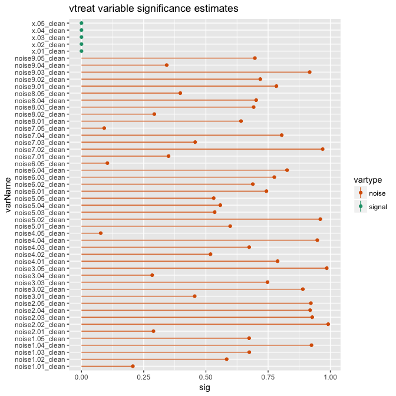
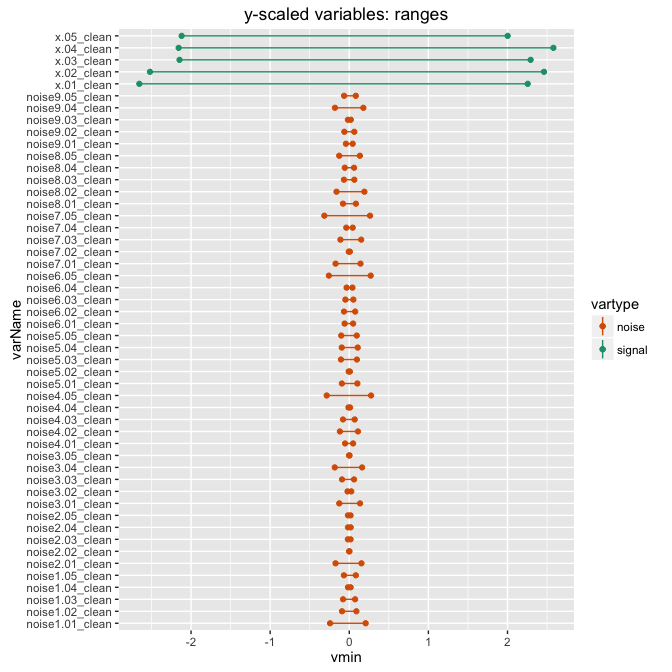
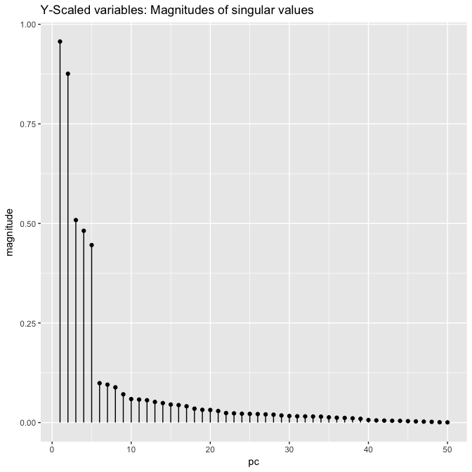
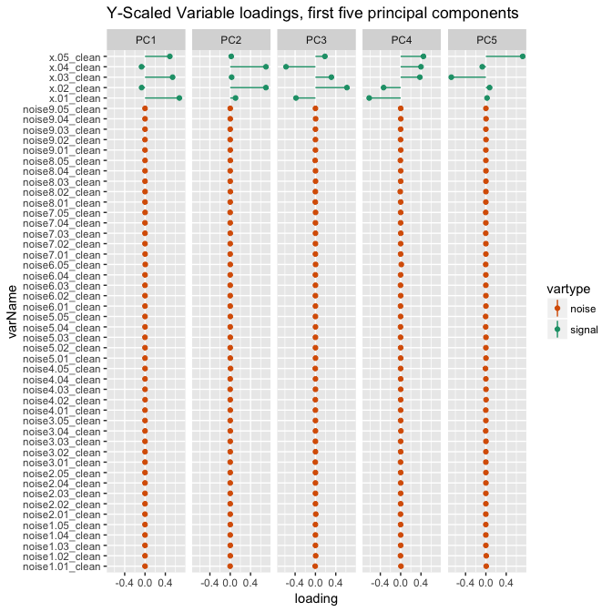
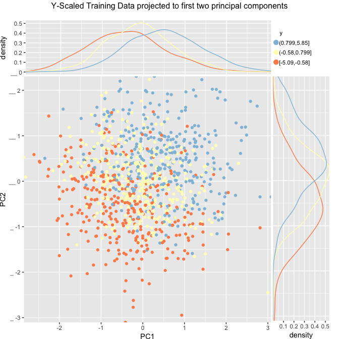
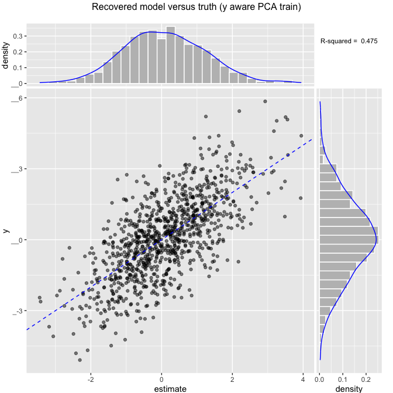
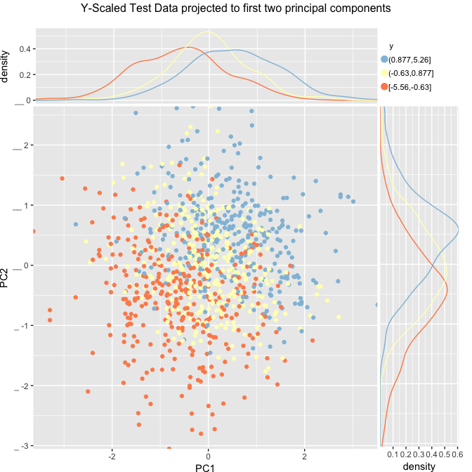
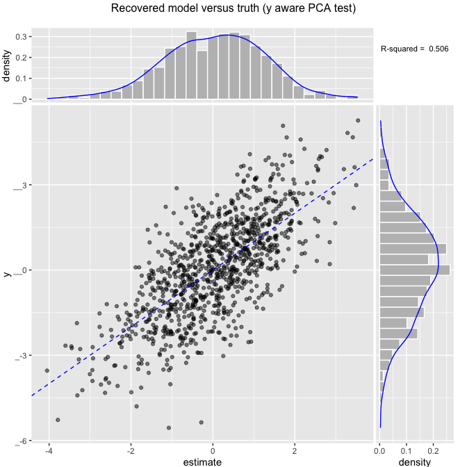

This article is by [Dr. Nina Zumel](http://www.win-vector.com/site/staff/nina-zumel/) of [Win-Vector LLC](http://www.win-vector.com/) and is hosted at: <http://www.win-vector.com/blog/2016/05/pcr_part2_yaware>.

In our [previous note](http://www.win-vector.com/blog/2016/05/pcr_part1_xonly), we discussed some problems that can arise when using standard principal components analysis (specifically, principal components regression) to model the relationship between independent (*x*) and dependent (*y*) variables. In this note, we present some dimensionality reduction techniques that alleviate some of those problems, in particular what we call *Y-Aware Principal Components Analysis*, or *Y-Aware PCA*. We will use our variable treatment package [`vtreat`](https://github.com/WinVector/vtreat) in the examples we show in this note, but you can easily implement the approach independently of `vtreat`.

What is *Y*-Aware PCA?
----------------------

As with other geometric algorithms, principal components analysis is sensitive to the units of the data. In standard ("*x*-only") PCA, we often attempt to alleviate this problem by rescaling the *x* variables to their "natural units": that is, we rescale *x* by its own standard deviation. By individually rescaling each *x* variable to its "natural unit," we hope (but cannot guarantee) that all the data as a group will be in some "natural metric space," and that the structure we hope to discover in the data will manifest itself in this coordinate system. As we saw in the previous note, if the structure that we hope to discover is the relationship between *x* and *y*, we have even less guarantee that we are in the correct space, since the decomposition of the data was done without knowledge of *y*.

*Y*-aware PCA is simply PCA with a different scaling: we rescale the *x* data to be in *y*-units. That is, we want scaled variables *x'* such that a unit change in *x'* corresponds to a unit change in *y*. Under this rescaling, all the independent variables are in *the same* units, which are indeed the natural units for the problem at hand: characterizing their effect on *y*. (We also center the transformed variables *x'* to be zero mean, as is done with standard centering and scaling).

It's easy to determine the scaling for a variable *x* by fitting a linear regression model between *x* and *y*:

\[ y = m * x + b \]

The coefficient *m* is the slope of the best fit line, so a unit change in *x* corresponds (on average) to a change of *m* units in *y*. If we rescale (and recenter) *x* as

\[ x' := m * x - mean(m * x) \]

then *x'* is in *y* units. This *y*-aware scaling is both complementary to variable pruning and powerful enough to perform well on its own.

In `vtreat`, the treatment plan created by `designTreatmentsN()` will store the information needed for *y*-aware scaling, so that if you then `prepare` your data with the flag `scale=TRUE`, the resulting treated frame will be scaled appropriately. Our example is a regression example, for the techniques needed for a classification example please see [here](https://github.com/WinVector/Examples/blob/master/PCR/YAwarePCAclassification.md).

An Example of *Y*-Aware PCA
---------------------------

First, let's build our example. We will use the same data set as our [earlier "x only" discussion](http://www.win-vector.com/blog/2016/05/pcr_part1_xonly).

In this data set, there are two (unobservable) processes: one that produces the output `yA` and one that produces the output `yB`.We only observe the mixture of the two: `y =  yA + yB + eps`, where `eps` is a noise term. Think of `y` as measuring some notion of success and the `x` variables as noisy estimates of two different factors that can each drive success.

We'll set things up so that the first five variables (x.01, x.02, x.03, x.04, x.05) have all the signal. The odd numbered variables correspond to one process (`yB`) and the even numbered variables correspond to the other (`yA`). Then, to simulate the difficulties of real world modeling, we'll add lots of pure noise variables (`noise*`). The noise variables are unrelated to our *y* of interest -- but are related to other "y-style" processes that we are not interested in. We do this because in real applications, there is no reason to believe that unhelpful variables have limited variation or are uncorrelated with each other, though things would certainly be easier if we could so assume. As we showed in the [previous note](http://www.win-vector.com/blog/2016/05/pcr_part1_xonly), this correlation undesirably out-competed the *y* induced correlation among signaling variables when using standard PCA.

All the variables are also deliberately mis-scaled to model some of the difficulties of working with under-curated real world data.

Let's start with our train and test data.

``` r
# make data
set.seed(23525)
dTrain <- mkData(1000)
dTest <- mkData(1000)
```

Let's look at our outcome *y* and a few of our variables.

``` r
summary(dTrain[, c("y", "x.01", "x.02", "noise1.01", "noise1.02")])
```

    ##        y                 x.01               x.02        
    ##  Min.   :-5.08978   Min.   :-4.94531   Min.   :-9.9796  
    ##  1st Qu.:-1.01488   1st Qu.:-0.97409   1st Qu.:-1.8235  
    ##  Median : 0.08223   Median : 0.04962   Median : 0.2025  
    ##  Mean   : 0.08504   Mean   : 0.02968   Mean   : 0.1406  
    ##  3rd Qu.: 1.17766   3rd Qu.: 0.93307   3rd Qu.: 1.9949  
    ##  Max.   : 5.84932   Max.   : 4.25777   Max.   :10.0261  
    ##    noise1.01          noise1.02       
    ##  Min.   :-30.5661   Min.   :-30.4412  
    ##  1st Qu.: -5.6814   1st Qu.: -6.4069  
    ##  Median :  0.5278   Median :  0.3031  
    ##  Mean   :  0.1754   Mean   :  0.4145  
    ##  3rd Qu.:  5.9238   3rd Qu.:  6.8142  
    ##  Max.   : 26.4111   Max.   : 31.8405

Next, we'll design a treatment plan for the frame, and examine the variable significances, as estimated by `vtreat`.

``` r
# design treatment plan
treatmentsN <- designTreatmentsN(dTrain,setdiff(colnames(dTrain),'y'),'y',
                                 verbose=FALSE)

scoreFrame = treatmentsN$scoreFrame
scoreFrame$vartype = ifelse(grepl("noise", scoreFrame$varName), "noise", "signal")

dotplot_identity(scoreFrame, "varName", "sig", "vartype") + 
  coord_flip()  + ggtitle("vtreat variable significance estimates")+ 
  scale_color_manual(values = c("noise" = "#d95f02", "signal" = "#1b9e77")) 
```



Note that the noise variables typically have large significance values, denoting statistical insignificance. Usually we recommend doing some significance pruning on variables before moving on -- see [here](http://www.win-vector.com/blog/2014/02/bad-bayes-an-example-of-why-you-need-hold-out-testing/) for possible consequences of not pruning an over-abundance of variables, and [here](http://www.win-vector.com/blog/2015/08/how-do-you-know-if-your-data-has-signal/) for a discussion of one way to prune, based on significance. For this example, however, we will attempt dimensionality reduction without pruning.

*Y*-Aware PCA
-------------

### Prepare the frame with *y*-aware scaling

Now let's prepare the treated frame, with scaling turned on. We will deliberately turn off variable pruning by setting `pruneSig = 1`. In real applications, you would want to set `pruneSig` to a value less than one to prune insignificant variables. However, here we turn off variable pruning to show that you can recover some of pruning's benefits via scaling effects, because the scaled noise variables should not have a major effect in the principal components analysis. Pruning by significance is in fact a good additional precaution complementary to scaling by effects.

``` r
# prepare the treated frames, with y-aware scaling
examplePruneSig = 1.0 
dTrainNTreatedYScaled <- prepare(treatmentsN,dTrain,pruneSig=examplePruneSig,scale=TRUE)
dTestNTreatedYScaled <- prepare(treatmentsN,dTest,pruneSig=examplePruneSig,scale=TRUE)

# get the variable ranges
ranges = vapply(dTrainNTreatedYScaled, FUN=function(col) c(min(col), max(col)), numeric(2))
rownames(ranges) = c("vmin", "vmax") 
rframe = as.data.frame(t(ranges))  # make ymin/ymax the columns
rframe$varName = rownames(rframe)
varnames = setdiff(rownames(rframe), "y")
rframe = rframe[varnames,]
rframe$vartype = ifelse(grepl("noise", rframe$varName), "noise", "signal")

# show a few columns
summary(dTrainNTreatedYScaled[, c("y", "x.01_clean", "x.02_clean", "noise1.02_clean", "noise1.02_clean")])
```

    ##        y              x.01_clean         x.02_clean      
    ##  Min.   :-5.08978   Min.   :-2.65396   Min.   :-2.51975  
    ##  1st Qu.:-1.01488   1st Qu.:-0.53547   1st Qu.:-0.48904  
    ##  Median : 0.08223   Median : 0.01063   Median : 0.01539  
    ##  Mean   : 0.08504   Mean   : 0.00000   Mean   : 0.00000  
    ##  3rd Qu.: 1.17766   3rd Qu.: 0.48192   3rd Qu.: 0.46167  
    ##  Max.   : 5.84932   Max.   : 2.25552   Max.   : 2.46128  
    ##  noise1.02_clean      noise1.02_clean.1   
    ##  Min.   :-0.0917910   Min.   :-0.0917910  
    ##  1st Qu.:-0.0186927   1st Qu.:-0.0186927  
    ##  Median : 0.0003253   Median : 0.0003253  
    ##  Mean   : 0.0000000   Mean   : 0.0000000  
    ##  3rd Qu.: 0.0199244   3rd Qu.: 0.0199244  
    ##  Max.   : 0.0901253   Max.   : 0.0901253

``` r
barbell_plot(rframe, "varName", "vmin", "vmax", "vartype") +
  coord_flip() + ggtitle("y-scaled variables: ranges") + 
  scale_color_manual(values = c("noise" = "#d95f02", "signal" = "#1b9e77"))
```



Notice that after the *y*-aware rescaling, the signal carrying variables have larger ranges than the noise variables.

### The Principal Components Analysis

Now we do the principal components analysis. In this case it is critical that the `scale` parameter in <code>prcomp</code> is set to `FALSE` so that it does not undo our own scaling. Notice the magnitudes of the singular values fall off quickly after the first two to five values.

``` r
vars <- setdiff(colnames(dTrainNTreatedYScaled),'y')
# prcomp defaults to scale. = FALSE, but we already scaled/centered in vtreat- which we don't want to lose.
dmTrain <- as.matrix(dTrainNTreatedYScaled[,vars])
dmTest <- as.matrix(dTestNTreatedYScaled[,vars])
princ <- prcomp(dmTrain, center = FALSE, scale. = FALSE)
dotplot_identity(frame = data.frame(pc=1:length(princ$sdev), 
                            magnitude=princ$sdev), 
                 xvar="pc",yvar="magnitude") +
  ggtitle("Y-Scaled variables: Magnitudes of singular values")
```



When we look at the variable loadings of the first five principal components, we see that we recover the even/odd loadings of the original signal variables. `PC1` has the odd variables, and `PC2` has the even variables. These two principal components carry most of the signal. The next three principal components complete the basis for the five original signal variables. The noise variables have very small loadings, compared to the signal variables.

``` r
proj <- extractProjection(2,princ)
rot5 <- extractProjection(5,princ)
rotf = as.data.frame(rot5)
rotf$varName = rownames(rotf)
rotflong = gather(rotf, "PC", "loading", starts_with("PC"))
rotflong$vartype = ifelse(grepl("noise", rotflong$varName), "noise", "signal")

dotplot_identity(rotflong, "varName", "loading", "vartype") + 
  facet_wrap(~PC,nrow=1) + coord_flip() + 
  ggtitle("Y-Scaled Variable loadings, first five principal components") + 
  scale_color_manual(values = c("noise" = "#d95f02", "signal" = "#1b9e77"))
```



Let's look at the projection of the data onto its first two principal components, using color to code the *y* value. Notice that y increases both as we move up and as we move right. We have recovered two features that correlate with an increase in y. In fact, `PC1` corresponds to the odd signal variables, which correspond to process *yB*, and `PC2` corresponds to the even signal variables, which correspond to process *yA*.

``` r
# apply projection
projectedTrain <- as.data.frame(dmTrain %*% proj,
                      stringsAsFactors = FALSE)
# plot data sorted by principal components
projectedTrain$y <- dTrainNTreatedYScaled$y
ScatterHistN(projectedTrain,'PC1','PC2','y',
               "Y-Scaled Training Data projected to first two principal components")
```



Now let's fit a linear regression model to the first two principal components.

``` r
model <- lm(y~PC1+PC2,data=projectedTrain)
summary(model)
```

    ## 
    ## Call:
    ## lm(formula = y ~ PC1 + PC2, data = projectedTrain)
    ## 
    ## Residuals:
    ##     Min      1Q  Median      3Q     Max 
    ## -3.3470 -0.7919  0.0172  0.7955  3.9588 
    ## 
    ## Coefficients:
    ##             Estimate Std. Error t value Pr(>|t|)    
    ## (Intercept)  0.08504    0.03912   2.174     0.03 *  
    ## PC1          0.78611    0.04092  19.212   <2e-16 ***
    ## PC2          1.03243    0.04469  23.101   <2e-16 ***
    ## ---
    ## Signif. codes:  0 '***' 0.001 '**' 0.01 '*' 0.05 '.' 0.1 ' ' 1
    ## 
    ## Residual standard error: 1.237 on 997 degrees of freedom
    ## Multiple R-squared:  0.4752, Adjusted R-squared:  0.4742 
    ## F-statistic: 451.4 on 2 and 997 DF,  p-value: < 2.2e-16

``` r
projectedTrain$estimate <- predict(model,newdata=projectedTrain)
trainrsq = rsq(projectedTrain$estimate,projectedTrain$y)

ScatterHist(projectedTrain,'estimate','y','Recovered model versus truth (y aware PCA train)',
            smoothmethod='identity',annot_size=3)
```



This model, with only two variables, explains 47.52% of the variation in *y*. This is comparable to the variance explained by the model fit to twenty principal components using *x*-only PCA (as well as a model fit to all the original variables) in the previous note.

Let's see how the model does on hold-out data.

``` r
# apply projection
projectedTest <- as.data.frame(dmTest %*% proj,
                      stringsAsFactors = FALSE)
# plot data sorted by principal components
projectedTest$y <- dTestNTreatedYScaled$y
ScatterHistN(projectedTest,'PC1','PC2','y',
               "Y-Scaled Test Data projected to first two principal components")
```



``` r
projectedTest$estimate <- predict(model,newdata=projectedTest)
testrsq = rsq(projectedTest$estimate,projectedTest$y)
testrsq
```

    ## [1] 0.5063724

``` r
ScatterHist(projectedTest,'estimate','y','Recovered model versus truth (y aware PCA test)',
            smoothmethod='identity',annot_size=3)
```



We see that this two-variable model captures about 50.64% of the variance in *y* on hold-out -- again, comparable to the hold-out performance of the model fit to twenty principal components using *x*-only PCA. These two principal components also do a *much* better job of capturing the internal structure of the data -- that is, the relationship of the signaling variables to the `yA` and `yB` processes -- than the first two principal components of the *x*-only PCA.

Is this the same as `caret::preProcess`?
----------------------------------------

In this note, we used `vtreat`, a data.frame processor/conditioner that prepares real-world data for predictive modeling in a statistically sound manner, followed by principal components regression. One could instead use `caret`. The `caret` package, as described in the documentation, "is a set of functions that attempt to streamline the process for creating predictive models."

`caret::preProcess` is designed to implement a number of sophisticated *x* alone transformations, groupings, prunings, and repairs (see [caret/preprocess.html\#all](http://topepo.github.io/caret/preprocess.html#all), which demonstrates "the function on all the columns except the last, which is the outcome" on the *schedulingData* dataset). So `caret::preProcess` is a super-version of the PCA step.

We could use it as follows either alone or *before* vtreat design/prepare as a initial pre-processor. Using it alone is similar to PCA for this data set, as our example doesn't have some of the additional problems `caret::preProcess` is designed to help with.

``` r
library('caret')
origVars <- setdiff(colnames(dTrain),'y')
# can try variations such adding/removing non-linear steps such as "YeoJohnson"
prep <- preProcess(dTrain[,origVars],
                     method = c("center", "scale", "pca"))
prepared <- predict(prep,newdata=dTrain[,origVars])
newVars <- colnames(prepared)
prepared$y <- dTrain$y
print(length(newVars))
```

    ## [1] 44

``` r
modelB <- lm(paste('y',paste(newVars,collapse=' + '),sep=' ~ '),data=prepared)
print(summary(modelB)$r.squared)
```

    ## [1] 0.5004569

``` r
print(summary(modelB)$adj.r.squared)
```

    ## [1] 0.4774413

``` r
preparedTest <- predict(prep,newdata=dTest[,origVars])
testRsqC <- rsq(predict(modelB,newdata=preparedTest),dTest$y)
testRsqC
```

    ## [1] 0.4824284

The 44 `caret`-chosen PCA variables are designed to capture 95% of the in-sample explainable variation of the variables. The linear regression model fit to the selected variables explains about 50.05% of the *y* variance on training and 48.24% of the *y* variance on test. This *is* quite good, comparable to our previous results. However, note that `caret` picked more than the twenty principal components that we picked visually in the previous note, and needed far more variables than we needed with *y*-aware PCA.

Because `caret::preProcess` is *x*-only processing, the first few variables capture much less of the *y* variation. So we can't model *y* without using a lot of the derived variables. To show this, let's try fitting a model using only five of `caret`'s PCA variables.

``` r
model5 <- lm(paste('y',paste(newVars[1:5],collapse=' + '),sep=' ~ '),data=prepared)
print(summary(model5)$r.squared)
```

    ## [1] 0.1352

``` r
print(summary(model5)$adj.r.squared)
```

    ## [1] 0.1308499

The first 5 variables only capture about 13.52% of the in-sample variance; without being informed about *y*, we can't know which variation to preserve and which we can ignore. We certainly haven't captured the two subprocesses that drive *y* in an inspectable manner.

Other *Y*-aware Approaches to Dimensionality Reduction
------------------------------------------------------

If your goal is regression, there are other workable *y*-aware dimension reducing procedures, such as L2-regularized regression or partial least squares. Both methods are also related to principal components analysis (see Hastie, *etal* 2009).

Bair, *etal* proposed a variant of principal components regression that they call *Supervised PCR*. In supervised PCR, *as described in their 2006 paper*, a univariate linear regression model is fit to each variable (after scaling and centering), and any variable whose coefficient (what we called *m* above) has a magnitude less than some threshold \(\theta\) is pruned. PCR is then done on the remaining variables. Conceptually, this is similar to the significance pruning that `vtreat` offers, except that the pruning criterion is "effects-based" (that is, it's based on the magnitude of a parameter, or the strength of an effect) rather than probability-based, such as pruning on significance.

One issue with an effects-based pruning criterion is that the appropriate pruning threshold varies from problem to problem, and not necessarily in an obvious way. Bair, *etal* find an appropriate threshold via cross-validation. Probability-based thresholds are in some sense more generalizable from problem to problem, since the score is always in probability units -- the same units for all problems. A simple variation of supervised PCR might prune on the *significance* of the coefficient *m*, as determined by its t-statistic. This would be essentially equivalent to significance pruning of the variables via `vtreat` before standard PCR.

Note that [`vtreat` uses the significance of the one-variable model fits, not coefficient significance](http://www.win-vector.com/blog/2015/08/how-do-you-know-if-your-data-has-signal/) to estimate variable significance. When both the dependent and independent variables are numeric, the model significance and the coefficient significance are identical (see Weisberg, *Applied Linear Regression*). In more general modeling situations where either the outcome is categorical or the original input variable is categorical with many degrees of freedom, they are not the same, and, in our opinion, using the model significance is preferable.

In general modeling situations where you are not specifically interested in the structure of the feature space, as described by the principal components, then we recommend significance pruning of the variables. As a rule of thumb, we suggest setting your significance pruning threshold based on the rate at which you can tolerate bad variables slipping into the model. For example, setting the pruning threshold at \(p=0.05\) would let pure noise variables in at the rate of about 1 in 20 in expectation. So a good upper bound on the pruning threshold might be *1/nvar*, where *nvar* is the number of variables. We discuss this issue briefly [here](http://winvector.github.io/vtreathtml/vtreatSignificance.html) in the `vtreat` documentation.

`vtreat` does not supply any joint variable dimension reduction as we feel dimension reduction is a modeling task. `vtreat` is intended to limit itself to only necessary "prior to modeling" processing and includes significance pruning reductions because [such pruning can be necessary prior to modeling](http://www.win-vector.com/blog/2014/02/bad-bayes-an-example-of-why-you-need-hold-out-testing/).

Conclusion
----------

In our experience, there are two camps of analysts: those who never use principal components regression and those who use it far too often. While principal components analysis is a useful data conditioning method, it is sensitive to distances and geometry. Therefore it is only to be trusted when the variables are curated, pruned, and in appropriate units. Principal components regression should not be used blindly; it requires proper domain aware scaling, initial variable pruning, and posterior component pruning. If the goal is regression many of the purported benefits of principal components regression can be achieved through regularization.

The general principals are widely applicable, and often re-discovered and re-formulated in useful ways (such as [autoencoders](https://en.wikipedia.org/wiki/Autoencoder)).

In our [next note](http://www.win-vector.com/blog/2016/05/pcr_part3_pickk/), we will look at some ways to pick the appropriate number of principal components procedurally.

### References

-   Bair, Eric, Trevor Hastie, Debashis Paul and Robert Tibshirani, "Prediction by Supervised Principal Components", *Journal of the American Statistical Association*, Vol. 101, No. 473 (March 2006), pp. 119-137.

-   Hastie, Trevor, Robert Tibshirani, and Jerome Friedman, *The Elements of Statistical Learning*, 2nd Edition, 2009.

-   Weisberg, Sanford, *Applied Linear Regression*, Third Edition, Wiley, 2005.
