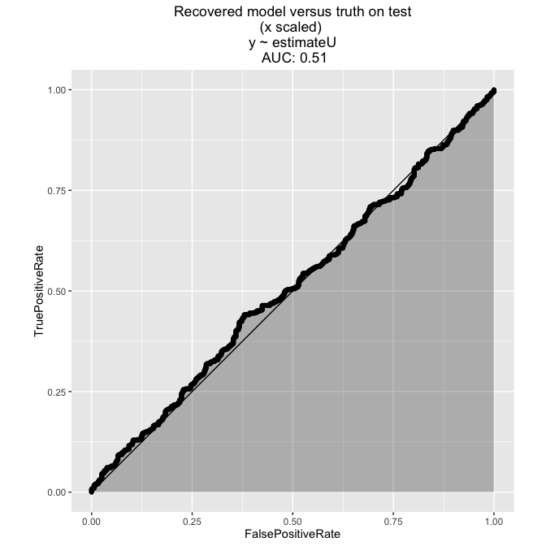
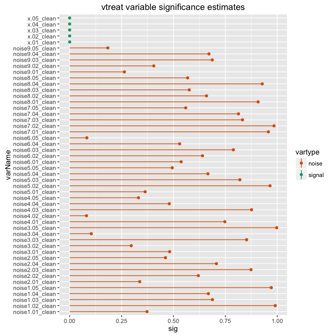
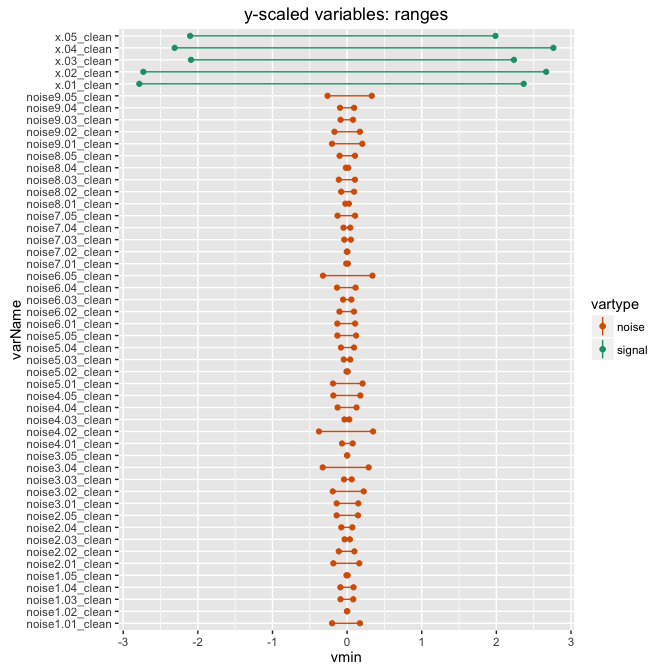
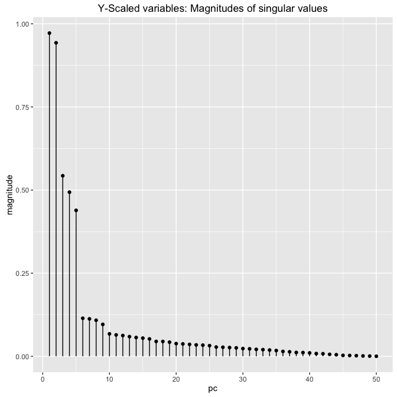
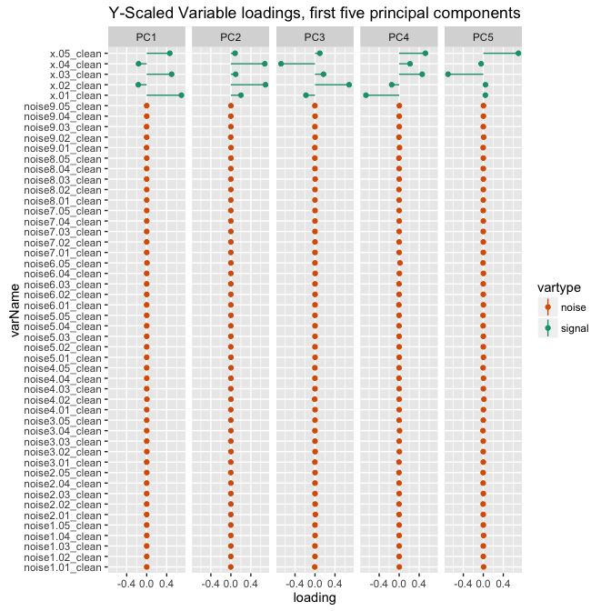
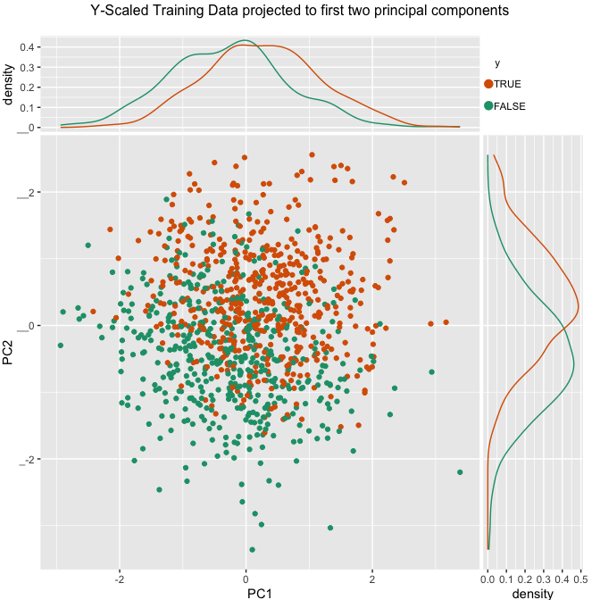
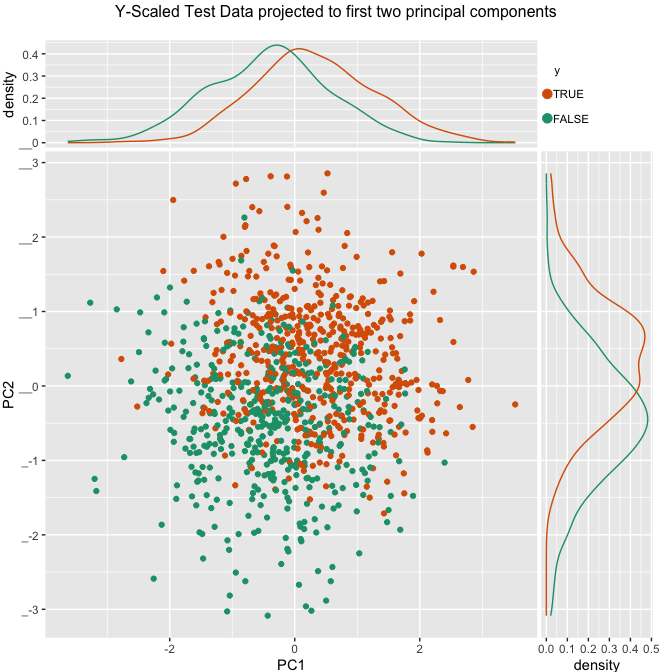
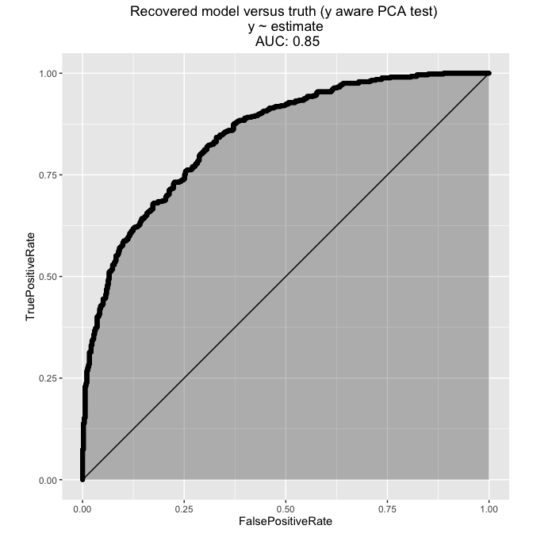
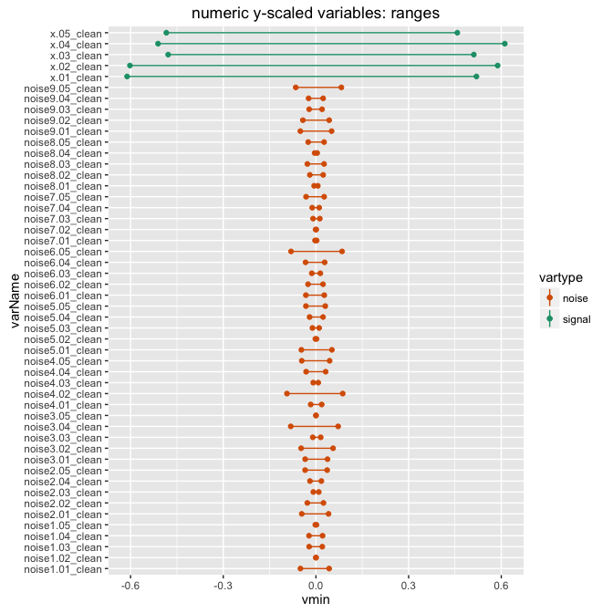

[Dr. Nina Zumel](http://www.win-vector.com/site/staff/nina-zumel/) of [Win-Vector LLC](http://www.win-vector.com/) demonstrated an effective regression preparation technique (particularly useful for principal components analysis and regression) called [*y*-aware scaling](http://www.win-vector.com/blog/2016/05/pcr_part2_yaware/).

In this note we adapt the method for classification problems (instead of regression). This note is a quick copy of Nina Zumel's original article, so we strongly suggest reading the original (and its [backing code](https://github.com/WinVector/Examples/tree/master/PCR)) for more explanation and details.

We will use our variable treatment package [`vtreat`](https://github.com/WinVector/vtreat) (note: the `catScaling=TRUE` option currently requires using [developtment veraion `0.5.26`](https://github.com/WinVector/vtreat) or newer) in the examples we show in this note, but you can easily implement the approach independently of `vtreat`.

What is classification *Y*-Aware PCA?
-------------------------------------

Classification *y*-aware PCA is similar to [regression *y*-aware PCA](http://www.win-vector.com/blog/2016/05/pcr_part2_yaware/), except we specialize for a classification problem instead of a regression. This specialization is performed by re-scaling variables to be in "*y* logistic link units." For a given input (or independent) variable *x* we transform *x* into a "classification link scaled" variable *x'* by applying the following transform:

We determine a classification units scaling for a variable *x* by fitting a logistic regression model between *x* and *y*:

\[ P[y==TRUE] ~ sigmoid(m * x + b) \]

If we then rescale (and recenter) *x* as

\[ x' := m * x - mean(m * x) \]

then *x'* is in *y* logistic link units. This *y*-aware scaling is both complementary to variable pruning and powerful enough to perform well on its own. This may seem like an odd transform, but the whole point of "link space" for generalized linear models is: link space is hoped to be a place where effects are somewhat linear/additive.

In `vtreat`, the treatment plan created by `designTreatmentsC()` will store the information needed for *y*-aware scaling, so that if you then `prepare` your data with the flag `scale=TRUE`, the resulting treated frame will be scaled appropriately. Or you could perform the transform on your own.

An Example of *Y*-Aware PCA
---------------------------

First, let's build our example. We will use a same data similar to the [earlier "x only" discussion](http://www.win-vector.com/blog/2016/05/pcr_part1_xonly), but one where only the sign of *y* is known and the task is to predict (classify) this sign. This problem can be a bit harder as each row of training data brings in a lot less information than in the original regression problem.

``` r
# make data
set.seed(23525)
dTrain <- mkData(1000)
dTest <- mkData(1000)
```

Let's look at our outcome *y* and a few of our variables.

``` r
summary(dTrain[, c("y", "x.01", "x.02", "noise1.01", "noise1.02")])
```

    ##      y                x.01               x.02           noise1.01       
    ##  Mode :logical   Min.   :-4.94531   Min.   :-9.9796   Min.   :-30.5661  
    ##  FALSE:483       1st Qu.:-0.97409   1st Qu.:-1.8235   1st Qu.: -5.6814  
    ##  TRUE :517       Median : 0.04962   Median : 0.2025   Median :  0.5278  
    ##  NA's :0         Mean   : 0.02968   Mean   : 0.1406   Mean   :  0.1754  
    ##                  3rd Qu.: 0.93307   3rd Qu.: 1.9949   3rd Qu.:  5.9238  
    ##                  Max.   : 4.25777   Max.   :10.0261   Max.   : 26.4111  
    ##    noise1.02       
    ##  Min.   :-30.4412  
    ##  1st Qu.: -6.4069  
    ##  Median :  0.3031  
    ##  Mean   :  0.4145  
    ##  3rd Qu.:  6.8142  
    ##  Max.   : 31.8405

Is *y*-aware scaling needed for classification problems?
--------------------------------------------------------

The answer is yes. Nina Zumel strongly demonstrated the need for *y*-aware scaling during principal components analysis data preparation for regression problems in her article series (please see [here](https://github.com/WinVector/Examples/tree/master/PCR)). Switching to categorical data and classification methods doesn't wish away the problem. Below we show abysmal test performance (AUC about `0.51`) on the traditional *x*-only scaled version of our example problem. With proper *y*-aware scaling we will get the test AUC above `0.8`.

``` r
varsU <- setdiff(colnames(dTrain),c('y','yN'))
dmTrainU <- as.matrix(dTrain[,varsU])
dmTestU <- as.matrix(dTest[,varsU])
prinu <- prcomp(dmTrainU, center = TRUE, scale. = TRUE)
projU <- extractProjection(2,prinu)
projectedTrainU <- as.data.frame(dmTrainU %*% projU,
                      stringsAsFactors = FALSE)
projectedTrainU$y <- dTrain$y
modelU <- glm(y~PC1+PC2,family=binomial,data=projectedTrainU)
projectedTestU <- as.data.frame(dmTestU %*% projU,
                      stringsAsFactors = FALSE)
projectedTestU$y <- dTest$y
projectedTestU$estimateU <- predict(modelU,type='response',newdata=projectedTestU)
ROCPlot(projectedTestU,'estimateU','y','Recovered model versus truth on test\n(x scaled)')
```



Preparing data using link based *y*-aware scaling
-------------------------------------------------

Next, we'll design a treatment plan for the frame, and examine the variable significances, as estimated by `vtreat`.

``` r
# design treatment plan
treatmentsC <- designTreatmentsC(dTrain,setdiff(colnames(dTrain),'y'),'y',TRUE,
                                 catScaling=TRUE,
                                 verbose=FALSE)

scoreFrame = treatmentsC$scoreFrame
scoreFrame$vartype = ifelse(grepl("noise", scoreFrame$varName), "noise", "signal")

dotplot_identity(scoreFrame, "varName", "sig", "vartype") + 
  coord_flip()  + ggtitle("vtreat variable significance estimates")+ 
  scale_color_manual(values = c("noise" = "#d95f02", "signal" = "#1b9e77")) 
```



Once again single variable significances are very telling. When this is the case we strongly advise pruning such using these significances. For this example we will not prune and intentionally leave any problems/issues for the downstream principal components analysis.

Categorical *Y*-Aware PCA
-------------------------

### Prepare the frame with *y*-aware scaling

Now let's prepare the treated frame, with scaling turned on. We will deliberately turn off variable pruning by setting `pruneSig = 1`. In real applications, you would want to set `pruneSig` to a value less than one to prune insignificant variables. However, here we turn off variable pruning to show that you can recover some of pruning's benefits via scaling effects, because the scaled noise variables should not have a major effect in the principal components analysis. Pruning by significance is in fact a good additional precaution complementary to scaling by effects.

``` r
# prepare the treated frames, with y-aware scaling
examplePruneSig = 1.0 
dTrainCTreatedYScaled <- prepare(treatmentsC,dTrain,pruneSig=examplePruneSig,scale=TRUE)
dTestCTreatedYScaled <- prepare(treatmentsC,dTest,pruneSig=examplePruneSig,scale=TRUE)

# get the variable ranges
ranges = vapply(dTrainCTreatedYScaled, FUN=function(col) c(min(col), max(col)), numeric(2))
rownames(ranges) = c("vmin", "vmax") 
rframe = as.data.frame(t(ranges))  # make ymin/ymax the columns
rframe$varName = rownames(rframe)
varnames = setdiff(rownames(rframe), "y")
rframe = rframe[varnames,]
rframe$vartype = ifelse(grepl("noise", rframe$varName), "noise", "signal")

# show a few columns
head(dTrainCTreatedYScaled[, c("y", "x.01_clean", "x.02_clean", "noise1.02_clean", "noise1.02_clean")])
```

    ##       y x.01_clean   x.02_clean noise1.02_clean noise1.02_clean.1
    ## 1  TRUE  0.6843510 -1.228535673   -0.0000407413     -0.0000407413
    ## 2  TRUE  0.8565212  0.474520641   -0.0001772855     -0.0001772855
    ## 3 FALSE -1.1146035 -0.425695320   -0.0001031654     -0.0001031654
    ## 4  TRUE  0.6410615  0.176883220   -0.0010762547     -0.0010762547
    ## 5 FALSE  1.0790082 -0.430795850   -0.0006643799     -0.0006643799
    ## 6  TRUE  0.5905793 -0.005199917   -0.0007712964     -0.0007712964

``` r
summary(dTrainCTreatedYScaled[, c("y", "x.01_clean", "x.02_clean", "noise1.02_clean", "noise1.02_clean")])
```

    ##      y             x.01_clean         x.02_clean      
    ##  Mode :logical   Min.   :-2.78433   Min.   :-2.73052  
    ##  FALSE:483       1st Qu.:-0.56178   1st Qu.:-0.52995  
    ##  TRUE :517       Median : 0.01116   Median : 0.01668  
    ##  NA's :0         Mean   : 0.00000   Mean   : 0.00000  
    ##                  3rd Qu.: 0.50559   3rd Qu.: 0.50029  
    ##                  Max.   : 2.36631   Max.   : 2.66716  
    ##  noise1.02_clean      noise1.02_clean.1   
    ##  Min.   :-2.306e-03   Min.   :-2.306e-03  
    ##  1st Qu.:-5.099e-04   1st Qu.:-5.099e-04  
    ##  Median :-8.323e-06   Median :-8.323e-06  
    ##  Mean   : 0.000e+00   Mean   : 0.000e+00  
    ##  3rd Qu.: 4.784e-04   3rd Qu.: 4.784e-04  
    ##  Max.   : 2.349e-03   Max.   : 2.349e-03

``` r
barbell_plot(rframe, "varName", "vmin", "vmax", "vartype") +
  coord_flip() + ggtitle("y-scaled variables: ranges") + 
  scale_color_manual(values = c("noise" = "#d95f02", "signal" = "#1b9e77"))
```



``` r
rframe$range <- rframe$vmax-rframe$vmin
rframeS <- aggregate(range~vartype,data=rframe,FUN=mean)
linkSignalToNoise <- rframeS$range[rframeS$vartype=='signal']/
  rframeS$range[rframeS$vartype=='noise']
print(linkSignalToNoise)
```

    ## [1] 21.717

Notice that after the *y*-aware rescaling, the signal carrying variables have larger ranges than the noise variables.

### The Principal Components Analysis

Now we do the principal components analysis. In this case it is critical that the `scale` parameter in <code>prcomp</code> is set to `FALSE` so that it does not undo our own scaling. Notice the magnitudes of the singular values fall off quickly after the first two to five values.

``` r
vars <- setdiff(colnames(dTrainCTreatedYScaled),'y')
# prcomp defaults to scale. = FALSE, but we already scaled/centered in vtreat- which we don't want to lose.
dmTrain <- as.matrix(dTrainCTreatedYScaled[,vars])
dmTest <- as.matrix(dTestCTreatedYScaled[,vars])
princ <- prcomp(dmTrain, center = FALSE, scale. = FALSE)
dotplot_identity(frame = data.frame(pc=1:length(princ$sdev), 
                            magnitude=princ$sdev), 
                 xvar="pc",yvar="magnitude") +
  ggtitle("Y-Scaled variables: Magnitudes of singular values")
```



When we look at the variable loadings of the first five principal components, we see that we recover the even/odd loadings of the original signal variables. `PC1` has the odd variables, and `PC2` has the even variables. These two principal components carry most of the signal. The next three principal components complete the basis for the five original signal variables. The noise variables have very small loadings, compared to the signal variables.

``` r
proj <- extractProjection(2,princ)
rot5 <- extractProjection(5,princ)
rotf = as.data.frame(rot5)
rotf$varName = rownames(rotf)
rotflong = gather(rotf, "PC", "loading", starts_with("PC"))
rotflong$vartype = ifelse(grepl("noise", rotflong$varName), "noise", "signal")

dotplot_identity(rotflong, "varName", "loading", "vartype") + 
  facet_wrap(~PC,nrow=1) + coord_flip() + 
  ggtitle("Y-Scaled Variable loadings, first five principal components") + 
  scale_color_manual(values = c("noise" = "#d95f02", "signal" = "#1b9e77"))
```



Let's look at the projection of the data onto its first two principal components, using color to code the *y* value. Notice that y increases both as we move up and as we move right. We have recovered two features that correlate with an increase in y. In fact, `PC1` corresponds to the odd signal variables, which correspond to process *yB*, and `PC2` corresponds to the even signal variables, which correspond to process *yA*.

``` r
# apply projection
projectedTrain <- as.data.frame(dmTrain %*% proj,
                      stringsAsFactors = FALSE)
# plot data sorted by principal components
projectedTrain$y <- dTrainCTreatedYScaled$y
head(projectedTrain)
```

    ##          PC1        PC2     y
    ## 1  1.7588502 -0.7578231  TRUE
    ## 2  0.7572639  0.2232599  TRUE
    ## 3 -0.6912758 -0.9916960 FALSE
    ## 4  0.9205786 -0.0755567  TRUE
    ## 5  0.4355579 -0.0760051 FALSE
    ## 6  0.8083429  0.2955686  TRUE

``` r
ScatterHistC(projectedTrain,'PC1','PC2','y',
               "Y-Scaled Training Data projected to first two principal components")
```



Now let's fit a logistic regression model to the first two principal components.

``` r
model <- glm(y~PC1+PC2,family=binomial,data=projectedTrain)
summary(model)
```

    ## 
    ## Call:
    ## glm(formula = y ~ PC1 + PC2, family = binomial, data = projectedTrain)
    ## 
    ## Deviance Residuals: 
    ##     Min       1Q   Median       3Q      Max  
    ## -2.4359  -0.8462   0.2205   0.8403   2.1651  
    ## 
    ## Coefficients:
    ##             Estimate Std. Error z value Pr(>|z|)    
    ## (Intercept)  0.12395    0.07686   1.613    0.107    
    ## PC1          0.84571    0.08844   9.562   <2e-16 ***
    ## PC2          1.48165    0.10826  13.687   <2e-16 ***
    ## ---
    ## Signif. codes:  0 '***' 0.001 '**' 0.01 '*' 0.05 '.' 0.1 ' ' 1
    ## 
    ## (Dispersion parameter for binomial family taken to be 1)
    ## 
    ##     Null deviance: 1385.1  on 999  degrees of freedom
    ## Residual deviance: 1023.8  on 997  degrees of freedom
    ## AIC: 1029.8
    ## 
    ## Number of Fisher Scoring iterations: 5

``` r
projectedTrain$estimate <- predict(model,type='response',newdata=projectedTrain)
ROCPlot(projectedTrain,'estimate','y','Recovered model versus truth (y aware PCA train)')
```


Let's see how the model does on hold-out data.

``` r
# apply projection
projectedTest <- as.data.frame(dmTest %*% proj,
                      stringsAsFactors = FALSE)
# plot data sorted by principal components
projectedTest$y <- dTestCTreatedYScaled$y
ScatterHistC(projectedTest,'PC1','PC2','y',
               "Y-Scaled Test Data projected to first two principal components")
```



``` r
projectedTest$estimate <- predict(model,type='response',newdata=projectedTest)
ROCPlot(projectedTest,'estimate','y','Recovered model versus truth (y aware PCA test)')
```



### Is this significantly different than encoding *y* as a 0/1 indicator and using regression methods?

Another common way to deal with data preparation for classification is to simply re-encode the categorical outcome as a numeric indicator target that is `1` on "`TRUE`" instances and `0` elsewhere. From that point on you treat data preparation as a numeric or regression problem (though you can of course treat modeling as a classification problem). This loses some modeling power, but can work well in practice.

The point is the both the *y*-aware regression and classification scaling methods work by picking an affine transform (a scaling followed by a centering) on the input (or independent or *x* variables). They pick different scales, but if proportions are similar behavior will be similar.

For our simple example data set we don't see much of a difference between the two treatment strategies. The data is encoded at a different scale, but the most important feature (the actual variables being rescaled to have much more range than the noise variables) is preserved.

As we see below the downstream modeling fixes additional issues of scale and we get nearly identical predicted probabilities and classification performance.

``` r
dTrain$yN <- as.numeric(dTrain$y)
dTest$yN <- as.numeric(dTest$y)
treatmentsN <- designTreatmentsN(dTrain,setdiff(colnames(dTrain),c('y','yN')),'yN',
                                 verbose=FALSE)
examplePruneSigN = 1.0 
dTrainNTreatedYScaled <- prepare(treatmentsN,dTrain,pruneSig=examplePruneSigN,scale=TRUE)

# get the variable ranges
rangesN = vapply(dTrainNTreatedYScaled, FUN=function(col) c(min(col), max(col)), numeric(2))
rownames(rangesN) = c("vmin", "vmax") 
rframeN = as.data.frame(t(rangesN))  # make ymin/ymax the columns
rframeN$varName = rownames(rframeN)
varnamesN = setdiff(rownames(rframeN), c("y","yN"))
rframeN = rframeN[varnamesN,]
rframeN$vartype = ifelse(grepl("noise", rframeN$varName), "noise", "signal")
# show a few columns
head(dTrainNTreatedYScaled[, c("yN", "x.01_clean", "x.02_clean", "noise1.02_clean", "noise1.02_clean")])
```

    ##   yN x.01_clean   x.02_clean noise1.02_clean noise1.02_clean.1
    ## 1  1  0.1502612 -0.270927290   -1.017354e-05     -1.017354e-05
    ## 2  1  0.1880642  0.104645387   -4.427010e-05     -4.427010e-05
    ## 3  0 -0.2447307 -0.093878006   -2.576151e-05     -2.576151e-05
    ## 4  1  0.1407563  0.039007814   -2.687524e-04     -2.687524e-04
    ## 5  0  0.2369151 -0.095002819   -1.659028e-04     -1.659028e-04
    ## 6  1  0.1296720 -0.001146731   -1.926010e-04     -1.926010e-04

``` r
barbell_plot(rframeN, "varName", "vmin", "vmax", "vartype") +
  coord_flip() + ggtitle("numeric y-scaled variables: ranges") + 
  scale_color_manual(values = c("noise" = "#d95f02", "signal" = "#1b9e77"))
```



``` r
rframeN$range <- rframeN$vmax-rframeN$vmin
rframeNS <- aggregate(range~vartype,data=rframeN,FUN=mean)
indicatorSignalToNoise <- rframeNS$range[rframeNS$vartype=='signal']/
  rframeNS$range[rframeNS$vartype=='noise']
print(indicatorSignalToNoise)
```

    ## [1] 19.46277

``` r
dTestNTreatedYScaled <- prepare(treatmentsN,dTest,pruneSig=examplePruneSigN,scale=TRUE)
varsN <- setdiff(colnames(dTrainNTreatedYScaled),c('y','yN'))
dmTrainN <- as.matrix(dTrainNTreatedYScaled[,varsN])
dmTestN <- as.matrix(dTestNTreatedYScaled[,varsN])
prinn <- prcomp(dmTrainN, center = FALSE, scale. = FALSE)

projN <- extractProjection(2,prinn)
projectedTrainN <- as.data.frame(dmTrainN %*% projN,
                      stringsAsFactors = FALSE)
projectedTrainN$y <- dTrainNTreatedYScaled$y
head(projectedTrainN)
```

    ##           PC1         PC2 y
    ## 1  0.39021812 -0.18730613 1
    ## 2  0.16819409  0.03859961 1
    ## 3 -0.15926304 -0.20907574 0
    ## 4  0.20476130 -0.02856545 1
    ## 5  0.08127714 -0.02398647 0
    ## 6  0.18655252  0.05544500 1

``` r
modelN <- glm(y~PC1+PC2,family=binomial,data=projectedTrainN)
projectedTrainN$estimateN <- predict(modelN,type='response',newdata=projectedTrainN)
ROCPlot(projectedTrainN,'estimateN','y','Recovered model versus truth on train\n(numeric y aware PCA train)')
```


``` r
projectedTestN <- as.data.frame(dmTestN %*% projN,
                      stringsAsFactors = FALSE)
projectedTestN$y <- dTestNTreatedYScaled$y
projectedTestN$estimateN <- predict(modelN,type='response',newdata=projectedTestN)
ROCPlot(projectedTestN,'estimateN','y','Recovered model versus truth on test\n(numeric y aware PCA train)')
```


``` r
projectedTestN$estimateC <- projectedTest$estimate
head(projectedTestN[,c('y','estimateC','estimateN')])
```

    ##   y estimateC estimateN
    ## 1 0 0.5050032 0.5049774
    ## 2 1 0.9578015 0.9578002
    ## 3 0 0.3124927 0.3171816
    ## 4 1 0.3913216 0.3819974
    ## 5 0 0.7685418 0.7724294
    ## 6 1 0.9463399 0.9493543

Now there is a difference. The link-scaled *y*-aware procedures give a signal to noise ratio (on the scaled variable, prior to PCA) of 21.72 and the indicator-scaled *y*-aware procedures give a signal to noise ratio of 19.46. So the "right way" method (link based scaling) is a bit better, but not enough of an improvement to drive a big difference. Likely this is mostly evidence that our toy dataset doesn't expose enough difficulty to show the difference.

Conclusion
----------

You can use *y*-aware scaling for data preparation for classification problems. We suggest using link-based scaling which is scaling by coefficients taken from single variable logistic regressions. However, we point out that in some cases converting your target *y* into a 0/1 indicator variable and treating the preparation steps as a numeric problem (followed by a proper classification after variable preparation) is not a bad technique.

In all cases the *y*-aware methods demonstrated in Nina Zumel's original article series are well worth trying.
