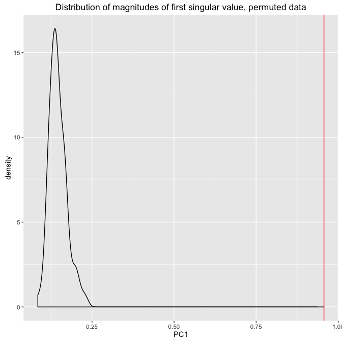
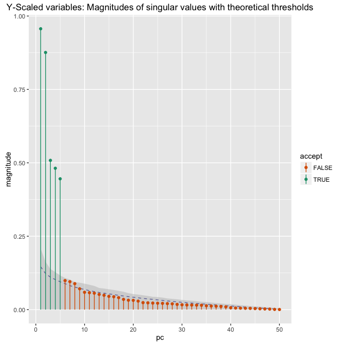
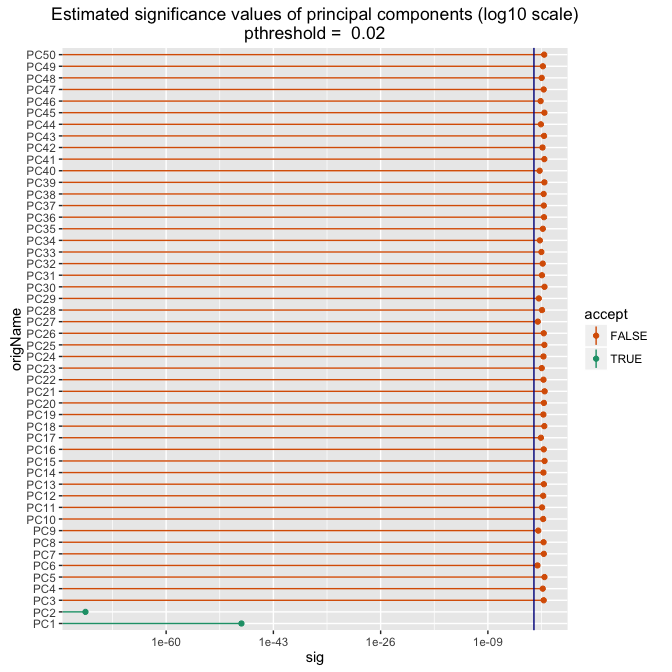

This article is by [Dr. Nina Zumel](http://www.win-vector.com/site/staff/nina-zumel/) of [Win-Vector LLC](http://www.win-vector.com/) and is hosted at: <http://www.win-vector.com/blog/2016/05/pcr_part3_pickk/>.

In our [previous note](http://www.win-vector.com/blog/2016/05/pcr_part2_yaware) we demonstrated *Y*-Aware PCA and other *y*-aware approaches to dimensionality reduction in a predictive modeling context, specifically Principal Components Regression (PCR). For our examples, we selected the appropriate number of principal components by eye. In this note, we will look at ways to select the appropriate number of principal components in a more automated fashion.

Before starting the discussion, let's quickly redo our *y*-aware PCA. Please refer to our [previous post](http://www.win-vector.com/blog/2016/05/pcr_part2_yaware) for a full discussion of this data set and this approach.

``` r
#
# make data
#
set.seed(23525)
dTrain <- mkData(1000)
dTest <- mkData(1000)

#
# design treatment plan
#
treatmentsN <- designTreatmentsN(dTrain,
                                 setdiff(colnames(dTrain),'y'),'y',
                                 verbose=FALSE)

#
# prepare the treated frames, with y-aware scaling
#
examplePruneSig = 1.0 
dTrainNTreatedYScaled <- prepare(treatmentsN,dTrain,
                                 pruneSig=examplePruneSig,scale=TRUE)
dTestNTreatedYScaled <- prepare(treatmentsN,dTest,
                                pruneSig=examplePruneSig,scale=TRUE)

#
# do the principal components analysis
#
vars <- setdiff(colnames(dTrainNTreatedYScaled),'y')
# prcomp defaults to scale. = FALSE, but we already 
# scaled/centered in vtreat- which we don't want to lose.
dmTrain <- as.matrix(dTrainNTreatedYScaled[,vars])
dmTest <- as.matrix(dTestNTreatedYScaled[,vars])
princ <- prcomp(dmTrain, center = FALSE, scale. = FALSE)
```

If we examine the magnitudes of the resulting singular values, we see that we should use from two to five principal components for our analysis. In fact, as we showed in the previous post, the first two singular values accurately capture the two unobservable processes that contribute to *y*, and a linear model fit to these two components captures most of the explainable variance in the data, both on training and on hold-out data.


We picked the number of principal components to use by eye; but it's tricky to implement code based on the strategy "look for a knee in the curve." So how might we automate picking the appropriate number of components in a reliable way?

*X*-Only Approaches
-------------------

Jackson (1993) and Peres-Neto, et.al. (2005) are two excellent surveys and evaluations of the different published approaches to picking the number of components in standard PCA. Those methods include:

1.  Look for a "knee in the curve" -- the approach we have taken, visually.
2.  *Only* for data that has been scaled to unit variance: keep the components corresponding to singular values greater than 1.
3.  Select enough components to cover some fixed fraction (generally 95%) of the observed variance. This is the approach taken by `caret::preProcess.`
4.  Perform a statistical test to see which singular values are larger than we would expect from an appropriate null hypothesis or noise process.

The papers also cover other approaches, as well as different variations of the above.

Kabakoff (*R In Action*, 2nd Edition, 2015) suggests comparing the magnitudes of the singular values to those extracted from random matrices of the same shape as the original data. Let's assume that the original data has *k* variables, and that PCA on the original data extracts the *k* singular values s<sub>i</sub> and the *k* principal components PC<sub>i</sub>.To pick the appropriate number of principal components:

1.  For a chosen number of iterations, *N* (choose *N* &gt;&gt; *k*):

-   Generate a random matrix of the correct size
-   Do PCA and extract the singular values

1.  Then for each of the *k* principal components:

-   Find the mean of the *i*th singular value, r<sub>i</sub>
-   If s<sub>i</sub> &gt; r<sub>i</sub>, then keep PC<sub>i</sub>

The idea is that if there is more variation in a given direction than you would expect at random, then that direction is probably meaningful. If you assume that higher variance directions are more useful than lower variance directions (the usual assumption), then one handy variation is to find the first *i* such that s<sub>i</sub> &lt; r<sub>i</sub>, and keep the first *i*-1 principal components.

This approach is similar to what the authors of the survey papers cited above refer to as the *broken-stick method*. In their research, the broken-stick method was among the best performing approaches for a variety of simulated and real-world examples.

With the proper adjustment, all of the above heuristics work as well in the *y*-adjusted case as they do with traditional *x*-only PCA.

A *Y*-Aware Approach: The Permutation Test
------------------------------------------

Since in our case we know *y*, we can -- and should -- take advantage of this information. We will use a variation of the broken-stick method, but rather than comparing our data to a random matrix, we will compare our data to alternative datasets where *x* has no relation to *y*. We can do this by randomly permuting the *y* values. This preserves the structure of *x* -- that is, the correlations and relationships of the *x* variables to each other -- but it changes the units of the problem, that is, the *y*-aware scaling. We are testing whether or not a given principal component appears more meaningful in a metric space induced by the true *y* than it does in a random metric space, one that preserves the distribution of *y*, but not the relationship of *y* to *x*.

You can read a more complete discussion of permutation tests and their application to variable selection (significance pruning) in [this post](http://www.win-vector.com/blog/2015/08/how-do-you-know-if-your-data-has-signal/).

In our example, we'll use *N*=100, and rather than using the means of the singular values from our experiments as the thresholds, we'll use the 98th percentiles. This represents a threshold value that is likely to be exceeded by a singular value induced in a random space only 1/(the number of variables) (1/50=0.02) fraction of the time.

``` r
#
# Resample y, do y-aware PCA, 
# and return the singular values
#
getResampledSV = function(data,yindices) {
  # resample y
  data$y = data$y[yindices]
  
  # treatment plan
  treatplan = vtreat::designTreatmentsN(data, 
                                setdiff(colnames(data), 'y'), 
                                'y', verbose=FALSE)
  # y-aware scaling
  dataTreat = vtreat::prepare(treatplan, data, pruneSig=1, scale=TRUE)
  
  # PCA
  vars = setdiff(colnames(dataTreat), 'y')
  dmat = as.matrix(dataTreat[,vars])
  princ = prcomp(dmat, center=FALSE, scale=FALSE)
  
  # return the magnitudes of the singular values
  princ$sdev
}

#
# Permute y, do y-aware PCA, 
# and return the singular values
#
getPermutedSV = function(data) {
  n = nrow(data)
  getResampledSV(data,sample(n,n,replace=FALSE))
}

#
# Run the permutation tests and collect the outcomes
#
niter = 100 # should be >> nvars
nvars = ncol(dTrain)-1
# matrix: 1 column for each iter, nvars rows
svmat = vapply(1:niter, FUN=function(i) {getPermutedSV(dTrain)}, numeric(nvars))
rownames(svmat) = colnames(princ$rotation) # rows are principal components
colnames(svmat) = paste0('rep',1:niter) # each col is an iteration

# plot the distribution of values for the first singular value
# compare it to the actual first singular value
ggplot(as.data.frame(t(svmat)), aes(x=PC1)) + 
  geom_density() + geom_vline(xintercept=princ$sdev[[1]], color="red") +
  ggtitle("Distribution of magnitudes of first singular value, permuted data")
```



Here we show the distribution of the magnitude of the first singular value on the permuted data, and compare it to the magnitude of the actual first singular value (the red vertical line). We see that the actual first singular value is far larger than the magnitude you would expect from data where *x* is not related to *y*. Let's compare all the singular values to their permutation test thresholds. The dashed line is the mean value of each singular value from the permutation tests; the shaded area represents the 98th percentile.

``` r
# transpose svmat so we get one column for every principal component
# Get the mean and empirical confidence level of every singular value
as.data.frame(t(svmat)) %>% dplyr::summarize_each(funs(mean)) %>% as.numeric() -> pmean
confF <- function(x) as.numeric(quantile(x,1-1/nvars))
as.data.frame(t(svmat)) %>% dplyr::summarize_each(funs(confF)) %>% as.numeric() -> pupper

pdata = data.frame(pc=seq_len(length(pmean)), magnitude=pmean, upper=pupper)

# we will use the first place where the singular value falls 
# below its threshold as the cutoff.
# Obviously there are multiple comparison issues on such a stopping rule,
# but for this example the signal is so strong we can ignore them.
below = which(princ$sdev < pdata$upper)
lastSV = below[[1]] - 1
```



This test suggests that we should use 5 principal components, which is consistent with what our eye sees. This is perhaps not the "correct" knee in the graph, but it is undoubtably a knee.

### Bootstrapping

Empirically estimating the quantiles from the permuted data so that we can threshold the non-informative singular values will have some undesirable bias and variance, especially if we do not perform enough experiment replications. This suggests that instead of estimating quantiles ad-hoc, we should use a systematic method: The Bootstrap. Bootstrap replication breaks the input to output association by re-sampling with replacement rather than using permutation, but comes with built-in methods to estimate bias-adjusted confidence intervals. The methods are fairly technical, and on this dataset the results are similar, so we don't show them here, although the code is available in the [R markdown document used to produce this note](https://github.com/WinVector/Examples/blob/master/PCR/YAwarePCR_pickK.Rmd).

Significance Pruning
--------------------

Alternatively, we can treat the principal components that we extracted via *y*-aware PCA simply as transformed variables -- which is what they are -- and significance prune them in the standard way. As our [article on significance pruning](http://www.win-vector.com/blog/2015/08/how-do-you-know-if-your-data-has-signal/) discusses, we can estimate the significance of a variable by fitting a one variable model (in this case, a linear regression) and looking at that model's significance value. You can pick the pruning threshold by considering the rate of false positives that you are willing to tolerate; as a rule of thumb, we suggest one over the number of variables.

In regular significance pruning, you would take any variable with estimated significance value lower than the threshold. Since in the PCR situation we presume that the variables are ordered from most to least useful, you can again look for the first position *i* where the variable appears insignificant, and use the first *i*-1 variables.

We'll use `vtreat` to get the significance estimates for the principal components. We'll use one over the number of variables (1/50 = 0.02) as the pruning threshold.

``` r
# get all the principal components
# not really a projection as we took all components!
projectedTrain <- as.data.frame(predict(princ,dTrainNTreatedYScaled),
                                 stringsAsFactors = FALSE)
vars = colnames(projectedTrain)
projectedTrain$y = dTrainNTreatedYScaled$y

# designing the treatment plan for the transformed data
# produces a data frame of estimated significances
tplan = designTreatmentsN(projectedTrain, vars, 'y', verbose=FALSE)

threshold = 1/length(vars)
scoreFrame = tplan$scoreFrame
scoreFrame$accept = scoreFrame$sig < threshold

# pick the number of variables in the standard way:
# the number of variables that pass the significance prune
nPC = sum(scoreFrame$accept)
```



Significance pruning picks 2 principal components, again consistent with our visual assessment. This time, we picked the correct knee: as we saw in the previous post, the first two principal components were sufficient to describe the explainable structure of the problem.

Conclusion
----------

Since one of the purposes of PCR/PCA is to discover the underlying structure in the data, it's generally useful to examine the singular values and the variable loadings on the principal components. However an analysis should also be repeatable, and hence, automatable, and it's not straightforward to automate something as vague as "look for a knee in the curve" when selecting the number of principal components to use. We've covered two ways to programatically select the appropriate number of principal components in a predictive modeling context.

To conclude this entire series, here is our recommended best practice for principal components regression:

1.  Significance prune the candidate input variables.
2.  Perform a Y-Aware principal components analysis.
3.  Significance prune the resulting principal components.
4.  Regress.

Thanks to [Cyril Pernet](https://plus.google.com/+CyrilPernet), who blogs at [*NeuroImaging and Statistics*](http://neurostatscyrilpernet.blogspot.co.uk/), for requesting this follow-up post and pointing us to the Jackson reference.

### References

-   Jackson, Donald A. "Stopping Rules in Principal Components Analysis: A Comparison of Heuristical and Statistical Approaches", *Ecology* Vol 74, no. 8, 1993.

-   Kabacoff, Robert I. *R In Action*, 2nd edition, Manning, 2015.

-   Efron, Bradley and Robert J. Tibshirani. *An Introduction to the Bootstrap*, Chapman and Hall/CRC, 1998.

-   Peres-Neto, Pedro, Donald A. Jackson and Keith M. Somers. "How many principal components? Stopping rules for determining the number of non-trivial axes revisited", *Computational Statistics & Data Analysis*, Vol 49, no. 4, 2005.
