ROC\_patch
================
John Mount, Win Vector LLC

## Introduction

Suppose we are working on a classification application where we need a
classificaiton rule with a low false positive rate and decent
sensitivity. Examples might include deciding which sales leads to follow
up on first in a population where most leads are not worth following up
on. We might want this due to asymmetric false-positive and
false-negative costs, or due to very unbalanced population prevalence.

Further suppose our initial modeling effort “seemed good to the data
scientist.” They got an okay value for the abstract scoring model metric
they were using: the [AUC (area under the
curve)](https://en.wikipedia.org/wiki/Receiver_operating_characteristic#Area_under_the_curve).
Notice this metric does not incorporate our stated goal\!

Let’s work an example where we have multiple modes with similar AUCs,
and we want to combine them into a model that meets our business goals.
Please keep in mind, *insisting* on using the ROC/AUC instead of
business utility metrics may be detriment; for how to work effectively
see [Nina Zumel’s article “Squeezing the Most Utility from Your
Models”](https://win-vector.com/2020/10/05/squeezing-the-most-utility-from-your-models/).
But, for fun, let’s work through how to work on the ROC graph, how to
patch it or perform graph surgery on it.

## An Example

Let’s set up just such an example in [R](https://www.r-project.org).

First we attach our packages.

``` r
library(ggplot2)
library(wrapr)
library(sigr)
library(WVPlots)
library(cdata)
```

Define our data generator function, which we will use to simply
*simulate* the kind of results our data scientist is seeing.

``` r
set.seed(2020)

y_example <- function(n, prevalence = 0.5) {
  data.frame(
    y = sample(
      c(TRUE, FALSE), 
      size = n, 
      replace = TRUE,
      prob = c(prevalence, 1 - prevalence))
  )
}

beta_variable <- function(
  d, 
  shape1_pos, shape2_pos, 
  shape1_neg, shape2_neg) {
  score <- numeric(nrow(d))
  score[d$y] <- rbeta(sum(d$y), shape1 = shape1_pos, shape2 = shape2_pos)
  score[!d$y] <- rbeta(sum(!d$y), shape1 = shape1_neg, shape2 = shape2_neg)
  score
}
```

We then generate some synthetic example data.

``` r
d <- y_example(10000, prevalence = 0.01)

d$original_model <- beta_variable(
  d,
  shape1_pos = 6, 
  shape2_pos = 6,
  shape1_neg = 1, 
  shape2_neg = 2)
```

And now we take the deliberately careless step of only looking at an
abstract model summary that does not incorporate our earlier stated
business need (a high specificity, moderate sensitivity model). For
early comparison models AUC is a useful metric, as it de-couples the
model performance from the business needs. For final screening and
tuning, it is much better to use business utility which incorpartes the
business requirements.

``` r
original_auc <- sigr::calcAUC(modelPredictions = d$original_model, yValues = d$y)

original_auc
```

    ## [1] 0.7268528

This AUC isn’t great, and isn’t bad. It all depends on the application,
which we have ignored up to now.

Let’s now look at the more detailed distribution of model scores both
for known valuable accounts and known non-valuable accounts. I.e. lets
plot the distribution of the prediction conditioned on what it is trying
to predict.

``` r
DoubleDensityPlot(
  d,
  xvar = 'original_model',
  truthVar = 'y',
  truth_target = TRUE,
  title = "original model scores conditioned by outcome")
```

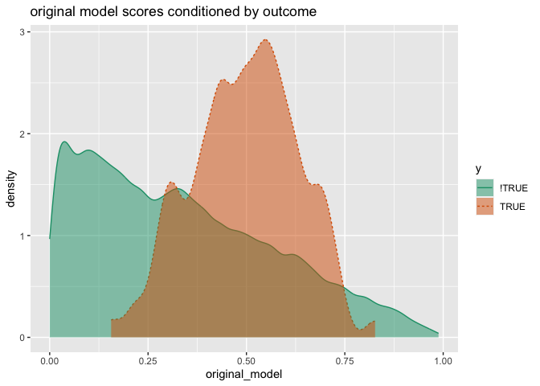<!-- -->

This is starting to look bad. What we see is: the model seems to have
some understanding of possibly valuable accounts. The high value
accounts have their scores somewhat concentrated near 0.5 (the orange
shaded curve). The model has a poor understand of non-valuable accounts.
These accounts have model scores all over the map. In fact the
non-valuable accounts put more probability mass at high scores near 1
than the valuable accounts do\! This is exactly what we don’t want if we
want high specificity from our model.

Let’s take a look at the [ROC (receiver operating
characteristic)](https://en.wikipedia.org/wiki/Receiver_operating_characteristic)
plot that summarized the information in the above double density plot.

``` r
ROCPlot(
  d,
  xvar = 'original_model',
  truthVar = 'y',
  truthTarget = TRUE,
  title = "Example where scores are beta-distributed (d1)")
```

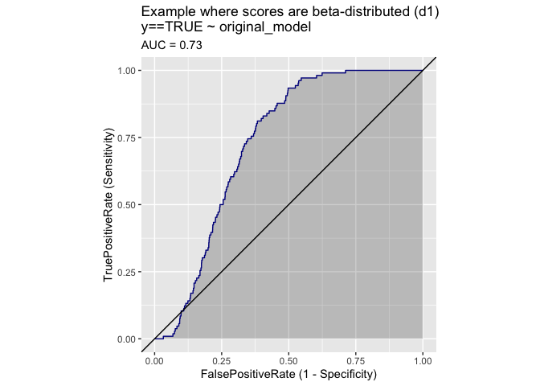<!-- -->

A high specificity application uses the model score in some region on
the very left of the graph. But the model has almost no sensitivity
there. Taking the items the model is most excited about brings only so
many non-valuable accounts that the model is worse than random guessing
until we get far enough right that the curve crosses the drawn diagonal.
This is at a specificity of around 0.1, so we would have to interact
with about 10% of the non-valuable accounts to start getting a benefit
from this model. This may be more accounts than we can work with, as we
probably asked for a high specificity model for serious reasons.

Also note: this ROC plot (and many others in this note) is non-convex
(or “improper” in the terminology of James P. Egan, *Signal Detection
Theory and ROC Analysis*, Academic Press, 1975). It doesn’t make sense
to operate with any classification rule that isn’t on the surface of the
convex hull of the ROC plot. In this case, it means that attempting to
ask this model for a false positive rate below `0.1` is a mistake- you
would do better guessing (the guess actually being picking two
classification rules outside the non-convex dip and flipping a weighted
coin as to which classification rule to use on each example, i.e. a
“mixed strategy” will dominate the classification rules in this
region). This is a problem as we want to operate at a low false positive
rate due to the low prevalence of the positive class\!

## The Solution in Practice

Now lets say by some magic (probably finding new and different
variables\!) the data scientist builds a new model with a similar AUC
but behavior more useful to our declared application. With some luck new
model might look like the following.

``` r
d$new_model <- beta_variable(
  d,
  shape1_pos = 2, 
  shape2_pos = 1,
  shape1_neg = 6, 
  shape2_neg = 6)
```

``` r
sigr::calcAUC(modelPredictions = d$new_model, yValues = d$y)
```

    ## [1] 0.7303121

This model is the mirror image of our original on the double density
plot.

``` r
DoubleDensityPlot(
  d,
  xvar = 'new_model',
  truthVar = 'y',
  truth_target = TRUE,
  title = "new model")
```

<!-- -->

And the mirror image on the ROC plot.

``` r
ROCPlotPair(
  d,
  xvar1 = 'original_model',
  xvar2 = 'new_model',
  truthVar = 'y',
  truthTarget = TRUE,
  title = 'comparison')
```

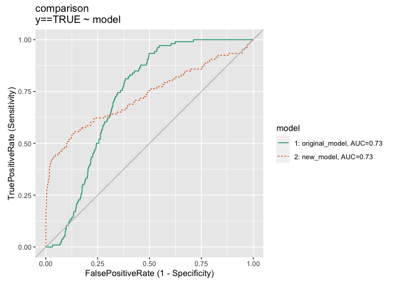<!-- -->

This model has not better AUC, but is drastily better for our
application. At this point we are pretty much done, the new model is
better in the region we are likely to operate it. That is the only
criteria that matters to the actual business case.

## An Extra Question

However, one wonders if one can have ones cake and eat it to. Can we get
a third model that is good in all the places that either of these models
is good? This situation is unusual, usually a better model dominates
earlier models for most of the ROC curve. But let’s suppose we have this
problem and see what we can do.

### Averaging

Obvious methods of combining more than one model include nested models,
ensemble methods, bagging, stacking, super-learning, boosting, and more.
For this simple problem we can simulate many of these simply through a
weighted average. If the model synthesizer is not informed of our
asymmetric value of false-positives versus false-negatives or of our
concerns of class prevalence, then a mid-point average is a likely
composite model candidate. Let’s take a look at this new model.

``` r
d$mid_model <- (d$original_model + d$new_model)/2

ROCPlotList(
  d,
  xvar_names = qc(original_model, new_model, mid_model),
  truthVar = 'y',
  truthTarget = TRUE,
  title = 'comparison to evenly averaging the models') 
```

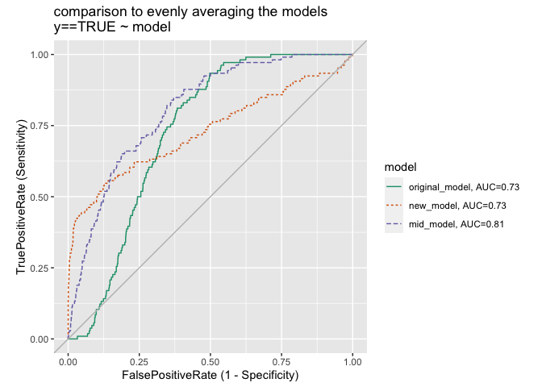<!-- -->

That actually looks pretty good, and even increased our abstract model
score: the AUC.

Weighted averaging lets us even try to impose some of our actual
business goal.

``` r
d$two_thirds_model <- (d$original_model + 2*d$new_model)/3

ROCPlotList(
  d,
  xvar_names = qc(original_model, new_model, mid_model, two_thirds_model),
  truthVar = 'y',
  truthTarget = TRUE,
  title = 'comparison to one-sided averaging the models') 
```

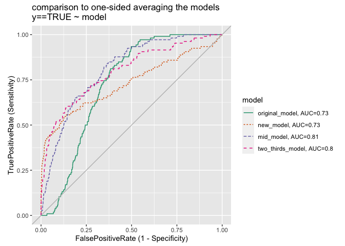<!-- -->

The actually helps a lot, and probably isn’t a bad strategy. Though we
are still losing some left-side performance relative to the new model.

To really see this we need a plot that concentrates on the performance
of the model in that region. The lift curve plot is well suited to the
task. The lift-curve is a re-scaling of the gain curve that shows how
much richer in the target class initial segments of the data are when
sorted by model scores. These graphs topics we teach in our [data
science intensive](https://win-vector.com/training-overview/).

``` r
LiftCurvePlotList(
  d,
  xvars = c('new_model', 'two_thirds_model'),
  truthVar = 'y',
  title = 'lift curves of two models') +
  xlim(0, 0.02)
```

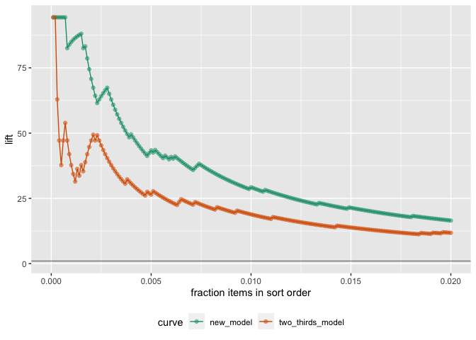<!-- -->

In this plot the y-axis “lift” is how much richer an initial segment of
selections by a given model is than the base prevalence. What we are
looking for is the performance of the model on the left, where we have
only taken the model’s highest predictions. Notice the curve for the
2/3rds mixture model is not as high as the one for the new model in the
first 1 percent of the data (as sorted in decreasing order by each
model). The 2/3rds mixture model is giving up performance right where we
claimed we wanted it.

### Direct Surgery on the ROC Plot

Up to now we have ignored using ideas from sensor fusion to combine the
models, i.e. can we make the model combination depend on the model
predictions per-row and not just be some constant-weight combination or
average.

And, as an abstract question: is it possible to build a composite model
that is *exactly* the new model on the far left, and something
reasonable the rest of the graph?

The answer is yes, we can sensor-fuse the models in a data aware manner
that lets the new model completely own the left side of the graph.

Our idea is:

  - Get the models into a common coordinate system. Right now each
    model’s scores could, in principle, be on completely different
    scales. For our coordinate system we will use the angle from the
    lower-right corner of the graph.
  - Pick a cut-over angle that the new model owns. In this case it is:
    if either model scores counter-clockwise of our cut-off angle then
    the new model score is used, otherwise the original model is used.
    This means *only* the new model is scoring items that work to the
    left side of the ROC plot.
  - Implement all of this and see what we get.

#### Implementing the Model Cross-Over Method

Here we get the two models ROC plots into a shared angle system.

``` r
build_score_to_angle_map <- function(x, y) {
  roc <- build_ROC_curve(x, y)
  roc$angle <-  atan2(y = roc$Sensitivity, x = -roc$Specificity)
  roc$length <- sqrt(roc$Sensitivity^2 + roc$Specificity^2)
  score_to_angle_fn <- suppressWarnings(approxfun(
    x = roc$Score,
    y = roc$angle,
    yleft = 0,
    yright = 1))
  angle_to_length_fn <- suppressWarnings(approxfun(
    x = roc$angle,
    y = roc$length,
    yleft = 0,
    yright = 1))
  list(roc = roc,
       score_to_angle_fn = score_to_angle_fn,
       angle_to_length_fn = angle_to_length_fn)
}

unpack[
  score_to_angle_original = score_to_angle_fn,
  angle_to_length_original = angle_to_length_fn,
  roc_original = roc] <- build_score_to_angle_map(d$original_model, d$y)

d$angle_original <- score_to_angle_original(d$original_model)

unpack[
  score_to_angle_new = score_to_angle_fn,
  angle_to_length_new = angle_to_length_fn,
  roc_new = roc] <- build_score_to_angle_map(d$new_model, d$y)

d$angle_new <- score_to_angle_new(d$new_model)
```

We can take a look at the ROC plots in this angle (and length) system.
We are writing larger angles on the left, as we are in the top half of
an angle system- so we are sweeping to the left as angle increases.

``` r
joint_angles <- data.frame(
  angle = seq(pi/2, pi, 0.01)
)

joint_angles$length_original <- angle_to_length_original(joint_angles$angle)
joint_angles$length_new <- angle_to_length_new(joint_angles$angle)

joint_plot <- pivot_to_blocks(
  data = joint_angles,
  nameForNewKeyColumn = 'model',
  nameForNewValueColumn = 'length',
  columnsToTakeFrom = qc(length_original, length_new))

ggplot(
  data = joint_plot,
  mapping = aes(x = angle, y = length, color = model)) +
  geom_line() + 
  scale_color_brewer(palette = "Dark2") +
  scale_x_reverse() +
  ggtitle("length as a function of angle") 
```

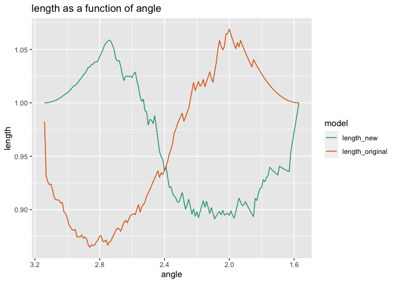<!-- -->

In the above we see the same thing we saw when we first compared the ROC
plots: the new model is dominating the old model to the left of some
cross-over. This time the cross-over is in angle coordinates instead of
1-Specificity coordinates.

We pick our switch over-angle as the smallest (right-most) angle where
our new model dominates the old model.

``` r
cut_angle <- joint_angles$angle[[min(which(joint_angles$length_new > joint_angles$length_original))]]
cut_angle
```

    ## [1] 2.410796

Let’s plot the cross-over angle as a ray in the joint ROC plot.

``` r
angle_frame <- data.frame(
  Specificity = c(0, -cos(cut_angle)),
  Sensitivity = c(0, sin(cut_angle)))
angle_frame <- angle_frame/max(angle_frame)

ROCPlotPair(
  d,
  xvar1 = 'original_model',
  xvar2 = 'new_model',
  truthVar = 'y',
  truthTarget = TRUE,
  title = 'comparison with cross-over') + 
  geom_line(
    mapping = aes(x = 1 - Specificity, y = Sensitivity),
    data = angle_frame)
```

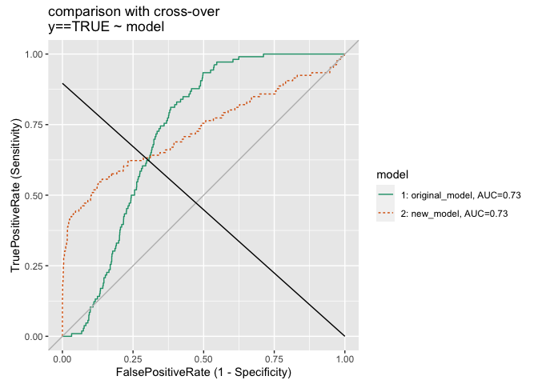<!-- -->

So our rule is then: if *either* model’s prediction is above a value
that would exceed the cut-angle we use the new model, as we want the new
model to own that region of the curve. Otherwise we use the original
model.

This can be implemented as follows.

``` r
d$composite_model <- ifelse(
  (d$angle_original >= cut_angle) | (d$angle_new >= cut_angle),
  d$new_model,
  d$original_model)
```

This rule may seem a bit strange, but it guarantees that all of the
points that are counter-clockwise are *exactly* the same set of examples
that the new model would have put there. This can be see if we take
cases. The only case where the new model doesn’t make the decision is
when we have both angle\_original\<cut\_angle and
angle\_new\<cut\_angle, but in this case the original also placed the
example clockwise of the cut, the same decision the new model would have
made.

#### The Model Surgery Result

And here is our new composite model’s ROC plot.

``` r
ROCPlot(
  d,
  xvar = 'composite_model',
  truthVar = 'y',
  truthTarget = TRUE,
  title = 'composite model') + 
  geom_line(
    mapping = aes(x = 1 - Specificity, y = Sensitivity),
    data = angle_frame)
```

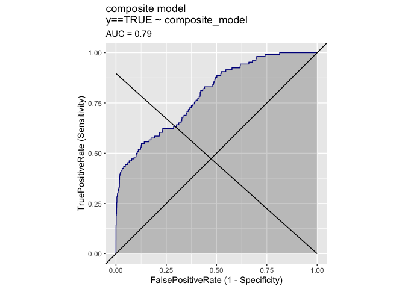<!-- -->

#### Comparing the Results

Let’s compare that to our first two models.

``` r
ROCPlotList(
  d,
  xvar_names = qc(original_model, new_model, composite_model),
  truthVar = 'y',
  truthTarget = TRUE,
  title = 'composite versus original models') + 
  geom_line(
    mapping = aes(x = 1 - Specificity, y = Sensitivity),
    data = angle_frame)
```

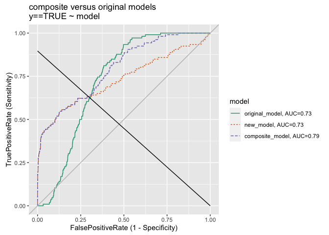<!-- -->

And we have achieved our goal: the new composite model is exactly the
new model counter-clockwise to the cut and a reasonable compromise on
the other side.

Or, comparing to the 2/3rds model.

``` r
ROCPlotList(
  d,
  xvar_names = qc(two_thirds_model, composite_model),
  truthVar = 'y',
  truthTarget = TRUE,
  title = 'composite versus original models') + 
  geom_line(
    mapping = aes(x = 1 - Specificity, y = Sensitivity),
    data = angle_frame)
```

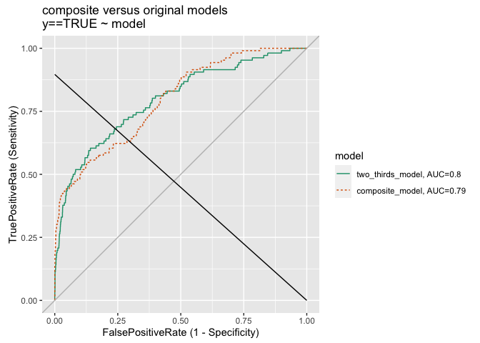<!-- -->

Notice the composite model is better on both ends (where many tasks
are), though worse in the middle.

And, let’s compare our composite model to our other combined models.

``` r
LiftCurvePlotList(
  d,
  xvars = qc(new_model, composite_model, two_thirds_model),
  truthVar = 'y',
  title = 'lift curves of a few of the models') +
  xlim(0, 0.02)
```

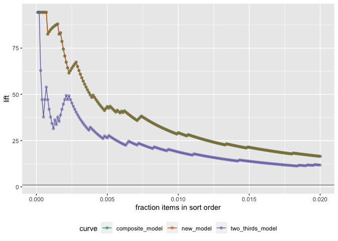<!-- -->

Notice in this case the composite model is as good as the new model was
in the region of interest.

## Conclusion

The point is: AUC is a summary of how a score might be converted into
different classification rules at different thresholds. Usually our
application needs good classification rules at one of the ends of the
ROC plot, so much of the area can be irrelevant.

And there we have it: directly patching the ROC plot.
