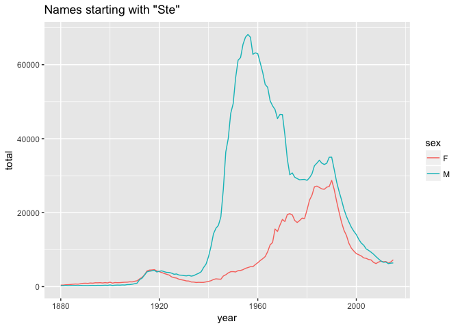
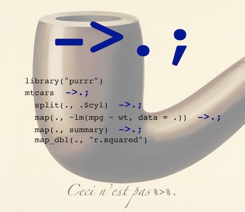

<!-- README.md is generated from README.Rmd. Please edit that file -->
"Bizarro Pipe" is a debugging tool for long `dplyr` pipelines. It is simply the idea that the glyph `->.;` behaves like an eager replacement for the `magrittr` pipe `%>%` and makes single step debugging much easier.

Here is a typical example using the `magrittr` and `dplyr` (from [here](https://www.r-statistics.com/2014/08/simpler-r-coding-with-pipes-the-present-and-future-of-the-magrittr-package/)):

``` r
library("babynames") # data package
library("dplyr")     # provides data manipulating functions.
```

    ## 
    ## Attaching package: 'dplyr'

    ## The following objects are masked from 'package:stats':
    ## 
    ##     filter, lag

    ## The following objects are masked from 'package:base':
    ## 
    ##     intersect, setdiff, setequal, union

``` r
library("magrittr")  # ceci n'est pas un pipe
library("ggplot2")   # for graphics

babynames %>%
    filter(name %>% substr(1, 3) %>% equals("Ste")) %>%
    group_by(year, sex) %>%
    summarize(total = sum(n)) %>%
    qplot(year, total, color = sex, data = ., geom = "line") %>%
    add(ggtitle('Names starting with "Ste"')) %>%
    print
```


To write the same pipeline using "Bizarro Pipe" we must make all the uses of first argument explicit with an extra "dot notation" in all of the "outer pipeline" (not actually a bad practice in terms of readability). By "outer pipes" we mean `magrittr` pipes that are in the outer pipeline and not inside the argument of an operator (i.e., not as with the "`name %>% substr(1, 3) %>% equals("Ste")`" inner pipeline).

``` r
babynames %>%
    filter(.,  name %>% substr(1, 3) %>% equals("Ste") ) %>%
    group_by(., year, sex) %>%
    summarize(., total = sum(n)) %>%
    qplot(year, total, color = sex, data = ., geom = "line") %>%
    add(., ggtitle('Names starting with "Ste"')) %>%
    print(.)
```

And then we convert all outer pipes (`%>%`) to Bizarro form (`->.;`) by a simple search and replace.

``` r
babynames ->.;
    filter(.,  name %>% substr(1, 3) %>% equals("Ste") ) ->.;
    group_by(., year, sex) ->.;
    summarize(., total = sum(n)) ->.;
    qplot(year, total, color = sex, data = ., geom = "line") ->.;
    add(., ggtitle('Names starting with "Ste"')) ->.;
    print(.)
```



This above form is now single step or per-line debuggable. We can step through each stage of the outer pipeline and examine the contents of "`.`" after each step (either by printing "`.`" or by using `RStudio` with `RStudio -> Preferences -> General -> "Show .Last.value in environment listing"` checked). We have a free video of the technique in action [here](https://youtu.be/7Xifeq3-FGU?list=PLAKBwakacHbQT51nPHex1on3YNCCmggZA).

It is a little disappointing we can't replace the inner or sub-expression pipes with Bizarro Pipe; but they are part of an expression that is captured for row-wise execution in the `filter` and not something we could step through in the context of the outer pipeline anyway.

Also note: while we can think of `->.;` as an eager operator we may need to force computation of a lazy structure (such as a `tbl`) by printing "`.`".

Overall the trick is to train your eye to see `->.;` as an atomic or indivisible glyph (with superhero logo).


The following image illustrates a pipeline (taken from [here](https://blog.rstudio.org/2015/09/29/purrr-0-1-0/)) without `magrittr` or `dplyr` (using only `purrr` verbs and Bizarro Pipe).


