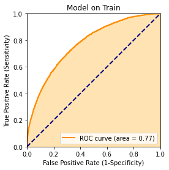
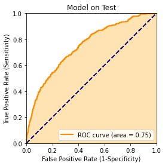
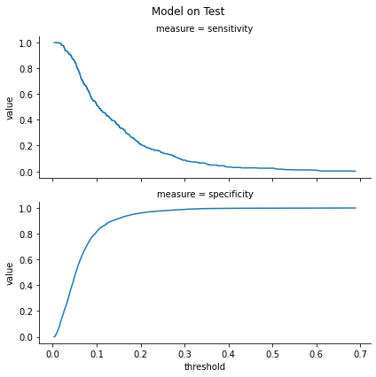
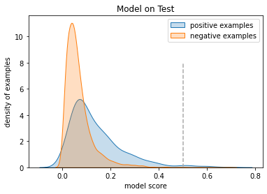
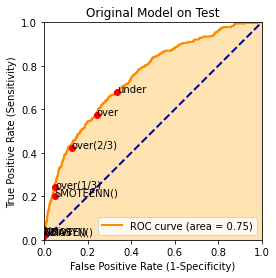
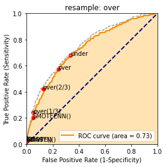
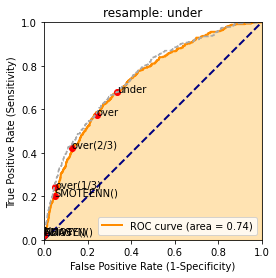
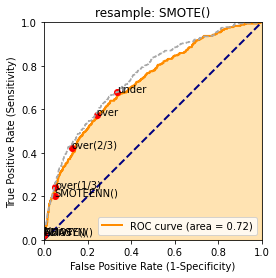
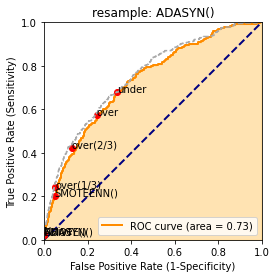
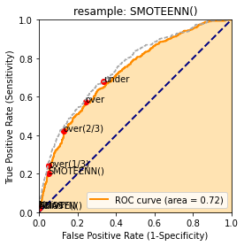

This is an supervised classification example taken from the KDD 2009 cup.  A copy of the data and details can be found here: [https://github.com/WinVector/PDSwR2/tree/master/KDD2009](https://github.com/WinVector/PDSwR2/tree/master/KDD2009).  The problem was to predict account cancellation ("churn") from very messy data (column names not given, numeric and categorical variables, many missing values, some categorical variables with a large number of possible levels).  In this example we show how to quickly use `vtreat` to prepare the data for modeling.  `vtreat` takes in `Pandas` `DataFrame`s and returns both a treatment plan and a clean `Pandas` `DataFrame` ready for modeling.

The results shown here are for only one data set, one modeling method, and one family of hyper-parameters, and mild imbalance. However, the results are typical of what we see in production: once one builds probability models and looks closely, resampling is less attractive and may be a ritual instead of a useful tool.

Load our packages/modules.


```python
import pandas
import xgboost
import vtreat
import vtreat.cross_plan
import numpy.random
import wvpy.util
import scipy.sparse
import sklearn.metrics
import matplotlib
# https://imbalanced-learn.org/stable/over_sampling.html
import imblearn.over_sampling
```

Read in explanatory variables.


```python
# data from https://github.com/WinVector/PDSwR2/tree/master/KDD2009
dir = "../../PracticalDataScienceWithR2nd/PDSwR2/KDD2009/"
d = pandas.read_csv(dir + 'orange_small_train.data.gz', sep='\t', header=0)
vars = [c for c in d.columns]
d.shape
```


    (50000, 230)


Read in dependent variable we are trying to predict.


```python
churn = pandas.read_csv(dir + 'orange_small_train_churn.labels.txt', header=None)
churn.columns = ["churn"]
churn.shape
```


    (50000, 1)


```python
churn["churn"].value_counts()
```


    -1    46328
     1     3672
    Name: churn, dtype: int64


Arrange test/train split.


```python
numpy.random.seed(2020)
n = d.shape[0]
# https://github.com/WinVector/pyvtreat/blob/master/Examples/CustomizedCrossPlan/CustomizedCrossPlan.md
split1 = vtreat.cross_plan.KWayCrossPlanYStratified().split_plan(n_rows=n, k_folds=10, y=churn.iloc[:, 0])
train_idx = set(split1[0]['train'])
is_train = [i in train_idx for i in range(n)]
is_test = numpy.logical_not(is_train)
```

(The reported performance runs of this example were sensitive to the prevalance of the churn variable in the test set, we are cutting down on this source of evaluation variarance by using the stratified split.)


```python
d_train = d.loc[is_train, :].copy()
d_train.reset_index(inplace=True, drop=True)
churn_train = numpy.asarray(churn.loc[is_train, :]["churn"]==1)
d_test = d.loc[is_test, :].copy()
d_test.reset_index(inplace=True, drop=True)
churn_test = numpy.asarray(churn.loc[is_test, :]["churn"]==1)
```

Take a look at the dependent variables.  They are a mess, many missing values.  Categorical variables that can not be directly used without some re-encoding.


```python
d_train.head()
```


<div>
<style scoped>
    .dataframe tbody tr th:only-of-type {
        vertical-align: middle;
    }

    .dataframe tbody tr th {
        vertical-align: top;
    }

    .dataframe thead th {
        text-align: right;
    }
</style>
<table border="1" class="dataframe">
  <thead>
    <tr style="text-align: right;">
      <th></th>
      <th>Var1</th>
      <th>Var2</th>
      <th>Var3</th>
      <th>Var4</th>
      <th>Var5</th>
      <th>Var6</th>
      <th>Var7</th>
      <th>Var8</th>
      <th>Var9</th>
      <th>Var10</th>
      <th>...</th>
      <th>Var221</th>
      <th>Var222</th>
      <th>Var223</th>
      <th>Var224</th>
      <th>Var225</th>
      <th>Var226</th>
      <th>Var227</th>
      <th>Var228</th>
      <th>Var229</th>
      <th>Var230</th>
    </tr>
  </thead>
  <tbody>
    <tr>
      <th>0</th>
      <td>NaN</td>
      <td>NaN</td>
      <td>NaN</td>
      <td>NaN</td>
      <td>NaN</td>
      <td>1526.0</td>
      <td>7.0</td>
      <td>NaN</td>
      <td>NaN</td>
      <td>NaN</td>
      <td>...</td>
      <td>oslk</td>
      <td>fXVEsaq</td>
      <td>jySVZNlOJy</td>
      <td>NaN</td>
      <td>NaN</td>
      <td>xb3V</td>
      <td>RAYp</td>
      <td>F2FyR07IdsN7I</td>
      <td>NaN</td>
      <td>NaN</td>
    </tr>
    <tr>
      <th>1</th>
      <td>NaN</td>
      <td>NaN</td>
      <td>NaN</td>
      <td>NaN</td>
      <td>NaN</td>
      <td>525.0</td>
      <td>0.0</td>
      <td>NaN</td>
      <td>NaN</td>
      <td>NaN</td>
      <td>...</td>
      <td>oslk</td>
      <td>2Kb5FSF</td>
      <td>LM8l689qOp</td>
      <td>NaN</td>
      <td>NaN</td>
      <td>fKCe</td>
      <td>RAYp</td>
      <td>F2FyR07IdsN7I</td>
      <td>NaN</td>
      <td>NaN</td>
    </tr>
    <tr>
      <th>2</th>
      <td>NaN</td>
      <td>NaN</td>
      <td>NaN</td>
      <td>NaN</td>
      <td>NaN</td>
      <td>5236.0</td>
      <td>7.0</td>
      <td>NaN</td>
      <td>NaN</td>
      <td>NaN</td>
      <td>...</td>
      <td>Al6ZaUT</td>
      <td>NKv4yOc</td>
      <td>jySVZNlOJy</td>
      <td>NaN</td>
      <td>kG3k</td>
      <td>Qu4f</td>
      <td>02N6s8f</td>
      <td>ib5G6X1eUxUn6</td>
      <td>am7c</td>
      <td>NaN</td>
    </tr>
    <tr>
      <th>3</th>
      <td>NaN</td>
      <td>NaN</td>
      <td>NaN</td>
      <td>NaN</td>
      <td>NaN</td>
      <td>1029.0</td>
      <td>7.0</td>
      <td>NaN</td>
      <td>NaN</td>
      <td>NaN</td>
      <td>...</td>
      <td>oslk</td>
      <td>1J2cvxe</td>
      <td>LM8l689qOp</td>
      <td>NaN</td>
      <td>kG3k</td>
      <td>FSa2</td>
      <td>RAYp</td>
      <td>F2FyR07IdsN7I</td>
      <td>mj86</td>
      <td>NaN</td>
    </tr>
    <tr>
      <th>4</th>
      <td>NaN</td>
      <td>NaN</td>
      <td>NaN</td>
      <td>NaN</td>
      <td>NaN</td>
      <td>658.0</td>
      <td>7.0</td>
      <td>NaN</td>
      <td>NaN</td>
      <td>NaN</td>
      <td>...</td>
      <td>zCkv</td>
      <td>QqVuch3</td>
      <td>LM8l689qOp</td>
      <td>NaN</td>
      <td>NaN</td>
      <td>Qcbd</td>
      <td>02N6s8f</td>
      <td>Zy3gnGM</td>
      <td>am7c</td>
      <td>NaN</td>
    </tr>
  </tbody>
</table>
<p>5 rows × 230 columns</p>
</div>


```python
d_train.shape
```


    (45000, 230)


Let's quickly prepare a data frame with none of these issues.

We start by building our treatment plan, this has the `sklearn.pipeline.Pipeline` interfaces.


```python
plan = vtreat.BinomialOutcomeTreatment(
    outcome_target=True,
    params=vtreat.vtreat_parameters({
        'filter_to_recommended': True,
        'sparse_indicators': False
    }))
```

Use `.fit_transform()` to get a special copy of the treated training data that has cross-validated mitigations againsst nested model bias. We call this a "cross frame." `.fit_transform()` is deliberately a different `DataFrame` than what would be returned by `.fit().transform()` (the `.fit().transform()` would damage the modeling effort due nested model bias, the `.fit_transform()` "cross frame" uses cross-validation techniques similar to "stacking" to mitigate these issues).


```python
cross_frame = plan.fit_transform(d_train, churn_train)
```

Take a look at the new data.  This frame is guaranteed to be all numeric with no missing values, with the rows in the same order as the training data.


```python
cross_frame.head()
```


<div>
<style scoped>
    .dataframe tbody tr th:only-of-type {
        vertical-align: middle;
    }

    .dataframe tbody tr th {
        vertical-align: top;
    }

    .dataframe thead th {
        text-align: right;
    }
</style>
<table border="1" class="dataframe">
  <thead>
    <tr style="text-align: right;">
      <th></th>
      <th>Var84_is_bad</th>
      <th>Var49_is_bad</th>
      <th>Var7_is_bad</th>
      <th>Var38_is_bad</th>
      <th>Var44_is_bad</th>
      <th>Var201_is_bad</th>
      <th>Var184_is_bad</th>
      <th>Var183_is_bad</th>
      <th>Var75_is_bad</th>
      <th>Var150_is_bad</th>
      <th>...</th>
      <th>Var227_lev_nIGXDli</th>
      <th>Var197_prevalence_code</th>
      <th>Var217_prevalence_code</th>
      <th>Var200_logit_code</th>
      <th>Var200_prevalence_code</th>
      <th>Var200_lev__NA_</th>
      <th>Var207_prevalence_code</th>
      <th>Var207_lev_me75fM6ugJ</th>
      <th>Var207_lev_7M47J5GA0pTYIFxg5uy</th>
      <th>Var207_lev_DHn_WUyBhW_whjA88g9bvA64_</th>
    </tr>
  </thead>
  <tbody>
    <tr>
      <th>0</th>
      <td>1.0</td>
      <td>1.0</td>
      <td>0.0</td>
      <td>0.0</td>
      <td>0.0</td>
      <td>1.0</td>
      <td>1.0</td>
      <td>1.0</td>
      <td>1.0</td>
      <td>1.0</td>
      <td>...</td>
      <td>0.0</td>
      <td>0.089244</td>
      <td>0.000067</td>
      <td>-3.839145e-03</td>
      <td>0.509111</td>
      <td>1.0</td>
      <td>0.701267</td>
      <td>1.0</td>
      <td>0.0</td>
      <td>0.0</td>
    </tr>
    <tr>
      <th>1</th>
      <td>1.0</td>
      <td>1.0</td>
      <td>0.0</td>
      <td>0.0</td>
      <td>0.0</td>
      <td>1.0</td>
      <td>1.0</td>
      <td>1.0</td>
      <td>1.0</td>
      <td>1.0</td>
      <td>...</td>
      <td>0.0</td>
      <td>0.008489</td>
      <td>0.013956</td>
      <td>-4.197609e-03</td>
      <td>0.509111</td>
      <td>1.0</td>
      <td>0.701267</td>
      <td>1.0</td>
      <td>0.0</td>
      <td>0.0</td>
    </tr>
    <tr>
      <th>2</th>
      <td>1.0</td>
      <td>1.0</td>
      <td>0.0</td>
      <td>0.0</td>
      <td>0.0</td>
      <td>0.0</td>
      <td>1.0</td>
      <td>1.0</td>
      <td>1.0</td>
      <td>1.0</td>
      <td>...</td>
      <td>0.0</td>
      <td>0.002311</td>
      <td>0.001867</td>
      <td>2.220446e-16</td>
      <td>0.000044</td>
      <td>0.0</td>
      <td>0.069933</td>
      <td>0.0</td>
      <td>0.0</td>
      <td>1.0</td>
    </tr>
    <tr>
      <th>3</th>
      <td>1.0</td>
      <td>1.0</td>
      <td>0.0</td>
      <td>0.0</td>
      <td>0.0</td>
      <td>0.0</td>
      <td>1.0</td>
      <td>1.0</td>
      <td>1.0</td>
      <td>1.0</td>
      <td>...</td>
      <td>0.0</td>
      <td>0.003867</td>
      <td>0.002333</td>
      <td>-3.435875e+00</td>
      <td>0.000089</td>
      <td>0.0</td>
      <td>0.701267</td>
      <td>1.0</td>
      <td>0.0</td>
      <td>0.0</td>
    </tr>
    <tr>
      <th>4</th>
      <td>1.0</td>
      <td>1.0</td>
      <td>0.0</td>
      <td>0.0</td>
      <td>0.0</td>
      <td>1.0</td>
      <td>1.0</td>
      <td>1.0</td>
      <td>1.0</td>
      <td>1.0</td>
      <td>...</td>
      <td>0.0</td>
      <td>0.089244</td>
      <td>0.001556</td>
      <td>-1.069223e-02</td>
      <td>0.509111</td>
      <td>1.0</td>
      <td>0.069933</td>
      <td>0.0</td>
      <td>0.0</td>
      <td>1.0</td>
    </tr>
  </tbody>
</table>
<p>5 rows × 234 columns</p>
</div>


```python
cross_frame.shape
```


    (45000, 234)


Pick a recommended subset of the new derived variables.


```python
plan.score_frame_.head()
```


<div>
<style scoped>
    .dataframe tbody tr th:only-of-type {
        vertical-align: middle;
    }

    .dataframe tbody tr th {
        vertical-align: top;
    }

    .dataframe thead th {
        text-align: right;
    }
</style>
<table border="1" class="dataframe">
  <thead>
    <tr style="text-align: right;">
      <th></th>
      <th>variable</th>
      <th>orig_variable</th>
      <th>treatment</th>
      <th>y_aware</th>
      <th>has_range</th>
      <th>PearsonR</th>
      <th>R2</th>
      <th>significance</th>
      <th>vcount</th>
      <th>default_threshold</th>
      <th>recommended</th>
    </tr>
  </thead>
  <tbody>
    <tr>
      <th>0</th>
      <td>Var84_is_bad</td>
      <td>Var84</td>
      <td>missing_indicator</td>
      <td>False</td>
      <td>True</td>
      <td>0.016325</td>
      <td>0.000576</td>
      <td>2.253129e-04</td>
      <td>193.0</td>
      <td>0.001036</td>
      <td>True</td>
    </tr>
    <tr>
      <th>1</th>
      <td>Var151_is_bad</td>
      <td>Var151</td>
      <td>missing_indicator</td>
      <td>False</td>
      <td>True</td>
      <td>0.014288</td>
      <td>0.000446</td>
      <td>1.169199e-03</td>
      <td>193.0</td>
      <td>0.001036</td>
      <td>False</td>
    </tr>
    <tr>
      <th>2</th>
      <td>Var49_is_bad</td>
      <td>Var49</td>
      <td>missing_indicator</td>
      <td>False</td>
      <td>True</td>
      <td>0.016358</td>
      <td>0.000579</td>
      <td>2.184160e-04</td>
      <td>193.0</td>
      <td>0.001036</td>
      <td>True</td>
    </tr>
    <tr>
      <th>3</th>
      <td>Var7_is_bad</td>
      <td>Var7</td>
      <td>missing_indicator</td>
      <td>False</td>
      <td>True</td>
      <td>-0.026297</td>
      <td>0.001427</td>
      <td>6.437306e-09</td>
      <td>193.0</td>
      <td>0.001036</td>
      <td>True</td>
    </tr>
    <tr>
      <th>4</th>
      <td>Var190_is_bad</td>
      <td>Var190</td>
      <td>missing_indicator</td>
      <td>False</td>
      <td>True</td>
      <td>0.006103</td>
      <td>0.000078</td>
      <td>1.756498e-01</td>
      <td>193.0</td>
      <td>0.001036</td>
      <td>False</td>
    </tr>
  </tbody>
</table>
</div>


```python
model_vars = numpy.asarray(plan.score_frame_["variable"][plan.score_frame_["recommended"]])
model_vars.sort()
len(model_vars)
```


    234


Fit the model


```python
def fit_model(*, explanatory_variables, dependent_variable, tree_depth=3):
    x_parameters = {
        "max_depth":tree_depth, 
        "objective":'binary:logistic',
        "eval_metric": 'logloss'}
    # cross validate for good number of trees on simulated out of sample data
    cross_dmatrix = xgboost.DMatrix(
        data=explanatory_variables, 
        label=dependent_variable)
    cv = xgboost.cv(x_parameters, cross_dmatrix, num_boost_round=100, verbose_eval=False)
    best = cv.loc[cv["test-logloss-mean"]<= min(cv["test-logloss-mean"]), :]
    ntree = best.index.values[0] + 1
    # refit with this number of trees
    model = xgboost.XGBClassifier(
        n_estimators=ntree, 
        max_depth=tree_depth, 
        objective='binary:logistic',
        eval_metric = 'logloss')
    model.fit(explanatory_variables, dependent_variable)
    return(model)
```


```python
model = fit_model(
    explanatory_variables=cross_frame.loc[:, model_vars],
    dependent_variable=churn_train
)
```

    /Users/johnmount/opt/anaconda3/envs/ai_academy_3_9/lib/python3.9/site-packages/xgboost/sklearn.py:888: UserWarning: The use of label encoder in XGBClassifier is deprecated and will be removed in a future release. To remove this warning, do the following: 1) Pass option use_label_encoder=False when constructing XGBClassifier object; and 2) Encode your labels (y) as integers starting with 0, i.e. 0, 1, 2, ..., [num_class - 1].
      warnings.warn(label_encoder_deprecation_msg, UserWarning)


```python
model
```


    XGBClassifier(base_score=0.5, booster='gbtree', colsample_bylevel=1,
                  colsample_bynode=1, colsample_bytree=1, eval_metric='logloss',
                  gamma=0, gpu_id=-1, importance_type='gain',
                  interaction_constraints='', learning_rate=0.300000012,
                  max_delta_step=0, max_depth=3, min_child_weight=1, missing=nan,
                  monotone_constraints='()', n_estimators=39, n_jobs=6,
                  num_parallel_tree=1, random_state=0, reg_alpha=0, reg_lambda=1,
                  scale_pos_weight=1, subsample=1, tree_method='exact',
                  validate_parameters=1, verbosity=None)


Plot the quality of the model on training data (a biased measure of performance).


```python
pf_train = pandas.DataFrame({"churn":churn_train})
pf_train["pred"] = model.predict_proba(cross_frame.loc[:, model_vars])[:, 1]
wvpy.util.plot_roc(pf_train["pred"], pf_train["churn"], title="Model on Train")
```


    <Figure size 432x288 with 0 Axes>


    

    


    0.7744362249604722


Apply the data transform to our held-out data.


```python
test_processed = plan.transform(d_test)
```

Plot the quality of the model score on the held-out data.  This AUC is not great, but in the ballpark of the original contest winners.


```python
pf = pandas.DataFrame({"churn": churn_test})
pf["pred"] = model.predict_proba(test_processed.loc[:, model_vars])[:, 1]
wvpy.util.plot_roc(
    prediction=pf["pred"], 
    istrue=pf["churn"], 
    title="Model on Test")
```


    <Figure size 432x288 with 0 Axes>


    

    


    0.7478334705610067


```python
wvpy.util.threshold_plot(
    pf,
    pred_var="pred", 
    truth_var="churn", 
    plotvars=("sensitivity", "specificity"),
    title="Model on Test")
```


    

    


Notice we dealt with many problem columns at once, and in a statistically sound manner. More on the `vtreat` package for Python can be found here: [https://github.com/WinVector/pyvtreat](https://github.com/WinVector/pyvtreat).  Details on the `R` version can be found here: [https://github.com/WinVector/vtreat](https://github.com/WinVector/vtreat).

We can compare this to the [R solution (link)](https://github.com/WinVector/PDSwR2/blob/master/KDD2009/KDD2009vtreat.md).

Let's make the deliberate mistake of calling `.predict()` insteadl of `.predictd_proba()`.


```python
pf["hard_decision_rule"] = model.predict(test_processed.loc[:, model_vars])
```


```python
pandas.crosstab(pf.churn, pf.hard_decision_rule)
```


<div>
<style scoped>
    .dataframe tbody tr th:only-of-type {
        vertical-align: middle;
    }

    .dataframe tbody tr th {
        vertical-align: top;
    }

    .dataframe thead th {
        text-align: right;
    }
</style>
<table border="1" class="dataframe">
  <thead>
    <tr style="text-align: right;">
      <th>hard_decision_rule</th>
      <th>False</th>
      <th>True</th>
    </tr>
    <tr>
      <th>churn</th>
      <th></th>
      <th></th>
    </tr>
  </thead>
  <tbody>
    <tr>
      <th>False</th>
      <td>4625</td>
      <td>6</td>
    </tr>
    <tr>
      <th>True</th>
      <td>360</td>
      <td>9</td>
    </tr>
  </tbody>
</table>
</div>


This *superficially* looks very bad, few examples are classified as positive. Our point is: if we don't like how many positives were return simply call `.predict_proba()` and pick threshold more to your liking later.

This model is good as, the distribution of score conditioned on outcomes differ. We can see that in the following graph.


```python
wvpy.util.dual_density_plot(
    probs=pf["pred"], 
    istrue=pf["churn"], 
    title="Model on Test",
    show=False
)
matplotlib.pyplot.plot([0.5, 0.5], [0, 8], 
                       color='DarkGrey', linestyle='--')
```


    [<matplotlib.lines.Line2D at 0x7f83112565b0>]


    

    


It is just the case that the model did not place many scores above 0.5. 0.5 being the hard-coded decision treshold
if you call `.predict()`. However at another threshold, say 0.2 one sees a non-negigble fraction of the positives and
a lesser fraction of the negatives. That would in fact be a useful threshold.

Our strong advice: popluate the model score in your system, and leave the threshold and even the possibility of
varying the threshold to the business stakeholders!


```python
tn, fp, fn, tp = sklearn.metrics.confusion_matrix(
        y_true=pf["churn"], 
        y_pred=pf["hard_decision_rule"]).ravel()
specificity = tn / (tn + fp)
sensitivity = tp / (tp + fn)

decision_rule_performance = pandas.DataFrame({
    'tpr': [sensitivity],
    'fpr': [1 - specificity],
    'label': ['Naive']
})

decision_rule_performance
```


<div>
<style scoped>
    .dataframe tbody tr th:only-of-type {
        vertical-align: middle;
    }

    .dataframe tbody tr th {
        vertical-align: top;
    }

    .dataframe thead th {
        text-align: right;
    }
</style>
<table border="1" class="dataframe">
  <thead>
    <tr style="text-align: right;">
      <th></th>
      <th>tpr</th>
      <th>fpr</th>
      <th>label</th>
    </tr>
  </thead>
  <tbody>
    <tr>
      <th>0</th>
      <td>0.02439</td>
      <td>0.001296</td>
      <td>Naive</td>
    </tr>
  </tbody>
</table>
</div>


The summary of how a probability score behaves with respect to every possible thershold is usually summarized in an "ROC plot".
Though, we advise using the unwound thresholds plot for clarity.

Now let's look at rebalanced solutions attempt to work around this mistake.


```python

```


```python
def evaluate_resampling_method(*, method, name=None):
    if name is None:
        name = str(method)
    # resample the prepared training data
    x_resampled, y_resampled = method.fit_resample(
        cross_frame.loc[:, model_vars],
        churn_train)
    # build a new model
    model_resampled = fit_model(
        explanatory_variables=x_resampled,
        dependent_variable=y_resampled
    )
    # evaluate the model on train
    pf_resampled_test = pandas.DataFrame({"churn": churn_test})
    pf_resampled_test["pred"] = model_resampled.predict_proba(test_processed.loc[:, model_vars])[:, 1]
    pf_resampled_test["hard_decision_rule"] = model_resampled.predict(test_processed.loc[:, model_vars])
    # summarize the performance
    tn, fp, fn, tp = sklearn.metrics.confusion_matrix(
        y_true=pf_resampled_test["churn"], 
        y_pred=pf_resampled_test["hard_decision_rule"]).ravel()
    specificity = tn / (tn + fp)
    sensitivity = tp / (tp + fn)
    perf_frame = pandas.DataFrame({
        'tpr': [sensitivity],
        'fpr': [1 - specificity],
        'label': [name]
    })
    return({
        'pf': pf_resampled_test, 
        'specificity': specificity, 
        'sensitivity': sensitivity,
        'perf_frame': perf_frame})
```


```python
%%capture
# https://imbalanced-learn.org/stable/introduction.html
method_evals = [
    evaluate_resampling_method(
        method=imblearn.over_sampling.RandomOverSampler(),
        name='over'),
    evaluate_resampling_method(
        method=imblearn.over_sampling.RandomOverSampler(sampling_strategy=1/3),
        name='over(1/3)'),
    evaluate_resampling_method(
        method=imblearn.over_sampling.RandomOverSampler(sampling_strategy=2/3),
        name='over(2/3)'),
    evaluate_resampling_method(
        method=imblearn.under_sampling.RandomUnderSampler(),
        name='under'),
    evaluate_resampling_method(
        method=imblearn.over_sampling.SMOTE()),
    evaluate_resampling_method(
        method=imblearn.over_sampling.ADASYN()),
    evaluate_resampling_method(
        method=imblearn.combine.SMOTEENN())
]
```


```python
perf_frame = pandas.concat(
    [decision_rule_performance] +
    [ei['perf_frame'] for ei in method_evals]
)
perf_frame
```


<div>
<style scoped>
    .dataframe tbody tr th:only-of-type {
        vertical-align: middle;
    }

    .dataframe tbody tr th {
        vertical-align: top;
    }

    .dataframe thead th {
        text-align: right;
    }
</style>
<table border="1" class="dataframe">
  <thead>
    <tr style="text-align: right;">
      <th></th>
      <th>tpr</th>
      <th>fpr</th>
      <th>label</th>
    </tr>
  </thead>
  <tbody>
    <tr>
      <th>0</th>
      <td>0.024390</td>
      <td>0.001296</td>
      <td>Naive</td>
    </tr>
    <tr>
      <th>0</th>
      <td>0.574526</td>
      <td>0.241417</td>
      <td>over</td>
    </tr>
    <tr>
      <th>0</th>
      <td>0.241192</td>
      <td>0.050097</td>
      <td>over(1/3)</td>
    </tr>
    <tr>
      <th>0</th>
      <td>0.422764</td>
      <td>0.127402</td>
      <td>over(2/3)</td>
    </tr>
    <tr>
      <th>0</th>
      <td>0.677507</td>
      <td>0.334917</td>
      <td>under</td>
    </tr>
    <tr>
      <th>0</th>
      <td>0.021680</td>
      <td>0.000864</td>
      <td>SMOTE()</td>
    </tr>
    <tr>
      <th>0</th>
      <td>0.021680</td>
      <td>0.001080</td>
      <td>ADASYN()</td>
    </tr>
    <tr>
      <th>0</th>
      <td>0.203252</td>
      <td>0.048370</td>
      <td>SMOTEENN()</td>
    </tr>
  </tbody>
</table>
</div>


```python
wvpy.util.plot_roc(
    prediction=pf["pred"], 
    istrue=pf["churn"], 
    title="Original Model on Test",
    extra_points=perf_frame)
```


    <Figure size 432x288 with 0 Axes>


    

    


    0.7478334705610067


The re-sampling plans are, at best, just laborious ways to try and trace out the efficient frontier of the ROC plot. Re-sampling's primary
contribuition in this sort of application is: it almost undoes the mistake of calling `.predict()` (instisting on using decision rules for decision
problems) instead of taking the trouble to call `.predict_proba()`. Our position is, take the simple step
of calling `.predict_proba()` and keeping the probabilities around and you don't need any of the resamping
machinery.

This study was inspired by by Dr. Nina Zumel's earlier observation that rebalancing just approximates the ROC curve: [*Does Balancing Classes Improve Classifier Performance?*](https://win-vector.com/2015/02/27/does-balancing-classes-improve-classifier-performance/).

Some follow up material includes:
 
   * [Against Accuracy](https://win-vector.com/2020/12/27/against-accuracy/) (why not to use accuarcy as a measure).
   * [Don’t Use Classification Rules for Classification Problems](https://win-vector.com/2020/08/07/dont-use-classification-rules-for-classification-problems/) (why to use scores and not hard decision rules for classification problems).
   * [The Shift and Balance Fallacies](https://win-vector.com/2020/10/15/the-shift-and-balance-fallacies/) (some notes on rebalancine logistic regression models).
   


## Appendix: Plotting the ROCs

In this appendix we plot the ROCs of the additional re-balanced models. This is to demonstrate, that in
addition to not generarting any new regions of performance for decision rules, they also are not 
themselves new regions of performance as probabilty models.


```python
# get ROC curve for base probability model
fpr, tpr, _ = sklearn.metrics.roc_curve(
    y_true=pf["churn"], 
    y_score=pf["pred"])

# run through all resampled model evals
for i in range(len(method_evals)):
    me = method_evals[i]
    # plot ROC curve for resampled model
    wvpy.util.plot_roc(
        prediction=me['pf']["pred"], 
        istrue=me['pf']["churn"], 
        title="resample: " + me['perf_frame'].label[0],
        extra_points=perf_frame,
        show=False)
    # overlay ROC curve for base probability model
    matplotlib.pyplot.plot(
        fpr, tpr, linestyle="--", color='DarkGrey')
```


    <Figure size 432x288 with 0 Axes>


    

    


    <Figure size 432x288 with 0 Axes>


    

    


    <Figure size 432x288 with 0 Axes>


    

    


    <Figure size 432x288 with 0 Axes>


    

    


    <Figure size 432x288 with 0 Axes>


    

    


    <Figure size 432x288 with 0 Axes>


    

    


    <Figure size 432x288 with 0 Axes>


    

    


Notice in all cases the new organge ROC curve is pretty much under (dominated by) the grey ROC curve from the original model prior to re-balancing! This is illustrating the rebalancing achieved nothing (in this case, for these rebalances, these hyper parameters, for this specific problem, and machine learning algorithm).


```python

```
