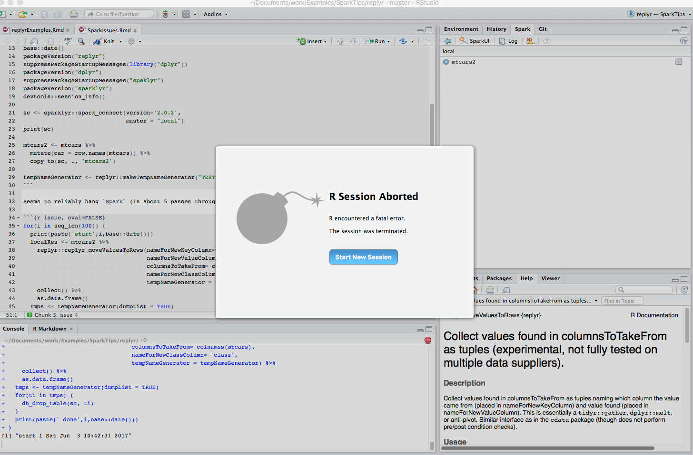

<!-- README.md is generated from README.Rmd. Please edit that file -->
``` r
base::date()
```

    ## [1] "Sat Jun  3 14:22:35 2017"

``` r
packageVersion("replyr")
```

    ## [1] '0.3.902'

``` r
suppressPackageStartupMessages(library("dplyr"))
packageVersion("dplyr")
```

    ## [1] '0.5.0'

``` r
packageVersion("sparklyr")
```

    ## [1] '0.5.5'

``` r
devtools::session_info()
```

    ## Session info -------------------------------------------------------------

    ##  setting  value                       
    ##  version  R version 3.4.0 (2017-04-21)
    ##  system   x86_64, darwin15.6.0        
    ##  ui       X11                         
    ##  language (EN)                        
    ##  collate  en_US.UTF-8                 
    ##  tz       America/Los_Angeles         
    ##  date     2017-06-03

    ## Packages -----------------------------------------------------------------

    ##  package    * version    date       source                          
    ##  assertthat   0.2.0      2017-04-11 CRAN (R 3.4.0)                  
    ##  backports    1.1.0      2017-05-22 CRAN (R 3.4.0)                  
    ##  base       * 3.4.0      2017-04-21 local                           
    ##  compiler     3.4.0      2017-04-21 local                           
    ##  datasets   * 3.4.0      2017-04-21 local                           
    ##  DBI          0.6-1      2017-04-01 CRAN (R 3.4.0)                  
    ##  devtools     1.13.2     2017-06-02 CRAN (R 3.4.0)                  
    ##  digest       0.6.12     2017-01-27 CRAN (R 3.4.0)                  
    ##  dplyr      * 0.5.0      2016-06-24 CRAN (R 3.4.0)                  
    ##  evaluate     0.10       2016-10-11 CRAN (R 3.4.0)                  
    ##  graphics   * 3.4.0      2017-04-21 local                           
    ##  grDevices  * 3.4.0      2017-04-21 local                           
    ##  htmltools    0.3.6      2017-04-28 CRAN (R 3.4.0)                  
    ##  knitr        1.16       2017-05-18 CRAN (R 3.4.0)                  
    ##  magrittr     1.5        2014-11-22 CRAN (R 3.4.0)                  
    ##  memoise      1.1.0      2017-04-21 CRAN (R 3.4.0)                  
    ##  methods    * 3.4.0      2017-04-21 local                           
    ##  R6           2.2.1      2017-05-10 CRAN (R 3.4.0)                  
    ##  Rcpp         0.12.11    2017-05-22 CRAN (R 3.4.0)                  
    ##  rlang        0.1.1.9000 2017-05-29 Github (tidyverse/rlang@c351186)
    ##  rmarkdown    1.5        2017-04-26 CRAN (R 3.4.0)                  
    ##  rprojroot    1.2        2017-01-16 CRAN (R 3.4.0)                  
    ##  stats      * 3.4.0      2017-04-21 local                           
    ##  stringi      1.1.5      2017-04-07 CRAN (R 3.4.0)                  
    ##  stringr      1.2.0      2017-02-18 CRAN (R 3.4.0)                  
    ##  tibble       1.3.3      2017-05-28 CRAN (R 3.4.0)                  
    ##  tools        3.4.0      2017-04-21 local                           
    ##  utils      * 3.4.0      2017-04-21 local                           
    ##  withr        1.0.2      2016-06-20 CRAN (R 3.4.0)                  
    ##  yaml         2.1.14     2016-11-12 CRAN (R 3.4.0)

``` r
sc <- NULL

sc <- sparklyr::spark_connect(version='2.0.2', 
                              master = "local")

print(sc)
```

    ## $master
    ## [1] "local[4]"
    ## 
    ## $method
    ## [1] "shell"
    ## 
    ## $app_name
    ## [1] "sparklyr"
    ## 
    ## $config
    ## $config$sparklyr.cores.local
    ## [1] 4
    ## 
    ## $config$spark.sql.shuffle.partitions.local
    ## [1] 4
    ## 
    ## $config$spark.env.SPARK_LOCAL_IP.local
    ## [1] "127.0.0.1"
    ## 
    ## $config$sparklyr.csv.embedded
    ## [1] "^1.*"
    ## 
    ## $config$`sparklyr.shell.driver-class-path`
    ## [1] ""
    ## 
    ## attr(,"config")
    ## [1] "default"
    ## attr(,"file")
    ## [1] "/Library/Frameworks/R.framework/Versions/3.4/Resources/library/sparklyr/conf/config-template.yml"
    ## 
    ## $spark_home
    ## [1] "/Users/johnmount/Library/Caches/spark/spark-2.0.2-bin-hadoop2.7"
    ## 
    ## $backend
    ## A connection with                               
    ## description "->localhost:50429"
    ## class       "sockconn"         
    ## mode        "wb"               
    ## text        "binary"           
    ## opened      "opened"           
    ## can read    "yes"              
    ## can write   "yes"              
    ## 
    ## $monitor
    ## A connection with                              
    ## description "->localhost:8880"
    ## class       "sockconn"        
    ## mode        "rb"              
    ## text        "binary"          
    ## opened      "opened"          
    ## can read    "yes"             
    ## can write   "yes"             
    ## 
    ## $output_file
    ## [1] "/var/folders/7q/h_jp2vj131g5799gfnpzhdp80000gn/T//RtmpE4rDHP/file83c383ca518_spark.log"
    ## 
    ## $spark_context
    ## <jobj[5]>
    ##   class org.apache.spark.SparkContext
    ##   org.apache.spark.SparkContext@5869878f
    ## 
    ## $java_context
    ## <jobj[6]>
    ##   class org.apache.spark.api.java.JavaSparkContext
    ##   org.apache.spark.api.java.JavaSparkContext@78f8c95e
    ## 
    ## $hive_context
    ## <jobj[9]>
    ##   class org.apache.spark.sql.SparkSession
    ##   org.apache.spark.sql.SparkSession@30d7acb6
    ## 
    ## attr(,"class")
    ## [1] "spark_connection"       "spark_shell_connection"
    ## [3] "DBIConnection"

``` r
mtcars2 <- mtcars %>%
  mutate(car = row.names(mtcars)) 


tempNameGenerator <- replyr::makeTempNameGenerator("TESTTABS")
```

Here is a local run showing the process working (note: this is not definative for a number of reasons including using different row-binding strategies depending on the declared back-end).

``` r
for(i in seq_len(100)) {
  print(paste('start',i,base::date()))
  localRes <- mtcars2 %>%
    replyr::replyr_moveValuesToRows(nameForNewKeyColumn= 'fact', 
                                    nameForNewValueColumn= 'value', 
                                    columnsToTakeFrom= colnames(mtcars),
                                    tempNameGenerator = tempNameGenerator) %>%
    collect() %>%
    as.data.frame()
  print(paste(' done',i,base::date()))
}
```

    ## [1] "start 1 Sat Jun  3 14:22:44 2017"
    ## [1] " done 1 Sat Jun  3 14:22:45 2017"
    ## [1] "start 2 Sat Jun  3 14:22:45 2017"
    ## [1] " done 2 Sat Jun  3 14:22:45 2017"
    ## [1] "start 3 Sat Jun  3 14:22:45 2017"
    ## [1] " done 3 Sat Jun  3 14:22:45 2017"
    ## [1] "start 4 Sat Jun  3 14:22:45 2017"
    ## [1] " done 4 Sat Jun  3 14:22:45 2017"
    ## [1] "start 5 Sat Jun  3 14:22:45 2017"
    ## [1] " done 5 Sat Jun  3 14:22:46 2017"
    ## [1] "start 6 Sat Jun  3 14:22:46 2017"
    ## [1] " done 6 Sat Jun  3 14:22:46 2017"
    ## [1] "start 7 Sat Jun  3 14:22:46 2017"
    ## [1] " done 7 Sat Jun  3 14:22:46 2017"
    ## [1] "start 8 Sat Jun  3 14:22:46 2017"
    ## [1] " done 8 Sat Jun  3 14:22:46 2017"
    ## [1] "start 9 Sat Jun  3 14:22:46 2017"
    ## [1] " done 9 Sat Jun  3 14:22:46 2017"
    ## [1] "start 10 Sat Jun  3 14:22:46 2017"
    ## [1] " done 10 Sat Jun  3 14:22:46 2017"
    ## [1] "start 11 Sat Jun  3 14:22:46 2017"
    ## [1] " done 11 Sat Jun  3 14:22:47 2017"
    ## [1] "start 12 Sat Jun  3 14:22:47 2017"
    ## [1] " done 12 Sat Jun  3 14:22:47 2017"
    ## [1] "start 13 Sat Jun  3 14:22:47 2017"
    ## [1] " done 13 Sat Jun  3 14:22:47 2017"
    ## [1] "start 14 Sat Jun  3 14:22:47 2017"
    ## [1] " done 14 Sat Jun  3 14:22:47 2017"
    ## [1] "start 15 Sat Jun  3 14:22:47 2017"
    ## [1] " done 15 Sat Jun  3 14:22:47 2017"
    ## [1] "start 16 Sat Jun  3 14:22:47 2017"
    ## [1] " done 16 Sat Jun  3 14:22:47 2017"
    ## [1] "start 17 Sat Jun  3 14:22:47 2017"
    ## [1] " done 17 Sat Jun  3 14:22:47 2017"
    ## [1] "start 18 Sat Jun  3 14:22:47 2017"
    ## [1] " done 18 Sat Jun  3 14:22:48 2017"
    ## [1] "start 19 Sat Jun  3 14:22:48 2017"
    ## [1] " done 19 Sat Jun  3 14:22:48 2017"
    ## [1] "start 20 Sat Jun  3 14:22:48 2017"
    ## [1] " done 20 Sat Jun  3 14:22:48 2017"
    ## [1] "start 21 Sat Jun  3 14:22:48 2017"
    ## [1] " done 21 Sat Jun  3 14:22:48 2017"
    ## [1] "start 22 Sat Jun  3 14:22:48 2017"
    ## [1] " done 22 Sat Jun  3 14:22:48 2017"
    ## [1] "start 23 Sat Jun  3 14:22:48 2017"
    ## [1] " done 23 Sat Jun  3 14:22:48 2017"
    ## [1] "start 24 Sat Jun  3 14:22:48 2017"
    ## [1] " done 24 Sat Jun  3 14:22:49 2017"
    ## [1] "start 25 Sat Jun  3 14:22:49 2017"
    ## [1] " done 25 Sat Jun  3 14:22:49 2017"
    ## [1] "start 26 Sat Jun  3 14:22:49 2017"
    ## [1] " done 26 Sat Jun  3 14:22:49 2017"
    ## [1] "start 27 Sat Jun  3 14:22:49 2017"
    ## [1] " done 27 Sat Jun  3 14:22:49 2017"
    ## [1] "start 28 Sat Jun  3 14:22:49 2017"
    ## [1] " done 28 Sat Jun  3 14:22:49 2017"
    ## [1] "start 29 Sat Jun  3 14:22:49 2017"
    ## [1] " done 29 Sat Jun  3 14:22:50 2017"
    ## [1] "start 30 Sat Jun  3 14:22:50 2017"
    ## [1] " done 30 Sat Jun  3 14:22:50 2017"
    ## [1] "start 31 Sat Jun  3 14:22:50 2017"
    ## [1] " done 31 Sat Jun  3 14:22:50 2017"
    ## [1] "start 32 Sat Jun  3 14:22:50 2017"
    ## [1] " done 32 Sat Jun  3 14:22:50 2017"
    ## [1] "start 33 Sat Jun  3 14:22:50 2017"
    ## [1] " done 33 Sat Jun  3 14:22:51 2017"
    ## [1] "start 34 Sat Jun  3 14:22:51 2017"
    ## [1] " done 34 Sat Jun  3 14:22:51 2017"
    ## [1] "start 35 Sat Jun  3 14:22:51 2017"
    ## [1] " done 35 Sat Jun  3 14:22:51 2017"
    ## [1] "start 36 Sat Jun  3 14:22:51 2017"
    ## [1] " done 36 Sat Jun  3 14:22:51 2017"
    ## [1] "start 37 Sat Jun  3 14:22:51 2017"
    ## [1] " done 37 Sat Jun  3 14:22:51 2017"
    ## [1] "start 38 Sat Jun  3 14:22:51 2017"
    ## [1] " done 38 Sat Jun  3 14:22:51 2017"
    ## [1] "start 39 Sat Jun  3 14:22:51 2017"
    ## [1] " done 39 Sat Jun  3 14:22:52 2017"
    ## [1] "start 40 Sat Jun  3 14:22:52 2017"
    ## [1] " done 40 Sat Jun  3 14:22:52 2017"
    ## [1] "start 41 Sat Jun  3 14:22:52 2017"
    ## [1] " done 41 Sat Jun  3 14:22:52 2017"
    ## [1] "start 42 Sat Jun  3 14:22:52 2017"
    ## [1] " done 42 Sat Jun  3 14:22:52 2017"
    ## [1] "start 43 Sat Jun  3 14:22:52 2017"
    ## [1] " done 43 Sat Jun  3 14:22:53 2017"
    ## [1] "start 44 Sat Jun  3 14:22:53 2017"
    ## [1] " done 44 Sat Jun  3 14:22:53 2017"
    ## [1] "start 45 Sat Jun  3 14:22:53 2017"
    ## [1] " done 45 Sat Jun  3 14:22:53 2017"
    ## [1] "start 46 Sat Jun  3 14:22:53 2017"
    ## [1] " done 46 Sat Jun  3 14:22:54 2017"
    ## [1] "start 47 Sat Jun  3 14:22:54 2017"
    ## [1] " done 47 Sat Jun  3 14:22:54 2017"
    ## [1] "start 48 Sat Jun  3 14:22:54 2017"
    ## [1] " done 48 Sat Jun  3 14:22:54 2017"
    ## [1] "start 49 Sat Jun  3 14:22:54 2017"
    ## [1] " done 49 Sat Jun  3 14:22:54 2017"
    ## [1] "start 50 Sat Jun  3 14:22:54 2017"
    ## [1] " done 50 Sat Jun  3 14:22:54 2017"
    ## [1] "start 51 Sat Jun  3 14:22:54 2017"
    ## [1] " done 51 Sat Jun  3 14:22:55 2017"
    ## [1] "start 52 Sat Jun  3 14:22:55 2017"
    ## [1] " done 52 Sat Jun  3 14:22:55 2017"
    ## [1] "start 53 Sat Jun  3 14:22:55 2017"
    ## [1] " done 53 Sat Jun  3 14:22:55 2017"
    ## [1] "start 54 Sat Jun  3 14:22:55 2017"
    ## [1] " done 54 Sat Jun  3 14:22:55 2017"
    ## [1] "start 55 Sat Jun  3 14:22:55 2017"
    ## [1] " done 55 Sat Jun  3 14:22:55 2017"
    ## [1] "start 56 Sat Jun  3 14:22:55 2017"
    ## [1] " done 56 Sat Jun  3 14:22:55 2017"
    ## [1] "start 57 Sat Jun  3 14:22:55 2017"
    ## [1] " done 57 Sat Jun  3 14:22:56 2017"
    ## [1] "start 58 Sat Jun  3 14:22:56 2017"
    ## [1] " done 58 Sat Jun  3 14:22:56 2017"
    ## [1] "start 59 Sat Jun  3 14:22:56 2017"
    ## [1] " done 59 Sat Jun  3 14:22:56 2017"
    ## [1] "start 60 Sat Jun  3 14:22:56 2017"
    ## [1] " done 60 Sat Jun  3 14:22:56 2017"
    ## [1] "start 61 Sat Jun  3 14:22:56 2017"
    ## [1] " done 61 Sat Jun  3 14:22:56 2017"
    ## [1] "start 62 Sat Jun  3 14:22:56 2017"
    ## [1] " done 62 Sat Jun  3 14:22:57 2017"
    ## [1] "start 63 Sat Jun  3 14:22:57 2017"
    ## [1] " done 63 Sat Jun  3 14:22:57 2017"
    ## [1] "start 64 Sat Jun  3 14:22:57 2017"
    ## [1] " done 64 Sat Jun  3 14:22:57 2017"
    ## [1] "start 65 Sat Jun  3 14:22:57 2017"
    ## [1] " done 65 Sat Jun  3 14:22:57 2017"
    ## [1] "start 66 Sat Jun  3 14:22:57 2017"
    ## [1] " done 66 Sat Jun  3 14:22:58 2017"
    ## [1] "start 67 Sat Jun  3 14:22:58 2017"
    ## [1] " done 67 Sat Jun  3 14:22:58 2017"
    ## [1] "start 68 Sat Jun  3 14:22:58 2017"
    ## [1] " done 68 Sat Jun  3 14:22:58 2017"
    ## [1] "start 69 Sat Jun  3 14:22:58 2017"
    ## [1] " done 69 Sat Jun  3 14:22:59 2017"
    ## [1] "start 70 Sat Jun  3 14:22:59 2017"
    ## [1] " done 70 Sat Jun  3 14:22:59 2017"
    ## [1] "start 71 Sat Jun  3 14:22:59 2017"
    ## [1] " done 71 Sat Jun  3 14:22:59 2017"
    ## [1] "start 72 Sat Jun  3 14:22:59 2017"
    ## [1] " done 72 Sat Jun  3 14:22:59 2017"
    ## [1] "start 73 Sat Jun  3 14:22:59 2017"
    ## [1] " done 73 Sat Jun  3 14:23:00 2017"
    ## [1] "start 74 Sat Jun  3 14:23:00 2017"
    ## [1] " done 74 Sat Jun  3 14:23:00 2017"
    ## [1] "start 75 Sat Jun  3 14:23:00 2017"
    ## [1] " done 75 Sat Jun  3 14:23:00 2017"
    ## [1] "start 76 Sat Jun  3 14:23:00 2017"
    ## [1] " done 76 Sat Jun  3 14:23:00 2017"
    ## [1] "start 77 Sat Jun  3 14:23:00 2017"
    ## [1] " done 77 Sat Jun  3 14:23:00 2017"
    ## [1] "start 78 Sat Jun  3 14:23:00 2017"
    ## [1] " done 78 Sat Jun  3 14:23:00 2017"
    ## [1] "start 79 Sat Jun  3 14:23:00 2017"
    ## [1] " done 79 Sat Jun  3 14:23:01 2017"
    ## [1] "start 80 Sat Jun  3 14:23:01 2017"
    ## [1] " done 80 Sat Jun  3 14:23:01 2017"
    ## [1] "start 81 Sat Jun  3 14:23:01 2017"
    ## [1] " done 81 Sat Jun  3 14:23:01 2017"
    ## [1] "start 82 Sat Jun  3 14:23:01 2017"
    ## [1] " done 82 Sat Jun  3 14:23:01 2017"
    ## [1] "start 83 Sat Jun  3 14:23:01 2017"
    ## [1] " done 83 Sat Jun  3 14:23:01 2017"
    ## [1] "start 84 Sat Jun  3 14:23:01 2017"
    ## [1] " done 84 Sat Jun  3 14:23:01 2017"
    ## [1] "start 85 Sat Jun  3 14:23:01 2017"
    ## [1] " done 85 Sat Jun  3 14:23:01 2017"
    ## [1] "start 86 Sat Jun  3 14:23:01 2017"
    ## [1] " done 86 Sat Jun  3 14:23:01 2017"
    ## [1] "start 87 Sat Jun  3 14:23:01 2017"
    ## [1] " done 87 Sat Jun  3 14:23:02 2017"
    ## [1] "start 88 Sat Jun  3 14:23:02 2017"
    ## [1] " done 88 Sat Jun  3 14:23:02 2017"
    ## [1] "start 89 Sat Jun  3 14:23:02 2017"
    ## [1] " done 89 Sat Jun  3 14:23:02 2017"
    ## [1] "start 90 Sat Jun  3 14:23:02 2017"
    ## [1] " done 90 Sat Jun  3 14:23:02 2017"
    ## [1] "start 91 Sat Jun  3 14:23:02 2017"
    ## [1] " done 91 Sat Jun  3 14:23:02 2017"
    ## [1] "start 92 Sat Jun  3 14:23:02 2017"
    ## [1] " done 92 Sat Jun  3 14:23:02 2017"
    ## [1] "start 93 Sat Jun  3 14:23:02 2017"
    ## [1] " done 93 Sat Jun  3 14:23:02 2017"
    ## [1] "start 94 Sat Jun  3 14:23:02 2017"
    ## [1] " done 94 Sat Jun  3 14:23:02 2017"
    ## [1] "start 95 Sat Jun  3 14:23:02 2017"
    ## [1] " done 95 Sat Jun  3 14:23:03 2017"
    ## [1] "start 96 Sat Jun  3 14:23:03 2017"
    ## [1] " done 96 Sat Jun  3 14:23:03 2017"
    ## [1] "start 97 Sat Jun  3 14:23:03 2017"
    ## [1] " done 97 Sat Jun  3 14:23:03 2017"
    ## [1] "start 98 Sat Jun  3 14:23:03 2017"
    ## [1] " done 98 Sat Jun  3 14:23:03 2017"
    ## [1] "start 99 Sat Jun  3 14:23:03 2017"
    ## [1] " done 99 Sat Jun  3 14:23:03 2017"
    ## [1] "start 100 Sat Jun  3 14:23:03 2017"
    ## [1] " done 100 Sat Jun  3 14:23:03 2017"

Seems to reliably hang `Spark` (in about 5 passes through the loop on average), sometimes crashing `R`.

Try to run on `Spark`.

``` r
mtcars2 <- copy_to(sc, mtcars2, 'mtcars2')

for(i in seq_len(100)) {
  print(paste('start',i,base::date()))
  localRes <- mtcars2 %>%
    replyr::replyr_moveValuesToRows(nameForNewKeyColumn= 'fact', 
                                    nameForNewValueColumn= 'value', 
                                    columnsToTakeFrom= colnames(mtcars),
                                    tempNameGenerator = tempNameGenerator) %>%
    collect() %>%
    as.data.frame()
  print(paste(' done',i,base::date()))
}
```



``` r
if(!is.null(sc)) {
  sparklyr::spark_disconnect(sc)
}
rm(list=ls())
gc()
```

    ##           used (Mb) gc trigger (Mb) max used (Mb)
    ## Ncells  705898 37.7    1168576 62.5  1168576 62.5
    ## Vcells 1216022  9.3    2060183 15.8  1479358 11.3
