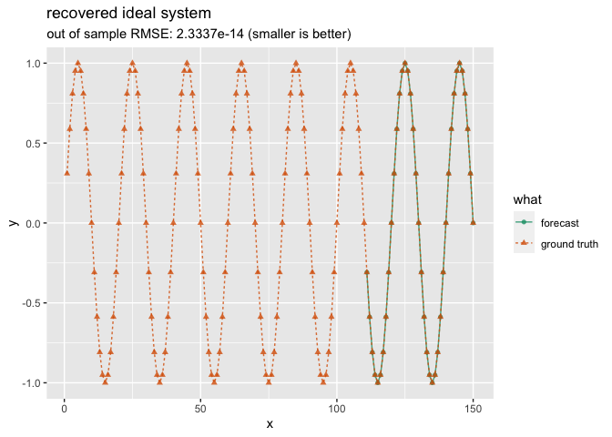
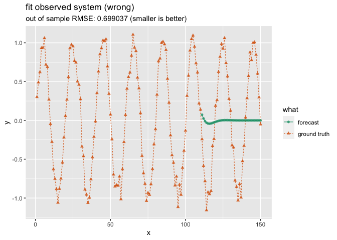

A Time Series Apologia
================
2023-05-07

John Mount Win Vector LLC

## Introduction

There is a *fear* that one can not be *seen* to be using standard
regression methods for time series problems.

The motivating worry is that in time series problems the error terms are
likely correlated, so one can no longer appeal to the Gauss Markov
Theorem to be assured of good out of sample performance (in the style of
[Bounding Excess Generalization Error for Linear Regression
Models](https://win-vector.com/2023/03/16/bounding-excess-generalization-error-for-linear-regression-models/)).
Another motivation is the absolute beauty of the germinal time series
reference: Box, Jenkins, Reinsel, *Time Series Analysis*, Wiley 2008
(all editions are good, this is just the edition I have at hand). So
there is a temptation to “leave it all to the package” and not be seen
to be tinkering.

We are going to demonstrate some standard time series methods. We will
call out an important, but under-taught, use of MA terms in ARIMA. We
will also demonstrate one *can*, in some cases, safely treat time series
problems as standard regression problems. The out of sample performance
of regression can be quite good, even for time series problems.

This note is, unfortunately, going to be long. However I think it is
very much worth the effort. I would like to encourage data scientists to
feel safe trying a variety of methods on time series forecasting
problems. To that end please think of this note as an attempt at a
vindication in the sense of Borges’ “The Library of Babel”:

> At that period there was much talk of The Vindications- books of
> *apologia* and prophecies that would vindicate for all the actions of
> every person in the universe and that held wondrous arcana for men’s
> futures.

## An Example

Let’s work an example of time series forecasting in
[R](https://www.r-project.org).

First we attach our packages.

``` r
library(ggplot2)
library(Hmisc)
library(wrapr)
library(forecast)
```

Now let’s generate some synthetic data to define an example problem.

``` r
w <- 2 * pi / 20
d <- data.frame(
  x = seq(150)
)

d$y_ideal <- sin(w * d$x)

head(d)
```

    ##   x   y_ideal
    ## 1 1 0.3090170
    ## 2 2 0.5877853
    ## 3 3 0.8090170
    ## 4 4 0.9510565
    ## 5 5 1.0000000
    ## 6 6 0.9510565

`y_ideal` obeys the recurrence
`y_ideal[i] = (2 * cos(w)) * y_ideal[i - 1] - y_ideal[i - 2]`. It is the
first time series we will try to forecast.

``` r
theoretical_coefs <- c(2 * cos(w), -1)

theoretical_coefs
```

    ## [1]  1.902113 -1.000000

We can confirm the recurrence as follows.

``` r
max(abs(
  d$y_ideal - 
    (theoretical_coefs[1] * Lag(d$y_ideal, 1) 
     + theoretical_coefs[2] * Lag(d$y_ideal, 2))),
  na.rm = TRUE
)
```

    ## [1] 6.943996e-15

The above is easy to derive from the usual trigonometric additive angle
formulas, and pretty much how trigonometric tables used to be
constructed. The recurrence exactly matches the form in the
`help(arima)` documentation:

`X[t] = a[1] * X[t - 1] + a[2] * X[t - 2] + e[t]`.

This reference is using `X` as the observable value (which for us is
`y_ideal` or `y_observed`, depending on which example we are working).

Note: we don’t always want to call the `e[]` term an error. *Time Series
Analysis* more properly refers to such as “random shocks”, not errors.
In section 1.2.1 “Stationary and Nonstationary Stochastic Models for
Forecasting and Control” page 8 *Time Series Analysis* states:

> The stochastic models we employ are based on the idea \[ref: 317\]
> that an obsevable time series <code>z<sub>t</sub></code> in which
> successive values are highly dependent can frequently be regarded as
> generated from a series of *independent* “shocks”
> <code>a<sub>t</sub></code>.

This reference is using `z` for the observable process and `a` for the
unobservable shocks (refs, p. 2 and p. 8).

An analogy for the above is: if you consider the contents of a tip jar
over time to be a time series, you most certainly *do not* consider the
tips (difference from the average expecte tip) to be errors! They are in
fact the drivers of the jar contents. Many current references (such as
`help(arima)`) unfortunately use the term “errors” for these shocks or
drivers.

The example we have chosen is a nice process to study as it doesn’t have
the “unit root” pathology, and it doesn’t require differencing or
integration in the analysis (a case where we don’t need the “I” in
ARIMA). We will move to trying to infer or fit the original system by
time series modeling.

## As a Time Series

The example is called a “`c(2, 0, 0)` ARIMA model” (see `help(arima)`).
A `c(p, d, q)` ARIMA process has `p` autoregressive terms (the “AR”,
expressing a linear relation among the ideal unobserved values), `d`
integration steps (integration needed to add trends to a system), and
`p` moving average terms (the “MA”, expressing *finite* memory for
unobserved shocks). It can be daunting to pick the `c(p, d, q)`
parameters when modeling. However when we have a recurrence specifying
the ideal system we can read off the implied parameters, and in this
case we have a `c(2, 0, 0)` system: we see two lags of the variable in
question, and no itegrations or older shock/impulse terms.

A note on time series terminology. A lot of the standard naming of terms
is historic, and does not reflect current understanding. For example our
*Time Series Analysis* reference in section 1.2.1 “Stationary and
Nonstationary Stochastic Models for Forecasting and Control” page 10
asserts:

> The name “moving average” is somewhat misleading becaues the weights
> \[…\] do not need to total to unity nor need they be positive.
> However, this nomenclature is in common use, and therefore we employ
> it.

Back to our problem. We will reserve some of our data for out of sample
evaluation.

``` r
d$is_train <- seq(nrow(d)) <= 110
```

We fit the ARIMA model.

``` r
arima_include_mean <- FALSE
arima_method <- "CSS"
```

``` r
m_ideal <- arima(
  d$y_ideal[d$is_train], 
  order = c(2, 0, 0), 
  include.mean = arima_include_mean, 
  method = arima_method)

m_ideal
```

    ## 
    ## Call:
    ## arima(x = d$y_ideal[d$is_train], order = c(2, 0, 0), include.mean = arima_include_mean, 
    ##     method = arima_method)
    ## 
    ## Coefficients:
    ##          ar1  ar2
    ##       1.9021   -1
    ## s.e.  0.0000    0
    ## 
    ## sigma^2 estimated as 3.03e-30:  log likelihood = 3585.47,  aic = NA

Some of the diagnostics look a little concerning, but the fitter did
identify the system and reproduce the theoretical coefficients.

We can plot the forecast into the future (past the training region).

``` r
plot_ts_result <- function(predictions, comparison_column, title) {
  p_frame <- 
    rbind(
      data.frame(
        x = d$x[d$is_train == FALSE],
        y = predictions,
        what = "forecast"
      ),
      data.frame(
        x = d$x,
        y = d[[comparison_column]],
        what = "ground truth"
      )
    )
  q_frame <-data.frame(
        x = d$x[d$is_train == FALSE],
        y_truth = d[[comparison_column]][d$is_train == FALSE],
        y_pred = predictions
      )
  rmse = sqrt(mean((q_frame$y_truth - q_frame$y_pred)^2))
  ggplot(
    data = p_frame,
    mapping = aes(x = x, y = y, color = what, linetype = what, shape = what)) +
    geom_line(alpha = 0.8) +
    geom_point(alpha = 0.8) + 
    scale_color_brewer(palette = "Dark2") +
    ggtitle(
      title,
      subtitle = paste0("out of sample RMSE: ", sprintf("%g", rmse), " (smaller is better)"))
}
```

``` r
n_ahead = sum(d$is_train == FALSE)
```

``` r
plot_ts_result(
  as.numeric(predict(m_ideal, n.ahead = n_ahead)$pred), 
  "y_ideal", 
  "recovered ideal system")
```

<!-- -->

## With Shocks or Obsevation Noise

Now consider the more common set-up where we don’t observe `y_ideal`,
but instead `y_observed`.

``` r
set.seed(2023)
# add observation noise
d$y_observed <- d$y_ideal + 0.1 * rnorm(nrow(d))
```

We must take care. The `y_observed` is *not* a `c(2, 0, 0)` ARIMA
process, even though `y_ideal` is! We can confirm the mis-fit as
follows.

### Doing it Wrong

``` r
m_observed_wrong <- arima(
  d$y_observed[d$is_train], 
  order = c(2, 0, 0),  # wrong for this example
  include.mean = arima_include_mean, 
  method = arima_method)

m_observed_wrong
```

    ## 
    ## Call:
    ## arima(x = d$y_observed[d$is_train], order = c(2, 0, 0), include.mean = arima_include_mean, 
    ##     method = arima_method)
    ## 
    ## Coefficients:
    ##          ar1      ar2
    ##       1.5321  -0.6364
    ## s.e.  0.0732   0.0731
    ## 
    ## sigma^2 estimated as 0.03716:  log likelihood = 25.01,  aic = NA

``` r
plot_ts_result(
  as.numeric(predict(m_observed_wrong, n.ahead = n_ahead)$pred),
  "y_observed", 
  "fit observed system (wrong)")
```

<!-- -->

The above is a pathological failure of the mis-specified fitting system.
The forecast procedure is vulnerable both to mis-identification of
system and to mis-estimation of the state going into the forecast
region.

This sort of failure can go unnoticed during modeling.

### Doing it Right

The correct form is translate the earlier recurrence to an identical one
over *the shock-free* terms `Xideal := Xobs - e`:

`(Xobs[t] - e[t]) = a[1] * (Xobs[t - 1] - e[t - 1]) + a[2] * (Xobs[t - 2] - e[t - 2])`.

This can be re-arranged to the usual ARIMA formula:

`Xobs[t] = a[1] * Xobs[t - 1] + a[2] * Xobs[t - 2] + e[t] + b[1] * e[t - 1] + b[2] * e[t - 2]`.

<div style="margin-left: 1em;">

The above is a **strong** argument that for `c(p, d, q)` ARIMA processes
one should pick `q` to be at least `p`. The idea is: with `q >= p` we
can appeal to a substitution of the form `Xideal := Xobs - e`. If there
is an autoregressive recurrence (the “AR” in ARIMA, or how the state is
thought to evolve in our system to be fit) in the unobserved ideal
values, then adding `q` moving average terms (the “MA” in ARIMA) makes
the ARIMA system strong enough to estimate it from the mere
observations. Without the `q` shock terms (the `e[]`s) there is in fact
no reason to suppose the approximate observations will obey a recurrence
similar to the unobserved ideal observations.

</div>

Let’s give that a try.

``` r
m_observed <- arima(
  d$y_observed[d$is_train], 
  order = c(2, 0, 2), 
  include.mean = arima_include_mean, 
  method = arima_method)

m_observed
```

    ## 
    ## Call:
    ## arima(x = d$y_observed[d$is_train], order = c(2, 0, 2), include.mean = arima_include_mean, 
    ##     method = arima_method)
    ## 
    ## Coefficients:
    ##          ar1      ar2      ma1     ma2
    ##       1.9048  -1.0022  -1.6756  0.7642
    ## s.e.  0.0038   0.0039   0.0804  0.0810
    ## 
    ## sigma^2 estimated as 0.01235:  log likelihood = 85.59,  aic = NA

``` r
plot_ts_result(
  as.numeric(predict(m_observed, n.ahead = n_ahead)$pred),
  "y_observed", 
  "fit observed system (correct)")
```

<!-- -->

## “Magic” Tools With Mundane Outcomes

One can also try one of the many “auto ARIMA” systems to find
`c(p, d, q)`.

``` r
m_auto <- auto.arima(
  d$y_observed[d$is_train], 
  stepwise = FALSE,
  approximation = FALSE)

m_auto
```

    ## Series: d$y_observed[d$is_train] 
    ## ARIMA(5,0,0) with zero mean 
    ## 
    ## Coefficients:
    ##          ar1     ar2      ar3      ar4      ar5
    ##       0.7894  0.4619  -0.1404  -0.2015  -0.1967
    ## s.e.  0.0942  0.1200   0.1278   0.1210   0.0952
    ## 
    ## sigma^2 = 0.01829:  log likelihood = 63.86
    ## AIC=-115.71   AICc=-114.89   BIC=-99.51

The software fails to pick the correct `c(p, d, q)` and fully identify
the system. However the excess `p` seems to almost work.

``` r
plot_ts_result(
  as.numeric(predict(m_auto, n.ahead = n_ahead)$pred),
  "y_observed",
  "auto.arima observed system")
```

<!-- -->

The unfortunate decay in the predictor is likely a small under-estimate
of the norm of the step forward in time operator. This is fine, *until
one applies the operator again and again to make predictions*. When we
fit ARIMA models we are actually trying to identify the one step forward
operator, not a `k`-step forward operator.

I have in the past found auto ARIMA type methods to be fairly brittle
and [degenerate to predicting a near-constant with rapidly growing error
bars for problems as simple as modeling the
tide](https://github.com/WinVector/Examples/blob/main/Tides/TideR_ARIMA.md)
when “under supervised.” For some fun with forecasting tides, please see
[Lord Kelvin, Data
Scientist](https://win-vector.com/2019/08/06/lord-kelvin-data-scientist/).

## ARIMA forecasting

ARIMA models make `k`-step out predictions by iterating `1`-step forward
predictions and feeding the intermediate predictions in *as if they were
actual observations*. This may seem a bit crude, but it is explicitly so
described in *Time Series Analysis* section 5.1.2 “Three Basic Forms for
the Forecast” page 143.

> 1.  The <code>z<sub>t-j</sub> (j = 0, 1, 2, …)</code> which have
>     already occured at origin <code>t</code>, are left unchanged.
>
> 2.  The <code>z<sub>t+j</sub> (j = 1, 2, …)</code> which have not yet
>     occured at origin <code>t</code>, are replaced by their forecasts
>     <code>ẑ<sub>t</sub>(j)</code> at origin <code>t</code>.
>
> 3.  The <code>a<sub>t-j</sub> (j = 0, 1, 2, …)</code> which have
>     occured, are available from <code>z<sub>t-j</sub> -
>     ẑ<sub>t-j-1</sub>(1)</code>.
>
> 4.  The <code>a<sub>t+j</sub> (j = 1, 2, …)</code> which have not yet
>     occured, are replaced by zeros.

In context this is saying: assume any past difference between
predictions and actuals are the (normally unobserved) driving shocks,
and assume no future shocks (which is *why* we model shocks as being
expected-value zero!).

With all said and done, the above `k`-step prediction scheme is just a
composition of linear functions, so therefore itself a linear function
of the original inputs.

## Treating The Problems as a Mere Regression

We can exploit the closed under composition property to support the
practice of *directly* fitting a `k`-step out predictor using
traditional regression (for each possible `k`!). To do this we land a
number of lagged copies of our variable as our explanatory variables.
This brings us to the usual form of having all the explanatory variables
in each row of data, and fitting a model as a function of rows.

The fitting strategy we are using throughout is: use theoretical
arguments to ensure the data generating system is in the family of
models being optimized over. Then the optimizer returns either this
system, or one that has *even smaller loss* on the training data. Some
of the excess performance *is* over-fit, so will not translate to out of
sample performance. However, if the concept space isn’t too complicated
in comparison with the amount of training data available: we then expect
good out of sample performance. We can establish this through
theoretical means (such as PAC learning or bounding in terms of
Rademacher complexity), *or* we can just be parsimonious in more model
specification and then empirically confirm out of sample performance.

Let’s set that up. First we organize our explanatory variables.

``` r
lags <- 0:5
d_train <- d[d$is_train, c("x", "y_observed"), drop = FALSE]
names(lags) <- paste0("x_", lags)
for (nm in names(lags)) {
  d_train[nm] = Lag(d_train$y_observed, lags[nm])
}

head(d_train)
```

    ##   x y_observed       x_0       x_1       x_2       x_3       x_4       x_5
    ## 1 1  0.3006386 0.3006386        NA        NA        NA        NA        NA
    ## 2 2  0.4894909 0.4894909 0.3006386        NA        NA        NA        NA
    ## 3 3  0.6215103 0.6215103 0.4894909 0.3006386        NA        NA        NA
    ## 4 4  0.9324421 0.9324421 0.6215103 0.4894909 0.3006386        NA        NA
    ## 5 5  0.9366514 0.9366514 0.9324421 0.6215103 0.4894909 0.3006386        NA
    ## 6 6  1.0601363 1.0601363 0.9366514 0.9324421 0.6215103 0.4894909 0.3006386

Now we define our brute force predict `k`-steps out function. To
forecast in this way we need a whole family of such functions. We
predict `1`-step out using a function fit to forecast `1`-step out, we
predict `2`-steps out using a function fit to forecast `2`-steps out,
and so on. We train many such `k` step out functions by fitting `k`
steps into the future, at prediction time we use the many functions to
predict many steps out from our last known state.

With this formulation we don’t need any of the lemmas that justify
composing predictions, as we don’t compose predictions. That is: we
don’t need to know if a good 3-step out prediction can be formed from
feeding a 2-step out prediction back into a 1-step out model. We don’t
need to know this as we are no longer doing that. We instead are saying,
if there is a good `k`-step out prediction that is a linear function of
its inputs we can find an approximation of that directly by fitting.
This lightens the theoretical load, but increases the engineering load,
as we have to perform and store multiple model fits.

``` r
fit_fn <- function(steps_forward) {
  stopifnot(steps_forward >= 1)
  d_train_y <- d_train
  # land the dependent variable
  d_train_y["y_f"] <- Lag(d_train$y_observed, -steps_forward)
  # limit to rows where we have explanatory values and dependent values
  d_train_y <- na.omit(d_train_y)
  # fit the dependent variable as a function of explanatory variables
  lm(mk_formula("y_f", names(lags)), data = d_train_y)
}
```

It is *easy* to code a data leak that makes results look too good both
in the training and application phases of this formulation. We avoid
this by strictly using only `d_train` for formation of both explanatory
and outcome variables, and letting `na.omit()` deal with how this cuts
our training data in an irregular pattern. More advice is to: return the
predictions in an explicit `data.frame` (not as a scalar or a vector),
and add an explicit time key to both inputs and predictions to make
joining external regressors or joining results safe and reliable.

We store these fits in a map keye by how far out we are trying to
predict.

``` r
vector_of_naheads_to_predict = seq(n_ahead)
```

``` r
model_map <- lapply(
  vector_of_naheads_to_predict,   # different nahead values
  fit_fn)
```

Our prediction functions uses this map of models to forecast.

``` r
pred_fn <- function(steps_forward, newdata) {
  stopifnot(steps_forward >= 1)
  stopifnot(nrow(newdata) == 1)
  model_f = model_map[[steps_forward]]
  # apply the model to the last "before the test period" row to get 
  # the k-steps_forward prediction
  as.numeric(predict(model_f, newdata = newdata))
}
```

With our prediction functions defined, we are ready to plot the results.

``` r
plot_ts_result(
  vapply(
    vector_of_naheads_to_predict,  # different nahead values
    pred_fn, 
    numeric(1), 
    newdata = d_train[nrow(d_train), , drop = FALSE]),  # last known state
  "y_observed", 
  "brute force k-lagged linear function family")
```

<!-- -->

Notice we get good out of sample performance. If we are judging on
quality of out of sample predictions (and not on system identification
or inference) then direct fitting `k`-step out predictors looks like a
justifiable strategy. There *are* other consideration in fitting, but if
minimizing prediction error magnitude is your goal, then regression
methods tend to dominate (as that is *all* they care about). If all one
cares about is minimizing error, then (like it or not) error-minimizing
strategies tend to dominate.

The above I call the Apps principle; as Dr. Philip Apps says:

> You have to get up pretty early in the morning to beat linear
> regression.

The linear regression worked very well, even though it can only imitate
`AR` terms (it doesn’t have `MA` terms). This is even with an example
where the generative process is `c(2, 0, 2)`, so has a non-trivial
number of `MA` terms. Reliable prediction does not always require a
fully faithful reconstruction of the underlying system. The *Time Series
Analysis* reference makes a similar observation after working an example
of a `c(1, 1, 1)` system (section 4.2.3 “Inverted Form of the Model”
p. 113):

> We mention in passing that, for statistical models representing
> practically occuring time series, the converging <code>π</code>
> weights usually die out rather quickly. Thus, although
> <code>z<sub>t</sub></code> may be theoretically dependent on the
> remote past, the representation \[… expression with only a few AR
> terms …\] will usually show that the <code>z<sub>t</sub></code> is
> dependent *to an important extent* only on recent past values
> <code>z<sub>t-j</sub></code> of the time series.

The above was in the context that a `c(p, 0, q)` system (i.e. a MA or
moving average process) can be written as a `c(infinity, 0, 0)` system,
which in turn is usually very well approximated by a `c(k, 0, 0)` system
for a small `k`. The theory supports systems that are not
well-approximated with `c(k, 0, 0)`, but they are not likely to be
estimable from a reasonable number of observations anyway (so setting
`k` very large doesn’t solve all problems).

This is an example of what I call the Welch principal from the
following.

> When Dr. Will Welch was asked why a simple model could correctly
> predict the strength of a biological interaction he said “maybe the
> molecule didn’t go to grad school.”

The direct regression approach makes the mechanics of adding external
regressors and saving models for future use a bit easier. If one can
form a row with correct lags or explanatory variables, one can call
predict.

## Conclusion

Time series tools have their own set of issues and affordances.

However, some of the terminology can be hard to understand and may not
in fact align with your modeling situation. In particular watch out for
thinking of the `e[]` as mere errors, they can also be important driving
impulses or shocks. Similarly avoid thinking of the moving average terms
as only computing moving averages; they can also translate relations
thought to be true on the unobserved ideal values to the observed values
(the “set `q` to `p` trick” we showed above). As with all mathematical
objects, what something is called doesn’t actually influence what it
does.

In my opinion teaching of ARIMA has drifted from the definitive
treatment in *Time Series Analysis*. Current teaching can degenerate to
“use this package to make forecasts, and direct modeling is heterodox.”
*Time Series Analysis* spent a lot of time on semantics, consequences,
and system identification as their own worthwhile goals- it did not
recommend black box packages skipping forward to prediction or
forecasting.

If one does *only* want predictions (even out of sample), one can in
fact use direct prediction methods. Approaches that bring in standard
regression tools (such as linear regression or even deep learning) can
in fact be justified. One is allowed to not use ARIMA.

Thank you to Dr. Nina Zumel for her comments and improvements.

Time series packages of interest include
[`sktime`](https://github.com/sktime/sktime) (a Python package), and
[NNS](https://CRAN.R-project.org/package=NNS).
