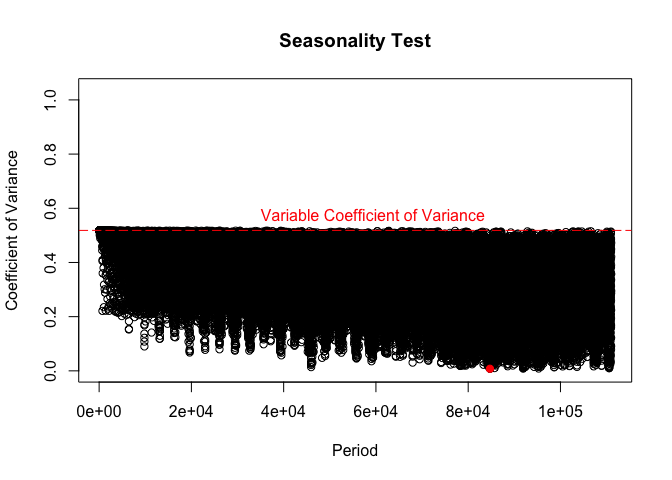
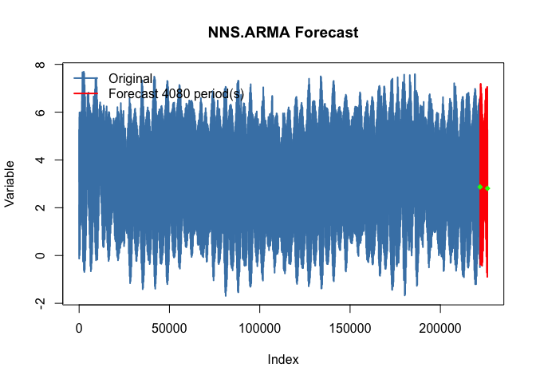
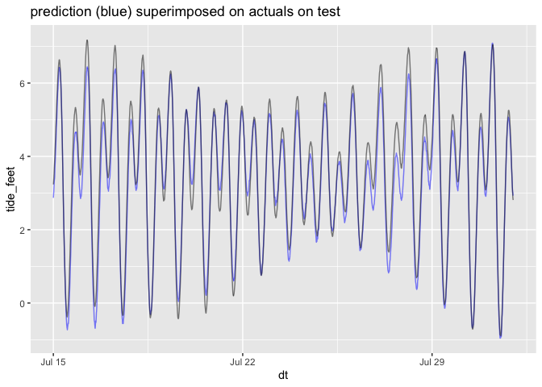

NNS solution
================

Reproducing [Fred Viole’s excellent NNS
solution](https://htmlpreview.github.io/?https://github.com/OVVO-Financial/NNS/blob/NNS-Beta-Version/examples/tides.html).

``` r
library(NNS)  # CRAN version August 8, 2019
```

    ## Loading required package: doParallel

    ## Loading required package: foreach

    ## Loading required package: iterators

    ## Loading required package: parallel

``` r
packageVersion('NNS')
```

    ## [1] '0.4.4'

``` r
tides <- readRDS('tides.RDS')

base_date_time =  as.POSIXct('2001/01/01 00:00', tz = "UTC")
first_date_time =  as.POSIXct('2019/06/01 00:00', tz = "UTC")
cut_date_time = as.POSIXct('2019/07/15 00:00', tz = "UTC")

dtrain <- tides[tides$dt<cut_date_time, , drop = FALSE]
dtest <- tides[tides$dt>=cut_date_time, , drop = FALSE]

training_length <- dim(dtrain)[1] - dim(dtest)[1]
```

``` r
nns_periods <- NNS.seas(dtrain$tide_feet)
```

<!-- -->

``` r
nns_periods <- nns_periods$all.periods$Period

head(nns_periods)
```

    ## [1] 84719 91920 95267 84711 84718 84710

``` r
length(nns_periods)
```

    ## [1] 65353

``` r
nns_periods_constrained <- nns_periods[nns_periods<=43584]


arma_parameters <- NNS.ARMA.optim(variable = dtrain$tide_feet,
                                  training.set = training_length,
                                  seasonal.factor = nns_periods_constrained[1:100])
```

    ## [1] "CURRNET METHOD: lin"
    ## [1] "COPY LATEST PARAMETERS DIRECTLY FOR NNS.ARMA() IF ERROR:"
    ## [1] "NNS.ARMA(... method =  'lin' , seasonal.factor =  c( 39247 ) ...)"
    ## [1] "CURRENT lin OBJECTIVE FUNCTION = 982.511157999999"
    ## [1] "NNS.ARMA(... method =  'lin' , seasonal.factor =  c( 39247, 22979 ) ...)"
    ## [1] "CURRENT lin OBJECTIVE FUNCTION = 466.584421153607"
    ## [1] "NNS.ARMA(... method =  'lin' , seasonal.factor =  c( 39247, 22979, 39248 ) ...)"
    ## [1] "CURRENT lin OBJECTIVE FUNCTION = 407.575404817684"
    ## [1] "NNS.ARMA(... method =  'lin' , seasonal.factor =  c( 39247, 22979, 39248, 42351 ) ...)"
    ## [1] "CURRENT lin OBJECTIVE FUNCTION = 402.231127171301"
    ## [1] "NNS.ARMA(... method =  'lin' , seasonal.factor =  c( 39247, 22979, 39248, 42351, 19624 ) ...)"
    ## [1] "CURRENT lin OBJECTIVE FUNCTION = 362.472034504139"
    ## [1] "NNS.ARMA(... method =  'lin' , seasonal.factor =  c( 39247, 22979, 39248, 42351, 19624, 39249 ) ...)"
    ## [1] "CURRENT lin OBJECTIVE FUNCTION = 356.233455001098"
    ## [1] "NNS.ARMA(... method =  'lin' , seasonal.factor =  c( 39247, 22979, 39248, 42351, 19624, 39249, 42352 ) ...)"
    ## [1] "CURRENT lin OBJECTIVE FUNCTION = 352.470323974977"
    ## [1] "BEST method = 'lin', seasonal.factor = c( 39247, 22979, 39248, 42351, 19624, 39249, 42352)"
    ## [1] "BEST lin OBJECTIVE FUNCTION = 352.470323974977"
    ## [1] "CURRNET METHOD: nonlin"
    ## [1] "COPY LATEST PARAMETERS DIRECTLY FOR NNS.ARMA() IF ERROR:"
    ## [1] "NNS.ARMA(... method =  'nonlin' , seasonal.factor =  c( 39247, 22979, 39248, 42351, 19624, 39249, 42352 ) ...)"
    ## [1] "CURRENT nonlin OBJECTIVE FUNCTION = 1190.77225468083"
    ## [1] "BEST method = 'nonlin' PATH MEMBER = c( 39247, 22979, 39248, 42351, 19624, 39249, 42352)"
    ## [1] "BEST nonlin OBJECTIVE FUNCTION = 1190.77225468083"
    ## [1] "CURRNET METHOD: both"
    ## [1] "COPY LATEST PARAMETERS DIRECTLY FOR NNS.ARMA() IF ERROR:"
    ## [1] "NNS.ARMA(... method =  'both' , seasonal.factor =  c( 39247, 22979, 39248, 42351, 19624, 39249, 42352 ) ...)"
    ## [1] "CURRENT both OBJECTIVE FUNCTION = 439.358581766141"
    ## [1] "BEST method = 'both' PATH MEMBER = c( 39247, 22979, 39248, 42351, 19624, 39249, 42352)"
    ## [1] "BEST both OBJECTIVE FUNCTION = 439.358581766141"

``` r
nns_estimates <- NNS.ARMA(dtrain$tide_feet, 
                          h = dim(dtest)[1], 
                          method = arma_parameters$method,
                          seasonal.factor = arma_parameters$periods, 
                          weights = arma_parameters$weights,
                          negative.values = TRUE,
                          seasonal.plot = FALSE)
```

<!-- -->

``` r
r_squared <- function(est, y) {
  1- sum((y-est)^2)/sum((y-mean(y))^2)
}

r_squared(nns_estimates, dtest$tide_feet)
```

    ## [1] 0.949459

``` r
dtest$nns_estimates <- nns_estimates
sigr::wrapFTest(dtest, 
                predictionColumnName = 'nns_estimates',
                yColumnName = 'tide_feet')
```

    ## [1] "F Test summary: (R2=0.9495, F(1,4078)=7.661e+04, p<1e-05)."

``` r
library(ggplot2)
ggplot(aes(x=dt), data=dtest) +
  geom_line(aes(y=tide_feet), color='blue', alpha=0.5) + 
  geom_line(aes(y=nns_estimates), color='black', alpha=0.5) +
  ggtitle("prediction (blue) superimposed on actuals on test")
```

<!-- -->
