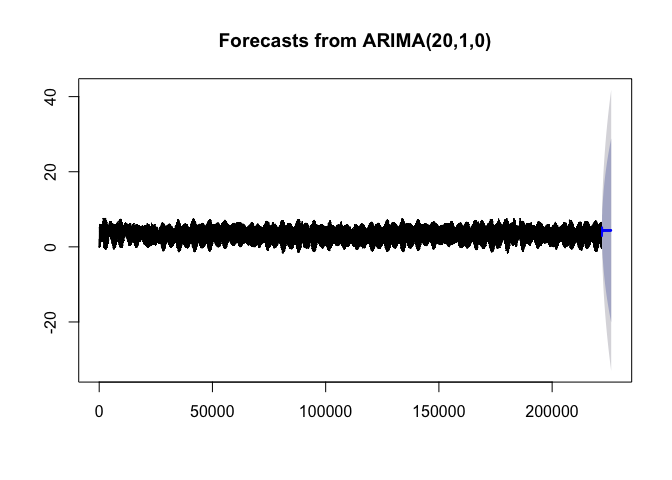
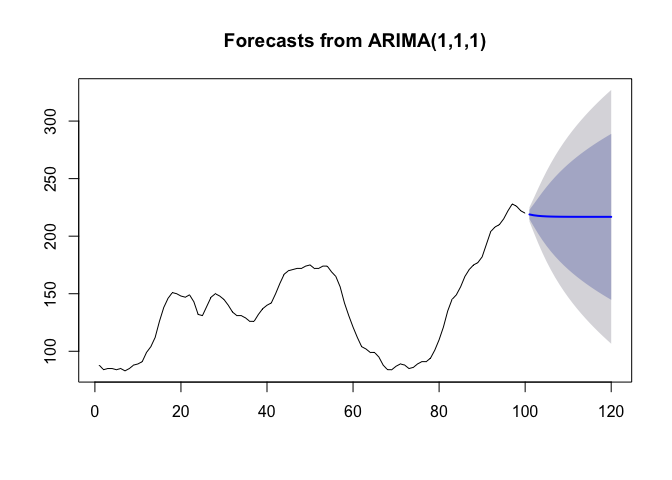

Tides\_ARIMA.Rmd
================

``` r
library(wrapr)
```

    ## Warning: package 'wrapr' was built under R version 3.5.2

``` r
library(forecast)
```

    ## Warning: package 'forecast' was built under R version 3.5.2

``` r
library(ggplot2)
```

    ## Warning: package 'ggplot2' was built under R version 3.5.2

``` r
tides <- readRDS('tides.RDS')
```

``` r
base_date_time =  as.POSIXct('2001/01/01 00:00', tz = "UTC")
cut_date_time = as.POSIXct('2019/07/15 00:00', tz = "UTC")
```

``` r
dtrain <- tides[tides$dt<cut_date_time, , drop = FALSE]
dtest <- tides[tides$dt>=cut_date_time, , drop = FALSE]
```

``` r
wcount = 1440/6
print(wcount)
```

    ## [1] 240

``` r
model <- auto.arima(dtrain$tide_feet,
                    max.p = wcount,
                    max.q = wcount,
                    max.P = wcount,
                    max.Q = wcount,
                    max.d = wcount,
                    max.D = wcount,
                    stepwise = TRUE,
                    nmodels = 16*wcount,
                    max.order = 4*wcount,
                    approximation = TRUE,
                    parallel = TRUE,
                    num.cores = 4)
```

    ## Warning in auto.arima(dtrain$tide_feet, max.p = wcount, max.q = wcount, :
    ## Parallel computer is only implemented when stepwise=FALSE, the model will
    ## be fit in serial.

``` r
print(model)
```

    ## Series: dtrain$tide_feet 
    ## ARIMA(20,1,0) 
    ## 
    ## Coefficients:
    ##          ar1     ar2     ar3     ar4     ar5     ar6     ar7     ar8
    ##       0.0356  0.1215  0.1578  0.0995  0.1098  0.2102  0.2190  0.1054
    ## s.e.  0.0021  0.0021  0.0021  0.0021  0.0021  0.0021  0.0022  0.0022
    ##          ar9    ar10    ar11    ar12     ar13     ar14     ar15     ar16
    ##       0.0909  0.1314  0.1102  0.0078  -0.0161  -0.0498  -0.0568  -0.0945
    ## s.e.  0.0023  0.0022  0.0022  0.0023   0.0022   0.0022   0.0022   0.0021
    ##          ar17     ar18     ar19     ar20
    ##       -0.0992  -0.0943  -0.0630  -0.0471
    ## s.e.   0.0021   0.0021   0.0021   0.0021
    ## 
    ## sigma^2 estimated as 0.001311:  log likelihood=421727.6
    ## AIC=-843413.2   AICc=-843413.2   BIC=-843196.7

``` r
pred <- forecast(model, h = nrow(dtest))
plot(pred)
```

<!-- -->

``` r
dtrain$pred <- pred$mean[1:nrow(dtrain)]
dtest$pred <- pred$mean[nrow(dtrain) + (1:nrow(dtest))]
```


The above is, unfortunately, pretty typical for uncontrolled ARIMA methods.  From the [package help](https://www.rdocumentation.org/packages/forecast/versions/8.7/topics/auto.arima):

``` r
fit <- auto.arima(WWWusage)
plot(forecast(fit,h=20))
```

<!-- -->


A better approach can be found [here]((https://htmlpreview.github.io/?https://github.com/OVVO-Financial/NNS/blob/NNS-Beta-Version/examples/tides.html).
