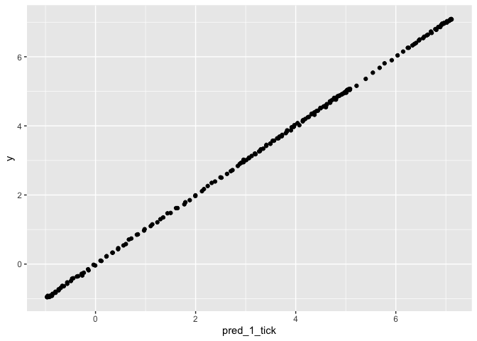
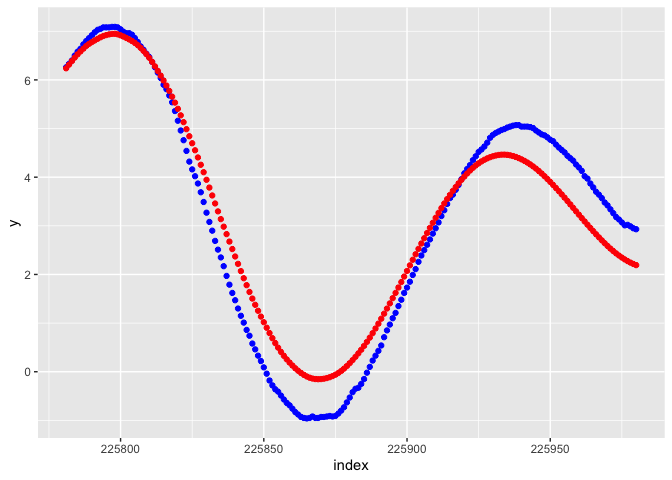

Tides_ARIMA.Rmd
================

``` r
library(wrapr)
library(ggplot2)
```

``` r
tides <- readRDS('tides.RDS')
```

``` r
base_date_time =  as.POSIXct('2001/01/01 00:00', tz = "UTC")
cut_date_time = as.POSIXct('2019/07/15 00:00', tz = "UTC")
```

``` r
# get rolling windows for brute force modeling
vec <- tides$tide_feet
window_len <- 100
x_values <- lapply(1:(length(vec) - (window_len)), function(i) {vec[(1:window_len) + i - 1]}) 
y_values <- vapply(1:(length(vec) - (window_len)), function(i) {vec[window_len + i]}, numeric(1))
m <- matrix(unlist(x_values), nrow=window_len, ncol=length(x_values))
m <- t(m)
d <- as.data.frame(m)
vars <- colnames(d)
d$y <- y_values
```

``` r
n_test <- 200
is_train <- c(rep(TRUE, nrow(d) - n_test), rep(FALSE, n_test))
dtrain <- d[is_train == TRUE, , drop = FALSE]
dtest <- d[is_train == FALSE, , drop = FALSE]
```

``` r
f <- mk_formula("y", vars)
model <- lm(f, data=dtrain)


dtrain$pred_1_tick <- predict(model, newdata = dtrain)
dtest$pred_1_tick <- predict(model, newdata = dtest)
```

``` r
# 1 tick out
ggplot(data=dtest,
       aes(x=pred_1_tick, y=y)) + geom_point()
```

<!-- -->

``` r
state = dtest[1, vars]
rownames(state) <- NULL
pred = predict(model, newdata=state)
preds = rep(0, nrow(dtest))
preds[1] = pred

for (i in 2:nrow(dtest)) {
  state <- as.data.frame(matrix(c(as.numeric(state[1, ])[2:window_len], pred), nrow=1, ncol=window_len))
  colnames(state) <- vars
  pred = predict(model, newdata=state)
  preds[i] = pred
}
```

``` r
dtest$project <- preds
ggplot(data=dtest,
       aes(x=project, y=y)) + geom_point()
```

<!-- -->

``` r
plot_frame <- dtest[, c("project", "y")]
plot_frame["index"] = (nrow(dtrain) + 1):(nrow(dtrain) + nrow(dtest))

ggplot(data=plot_frame,
       aes(x=index)) + geom_point(aes(y=y), color="blue") + geom_point(aes(y=project), color="red")
```

<!-- -->
