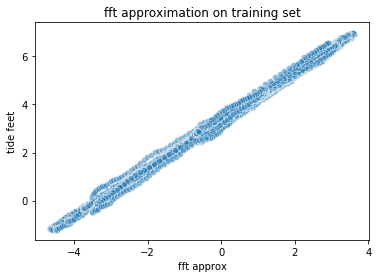
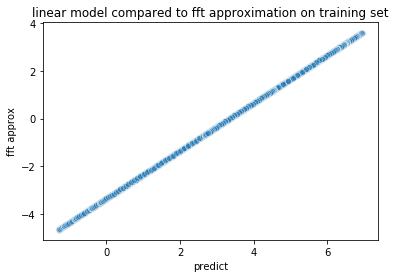
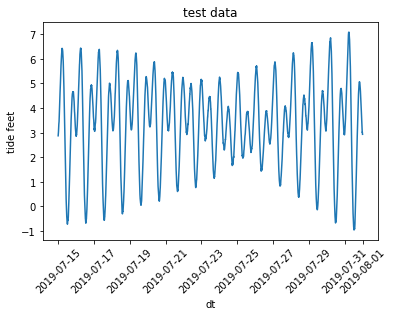
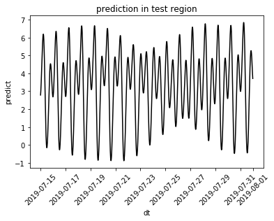
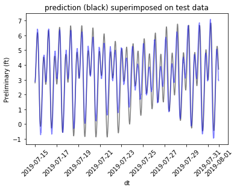
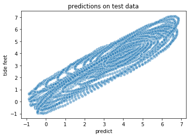
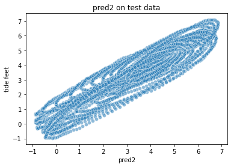

```python

```

Simple use the FFT to fit history tide data.  

Data from https://tidesandcurrents.noaa.gov/waterlevels.html?id=9414290&units=standard&bdate=20190701&edate=20190801&timezone=GMT&datum=MLLW&interval=6&action=data


```python
import math
import datetime
import pytz
import glob
import functools
import operator
import numpy
import pandas
import matplotlib.pyplot
import matplotlib.pylab
import seaborn
import sklearn.linear_model
import sklearn.metrics
import vtreat.cross_plan

from pandas.plotting import register_matplotlib_converters
register_matplotlib_converters()
```


```python
date_fmt = '%Y/%m/%d %H:%M'
tz = pytz.utc
    
def parse_date(dtstr):
    d0 = datetime.datetime.strptime(dtstr, date_fmt)
    return d0.replace(tzinfo=tz)

base_date_time = datetime.datetime(2001, 1, 1, tzinfo=tz)
first_date_time = datetime.datetime(2019, 6, 1, tzinfo=tz)
cut_date_time = datetime.datetime(2019, 7, 15, tzinfo=tz)
```


```python
print("TZ NAME: {tz}".format(tz=base_date_time.tzname()))
```

    TZ NAME: UTC


```python
d0 = parse_date('2001/01/01 00:00')
(d0 - base_date_time).total_seconds()
```


    0.0


```python
print("TZ NAME: {tz}".format(tz=d0.tzname()))
```

    TZ NAME: UTC


```python
tides = pandas.read_pickle('tides.pickle.gz')
```


```python
tides['train'] = tides['dt']<cut_date_time
```


```python
tides.head()
```


<div>
<style scoped>
    .dataframe tbody tr th:only-of-type {
        vertical-align: middle;
    }

    .dataframe tbody tr th {
        vertical-align: top;
    }

    .dataframe thead th {
        text-align: right;
    }
</style>
<table border="1" class="dataframe">
  <thead>
    <tr style="text-align: right;">
      <th></th>
      <th>Date</th>
      <th>Time (GMT)</th>
      <th>Predicted (ft)</th>
      <th>Preliminary (ft)</th>
      <th>Verified (ft)</th>
      <th>dt</th>
      <th>dts</th>
      <th>tide feet</th>
      <th>train</th>
    </tr>
  </thead>
  <tbody>
    <tr>
      <th>0</th>
      <td>2017/01/01</td>
      <td>00:00</td>
      <td>1.849</td>
      <td>NaN</td>
      <td>2.12</td>
      <td>2017-01-01 00:00:00+00:00</td>
      <td>504921600.0</td>
      <td>2.12</td>
      <td>True</td>
    </tr>
    <tr>
      <th>1</th>
      <td>2017/01/01</td>
      <td>00:06</td>
      <td>1.695</td>
      <td>NaN</td>
      <td>1.97</td>
      <td>2017-01-01 00:06:00+00:00</td>
      <td>504921960.0</td>
      <td>1.97</td>
      <td>True</td>
    </tr>
    <tr>
      <th>2</th>
      <td>2017/01/01</td>
      <td>00:12</td>
      <td>1.543</td>
      <td>NaN</td>
      <td>1.88</td>
      <td>2017-01-01 00:12:00+00:00</td>
      <td>504922320.0</td>
      <td>1.88</td>
      <td>True</td>
    </tr>
    <tr>
      <th>3</th>
      <td>2017/01/01</td>
      <td>00:18</td>
      <td>1.393</td>
      <td>NaN</td>
      <td>1.78</td>
      <td>2017-01-01 00:18:00+00:00</td>
      <td>504922680.0</td>
      <td>1.78</td>
      <td>True</td>
    </tr>
    <tr>
      <th>4</th>
      <td>2017/01/01</td>
      <td>00:24</td>
      <td>1.247</td>
      <td>NaN</td>
      <td>1.66</td>
      <td>2017-01-01 00:24:00+00:00</td>
      <td>504923040.0</td>
      <td>1.66</td>
      <td>True</td>
    </tr>
  </tbody>
</table>
</div>


```python
tides = tides.loc[tides['dt']>=first_date_time, :]
tides.reset_index(inplace=True, drop=True)
```


```python
dtrain = tides.loc[tides['train'], :].copy()
dtrain.reset_index(inplace=True, drop=True)
```


```python
xform = numpy.fft.fft(dtrain['tide feet'])
```


```python
# freqs are defined as cycles per sample spacing
freqs = numpy.fft.fftfreq(dtrain.shape[0])
```


```python
sample_spacing_seconds = dtrain['dts'][1] - dtrain['dts'][0]
```


```python
periods_seconds = numpy.asarray([sample_spacing_seconds/f for f in freqs])
```

    /Users/johnmount/anaconda3/envs/aiAcademy/lib/python3.7/site-packages/ipykernel_launcher.py:1: RuntimeWarning: divide by zero encountered in double_scalars
      """Entry point for launching an IPython kernel.


```python
cutoff = 10**math.floor(numpy.log(-numpy.sort(-abs(xform))[50])/numpy.log(10))
cutoff
```


    100


```python
pick = (abs(xform) >= cutoff) & (periods_seconds <= 120 * 86400)
sum(pick)
```


    90


```python
xform[numpy.logical_not(pick)] = 0j
```


```python
back = numpy.real(numpy.fft.ifft(xform))
```


```python
dtrain['fft approx'] = back
```


```python
seaborn.scatterplot(x='fft approx', y='tide feet', 
                    data=dtrain, 
                    alpha=0.5)
info = matplotlib.pyplot.title("fft approximation on training set")
```


    

    


```python
sklearn.metrics.r2_score(dtrain['tide feet'], dtrain['fft approx'])
```


    -2.238582384820625


```python
# freqs are defined as cycles per sample spacing
freqs = numpy.fft.fftfreq(dtrain.shape[0])
freqs = numpy.sort(numpy.unique([abs(f) for f in freqs[pick]]))
freqs = [f for f in freqs if f > 0]
```


```python
periods_seconds = [sample_spacing_seconds/f for f in freqs]
```


```python

```


```python
vars = []
for ps in periods_seconds:
    vs = 'sin(second/' + str(ps) + ')'
    dtrain[vs] = numpy.sin(2*numpy.pi*dtrain['dts']/ps)
    tides[vs] = numpy.sin(2*numpy.pi*tides['dts']/ps)
    vc = 'cos(second/' + str(ps) + ')'
    dtrain[vc] = numpy.cos(2*numpy.pi*dtrain['dts']/ps)
    tides[vc] = numpy.cos(2*numpy.pi*tides['dts']/ps)
    vars = vars + [vs, vc]
    
```


```python
fitter = sklearn.linear_model.ElasticNet(fit_intercept=True, 
                                         alpha = 1e-4,
                                         max_iter=10000)
fitter.fit(dtrain[vars], dtrain['tide feet'])
#fitter.coef_
```


    ElasticNet(alpha=0.0001, copy_X=True, fit_intercept=True, l1_ratio=0.5,
               max_iter=10000, normalize=False, positive=False, precompute=False,
               random_state=None, selection='cyclic', tol=0.0001, warm_start=False)


```python
dtrain['predict'] = fitter.predict(dtrain[vars])
```


```python
seaborn.scatterplot(x='predict', y='fft approx', 
                    data=dtrain, alpha=0.5)
info = matplotlib.pyplot.title("linear model compared to fft approximation on training set")
```


    

    


Now try to extrapolate.


```python
tides['predict'] = fitter.predict(tides[vars])
```


```python
dtest = tides.loc[numpy.logical_not(tides['train']), :].copy()
dtest.reset_index(inplace=True, drop=True)
```


```python
seaborn.lineplot(x='dt', y='tide feet', 
                 data=dtest)
info = matplotlib.pylab.xticks(rotation=45)
info = matplotlib.pyplot.title("test data")
```


    

    


```python
seaborn.lineplot(x='dt', y='predict', 
                 data=dtest, color='black')
info = matplotlib.pylab.xticks(rotation=45)
info = matplotlib.pyplot.title("prediction in test region")
```


    

    


```python
test_plot = tides.loc[numpy.logical_not(tides['train']), :]
seaborn.lineplot(x='dt', y='predict', 
                 data=test_plot,
                 color='black',
                 alpha=0.5)
seaborn.lineplot(x='dt', y='Preliminary (ft)', 
                 data=test_plot, 
                 color='blue',
                 alpha=0.5)
info = matplotlib.pylab.xticks(rotation=45)
info = matplotlib.pyplot.title("prediction (black) superimposed on test data")
```


    

    


```python
seaborn.scatterplot(x='predict', y='tide feet', 
                    data=dtest, 
                    alpha=0.5)
info = matplotlib.pyplot.title("predictions on test data")
```


    

    


```python
sklearn.metrics.r2_score(dtest['tide feet'], dtest['predict'])
```


    0.8098615395692726


Now try to cross-validate for better regularization parameters.


```python
alphas = [ 10 ** k for k in range(-5, 5, 1) ]
print(alphas)
l1_ratios = numpy.arange(0, 1, 0.05)
print(l1_ratios)
grid = [ [ {"alpha": alpha, "l1_ratio": l1_ratio} for alpha in alphas ] for l1_ratio in l1_ratios ]
grid = functools.reduce(operator.concat, grid)
grid[0]
```

    [1e-05, 0.0001, 0.001, 0.01, 0.1, 1, 10, 100, 1000, 10000]
    [0.   0.05 0.1  0.15 0.2  0.25 0.3  0.35 0.4  0.45 0.5  0.55 0.6  0.65
     0.7  0.75 0.8  0.85 0.9  0.95]


    {'alpha': 1e-05, 'l1_ratio': 0.0}


```python
def cross_predict_model(fitter, X, Y, plan):
    preds = numpy.zeros(X.shape[0])
    for g in range(len(plan)):
        pi = plan[g]
        model = fitter.fit(X.iloc[pi["train"]], Y.iloc[pi["train"]])
        predg = model.predict(X.iloc[pi["app"]])
        preds[pi["app"]] = predg
    return preds

def est_quality(settings, plan, dtrain, mvars, outcome='y'):
    fitter = sklearn.linear_model.ElasticNet(alpha = settings["alpha"], 
                                             l1_ratio = settings["l1_ratio"], fit_intercept=True)
    preds = cross_predict_model(fitter, dtrain[mvars], dtrain[outcome], plan)
    mean_sq_error = numpy.mean((dtrain[outcome] - preds)**2)
    return mean_sq_error
```


```python
fitter = sklearn.linear_model.ElasticNet(fit_intercept=True, 
                                         max_iter=10000)
cross_plan = vtreat.cross_plan.order_cross_plan(k_folds=5, order_vector=dtrain['dts'])
```


```python
%%capture
param_evals = [ {"settings" : settings, "loss" : est_quality(settings, cross_plan, dtrain, vars, 'tide feet')} for settings in grid ]
```


```python
min_loss = numpy.min([ q["loss"] for q in param_evals ])
best_params = [ q for q in param_evals if q["loss"] <= min_loss + 1e-9 ]
best_params
```


    [{'settings': {'alpha': 0.001, 'l1_ratio': 0.9500000000000001},
      'loss': 0.25550772437890235}]


```python
settings = best_params[0]["settings"]
fitter = sklearn.linear_model.ElasticNet(alpha = settings["alpha"], 
                                         l1_ratio = settings["l1_ratio"], 
                                         fit_intercept=True,
                                         max_iter=1000)
model = fitter.fit(dtrain[vars], dtrain['tide feet'])
```


```python
dtest['pred2'] = fitter.predict(dtest[vars])
```


```python
seaborn.scatterplot(x='pred2', y='tide feet', 
                    data=dtest, 
                    alpha=0.5)
info = matplotlib.pyplot.title("pred2 on test data")
```


    

    


```python
sklearn.metrics.r2_score(dtest['tide feet'], dtest['pred2'])
```


    0.8133030502543819


No real change in this case.
