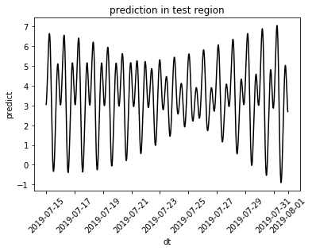
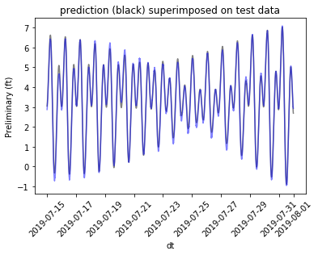
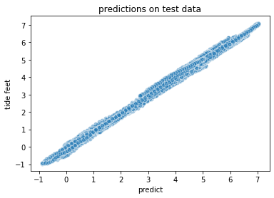
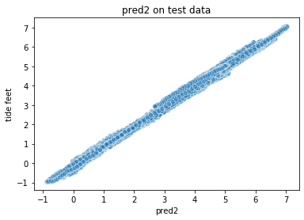

```python

```

Pre-stored harmonics to fit tide data.

Data from https://tidesandcurrents.noaa.gov/waterlevels.html?id=9414290&units=standard&bdate=20190701&edate=20190801&timezone=GMT&datum=MLLW&interval=6&action=data


```python
import math
import datetime
import pytz
import glob
import functools
import operator
import numpy
import pandas
import matplotlib.pyplot
import matplotlib.pylab
import seaborn
import sklearn.linear_model
import sklearn.metrics
import vtreat.cross_plan

from pandas.plotting import register_matplotlib_converters
register_matplotlib_converters()
```


```python
harmonics = pandas.read_csv('harmonics.csv')
harmonics.head()
```


<div>
<style scoped>
    .dataframe tbody tr th:only-of-type {
        vertical-align: middle;
    }

    .dataframe tbody tr th {
        vertical-align: top;
    }

    .dataframe thead th {
        text-align: right;
    }
</style>
<table border="1" class="dataframe">
  <thead>
    <tr style="text-align: right;">
      <th></th>
      <th>name</th>
      <th>sname</th>
      <th>speed</th>
      <th>code</th>
      <th>i1</th>
      <th>i2</th>
      <th>i3</th>
      <th>i4</th>
      <th>i5</th>
      <th>i6</th>
      <th>phi</th>
      <th>nodal</th>
      <th>in_hc4</th>
      <th>in_hc7</th>
      <th>in_hc37</th>
      <th>in_hc60</th>
      <th>in_hc114</th>
    </tr>
  </thead>
  <tbody>
    <tr>
      <th>0</th>
      <td>aSa</td>
      <td>aSa</td>
      <td>0.041067</td>
      <td>ZZAZZYZ</td>
      <td>0</td>
      <td>0</td>
      <td>1</td>
      <td>0</td>
      <td>0</td>
      <td>-1</td>
      <td>0</td>
      <td>z</td>
      <td>False</td>
      <td>False</td>
      <td>False</td>
      <td>False</td>
      <td>False</td>
    </tr>
    <tr>
      <th>1</th>
      <td>Sa</td>
      <td>Sa</td>
      <td>0.041069</td>
      <td>ZZAZZZZ</td>
      <td>0</td>
      <td>0</td>
      <td>1</td>
      <td>0</td>
      <td>0</td>
      <td>0</td>
      <td>0</td>
      <td>z</td>
      <td>False</td>
      <td>False</td>
      <td>True</td>
      <td>True</td>
      <td>True</td>
    </tr>
    <tr>
      <th>2</th>
      <td>Ssa</td>
      <td>Ssa</td>
      <td>0.082137</td>
      <td>ZZBZZZZ</td>
      <td>0</td>
      <td>0</td>
      <td>2</td>
      <td>0</td>
      <td>0</td>
      <td>0</td>
      <td>0</td>
      <td>z</td>
      <td>False</td>
      <td>False</td>
      <td>True</td>
      <td>True</td>
      <td>True</td>
    </tr>
    <tr>
      <th>3</th>
      <td>Sta</td>
      <td>Sta</td>
      <td>0.123204</td>
      <td>ZZCZZYY</td>
      <td>0</td>
      <td>0</td>
      <td>3</td>
      <td>0</td>
      <td>0</td>
      <td>-1</td>
      <td>270</td>
      <td>x</td>
      <td>False</td>
      <td>False</td>
      <td>False</td>
      <td>False</td>
      <td>False</td>
    </tr>
    <tr>
      <th>4</th>
      <td>MSm</td>
      <td>MSm</td>
      <td>0.471521</td>
      <td>ZAXAZZZ</td>
      <td>0</td>
      <td>1</td>
      <td>-2</td>
      <td>1</td>
      <td>0</td>
      <td>0</td>
      <td>0</td>
      <td>x</td>
      <td>False</td>
      <td>False</td>
      <td>False</td>
      <td>False</td>
      <td>False</td>
    </tr>
  </tbody>
</table>
</div>


From: https://cran.r-project.org/web/packages/TideHarmonics/TideHarmonics.pdf

> The speed (angular frequency) in degrees per hour. Derived from the Doodson number. To calculate the period in hours, divide 360 by the speed.


```python
harmonics['period_seconds'] = (360/harmonics['speed'])*60*60
harmonics['period_days'] = harmonics['period_seconds']/86400
harmonics.head()
```


<div>
<style scoped>
    .dataframe tbody tr th:only-of-type {
        vertical-align: middle;
    }

    .dataframe tbody tr th {
        vertical-align: top;
    }

    .dataframe thead th {
        text-align: right;
    }
</style>
<table border="1" class="dataframe">
  <thead>
    <tr style="text-align: right;">
      <th></th>
      <th>name</th>
      <th>sname</th>
      <th>speed</th>
      <th>code</th>
      <th>i1</th>
      <th>i2</th>
      <th>i3</th>
      <th>i4</th>
      <th>i5</th>
      <th>i6</th>
      <th>phi</th>
      <th>nodal</th>
      <th>in_hc4</th>
      <th>in_hc7</th>
      <th>in_hc37</th>
      <th>in_hc60</th>
      <th>in_hc114</th>
      <th>period_seconds</th>
      <th>period_days</th>
    </tr>
  </thead>
  <tbody>
    <tr>
      <th>0</th>
      <td>aSa</td>
      <td>aSa</td>
      <td>0.041067</td>
      <td>ZZAZZYZ</td>
      <td>0</td>
      <td>0</td>
      <td>1</td>
      <td>0</td>
      <td>0</td>
      <td>-1</td>
      <td>0</td>
      <td>z</td>
      <td>False</td>
      <td>False</td>
      <td>False</td>
      <td>False</td>
      <td>False</td>
      <td>3.155844e+07</td>
      <td>365.259722</td>
    </tr>
    <tr>
      <th>1</th>
      <td>Sa</td>
      <td>Sa</td>
      <td>0.041069</td>
      <td>ZZAZZZZ</td>
      <td>0</td>
      <td>0</td>
      <td>1</td>
      <td>0</td>
      <td>0</td>
      <td>0</td>
      <td>0</td>
      <td>z</td>
      <td>False</td>
      <td>False</td>
      <td>True</td>
      <td>True</td>
      <td>True</td>
      <td>3.155693e+07</td>
      <td>365.242279</td>
    </tr>
    <tr>
      <th>2</th>
      <td>Ssa</td>
      <td>Ssa</td>
      <td>0.082137</td>
      <td>ZZBZZZZ</td>
      <td>0</td>
      <td>0</td>
      <td>2</td>
      <td>0</td>
      <td>0</td>
      <td>0</td>
      <td>0</td>
      <td>z</td>
      <td>False</td>
      <td>False</td>
      <td>True</td>
      <td>True</td>
      <td>True</td>
      <td>1.577847e+07</td>
      <td>182.621139</td>
    </tr>
    <tr>
      <th>3</th>
      <td>Sta</td>
      <td>Sta</td>
      <td>0.123204</td>
      <td>ZZCZZYY</td>
      <td>0</td>
      <td>0</td>
      <td>3</td>
      <td>0</td>
      <td>0</td>
      <td>-1</td>
      <td>270</td>
      <td>x</td>
      <td>False</td>
      <td>False</td>
      <td>False</td>
      <td>False</td>
      <td>False</td>
      <td>1.051915e+07</td>
      <td>121.749364</td>
    </tr>
    <tr>
      <th>4</th>
      <td>MSm</td>
      <td>MSm</td>
      <td>0.471521</td>
      <td>ZAXAZZZ</td>
      <td>0</td>
      <td>1</td>
      <td>-2</td>
      <td>1</td>
      <td>0</td>
      <td>0</td>
      <td>0</td>
      <td>x</td>
      <td>False</td>
      <td>False</td>
      <td>False</td>
      <td>False</td>
      <td>False</td>
      <td>2.748551e+06</td>
      <td>31.811937</td>
    </tr>
  </tbody>
</table>
</div>


```python
periods_seconds = harmonics['period_seconds'][harmonics['in_hc60']]
periods_seconds = numpy.sort(numpy.unique(numpy.asarray(periods_seconds)))
periods_seconds
```


    array([1.45509677e+04, 1.45643990e+04, 1.47188519e+04, 1.47325952e+04,
           1.48243327e+04, 1.49047215e+04, 1.49986220e+04, 2.15704711e+04,
           2.16000000e+04, 2.19414672e+04, 2.19720214e+04, 2.21766940e+04,
           2.23570822e+04, 2.25690260e+04, 2.87737401e+04, 2.94377039e+04,
           2.94927281e+04, 2.98094429e+04, 3.01906907e+04, 4.17850258e+04,
           4.23162784e+04, 4.24300716e+04, 4.30820454e+04, 4.31409449e+04,
           4.32000001e+04, 4.32592172e+04, 4.38898329e+04, 4.39983869e+04,
           4.45878082e+04, 4.47141644e+04, 4.48412388e+04, 4.54536159e+04,
           4.55700536e+04, 4.63383274e+04, 4.64593479e+04, 4.72581626e+04,
           4.74001310e+04, 8.03018676e+04, 8.07126411e+04, 8.31545168e+04,
           8.35450446e+04, 8.56961158e+04, 8.59294773e+04, 8.61640908e+04,
           8.64000002e+04, 8.66372049e+04, 8.68757043e+04, 8.89526598e+04,
           8.94283288e+04, 9.24052782e+04, 9.29496300e+04, 9.62029920e+04,
           9.67260835e+04, 1.00254195e+05, 1.00822400e+05, 1.18029240e+06,
           1.27572146e+06, 2.38071348e+06, 1.57784664e+07, 3.15569329e+07])


```python
date_fmt = '%Y/%m/%d %H:%M'
tz = pytz.utc
    
def parse_date(dtstr):
    d0 = datetime.datetime.strptime(dtstr, date_fmt)
    return d0.replace(tzinfo=tz)

base_date_time = datetime.datetime(2001, 1, 1, tzinfo=tz)
first_date_time = datetime.datetime(2019, 6, 1, tzinfo=tz)
cut_date_time = datetime.datetime(2019, 7, 15, tzinfo=tz)
```


```python
print("TZ NAME: {tz}".format(tz=base_date_time.tzname()))
```

    TZ NAME: UTC


```python
d0 = parse_date('2001/01/01 00:00')
(d0 - base_date_time).total_seconds()
```


    0.0


```python
print("TZ NAME: {tz}".format(tz=d0.tzname()))
```

    TZ NAME: UTC


```python
tides = pandas.read_pickle('tides.pickle.gz')
```


```python
tides['train'] = tides['dt']<cut_date_time
```


```python
tides.head()
```


<div>
<style scoped>
    .dataframe tbody tr th:only-of-type {
        vertical-align: middle;
    }

    .dataframe tbody tr th {
        vertical-align: top;
    }

    .dataframe thead th {
        text-align: right;
    }
</style>
<table border="1" class="dataframe">
  <thead>
    <tr style="text-align: right;">
      <th></th>
      <th>Date</th>
      <th>Time (GMT)</th>
      <th>Predicted (ft)</th>
      <th>Preliminary (ft)</th>
      <th>Verified (ft)</th>
      <th>dt</th>
      <th>dts</th>
      <th>tide feet</th>
      <th>train</th>
    </tr>
  </thead>
  <tbody>
    <tr>
      <th>0</th>
      <td>2017/01/01</td>
      <td>00:00</td>
      <td>1.849</td>
      <td>NaN</td>
      <td>2.12</td>
      <td>2017-01-01 00:00:00+00:00</td>
      <td>504921600.0</td>
      <td>2.12</td>
      <td>True</td>
    </tr>
    <tr>
      <th>1</th>
      <td>2017/01/01</td>
      <td>00:06</td>
      <td>1.695</td>
      <td>NaN</td>
      <td>1.97</td>
      <td>2017-01-01 00:06:00+00:00</td>
      <td>504921960.0</td>
      <td>1.97</td>
      <td>True</td>
    </tr>
    <tr>
      <th>2</th>
      <td>2017/01/01</td>
      <td>00:12</td>
      <td>1.543</td>
      <td>NaN</td>
      <td>1.88</td>
      <td>2017-01-01 00:12:00+00:00</td>
      <td>504922320.0</td>
      <td>1.88</td>
      <td>True</td>
    </tr>
    <tr>
      <th>3</th>
      <td>2017/01/01</td>
      <td>00:18</td>
      <td>1.393</td>
      <td>NaN</td>
      <td>1.78</td>
      <td>2017-01-01 00:18:00+00:00</td>
      <td>504922680.0</td>
      <td>1.78</td>
      <td>True</td>
    </tr>
    <tr>
      <th>4</th>
      <td>2017/01/01</td>
      <td>00:24</td>
      <td>1.247</td>
      <td>NaN</td>
      <td>1.66</td>
      <td>2017-01-01 00:24:00+00:00</td>
      <td>504923040.0</td>
      <td>1.66</td>
      <td>True</td>
    </tr>
  </tbody>
</table>
</div>


```python
dtrain = tides.loc[tides['train'], :].copy()
dtrain.reset_index(inplace=True, drop=True)
```


```python
vars = []
for ps in periods_seconds:
    vs = 'sin(second/' + str(ps) + ')'
    dtrain[vs] = numpy.sin(2*numpy.pi*dtrain['dts']/ps)
    tides[vs] = numpy.sin(2*numpy.pi*tides['dts']/ps)
    vc = 'cos(second/' + str(ps) + ')'
    dtrain[vc] = numpy.cos(2*numpy.pi*dtrain['dts']/ps)
    tides[vc] = numpy.cos(2*numpy.pi*tides['dts']/ps)
    vars = vars + [vs, vc]
    
```


```python
fitter = sklearn.linear_model.ElasticNet(fit_intercept=True, 
                                         alpha = 1e-4,
                                         max_iter=10000)
fitter.fit(dtrain[vars], dtrain['tide feet'])
#fitter.coef_
```


    ElasticNet(alpha=0.0001, copy_X=True, fit_intercept=True, l1_ratio=0.5,
               max_iter=10000, normalize=False, positive=False, precompute=False,
               random_state=None, selection='cyclic', tol=0.0001, warm_start=False)


```python
dtrain['predict'] = fitter.predict(dtrain[vars])
```

Now try to extrapolate.


```python
tides['predict'] = fitter.predict(tides[vars])
```


```python
dtest = tides.loc[numpy.logical_not(tides['train']), :].copy()
dtest.reset_index(inplace=True, drop=True)
```


```python
seaborn.lineplot(x='dt', y='tide feet', 
                 data=dtest)
info = matplotlib.pylab.xticks(rotation=45)
info = matplotlib.pyplot.title("test data")
```


    

    


```python
seaborn.lineplot(x='dt', y='predict', 
                 data=dtest, color='black')
info = matplotlib.pylab.xticks(rotation=45)
info = matplotlib.pyplot.title("prediction in test region")
```


    

    


```python
test_plot = tides.loc[numpy.logical_not(tides['train']), :]
seaborn.lineplot(x='dt', y='predict', 
                 data=test_plot,
                 color='black',
                 alpha=0.5)
seaborn.lineplot(x='dt', y='Preliminary (ft)', 
                 data=test_plot, 
                 color='blue',
                 alpha=0.5)
info = matplotlib.pylab.xticks(rotation=45)
info = matplotlib.pyplot.title("prediction (black) superimposed on test data")
```


    

    


```python
seaborn.scatterplot(x='predict', y='tide feet', 
                    data=dtest, 
                    alpha=0.5)
info = matplotlib.pyplot.title("predictions on test data")
```


    

    


```python
sklearn.metrics.r2_score(dtest['tide feet'], dtest['predict'])
```


    0.9913854788234292


Now try to cross-validate for better regularization parameters.


```python
alphas = [ 10 ** k for k in range(-5, 5, 1) ]
print(alphas)
l1_ratios = numpy.arange(0, 1, 0.05)
print(l1_ratios)
grid = [ [ {"alpha": alpha, "l1_ratio": l1_ratio} for alpha in alphas ] for l1_ratio in l1_ratios ]
grid = functools.reduce(operator.concat, grid)
grid[0]
```

    [1e-05, 0.0001, 0.001, 0.01, 0.1, 1, 10, 100, 1000, 10000]
    [0.   0.05 0.1  0.15 0.2  0.25 0.3  0.35 0.4  0.45 0.5  0.55 0.6  0.65
     0.7  0.75 0.8  0.85 0.9  0.95]


    {'alpha': 1e-05, 'l1_ratio': 0.0}


```python
def cross_predict_model(fitter, X, Y, plan):
    preds = numpy.zeros(X.shape[0])
    for g in range(len(plan)):
        pi = plan[g]
        model = fitter.fit(X.iloc[pi["train"]], Y.iloc[pi["train"]])
        predg = model.predict(X.iloc[pi["app"]])
        preds[pi["app"]] = predg
    return preds

def est_quality(settings, plan, dtrain, mvars, outcome='y'):
    fitter = sklearn.linear_model.ElasticNet(alpha = settings["alpha"], 
                                             l1_ratio = settings["l1_ratio"], fit_intercept=True)
    preds = cross_predict_model(fitter, dtrain[mvars], dtrain[outcome], plan)
    mean_sq_error = numpy.mean((dtrain[outcome] - preds)**2)
    return mean_sq_error
```


```python
fitter = sklearn.linear_model.ElasticNet(fit_intercept=True)
cross_plan = vtreat.cross_plan.order_cross_plan(k_folds=5, order_vector=dtrain['dts'])
```


```python
%%capture
param_evals = [ {"settings" : settings, "loss" : est_quality(settings, cross_plan, dtrain, vars, 'tide feet')} for settings in grid ]
```


```python
min_loss = numpy.min([ q["loss"] for q in param_evals ])
best_params = [ q for q in param_evals if q["loss"] <= min_loss + 1e-9 ]
best_params
```


    [{'settings': {'alpha': 0.001, 'l1_ratio': 0.9500000000000001},
      'loss': 0.1127819541365205}]


```python
settings = best_params[0]["settings"]
fitter = sklearn.linear_model.ElasticNet(alpha = settings["alpha"], 
                                         l1_ratio = settings["l1_ratio"], 
                                         fit_intercept=True,
                                         max_iter=1000)
model = fitter.fit(dtrain[vars], dtrain['tide feet'])
```


```python
dtest['pred2'] = fitter.predict(dtest[vars])
```


```python
seaborn.scatterplot(x='pred2', y='tide feet', 
                    data=dtest, 
                    alpha=0.5)
info = matplotlib.pyplot.title("pred2 on test data")
```


    

    


```python
sklearn.metrics.r2_score(dtest['tide feet'], dtest['pred2'])
```


    0.9914837650563733


No real change in this case.
