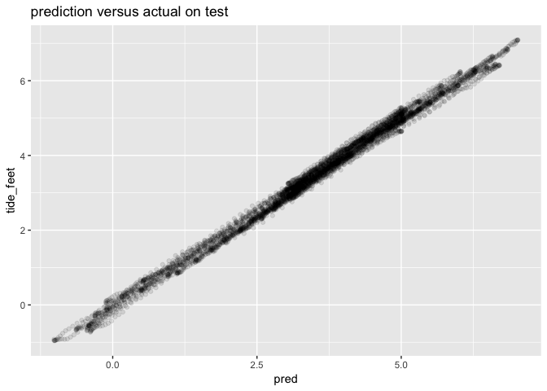

Tides.Rmd
================

Read data.

``` r
library(wrapr)
library(TideHarmonics)
library(ggplot2)
```

    ## Warning: package 'ggplot2' was built under R version 3.5.2

``` r
files <- list.files('tide_data',
               pattern='.*.csv') %.>%
  sort(.)

dat_list <- lapply(
  files,
  function(fi) {
     read.csv(paste0('tide_data/', fi),
              strip.white = TRUE, 
              na.strings = c("", "NA", "-"),
              stringsAsFactors = FALSE)
  })

tides = do.call(rbind, dat_list)
tides['tide_feet'] <- tides['Verified..ft.']
missing_v = is.na(tides['tide_feet'])
tides['tide_feet'][missing_v] <- tides['Preliminary..ft.'][missing_v]
summary(tides['tide_feet'])
```

    ##    tide_feet     
    ##  Min.   :-1.690  
    ##  1st Qu.: 2.110  
    ##  Median : 3.530  
    ##  Mean   : 3.355  
    ##  3rd Qu.: 4.690  
    ##  Max.   : 7.690

``` r
tides['dt'] <- as.POSIXct(paste(tides[['Date']], tides[['Time..GMT.']]), 
                          tz = "UTC")
head(tides)
```

    ##         Date Time..GMT. Predicted..ft. Preliminary..ft. Verified..ft.
    ## 1 2017/01/01      00:00          1.849               NA          2.12
    ## 2 2017/01/01      00:06          1.695               NA          1.97
    ## 3 2017/01/01      00:12          1.543               NA          1.88
    ## 4 2017/01/01      00:18          1.393               NA          1.78
    ## 5 2017/01/01      00:24          1.247               NA          1.66
    ## 6 2017/01/01      00:30          1.104               NA          1.50
    ##   tide_feet                  dt
    ## 1      2.12 2017-01-01 00:00:00
    ## 2      1.97 2017-01-01 00:06:00
    ## 3      1.88 2017-01-01 00:12:00
    ## 4      1.78 2017-01-01 00:18:00
    ## 5      1.66 2017-01-01 00:24:00
    ## 6      1.50 2017-01-01 00:30:00

``` r
deltas <- difftime(tides[['dt']][-1], 
                   tides[['dt']][-length(tides[['dt']])], 
                   units='secs')
summary(as.numeric(deltas))
```

    ##    Min. 1st Qu.  Median    Mean 3rd Qu.    Max. 
    ##     360     360     360     360     360     360

``` r
base_date_time =  as.POSIXct('2001/01/01 00:00', tz = "UTC")
first_date_time =  as.POSIXct('2019/06/01 00:00', tz = "UTC")
cut_date_time = as.POSIXct('2019/07/15 00:00', tz = "UTC")
```

``` r
#tides <- tides[tides$dt>first_date_time, , drop = FALSE]
dtrain <- tides[tides$dt<cut_date_time, , drop = FALSE]
dtest <- tides[tides$dt>=cut_date_time, , drop = FALSE]
```

``` r
model <- ftide(dtrain$tide_feet, dtrain$dt)
dtrain$pred <- predict(model,
                      from=dtrain$dt[1],
                      to=dtrain$dt[nrow(dtrain)],
                      by=0.1)
dtest$pred <- predict(model,
                      from=dtest$dt[1],
                      to=dtest$dt[nrow(dtest)],
                      by=0.1)
```

``` r
ggplot(aes(x=dt), data=dtest) +
  geom_line(aes(y=tide_feet), color='blue', alpha=0.5) + 
  geom_line(aes(y=pred), color='black', alpha=0.5) +
  ggtitle("prediction (blue) superimposed on actuals on test")
```

<!-- -->

``` r
ggplot(aes(x=pred, y=tide_feet), data=dtest) +
  geom_point(alpha=0.1) + 
  ggtitle("prediction versus actual on test")
```

<!-- -->
