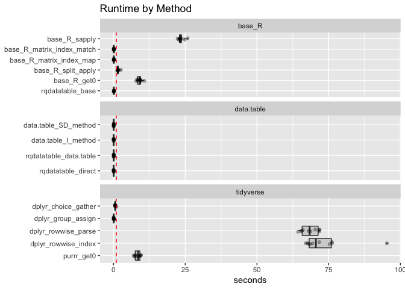
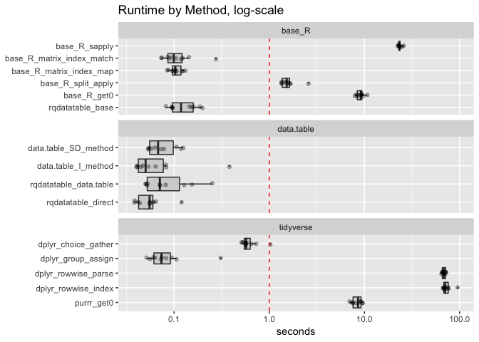

timings
================

For details please see these articles:

  * [Using a Column as a Column Index](http://www.win-vector.com/blog/2018/09/using-a-column-as-a-column-index/)
  * [Timing Column Indexing in R](http://www.win-vector.com/blog/2018/09/timing-column-indexing-in-r/)


``` r
library("microbenchmark")
library("dplyr")
```

    ## Warning: package 'dplyr' was built under R version 3.5.1

    ## 
    ## Attaching package: 'dplyr'

    ## The following objects are masked from 'package:stats':
    ## 
    ##     filter, lag

    ## The following objects are masked from 'package:base':
    ## 
    ##     intersect, setdiff, setequal, union

``` r
library("dtplyr")
library("tidyr")
library("purrr")
library("wrapr")
```

    ## 
    ## Attaching package: 'wrapr'

    ## The following object is masked from 'package:dplyr':
    ## 
    ##     coalesce

``` r
library("data.table")
```

    ## 
    ## Attaching package: 'data.table'

    ## The following object is masked from 'package:wrapr':
    ## 
    ##     :=

    ## The following object is masked from 'package:purrr':
    ## 
    ##     transpose

    ## The following objects are masked from 'package:dplyr':
    ## 
    ##     between, first, last

``` r
library("rqdatatable")
```

    ## Loading required package: rquery

``` r
library("ggplot2")
library("WVPlots")
```

``` r
mk_data <- function(n) {
  data.frame(x = seq_len(n) + 0.0,
             y = seq_len(n) + n + 0.0,
             choice = rep(c("x", "y"), ceiling(n/2))[1:n],
             stringsAsFactors = FALSE)
}
```

``` r
base_R_sapply <- function(df) {
  # https://community.rstudio.com/t/extracting-value-from-a-data-frame-where-column-name-to-extract-from-is-dynamically-determined-by-values-in-another-column/14585
  df$derived <- sapply( 
    seq_len(nrow(df)), 
    function(i) { 
      df[i, df$choice[[i]], drop = TRUE ]
    })
  df
}

base_R_matrix_index_match <- function(df) {
  # https://community.rstudio.com/t/extracting-value-from-a-data-frame-where-column-name-to-extract-from-is-dynamically-determined-by-values-in-another-column/14585
  dtmp <- df[, 
             intersect(df$choice, colnames(df)), 
             drop = FALSE]
  df$derived <- dtmp[
    cbind(seq_len(nrow(df)),
          match(df$choice, colnames(dtmp)))]
  df
}

base_R_matrix_index_map <- function(df) {
  # https://community.rstudio.com/t/extracting-value-from-a-data-frame-where-column-name-to-extract-from-is-dynamically-determined-by-values-in-another-column/14585
  dtmp <- df[, 
             intersect(df$choice, colnames(df)), 
             drop = FALSE]
  cmap <- seq_len(length(colnames(df)))
  names(cmap) <- colnames(df)
  df$derived <- dtmp[
    cbind(seq_len(nrow(df)),
          cmap[df$choice])]
  df
}

base_R_split_apply <- function(df) {
  df$id = seq_len(nrow(df))
  dfl = split(df, df$choice)
  dfl = lapply(dfl,
               function(dfli) {
                 pick = dfli$choice[[1]]
                 dfli$derived = dfli[[pick]]
                 dfli
               })
  df = do.call(rbind, dfl)
  df = df[order(df$id), , drop=FALSE]
  df$id <- NULL
  df
}

base_R_get0 <- function(df) {
  # http://www.win-vector.com/blog/2018/09/using-a-column-as-a-column-index/#comment-67008
  df$derived <-
    do.call(mapply,c(df,FUN = function(...)
      with(list(...),
           get0(choice,ifnotfound = NA, inherits = FALSE))))
  df
}

purrr_get0 <- function(df) {
  # http://www.win-vector.com/blog/2018/09/using-a-column-as-a-column-index/#comment-67007
  df$derived <-
    pmap_dbl(df, ~with(list(...), get0(choice, ifnotfound = NA,inherits = FALSE)))
  df
}

data.table_SD_method <- function(df) {
  # https://community.rstudio.com/t/extracting-value-from-a-data-frame-where-column-name-to-extract-from-is-dynamically-determined-by-values-in-another-column/14585
  dt <- as.data.table(df)
  dt[, derived := .SD[[choice]], by = choice][]
}

data.table_I_method <- function(df) {
  # https://community.rstudio.com/t/extracting-value-from-a-data-frame-where-column-name-to-extract-from-is-dynamically-determined-by-values-in-another-column/14585
  dt <- as.data.table(df)
  dt[, derived := dt[[choice]][.I], by=choice][]
}


dplyr_choice_gather <- function(df) {
  # https://community.rstudio.com/t/extracting-value-from-a-data-frame-where-column-name-to-extract-from-is-dynamically-determined-by-values-in-another-column/14585
  df <- df %>%
    mutate(id = seq_len(nrow(.)))
  df %>%
    gather("column", "derived", -id, -choice) %>%
    filter(column == choice) %>%
    select(-choice, -column) %>%
    right_join(df, by = "id") %>%
    select(-id)
}

dplyr_group_assign <- function(df) {
  # http://www.win-vector.com/blog/2018/09/using-a-column-as-a-column-index/
  df %>% 
    group_by(choice) %>%
    mutate(derived = .data[[ choice[[1]] ]]) %>%
    ungroup() 
}

dtplyr_group_assign <- function(df) {
  # http://www.win-vector.com/blog/2018/09/using-a-column-as-a-column-index/
  dt <- as.data.table(df)
  dt %>% 
    group_by(choice) %>%
    mutate(derived = .data[[ choice[[1]] ]]) %>%
    ungroup() 
}


dplyr_rowwise_parse <- function(df) {
  # http://www.win-vector.com/blog/2018/09/using-a-column-as-a-column-index/#comment-67006
  df %>%
    rowwise() %>% 
    mutate(derived = eval(parse(text = choice))) %>%
    ungroup()
}


dplyr_rowwise_index <- function(df) {
  df %>%
    rowwise() %>% 
    mutate(derived = .data[[choice]]) %>%
    ungroup()
}

rqdatatable_direct <- make_dt_lookup_by_column("choice", "derived")
```

``` r
df <- mk_data(3)

base_R_sapply(df)
```

    ##   x y choice derived
    ## 1 1 4      x       1
    ## 2 2 5      y       5
    ## 3 3 6      x       3

``` r
base_R_matrix_index_match(df)
```

    ##   x y choice derived
    ## 1 1 4      x       1
    ## 2 2 5      y       5
    ## 3 3 6      x       3

``` r
base_R_matrix_index_map(df)
```

    ##   x y choice derived
    ## 1 1 4      x       1
    ## 2 2 5      y       5
    ## 3 3 6      x       3

``` r
base_R_split_apply(df)
```

    ##     x y choice derived
    ## x.1 1 4      x       1
    ## y   2 5      y       5
    ## x.3 3 6      x       3

``` r
base_R_get0(df)
```

    ##   x y choice derived
    ## 1 1 4      x       1
    ## 2 2 5      y       5
    ## 3 3 6      x       3

``` r
data.table_SD_method(df)
```

    ##    x y choice derived
    ## 1: 1 4      x       1
    ## 2: 2 5      y       5
    ## 3: 3 6      x       3

``` r
data.table_I_method(df)
```

    ##    x y choice derived
    ## 1: 1 4      x       1
    ## 2: 2 5      y       5
    ## 3: 3 6      x       3

``` r
dplyr_choice_gather(df)
```

    ##   derived x y choice
    ## 1       1 1 4      x
    ## 2       5 2 5      y
    ## 3       3 3 6      x

``` r
dplyr_group_assign(df)
```

    ## # A tibble: 3 x 4
    ##       x     y choice derived
    ##   <dbl> <dbl> <chr>    <dbl>
    ## 1     1     4 x            1
    ## 2     2     5 y            5
    ## 3     3     6 x            3

``` r
dplyr_rowwise_parse(df)
```

    ## # A tibble: 3 x 4
    ##       x     y choice derived
    ##   <dbl> <dbl> <chr>    <dbl>
    ## 1     1     4 x            1
    ## 2     2     5 y            5
    ## 3     3     6 x            3

``` r
dplyr_rowwise_index(df)
```

    ## # A tibble: 3 x 4
    ##       x     y choice derived
    ##   <dbl> <dbl> <chr>    <dbl>
    ## 1     1     4 x            1
    ## 2     2     5 y            5
    ## 3     3     6 x            3

``` r
purrr_get0(df)
```

    ##   x y choice derived
    ## 1 1 4      x       1
    ## 2 2 5      y       5
    ## 3 3 6      x       3

``` r
lookup_by_column(df, "choice", "derived")
```

    ##    x y choice derived
    ## 1: 1 4      x       1
    ## 2: 2 5      y       5
    ## 3: 3 6      x       3

``` r
lookup_by_column(df, "choice", "derived",
                 f_dt_factory = make_dt_lookup_by_column)
```

    ##    x y choice derived
    ## 1: 1 4      x       1
    ## 2: 2 5      y       5
    ## 3: 3 6      x       3

``` r
rqdatatable_direct(df)
```

    ##    x y choice derived
    ## 1: 1 4      x       1
    ## 2: 2 5      y       5
    ## 3: 3 6      x       3

``` r
dtplyr_group_assign(df)
```

    ## Error in data.table::is.data.table(data): Column `x` not found in `.data`

``` r
df <- mk_data(1000000)

timings <- microbenchmark(
  base_R_sapply = base_R_sapply(df),
  base_R_matrix_index_match = base_R_matrix_index_match(df),
  base_R_matrix_index_map = base_R_matrix_index_map(df),
  base_R_split_apply = base_R_split_apply(df),
  base_R_get0 = base_R_get0(df),
  data.table_SD_method = data.table_SD_method(df),
  data.table_I_method = data.table_I_method(df),
  dplyr_choice_gather = dplyr_choice_gather(df),
  dplyr_group_assign = dplyr_group_assign(df),
  dplyr_rowwise_parse = dplyr_rowwise_parse(df),
  dplyr_rowwise_index = dplyr_rowwise_index(df),
  purrr_get0 = purrr_get0(df),
  rqdatatable_base = lookup_by_column(df, "choice", "derived"),
  rqdatatable_data.table = lookup_by_column(df, "choice", "derived",
                                            f_dt_factory = make_dt_lookup_by_column),
  rqdatatable_direct = rqdatatable_direct(df),
  unit = 's',
  times = 10L
)
saveRDS(timings, file = "timings.RDS")
```

``` r
tdf <- as.data.frame(timings)


tdf$seconds <- tdf$time/1e+9
tdf$method <- factor(as.character(tdf$expr),
                     rev(levels(tdf$expr)))

method_family <- qc(
  base_R_sapply = base_R,
  base_R_matrix_index_match = base_R,
  base_R_matrix_index_map = base_R,
  base_R_split_apply = base_R,
  base_R_get0 = base_R,
  purrr_get0 = tidyverse,
  data.table_SD_method = data.table,
  data.table_I_method = data.table,
  dplyr_choice_gather = tidyverse,
  dplyr_group_assign = tidyverse,
  dplyr_rowwise_parse = tidyverse,
  dplyr_rowwise_index = tidyverse,
  rqdatatable_base = base_R,
  rqdatatable_data.table = data.table,
  rqdatatable_direct = data.table
)

tdf$method_family <- method_family[as.character(tdf$method)]

tdf %.>%
  project_nse(., 
              groupby = "method",
              mean_seconds = mean(seconds)) %.>%
  orderby(., "mean_seconds")
```

    ##                        method mean_seconds
    ##  1:        rqdatatable_direct   0.05749327
    ##  2:      data.table_SD_method   0.07813813
    ##  3:       data.table_I_method   0.08768025
    ##  4:    rqdatatable_data.table   0.09620344
    ##  5:        dplyr_group_assign   0.09693442
    ##  6:   base_R_matrix_index_map   0.10515933
    ##  7: base_R_matrix_index_match   0.11784773
    ##  8:          rqdatatable_base   0.13066374
    ##  9:       dplyr_choice_gather   0.62650677
    ## 10:        base_R_split_apply   1.60048383
    ## 11:                purrr_get0   8.40143217
    ## 12:               base_R_get0   9.06148395
    ## 13:             base_R_sapply  23.54550663
    ## 14:       dplyr_rowwise_parse  68.37240328
    ## 15:       dplyr_rowwise_index  73.53886016

``` r
WVPlots::ScatterBoxPlotH(tdf, "seconds","method",  
                         title="Runtime by Method") +
  facet_wrap(~method_family, ncol = 1, drop = TRUE, scales = "free_y") +
  geom_hline(yintercept = 1, color = "red", linetype = 2) + 
  xlab(NULL)
```



``` r
WVPlots::ScatterBoxPlotH(tdf, "seconds","method",  
                         title="Runtime by Method, log-scale") + 
  scale_y_log10() +
  facet_wrap(~method_family, ncol = 1, drop = TRUE, scales = "free_y") +
  geom_hline(yintercept = 1, color = "red", linetype = 2) + 
  xlab(NULL)
```


