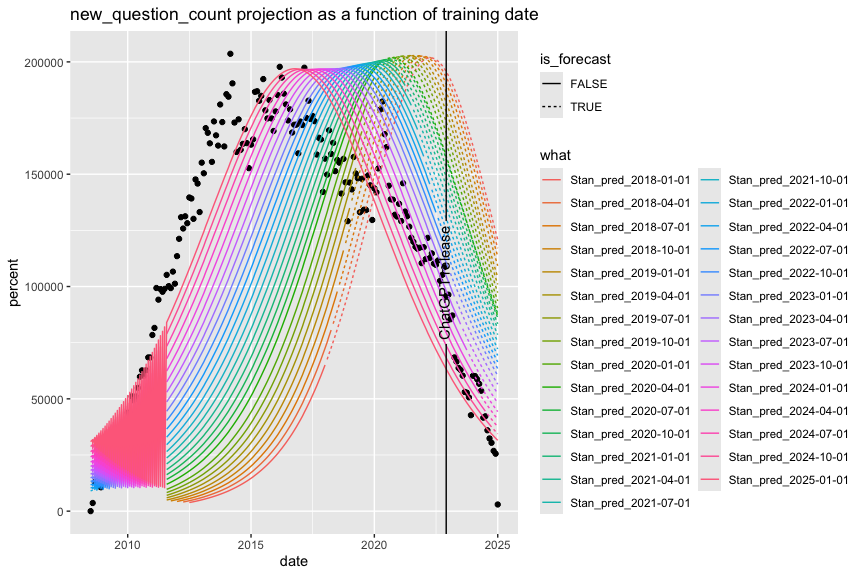

Bass Model by Stan
================
2025-03-14

See also:
<https://srdas.github.io/MLBook/productForecastingBassModel.html>

``` r
library(wrapr)
library(rstan)
```

    ## Loading required package: StanHeaders

    ## 
    ## rstan version 2.32.6 (Stan version 2.32.2)

    ## For execution on a local, multicore CPU with excess RAM we recommend calling
    ## options(mc.cores = parallel::detectCores()).
    ## To avoid recompilation of unchanged Stan programs, we recommend calling
    ## rstan_options(auto_write = TRUE)
    ## For within-chain threading using `reduce_sum()` or `map_rect()` Stan functions,
    ## change `threads_per_chain` option:
    ## rstan_options(threads_per_chain = 1)

``` r
library(ggplot2)
library(geomtextpath)
knitr::opts_chunk$set(fig.height = 6, fig.width = 9)
```

Data from:

<https://stackoverflow.blog/2017/09/06/incredible-growth-python/>
<https://trends.stackoverflow.co/?tags=python>

saved as: stackoverflow-trends-chart-python.svg exported to:
stackoverflow-trends-chart-python.png

converted with
<https://web.eecs.utk.edu/~dcostine/personal/PowerDeviceLib/DigiTest/index.html>

``` r
use_tag_trends = FALSE
if (use_tag_trends) {
  # read data
  d_all <- read.csv('tag_trends_Pyton.csv', stringsAsFactors = FALSE, strip.white = TRUE)
  d_all['date'] = as.Date(d_all[['date']])
  tag <- 'Python'
} else {
  # new data, shoehorn into previous format and names
  d_all <- read.csv(
    'stackoverflow-new-questions-over-time.2009-2024.csv',
    stringsAsFactors = FALSE, 
    strip.white = TRUE)
  tag <- 'new_question_count'
  d_all$tag <- tag
  d_all$percent <- d_all$NumQuestions
  d_all$date <- as.Date(paste0(d_all$Year, '-', d_all$Month, '-01'))   # TODO: move to last day of the month
}
d_match <- d_all[d_all$tag == tag, c('date', 'percent', 'tag')]
n_pad <- 36
new_dates <- seq(d_match$date[nrow(d_match)], by='1 month', length.out = n_pad + 1)[2:(n_pad + 1)]
```

``` r
d_plot <- rbind(
  d_match,
  data.frame(
    date = new_dates,
    percent = NA,
    tag = d_match$tag[[1]]))
d_plot['what'] = 'actuals'
```

``` r
stan_model <- stan_model(
    file = "Bass_Stan.stan"
  )
```

``` r
# get the curve implied by the parameters
plot_Bass_curve <- function(values, n_pad, p, q, m) {
  #PLOT THE FITTED MODEL, shifted to match values
  nqtrs = length(values)
  t = seq(-10 * nqtrs, 10 * nqtrs + n_pad)
  FF = expression(p*(exp((p+q)*t)-1)/(p*exp((p+q)*t)+q))
  ff = D(FF, "t")
  fn_f = as.numeric(eval(ff) * m)
  pred <- fn_f
  i_max <- which.max(pred)
  v_max <- NA
  if((i_max >= 1) && (i_max <= length(pred))) {
    v_max <- pred[i_max]
  }
  errs <- vapply(
    seq(0, length(pred) - length(values) - 1), 
    function(i) {
      sum((pred[seq(1 + i, length(values) + i)] - values)**2)
    }, 
    FUN.VALUE = numeric(1))
  best_shift = which.min(errs) - 1
  pred <- pred[seq(1 + best_shift, length(values) + best_shift + n_pad)]
  return( list(
    predictions = as.numeric(pred), 
    i_max = i_max - best_shift,
    v_max = v_max) )
}
```

``` r
fit_pred_given_train_date <- function(train_cut_date) {
  d_train <- d_match[d_match$date <= train_cut_date, , drop = FALSE]
  # run Stan model
  # see:
  # https://github.com/WinVector/Examples/blob/31066ae1d42c369ffcf3d0544f3972ed4f691e2c/MetaAnalysis/Amlodipine/ExaminingMetaAnalysis.m
  stan_data = list(
    N = nrow(d_train),
    s = array(d_train$percent, dim = nrow(d_train)),
    cumsum_s = array(cumsum(d_train$percent), dim = nrow(d_train)),
    total_s = sum(d_train$percent)
  )
  res <- as.data.frame(sampling(
    stan_model,
    data = stan_data,
    chains = 4,                 # number of Markov chains
    warmup = 2000,              # number of warmup iterations per chain
    iter = 4000,                # total number of iterations per chain
    cores = 4,                  # number of cores (could use one per chain)
    refresh = 0                # no progress shown
  ))
  # limit to more likely samples
  res <- res[res$lp__ >= quantile(res$lp__, probs = 0.9), , drop = FALSE]
  # extract a point estimate
  cm <- colMeans(res)
  unpack[
    preds = predictions, 
    i_max = i_max,
    v_max = v_max] := plot_Bass_curve(
      d_train$percent, 
      n_pad = n_pad, 
      p = cm[['p']],
      q = cm[['q']], 
      m = cm[['m']])
  t_max <- NA
  if((i_max >= 1) && (i_max <= nrow(d_plot))) {
     t_max <- d_plot$date[i_max]
  }
  # return the result
  if(nrow(d_plot) > length(preds)) {
    preds <- c(preds, rep(NA, nrow(d_plot) - length(preds)))
  }
  d_predict <- d_plot
  d_predict['percent'] <- preds
  d_predict['what'] <- paste0("Stan_pred_", train_cut_date)
  d_predict['is_forecast'] <- d_predict$date > train_cut_date
  d_predict['i_max'] <- as.integer(i_max)
  d_predict['v_max'] <- as.numeric(v_max)
  d_predict['t_max'] <- as.Date(t_max)
  return(d_predict)
}
```

``` r
d_predict <- lapply(
  seq(
    as.Date('2018-01-01'), 
    as.Date('2025-01-01'), 
    by = '3 months'
    ),
  fit_pred_given_train_date)
```

    ## Warning: There were 259 divergent transitions after warmup. See
    ## https://mc-stan.org/misc/warnings.html#divergent-transitions-after-warmup
    ## to find out why this is a problem and how to eliminate them.

    ## Warning: There were 4 chains where the estimated Bayesian Fraction of Missing Information was low. See
    ## https://mc-stan.org/misc/warnings.html#bfmi-low

    ## Warning: Examine the pairs() plot to diagnose sampling problems

    ## Warning: The largest R-hat is 3.49, indicating chains have not mixed.
    ## Running the chains for more iterations may help. See
    ## https://mc-stan.org/misc/warnings.html#r-hat

    ## Warning: Bulk Effective Samples Size (ESS) is too low, indicating posterior means and medians may be unreliable.
    ## Running the chains for more iterations may help. See
    ## https://mc-stan.org/misc/warnings.html#bulk-ess

    ## Warning: Tail Effective Samples Size (ESS) is too low, indicating posterior variances and tail quantiles may be unreliable.
    ## Running the chains for more iterations may help. See
    ## https://mc-stan.org/misc/warnings.html#tail-ess

    ## Warning: There were 119 divergent transitions after warmup. See
    ## https://mc-stan.org/misc/warnings.html#divergent-transitions-after-warmup
    ## to find out why this is a problem and how to eliminate them.

    ## Warning: There were 4 chains where the estimated Bayesian Fraction of Missing Information was low. See
    ## https://mc-stan.org/misc/warnings.html#bfmi-low

    ## Warning: Examine the pairs() plot to diagnose sampling problems

    ## Warning: The largest R-hat is 4.13, indicating chains have not mixed.
    ## Running the chains for more iterations may help. See
    ## https://mc-stan.org/misc/warnings.html#r-hat

    ## Warning: Bulk Effective Samples Size (ESS) is too low, indicating posterior means and medians may be unreliable.
    ## Running the chains for more iterations may help. See
    ## https://mc-stan.org/misc/warnings.html#bulk-ess

    ## Warning: Tail Effective Samples Size (ESS) is too low, indicating posterior variances and tail quantiles may be unreliable.
    ## Running the chains for more iterations may help. See
    ## https://mc-stan.org/misc/warnings.html#tail-ess

    ## Warning: There were 179 divergent transitions after warmup. See
    ## https://mc-stan.org/misc/warnings.html#divergent-transitions-after-warmup
    ## to find out why this is a problem and how to eliminate them.

    ## Warning: There were 4 chains where the estimated Bayesian Fraction of Missing Information was low. See
    ## https://mc-stan.org/misc/warnings.html#bfmi-low

    ## Warning: Examine the pairs() plot to diagnose sampling problems

    ## Warning: The largest R-hat is 3.64, indicating chains have not mixed.
    ## Running the chains for more iterations may help. See
    ## https://mc-stan.org/misc/warnings.html#r-hat

    ## Warning: Bulk Effective Samples Size (ESS) is too low, indicating posterior means and medians may be unreliable.
    ## Running the chains for more iterations may help. See
    ## https://mc-stan.org/misc/warnings.html#bulk-ess

    ## Warning: Tail Effective Samples Size (ESS) is too low, indicating posterior variances and tail quantiles may be unreliable.
    ## Running the chains for more iterations may help. See
    ## https://mc-stan.org/misc/warnings.html#tail-ess

    ## Warning: There were 215 divergent transitions after warmup. See
    ## https://mc-stan.org/misc/warnings.html#divergent-transitions-after-warmup
    ## to find out why this is a problem and how to eliminate them.

    ## Warning: There were 4 chains where the estimated Bayesian Fraction of Missing Information was low. See
    ## https://mc-stan.org/misc/warnings.html#bfmi-low

    ## Warning: Examine the pairs() plot to diagnose sampling problems

    ## Warning: The largest R-hat is 3.76, indicating chains have not mixed.
    ## Running the chains for more iterations may help. See
    ## https://mc-stan.org/misc/warnings.html#r-hat

    ## Warning: Bulk Effective Samples Size (ESS) is too low, indicating posterior means and medians may be unreliable.
    ## Running the chains for more iterations may help. See
    ## https://mc-stan.org/misc/warnings.html#bulk-ess

    ## Warning: Tail Effective Samples Size (ESS) is too low, indicating posterior variances and tail quantiles may be unreliable.
    ## Running the chains for more iterations may help. See
    ## https://mc-stan.org/misc/warnings.html#tail-ess

    ## Warning: There were 268 divergent transitions after warmup. See
    ## https://mc-stan.org/misc/warnings.html#divergent-transitions-after-warmup
    ## to find out why this is a problem and how to eliminate them.

    ## Warning: There were 4 chains where the estimated Bayesian Fraction of Missing Information was low. See
    ## https://mc-stan.org/misc/warnings.html#bfmi-low

    ## Warning: Examine the pairs() plot to diagnose sampling problems

    ## Warning: The largest R-hat is 3.55, indicating chains have not mixed.
    ## Running the chains for more iterations may help. See
    ## https://mc-stan.org/misc/warnings.html#r-hat

    ## Warning: Bulk Effective Samples Size (ESS) is too low, indicating posterior means and medians may be unreliable.
    ## Running the chains for more iterations may help. See
    ## https://mc-stan.org/misc/warnings.html#bulk-ess

    ## Warning: Tail Effective Samples Size (ESS) is too low, indicating posterior variances and tail quantiles may be unreliable.
    ## Running the chains for more iterations may help. See
    ## https://mc-stan.org/misc/warnings.html#tail-ess

    ## Warning: There were 158 divergent transitions after warmup. See
    ## https://mc-stan.org/misc/warnings.html#divergent-transitions-after-warmup
    ## to find out why this is a problem and how to eliminate them.

    ## Warning: There were 4 chains where the estimated Bayesian Fraction of Missing Information was low. See
    ## https://mc-stan.org/misc/warnings.html#bfmi-low

    ## Warning: Examine the pairs() plot to diagnose sampling problems

    ## Warning: The largest R-hat is 4.14, indicating chains have not mixed.
    ## Running the chains for more iterations may help. See
    ## https://mc-stan.org/misc/warnings.html#r-hat

    ## Warning: Bulk Effective Samples Size (ESS) is too low, indicating posterior means and medians may be unreliable.
    ## Running the chains for more iterations may help. See
    ## https://mc-stan.org/misc/warnings.html#bulk-ess

    ## Warning: Tail Effective Samples Size (ESS) is too low, indicating posterior variances and tail quantiles may be unreliable.
    ## Running the chains for more iterations may help. See
    ## https://mc-stan.org/misc/warnings.html#tail-ess

    ## Warning: There were 117 divergent transitions after warmup. See
    ## https://mc-stan.org/misc/warnings.html#divergent-transitions-after-warmup
    ## to find out why this is a problem and how to eliminate them.

    ## Warning: There were 8 transitions after warmup that exceeded the maximum treedepth. Increase max_treedepth above 10. See
    ## https://mc-stan.org/misc/warnings.html#maximum-treedepth-exceeded

    ## Warning: There were 4 chains where the estimated Bayesian Fraction of Missing Information was low. See
    ## https://mc-stan.org/misc/warnings.html#bfmi-low

    ## Warning: Examine the pairs() plot to diagnose sampling problems

    ## Warning: The largest R-hat is 3.4, indicating chains have not mixed.
    ## Running the chains for more iterations may help. See
    ## https://mc-stan.org/misc/warnings.html#r-hat

    ## Warning: Bulk Effective Samples Size (ESS) is too low, indicating posterior means and medians may be unreliable.
    ## Running the chains for more iterations may help. See
    ## https://mc-stan.org/misc/warnings.html#bulk-ess

    ## Warning: Tail Effective Samples Size (ESS) is too low, indicating posterior variances and tail quantiles may be unreliable.
    ## Running the chains for more iterations may help. See
    ## https://mc-stan.org/misc/warnings.html#tail-ess

    ## Warning: There were 176 divergent transitions after warmup. See
    ## https://mc-stan.org/misc/warnings.html#divergent-transitions-after-warmup
    ## to find out why this is a problem and how to eliminate them.

    ## Warning: There were 4 chains where the estimated Bayesian Fraction of Missing Information was low. See
    ## https://mc-stan.org/misc/warnings.html#bfmi-low

    ## Warning: Examine the pairs() plot to diagnose sampling problems

    ## Warning: The largest R-hat is 3.02, indicating chains have not mixed.
    ## Running the chains for more iterations may help. See
    ## https://mc-stan.org/misc/warnings.html#r-hat

    ## Warning: Bulk Effective Samples Size (ESS) is too low, indicating posterior means and medians may be unreliable.
    ## Running the chains for more iterations may help. See
    ## https://mc-stan.org/misc/warnings.html#bulk-ess

    ## Warning: Tail Effective Samples Size (ESS) is too low, indicating posterior variances and tail quantiles may be unreliable.
    ## Running the chains for more iterations may help. See
    ## https://mc-stan.org/misc/warnings.html#tail-ess

    ## Warning: There were 164 divergent transitions after warmup. See
    ## https://mc-stan.org/misc/warnings.html#divergent-transitions-after-warmup
    ## to find out why this is a problem and how to eliminate them.

    ## Warning: There were 4 chains where the estimated Bayesian Fraction of Missing Information was low. See
    ## https://mc-stan.org/misc/warnings.html#bfmi-low

    ## Warning: Examine the pairs() plot to diagnose sampling problems

    ## Warning: The largest R-hat is 4.01, indicating chains have not mixed.
    ## Running the chains for more iterations may help. See
    ## https://mc-stan.org/misc/warnings.html#r-hat

    ## Warning: Bulk Effective Samples Size (ESS) is too low, indicating posterior means and medians may be unreliable.
    ## Running the chains for more iterations may help. See
    ## https://mc-stan.org/misc/warnings.html#bulk-ess

    ## Warning: Tail Effective Samples Size (ESS) is too low, indicating posterior variances and tail quantiles may be unreliable.
    ## Running the chains for more iterations may help. See
    ## https://mc-stan.org/misc/warnings.html#tail-ess

    ## Warning: There were 309 divergent transitions after warmup. See
    ## https://mc-stan.org/misc/warnings.html#divergent-transitions-after-warmup
    ## to find out why this is a problem and how to eliminate them.

    ## Warning: There were 4 chains where the estimated Bayesian Fraction of Missing Information was low. See
    ## https://mc-stan.org/misc/warnings.html#bfmi-low

    ## Warning: Examine the pairs() plot to diagnose sampling problems

    ## Warning: The largest R-hat is 4.14, indicating chains have not mixed.
    ## Running the chains for more iterations may help. See
    ## https://mc-stan.org/misc/warnings.html#r-hat

    ## Warning: Bulk Effective Samples Size (ESS) is too low, indicating posterior means and medians may be unreliable.
    ## Running the chains for more iterations may help. See
    ## https://mc-stan.org/misc/warnings.html#bulk-ess

    ## Warning: Tail Effective Samples Size (ESS) is too low, indicating posterior variances and tail quantiles may be unreliable.
    ## Running the chains for more iterations may help. See
    ## https://mc-stan.org/misc/warnings.html#tail-ess

    ## Warning: There were 163 divergent transitions after warmup. See
    ## https://mc-stan.org/misc/warnings.html#divergent-transitions-after-warmup
    ## to find out why this is a problem and how to eliminate them.

    ## Warning: There were 4 chains where the estimated Bayesian Fraction of Missing Information was low. See
    ## https://mc-stan.org/misc/warnings.html#bfmi-low

    ## Warning: Examine the pairs() plot to diagnose sampling problems

    ## Warning: The largest R-hat is 4.03, indicating chains have not mixed.
    ## Running the chains for more iterations may help. See
    ## https://mc-stan.org/misc/warnings.html#r-hat

    ## Warning: Bulk Effective Samples Size (ESS) is too low, indicating posterior means and medians may be unreliable.
    ## Running the chains for more iterations may help. See
    ## https://mc-stan.org/misc/warnings.html#bulk-ess

    ## Warning: Tail Effective Samples Size (ESS) is too low, indicating posterior variances and tail quantiles may be unreliable.
    ## Running the chains for more iterations may help. See
    ## https://mc-stan.org/misc/warnings.html#tail-ess

    ## Warning: There were 263 divergent transitions after warmup. See
    ## https://mc-stan.org/misc/warnings.html#divergent-transitions-after-warmup
    ## to find out why this is a problem and how to eliminate them.

    ## Warning: There were 4 chains where the estimated Bayesian Fraction of Missing Information was low. See
    ## https://mc-stan.org/misc/warnings.html#bfmi-low

    ## Warning: Examine the pairs() plot to diagnose sampling problems

    ## Warning: The largest R-hat is 4, indicating chains have not mixed.
    ## Running the chains for more iterations may help. See
    ## https://mc-stan.org/misc/warnings.html#r-hat

    ## Warning: Bulk Effective Samples Size (ESS) is too low, indicating posterior means and medians may be unreliable.
    ## Running the chains for more iterations may help. See
    ## https://mc-stan.org/misc/warnings.html#bulk-ess

    ## Warning: Tail Effective Samples Size (ESS) is too low, indicating posterior variances and tail quantiles may be unreliable.
    ## Running the chains for more iterations may help. See
    ## https://mc-stan.org/misc/warnings.html#tail-ess

    ## Warning: There were 260 divergent transitions after warmup. See
    ## https://mc-stan.org/misc/warnings.html#divergent-transitions-after-warmup
    ## to find out why this is a problem and how to eliminate them.

    ## Warning: There were 4 chains where the estimated Bayesian Fraction of Missing Information was low. See
    ## https://mc-stan.org/misc/warnings.html#bfmi-low

    ## Warning: Examine the pairs() plot to diagnose sampling problems

    ## Warning: The largest R-hat is 4.15, indicating chains have not mixed.
    ## Running the chains for more iterations may help. See
    ## https://mc-stan.org/misc/warnings.html#r-hat

    ## Warning: Bulk Effective Samples Size (ESS) is too low, indicating posterior means and medians may be unreliable.
    ## Running the chains for more iterations may help. See
    ## https://mc-stan.org/misc/warnings.html#bulk-ess

    ## Warning: Tail Effective Samples Size (ESS) is too low, indicating posterior variances and tail quantiles may be unreliable.
    ## Running the chains for more iterations may help. See
    ## https://mc-stan.org/misc/warnings.html#tail-ess

    ## Warning: There were 185 divergent transitions after warmup. See
    ## https://mc-stan.org/misc/warnings.html#divergent-transitions-after-warmup
    ## to find out why this is a problem and how to eliminate them.

    ## Warning: There were 4 chains where the estimated Bayesian Fraction of Missing Information was low. See
    ## https://mc-stan.org/misc/warnings.html#bfmi-low

    ## Warning: Examine the pairs() plot to diagnose sampling problems

    ## Warning: The largest R-hat is 3.4, indicating chains have not mixed.
    ## Running the chains for more iterations may help. See
    ## https://mc-stan.org/misc/warnings.html#r-hat

    ## Warning: Bulk Effective Samples Size (ESS) is too low, indicating posterior means and medians may be unreliable.
    ## Running the chains for more iterations may help. See
    ## https://mc-stan.org/misc/warnings.html#bulk-ess

    ## Warning: Tail Effective Samples Size (ESS) is too low, indicating posterior variances and tail quantiles may be unreliable.
    ## Running the chains for more iterations may help. See
    ## https://mc-stan.org/misc/warnings.html#tail-ess

    ## Warning: There were 121 divergent transitions after warmup. See
    ## https://mc-stan.org/misc/warnings.html#divergent-transitions-after-warmup
    ## to find out why this is a problem and how to eliminate them.

    ## Warning: There were 493 transitions after warmup that exceeded the maximum treedepth. Increase max_treedepth above 10. See
    ## https://mc-stan.org/misc/warnings.html#maximum-treedepth-exceeded

    ## Warning: There were 4 chains where the estimated Bayesian Fraction of Missing Information was low. See
    ## https://mc-stan.org/misc/warnings.html#bfmi-low

    ## Warning: Examine the pairs() plot to diagnose sampling problems

    ## Warning: The largest R-hat is 4.35, indicating chains have not mixed.
    ## Running the chains for more iterations may help. See
    ## https://mc-stan.org/misc/warnings.html#r-hat

    ## Warning: Bulk Effective Samples Size (ESS) is too low, indicating posterior means and medians may be unreliable.
    ## Running the chains for more iterations may help. See
    ## https://mc-stan.org/misc/warnings.html#bulk-ess

    ## Warning: Tail Effective Samples Size (ESS) is too low, indicating posterior variances and tail quantiles may be unreliable.
    ## Running the chains for more iterations may help. See
    ## https://mc-stan.org/misc/warnings.html#tail-ess

    ## Warning: There were 194 divergent transitions after warmup. See
    ## https://mc-stan.org/misc/warnings.html#divergent-transitions-after-warmup
    ## to find out why this is a problem and how to eliminate them.

    ## Warning: There were 21 transitions after warmup that exceeded the maximum treedepth. Increase max_treedepth above 10. See
    ## https://mc-stan.org/misc/warnings.html#maximum-treedepth-exceeded

    ## Warning: There were 4 chains where the estimated Bayesian Fraction of Missing Information was low. See
    ## https://mc-stan.org/misc/warnings.html#bfmi-low

    ## Warning: Examine the pairs() plot to diagnose sampling problems

    ## Warning: The largest R-hat is 4.21, indicating chains have not mixed.
    ## Running the chains for more iterations may help. See
    ## https://mc-stan.org/misc/warnings.html#r-hat

    ## Warning: Bulk Effective Samples Size (ESS) is too low, indicating posterior means and medians may be unreliable.
    ## Running the chains for more iterations may help. See
    ## https://mc-stan.org/misc/warnings.html#bulk-ess

    ## Warning: Tail Effective Samples Size (ESS) is too low, indicating posterior variances and tail quantiles may be unreliable.
    ## Running the chains for more iterations may help. See
    ## https://mc-stan.org/misc/warnings.html#tail-ess

    ## Warning: There were 190 divergent transitions after warmup. See
    ## https://mc-stan.org/misc/warnings.html#divergent-transitions-after-warmup
    ## to find out why this is a problem and how to eliminate them.

    ## Warning: There were 4 chains where the estimated Bayesian Fraction of Missing Information was low. See
    ## https://mc-stan.org/misc/warnings.html#bfmi-low

    ## Warning: Examine the pairs() plot to diagnose sampling problems

    ## Warning: The largest R-hat is 3.62, indicating chains have not mixed.
    ## Running the chains for more iterations may help. See
    ## https://mc-stan.org/misc/warnings.html#r-hat

    ## Warning: Bulk Effective Samples Size (ESS) is too low, indicating posterior means and medians may be unreliable.
    ## Running the chains for more iterations may help. See
    ## https://mc-stan.org/misc/warnings.html#bulk-ess

    ## Warning: Tail Effective Samples Size (ESS) is too low, indicating posterior variances and tail quantiles may be unreliable.
    ## Running the chains for more iterations may help. See
    ## https://mc-stan.org/misc/warnings.html#tail-ess

    ## Warning: There were 159 divergent transitions after warmup. See
    ## https://mc-stan.org/misc/warnings.html#divergent-transitions-after-warmup
    ## to find out why this is a problem and how to eliminate them.

    ## Warning: There were 372 transitions after warmup that exceeded the maximum treedepth. Increase max_treedepth above 10. See
    ## https://mc-stan.org/misc/warnings.html#maximum-treedepth-exceeded

    ## Warning: There were 4 chains where the estimated Bayesian Fraction of Missing Information was low. See
    ## https://mc-stan.org/misc/warnings.html#bfmi-low

    ## Warning: Examine the pairs() plot to diagnose sampling problems

    ## Warning: The largest R-hat is 3.81, indicating chains have not mixed.
    ## Running the chains for more iterations may help. See
    ## https://mc-stan.org/misc/warnings.html#r-hat

    ## Warning: Bulk Effective Samples Size (ESS) is too low, indicating posterior means and medians may be unreliable.
    ## Running the chains for more iterations may help. See
    ## https://mc-stan.org/misc/warnings.html#bulk-ess

    ## Warning: Tail Effective Samples Size (ESS) is too low, indicating posterior variances and tail quantiles may be unreliable.
    ## Running the chains for more iterations may help. See
    ## https://mc-stan.org/misc/warnings.html#tail-ess

    ## Warning: There were 240 divergent transitions after warmup. See
    ## https://mc-stan.org/misc/warnings.html#divergent-transitions-after-warmup
    ## to find out why this is a problem and how to eliminate them.

    ## Warning: There were 4 chains where the estimated Bayesian Fraction of Missing Information was low. See
    ## https://mc-stan.org/misc/warnings.html#bfmi-low

    ## Warning: Examine the pairs() plot to diagnose sampling problems

    ## Warning: The largest R-hat is 3.59, indicating chains have not mixed.
    ## Running the chains for more iterations may help. See
    ## https://mc-stan.org/misc/warnings.html#r-hat

    ## Warning: Bulk Effective Samples Size (ESS) is too low, indicating posterior means and medians may be unreliable.
    ## Running the chains for more iterations may help. See
    ## https://mc-stan.org/misc/warnings.html#bulk-ess

    ## Warning: Tail Effective Samples Size (ESS) is too low, indicating posterior variances and tail quantiles may be unreliable.
    ## Running the chains for more iterations may help. See
    ## https://mc-stan.org/misc/warnings.html#tail-ess

    ## Warning: There were 202 divergent transitions after warmup. See
    ## https://mc-stan.org/misc/warnings.html#divergent-transitions-after-warmup
    ## to find out why this is a problem and how to eliminate them.

    ## Warning: There were 4 chains where the estimated Bayesian Fraction of Missing Information was low. See
    ## https://mc-stan.org/misc/warnings.html#bfmi-low

    ## Warning: Examine the pairs() plot to diagnose sampling problems

    ## Warning: The largest R-hat is 4.06, indicating chains have not mixed.
    ## Running the chains for more iterations may help. See
    ## https://mc-stan.org/misc/warnings.html#r-hat

    ## Warning: Bulk Effective Samples Size (ESS) is too low, indicating posterior means and medians may be unreliable.
    ## Running the chains for more iterations may help. See
    ## https://mc-stan.org/misc/warnings.html#bulk-ess

    ## Warning: Tail Effective Samples Size (ESS) is too low, indicating posterior variances and tail quantiles may be unreliable.
    ## Running the chains for more iterations may help. See
    ## https://mc-stan.org/misc/warnings.html#tail-ess

    ## Warning: There were 185 divergent transitions after warmup. See
    ## https://mc-stan.org/misc/warnings.html#divergent-transitions-after-warmup
    ## to find out why this is a problem and how to eliminate them.

    ## Warning: There were 4 chains where the estimated Bayesian Fraction of Missing Information was low. See
    ## https://mc-stan.org/misc/warnings.html#bfmi-low

    ## Warning: Examine the pairs() plot to diagnose sampling problems

    ## Warning: The largest R-hat is 3.87, indicating chains have not mixed.
    ## Running the chains for more iterations may help. See
    ## https://mc-stan.org/misc/warnings.html#r-hat

    ## Warning: Bulk Effective Samples Size (ESS) is too low, indicating posterior means and medians may be unreliable.
    ## Running the chains for more iterations may help. See
    ## https://mc-stan.org/misc/warnings.html#bulk-ess

    ## Warning: Tail Effective Samples Size (ESS) is too low, indicating posterior variances and tail quantiles may be unreliable.
    ## Running the chains for more iterations may help. See
    ## https://mc-stan.org/misc/warnings.html#tail-ess

    ## Warning: There were 228 divergent transitions after warmup. See
    ## https://mc-stan.org/misc/warnings.html#divergent-transitions-after-warmup
    ## to find out why this is a problem and how to eliminate them.

    ## Warning: There were 4 chains where the estimated Bayesian Fraction of Missing Information was low. See
    ## https://mc-stan.org/misc/warnings.html#bfmi-low

    ## Warning: Examine the pairs() plot to diagnose sampling problems

    ## Warning: The largest R-hat is 4.53, indicating chains have not mixed.
    ## Running the chains for more iterations may help. See
    ## https://mc-stan.org/misc/warnings.html#r-hat

    ## Warning: Bulk Effective Samples Size (ESS) is too low, indicating posterior means and medians may be unreliable.
    ## Running the chains for more iterations may help. See
    ## https://mc-stan.org/misc/warnings.html#bulk-ess

    ## Warning: Tail Effective Samples Size (ESS) is too low, indicating posterior variances and tail quantiles may be unreliable.
    ## Running the chains for more iterations may help. See
    ## https://mc-stan.org/misc/warnings.html#tail-ess

    ## Warning: There were 155 divergent transitions after warmup. See
    ## https://mc-stan.org/misc/warnings.html#divergent-transitions-after-warmup
    ## to find out why this is a problem and how to eliminate them.

    ## Warning: There were 4 chains where the estimated Bayesian Fraction of Missing Information was low. See
    ## https://mc-stan.org/misc/warnings.html#bfmi-low

    ## Warning: Examine the pairs() plot to diagnose sampling problems

    ## Warning: The largest R-hat is 3.25, indicating chains have not mixed.
    ## Running the chains for more iterations may help. See
    ## https://mc-stan.org/misc/warnings.html#r-hat

    ## Warning: Bulk Effective Samples Size (ESS) is too low, indicating posterior means and medians may be unreliable.
    ## Running the chains for more iterations may help. See
    ## https://mc-stan.org/misc/warnings.html#bulk-ess

    ## Warning: Tail Effective Samples Size (ESS) is too low, indicating posterior variances and tail quantiles may be unreliable.
    ## Running the chains for more iterations may help. See
    ## https://mc-stan.org/misc/warnings.html#tail-ess

    ## Warning: There were 257 divergent transitions after warmup. See
    ## https://mc-stan.org/misc/warnings.html#divergent-transitions-after-warmup
    ## to find out why this is a problem and how to eliminate them.

    ## Warning: There were 4 chains where the estimated Bayesian Fraction of Missing Information was low. See
    ## https://mc-stan.org/misc/warnings.html#bfmi-low

    ## Warning: Examine the pairs() plot to diagnose sampling problems

    ## Warning: The largest R-hat is 3.26, indicating chains have not mixed.
    ## Running the chains for more iterations may help. See
    ## https://mc-stan.org/misc/warnings.html#r-hat

    ## Warning: Bulk Effective Samples Size (ESS) is too low, indicating posterior means and medians may be unreliable.
    ## Running the chains for more iterations may help. See
    ## https://mc-stan.org/misc/warnings.html#bulk-ess

    ## Warning: Tail Effective Samples Size (ESS) is too low, indicating posterior variances and tail quantiles may be unreliable.
    ## Running the chains for more iterations may help. See
    ## https://mc-stan.org/misc/warnings.html#tail-ess

    ## Warning: There were 201 divergent transitions after warmup. See
    ## https://mc-stan.org/misc/warnings.html#divergent-transitions-after-warmup
    ## to find out why this is a problem and how to eliminate them.

    ## Warning: There were 4 transitions after warmup that exceeded the maximum treedepth. Increase max_treedepth above 10. See
    ## https://mc-stan.org/misc/warnings.html#maximum-treedepth-exceeded

    ## Warning: There were 4 chains where the estimated Bayesian Fraction of Missing Information was low. See
    ## https://mc-stan.org/misc/warnings.html#bfmi-low

    ## Warning: Examine the pairs() plot to diagnose sampling problems

    ## Warning: The largest R-hat is 3.53, indicating chains have not mixed.
    ## Running the chains for more iterations may help. See
    ## https://mc-stan.org/misc/warnings.html#r-hat

    ## Warning: Bulk Effective Samples Size (ESS) is too low, indicating posterior means and medians may be unreliable.
    ## Running the chains for more iterations may help. See
    ## https://mc-stan.org/misc/warnings.html#bulk-ess

    ## Warning: Tail Effective Samples Size (ESS) is too low, indicating posterior variances and tail quantiles may be unreliable.
    ## Running the chains for more iterations may help. See
    ## https://mc-stan.org/misc/warnings.html#tail-ess

    ## Warning: There were 191 divergent transitions after warmup. See
    ## https://mc-stan.org/misc/warnings.html#divergent-transitions-after-warmup
    ## to find out why this is a problem and how to eliminate them.

    ## Warning: There were 4 chains where the estimated Bayesian Fraction of Missing Information was low. See
    ## https://mc-stan.org/misc/warnings.html#bfmi-low

    ## Warning: Examine the pairs() plot to diagnose sampling problems

    ## Warning: The largest R-hat is 3.16, indicating chains have not mixed.
    ## Running the chains for more iterations may help. See
    ## https://mc-stan.org/misc/warnings.html#r-hat

    ## Warning: Bulk Effective Samples Size (ESS) is too low, indicating posterior means and medians may be unreliable.
    ## Running the chains for more iterations may help. See
    ## https://mc-stan.org/misc/warnings.html#bulk-ess

    ## Warning: Tail Effective Samples Size (ESS) is too low, indicating posterior variances and tail quantiles may be unreliable.
    ## Running the chains for more iterations may help. See
    ## https://mc-stan.org/misc/warnings.html#tail-ess

    ## Warning: There were 201 divergent transitions after warmup. See
    ## https://mc-stan.org/misc/warnings.html#divergent-transitions-after-warmup
    ## to find out why this is a problem and how to eliminate them.

    ## Warning: There were 4 chains where the estimated Bayesian Fraction of Missing Information was low. See
    ## https://mc-stan.org/misc/warnings.html#bfmi-low

    ## Warning: Examine the pairs() plot to diagnose sampling problems

    ## Warning: The largest R-hat is 3.76, indicating chains have not mixed.
    ## Running the chains for more iterations may help. See
    ## https://mc-stan.org/misc/warnings.html#r-hat

    ## Warning: Bulk Effective Samples Size (ESS) is too low, indicating posterior means and medians may be unreliable.
    ## Running the chains for more iterations may help. See
    ## https://mc-stan.org/misc/warnings.html#bulk-ess

    ## Warning: Tail Effective Samples Size (ESS) is too low, indicating posterior variances and tail quantiles may be unreliable.
    ## Running the chains for more iterations may help. See
    ## https://mc-stan.org/misc/warnings.html#tail-ess

    ## Warning: There were 220 divergent transitions after warmup. See
    ## https://mc-stan.org/misc/warnings.html#divergent-transitions-after-warmup
    ## to find out why this is a problem and how to eliminate them.

    ## Warning: There were 4 chains where the estimated Bayesian Fraction of Missing Information was low. See
    ## https://mc-stan.org/misc/warnings.html#bfmi-low

    ## Warning: Examine the pairs() plot to diagnose sampling problems

    ## Warning: The largest R-hat is 4.21, indicating chains have not mixed.
    ## Running the chains for more iterations may help. See
    ## https://mc-stan.org/misc/warnings.html#r-hat

    ## Warning: Bulk Effective Samples Size (ESS) is too low, indicating posterior means and medians may be unreliable.
    ## Running the chains for more iterations may help. See
    ## https://mc-stan.org/misc/warnings.html#bulk-ess

    ## Warning: Tail Effective Samples Size (ESS) is too low, indicating posterior variances and tail quantiles may be unreliable.
    ## Running the chains for more iterations may help. See
    ## https://mc-stan.org/misc/warnings.html#tail-ess

    ## Warning: There were 150 divergent transitions after warmup. See
    ## https://mc-stan.org/misc/warnings.html#divergent-transitions-after-warmup
    ## to find out why this is a problem and how to eliminate them.

    ## Warning: There were 4 chains where the estimated Bayesian Fraction of Missing Information was low. See
    ## https://mc-stan.org/misc/warnings.html#bfmi-low

    ## Warning: Examine the pairs() plot to diagnose sampling problems

    ## Warning: The largest R-hat is 3.5, indicating chains have not mixed.
    ## Running the chains for more iterations may help. See
    ## https://mc-stan.org/misc/warnings.html#r-hat

    ## Warning: Bulk Effective Samples Size (ESS) is too low, indicating posterior means and medians may be unreliable.
    ## Running the chains for more iterations may help. See
    ## https://mc-stan.org/misc/warnings.html#bulk-ess

    ## Warning: Tail Effective Samples Size (ESS) is too low, indicating posterior variances and tail quantiles may be unreliable.
    ## Running the chains for more iterations may help. See
    ## https://mc-stan.org/misc/warnings.html#tail-ess

``` r
d_predict <- do.call(rbind, d_predict)
```

``` r
saveRDS(
  list(d_plot = d_plot, d_predict = d_predict), 
  paste0(tag, "_predictions_Bass.RDS"))
```

``` r
ggplot(mapping = aes(x = date, y = percent)) +
  geom_point(data = d_plot) +
  geom_line(
    data = d_predict,
    mapping = aes(color = what, linetype = is_forecast)) +
  geom_textvline(
    data = data.frame(
      date = as.Date('2022-11-30'),
      label = 'ChatGPT release'
      ),
      mapping = aes(xintercept = date, label = label),
    ) + 
  ggtitle(paste0(tag, " projection as a function of training date"))
```

    ## Warning: Removed 36 rows containing missing values or values outside the scale range
    ## (`geom_point()`).

    ## Warning: Removed 774 rows containing missing values or values outside the scale range
    ## (`geom_line()`).

<!-- -->
