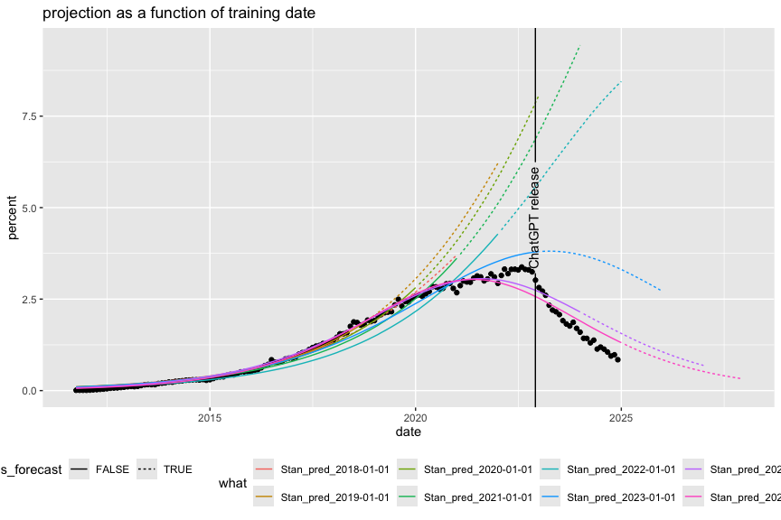

PlotBass
================
2025-03-14

Replot the contents of Bass_Stan.Rmd.

``` r
library(wrapr)
library(ggplot2)
library(geomtextpath)
knitr::opts_chunk$set(fig.height = 6, fig.width = 9)
```

``` r
unpack[
  d_plot = d_plot, 
  d_predict = d_predict] := readRDS("Pandas_predictions_Bass.RDS")
```

``` r
ggplot(mapping = aes(x = date, y = percent)) +
  geom_point(data = na.omit(d_plot)) +
  geom_line(
    data = na.omit(d_predict),
    mapping = aes(color = what, linetype = is_forecast)) +
  geom_textvline(
    data = data.frame(
      date = as.Date('2022-11-30'),
      label = 'ChatGPT release'
      ),
      mapping = aes(xintercept = date, label = label),
    ) + 
  theme(legend.position="bottom") +
  ggtitle("projection as a function of training date")
```

<!-- -->
