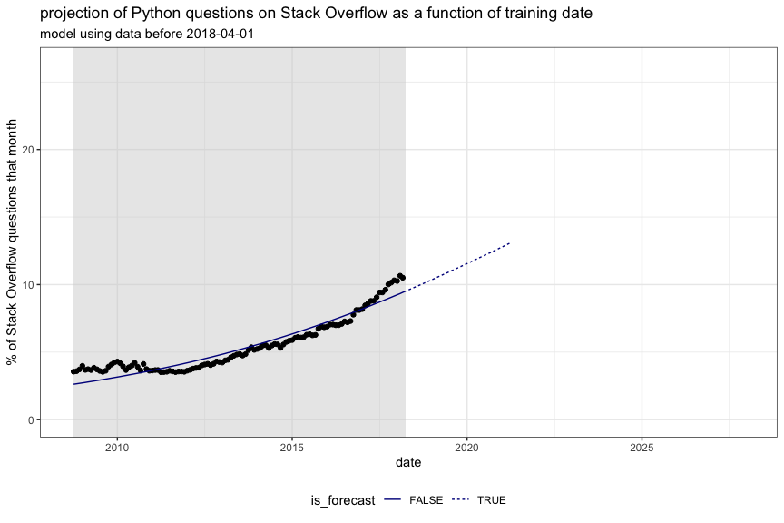
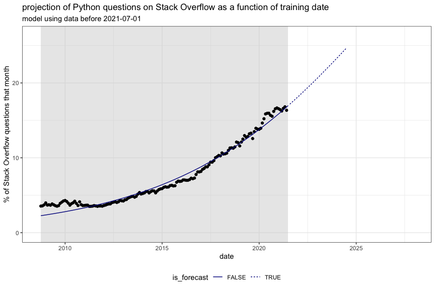

Plott Bass Model by Stan
================
2025-03-17

Re-plot the contents of [Bass_Stan.Rmd](Bass_Stan.Rmd).

Data from:

<https://stackoverflow.blog/2017/09/06/incredible-growth-python/>
<https://trends.stackoverflow.co/?tags=python>

``` r
library(wrapr)
library(ggplot2)
library(geomtextpath)
knitr::opts_chunk$set(fig.height = 6, fig.width = 9)
```

``` r
unpack[
  d_plot = d_plot, 
  d_predict = d_predict] := readRDS("Python_predictions_Bass.RDS")
chat_gpt_release_date <- as.Date('2022-11-30')
```

``` r
tag = d_plot$tag[[1]]
d_predict[["what"]] <- paste0("model using data before ", gsub("Stan_pred_", "", d_predict$what, fixed = TRUE))
```

``` r
whats <- sort(unique(d_predict$what))
max_y <- max(c(d_plot$percent, d_predict$percent), na.rm = TRUE)
min_x <- min(c(d_plot$date, d_plot$date))
max_x <- max(c(d_plot$date, d_plot$date))
# max_x <- as.Date('2028-12-01')
```

``` r
for(what in whats) {
  what_date <- as.Date(gsub("model using data before ", "", what))
  d_predict_i <- d_predict[d_predict$what == what, , drop = FALSE]
  d_plot_i <- na.omit(d_plot)
  d_plot_i$is_future <- d_plot_i$date >= what_date
  min_date <- min(d_plot_i$date)
  train_bound <- max(d_predict_i$date[d_predict_i$is_forecast == FALSE])
  i_max <- d_predict_i[['i_max']][[1]]
  v_max <- d_predict_i[['v_max']][[1]]
  t_max <- d_predict_i[['t_max']][[1]]
  
  plt_i <- ggplot() +
    geom_rect(aes(xmin = min_date, xmax = train_bound, ymin = -Inf, ymax = Inf),
            fill = "lightgrey", alpha = 0.5) +  # Shaded left half
    geom_point(
      data = d_plot_i[d_plot_i$is_future == FALSE, , drop = FALSE],
      mapping = aes(x = date, y = percent)) +
    geom_line(
      data = d_predict_i,
      mapping = aes(x = date, y = percent, linetype = is_forecast),
      color = 'darkblue') +
    ylab("% of Stack Overflow questions that month") + 
    scale_shape_manual(values=c(16, 1)) +
    theme_bw() +
    theme(legend.position = "bottom") +
    xlim(min_x, max_x) +
    ylim(0, max_y) +
    ggtitle(
      paste0("projection of ", tag, " questions on Stack Overflow as a function of training date"),
      subtitle = what)
  if(what_date >= chat_gpt_release_date) {
    plt_i <- plt_i +
      geom_textvline(
        data = data.frame(
          date = chat_gpt_release_date,
          label = paste0('ChatGPT release ', chat_gpt_release_date)
          ),
          mapping = aes(xintercept = date, label = label),
        )
  }
  if((! is.na(v_max)) && (! is.na(t_max))) {
      plt_i <- plt_i +
          geom_point(
              mapping = aes(x = date, y = percent),
              data = data.frame(date = t_max, percent = v_max),
              size = 4,
              color = 'red',
              shape = 2)
  }
  print(plt_i)
}
```

    ## Warning: Removed 83 rows containing missing values or values outside the scale range
    ## (`geom_line()`).

<!-- -->

    ## Warning: Removed 80 rows containing missing values or values outside the scale range
    ## (`geom_line()`).

<!-- -->

    ## Warning: Removed 77 rows containing missing values or values outside the scale range
    ## (`geom_line()`).

<!-- -->

    ## Warning: Removed 74 rows containing missing values or values outside the scale range
    ## (`geom_line()`).

<!-- -->

    ## Warning: Removed 71 rows containing missing values or values outside the scale range
    ## (`geom_line()`).

<!-- -->

    ## Warning: Removed 68 rows containing missing values or values outside the scale range
    ## (`geom_line()`).

<!-- -->

    ## Warning: Removed 65 rows containing missing values or values outside the scale range
    ## (`geom_line()`).

<!-- -->

    ## Warning: Removed 62 rows containing missing values or values outside the scale range
    ## (`geom_line()`).

<!-- -->

    ## Warning: Removed 59 rows containing missing values or values outside the scale range
    ## (`geom_line()`).

<!-- -->

    ## Warning: Removed 56 rows containing missing values or values outside the scale range
    ## (`geom_line()`).

<!-- -->

    ## Warning: Removed 53 rows containing missing values or values outside the scale range
    ## (`geom_line()`).

<!-- -->

    ## Warning: Removed 50 rows containing missing values or values outside the scale range
    ## (`geom_line()`).

<!-- -->

    ## Warning: Removed 47 rows containing missing values or values outside the scale range
    ## (`geom_line()`).

<!-- -->

    ## Warning: Removed 44 rows containing missing values or values outside the scale range
    ## (`geom_line()`).

<!-- -->

    ## Warning: Removed 41 rows containing missing values or values outside the scale range
    ## (`geom_line()`).

<!-- -->

    ## Warning: Removed 38 rows containing missing values or values outside the scale range
    ## (`geom_line()`).

<!-- -->

    ## Warning: Removed 35 rows containing missing values or values outside the scale range
    ## (`geom_line()`).

<!-- -->

    ## Warning: Removed 32 rows containing missing values or values outside the scale range
    ## (`geom_line()`).

<!-- -->

    ## Warning: Removed 29 rows containing missing values or values outside the scale range
    ## (`geom_line()`).

<!-- -->

    ## Warning: Removed 26 rows containing missing values or values outside the scale range
    ## (`geom_line()`).

<!-- -->

    ## Warning: Removed 23 rows containing missing values or values outside the scale range
    ## (`geom_line()`).

<!-- -->

    ## Warning: Removed 20 rows containing missing values or values outside the scale range
    ## (`geom_line()`).

<!-- -->

    ## Warning: Removed 17 rows containing missing values or values outside the scale range
    ## (`geom_line()`).

<!-- -->

    ## Warning: Removed 14 rows containing missing values or values outside the scale range
    ## (`geom_line()`).

<!-- -->

    ## Warning: Removed 11 rows containing missing values or values outside the scale range
    ## (`geom_line()`).

<!-- -->

    ## Warning: Removed 8 rows containing missing values or values outside the scale range
    ## (`geom_line()`).

<!-- -->

    ## Warning: Removed 5 rows containing missing values or values outside the scale range
    ## (`geom_line()`).

<!-- -->

    ## Warning: Removed 2 rows containing missing values or values outside the scale range
    ## (`geom_line()`).

<!-- --><!-- -->
