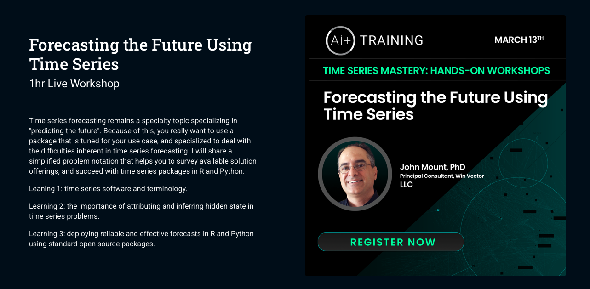

Materials for some of my teaching on using time series methods to solve business forecasting methods. This is a neglected topic that can unlock a lot of value in your organization.

> "One of the biggest mistakes in my data science career was not paying enough attention to time series models. Time series is everywhere—finance, sales, marketing—and it can drastically improve your decision-making process."
>
> – Mark Eltsefon, Staff Scientist at Meta https://www.linkedin.com/posts/mark-eltsefon_datascience-timeseries-activity-7253363004694491137-94D8?utm_source=share&utm_medium=member_desktop

Our organizing thesis is:  In business forecasting: ability to specify actionable structure beats technique in forecasting.

Our group is available to give on-site or remote training on these tools and techniques.

<h2>AI Plus</h2>

We are presenting a version of this material at "AI Plus":

  * 
  * [slides](TimeSeriesProblems.pdf)
  * [rehearsal video](https://www.youtube.com/watch?v=8ALN8N2Bj7s)

<h2>PyData Global 2024</h2>

We presented an overview of the methodology and results here.

  * [video](https://www.youtube.com/watch?v=jbJqlTWgN9A)
  * [slides](TS.pdf)
  * PyData Global 2024 https://global2024.pydata.org/cfp/talk/3NYJVA/ 12-05, 17:00–17:30 (UTC), General Track 

The slides for of the material is here: https://github.com/WinVector/Examples/blob/main/TimeSeries/TimeSeries.pdf

<h2>ODSC West 2024</h2>

This work was presented here.

 * [slides](TimeSeries.pdf)
 * <a href="https://odsc.com/california/odsc-west-schedule-2024/">

Find at https://odsc.com/california/odsc-west-schedule-2024/ , Tutorials | Workshops, 30 Oct Day 2. 3:30 PM Pacific time, 1 hour long.
</a>

<h2>Support materials</h2>

  * https://github.com/WinVector/Examples/blob/main/TimeSeries/nested_model_example.ipynb 
  * https://win-vector.com/2023/05/07/a-time-series-apologia/ 
  * https://win-vector.com/2024/07/15/armax-offerings-remain-a-muddle/ 
  * https://github.com/WinVector/Examples/blob/main/TimeSeries/ts_example.md 
  * https://github.com/WinVector/Examples/blob/main/TimeSeries/sm_example.ipynb
  * https://github.com/WinVector/Examples/blob/main/TimeSeries/Prophet_example.ipynb 
  * https://win-vector.com/2024/09/09/please-version-data/ 
  * https://win-vector.com/2023/05/25/some-of-the-perils-of-time-series-forecasting/  
  * https://github.com/WinVector/Examples/blob/main/linear_regression_w_zeros/tobit.ipynb
  * https://github.com/WinVector/Examples/blob/main/rank/LearningToRank.pdf

<h2>Details</h2>

Roughly our thesis is:

  1) In time series work, good descriptions such as https://www.statsmodels.org/stable/statespace.html are largely the exception.
    This is one of the descriptions that lets us know the package implements "linear regression with auto-correlated residuals."
     
  2) Even with such descriptions, it can remain unclear if the `(p, d, q)` style parameter specification *actually* implement the claimed equations.
  3) Basic hints are not shared (such as setting `q = p`, please see https://github.com/WinVector/Examples/blob/main/TS/TS_example.md ).
  4) There are tricks: such as full AR regression solutions ( https://win-vector.com/2023/05/07/a-time-series-apologia/ , the nasty "if all you measure about inference is prediction performance, regression wins" ) or pure pseudo-MA (linear combination of filters, often used in finance) that are pretty effective.
  4) In the end, you may want a full Bayesian decomposition. Roughly: inferring state may be at least as important is inferring the transfer function.

Note: we are not sharing out the Bass model fitting code at this time, as we haven't characterized its fitting biases yet. Good ideas on fitting Bass models can be found here: https://srdas.github.io/MLBook/productForecastingBassModel.html .

