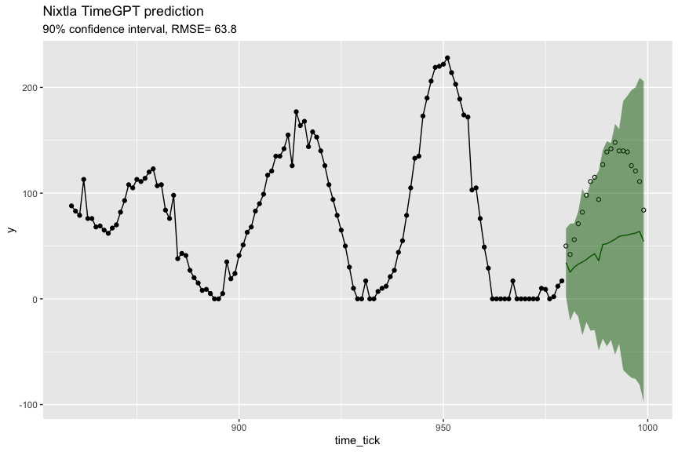

Nixtla
================
2025-03-06

``` r
library(nixtlar)
library(ggplot2)
knitr::opts_chunk$set(fig.width = 9, fig.height = 6)

nixtla_client_setup(api_key = "API Key goes here")
```

    ## API key has been set for the current session.

``` r
d_train <- read.csv('../../d_train_ext.csv', strip.white = TRUE, stringsAsFactors = FALSE)
d_test <- read.csv('../../d_test_ext.csv', strip.white = TRUE, stringsAsFactors = FALSE)
# make sure column order is same and the names are same as hard-coded in .validate_exogenous()
d_train <- d_train[, c('curve_id', 'time_tick', 'x_durable_0', 'x_transient_0', 'y')]
d_test <- d_test[, c('curve_id', 'time_tick', 'x_durable_0', 'x_transient_0')]
colnames(d_train) <- c("unique_id", "ds", 'x_durable_0', 'x_transient_0', "y")
colnames(d_test) <- c("unique_id", "ds", 'x_durable_0', 'x_transient_0')
```

``` r
result_file_name <- 'nixtla_timegpt_fcst.csv'
if(!file.exists(result_file_name)) {
  nixtla_client_fcst <- nixtla_client_forecast(
    d_train,
    h = 20,
    freq = 's',
    id_col = "unique_id",
    time_col = "ds",
    target_col = "y",
    X_df = d_test,
    level = 90,
  )
  write.csv(nixtla_client_fcst, result_file_name)
} else {
  nixtla_client_fcst <- read.csv(result_file_name, stringsAsFactors = FALSE, strip.white = TRUE)
}
```

``` r
d_train_p <- read.csv('../../d_train.csv', strip.white = TRUE, stringsAsFactors = FALSE)
d_train_p <- d_train_p[(nrow(d_train_p) - 120):nrow(d_train_p), , drop = FALSE]
d_test_p <- read.csv('../../d_test.csv', strip.white = TRUE, stringsAsFactors = FALSE)
d_test_p$TimeGPT_prediction <- nixtla_client_fcst[['TimeGPT']]
d_test_p$TimeGPT_l_90 <- nixtla_client_fcst[['TimeGPT.lo.90']]
d_test_p$TimeGPT_h_90 <- nixtla_client_fcst[['TimeGPT.hi.90']]
```

``` r
rmse <- sqrt(mean((d_test_p$y - d_test_p$TimeGPT_prediction)**2))
ggplot(
    mapping=aes(x = time_tick)
  ) +
  geom_point(
    data = d_train_p, 
    mapping= aes(y = y)) +
  geom_line(
    data = d_train_p,
    mapping= aes(y = y)) +
  geom_point(
    data = d_test_p,
    shape = 1,
    mapping= aes(y = y)) + 
  geom_line(
    data = d_test_p, 
    mapping= aes(y = TimeGPT_prediction), 
    color = 'darkgreen') +
  geom_ribbon(
    data = d_test_p,
    mapping = aes(
      ymin = TimeGPT_l_90, 
      ymax = TimeGPT_h_90), 
    alpha=0.5,
    fill = 'darkgreen') +
  ggtitle(
    "Nixtla TimeGPT prediction",
    subtitle = paste0(
      "90% confidence interval, RMSE= ",
      sprintf("%0.1f", rmse))
    )
```

<!-- -->
