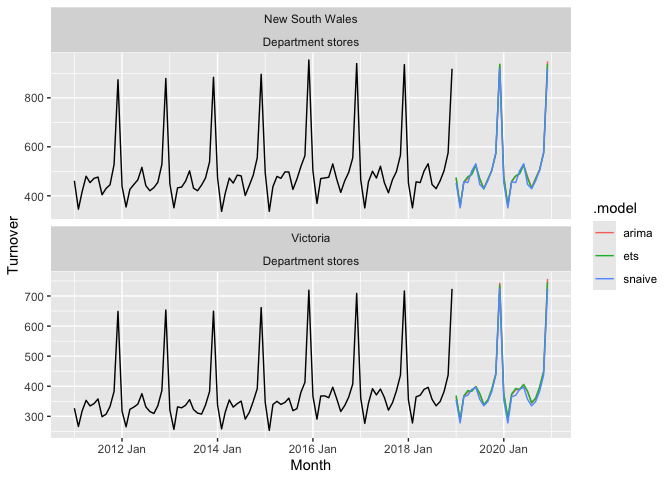
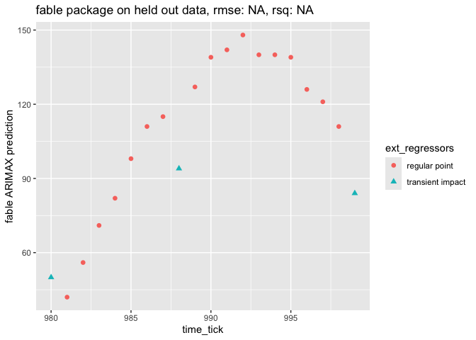
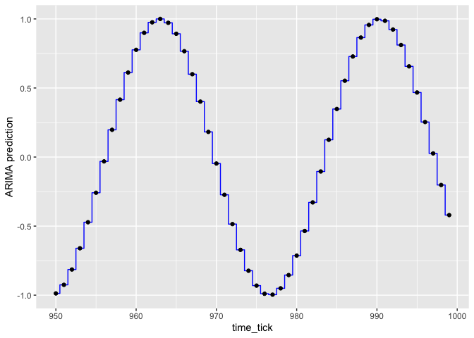
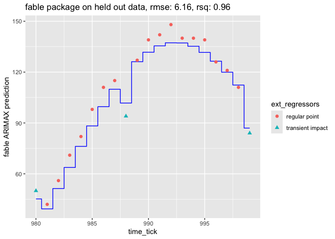
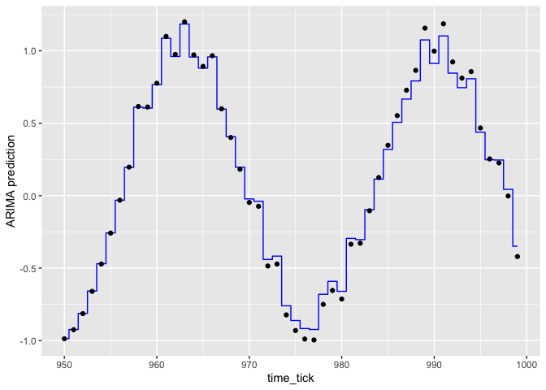
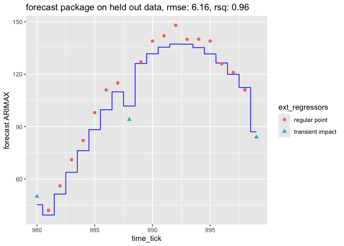

ts_example
================
2024-08-03

Show README example.

``` r
# http://fable.tidyverts.org
library(fable)
```

    ## Warning: package 'fable' was built under R version 4.3.2

    ## Loading required package: fabletools

    ## Warning: package 'fabletools' was built under R version 4.3.2

    ## Registered S3 method overwritten by 'tsibble':
    ##   method               from 
    ##   as_tibble.grouped_df dplyr

``` r
library(tsibble)
```

    ## Warning: package 'tsibble' was built under R version 4.3.3

    ## 
    ## Attaching package: 'tsibble'

    ## The following objects are masked from 'package:base':
    ## 
    ##     intersect, setdiff, union

``` r
library(tsibbledata)
library(lubridate)
```

    ## 
    ## Attaching package: 'lubridate'

    ## The following object is masked from 'package:tsibble':
    ## 
    ##     interval

    ## The following objects are masked from 'package:base':
    ## 
    ##     date, intersect, setdiff, union

``` r
library(dplyr)
```

    ## 
    ## Attaching package: 'dplyr'

    ## The following objects are masked from 'package:stats':
    ## 
    ##     filter, lag

    ## The following objects are masked from 'package:base':
    ## 
    ##     intersect, setdiff, setequal, union

``` r
aus_retail %>%
  filter(
    State %in% c("New South Wales", "Victoria"),
    Industry == "Department stores"
  ) %>% 
  model(
    ets = ETS(box_cox(Turnover, 0.3)),
    arima = ARIMA(log(Turnover)),
    snaive = SNAIVE(Turnover)
  ) %>%
  forecast(h = "2 years") %>% 
  autoplot(filter(aus_retail, year(Month) > 2010), level = NULL)
```

<!-- -->

Show fitting with an external regressor.

``` r
library(ggplot2)
```

    ## Warning: package 'ggplot2' was built under R version 4.3.2

``` r
# https://otexts.com/fpp3/regarima.html
d_train <- read.csv('d_train.csv', stringsAsFactors = FALSE)
d_test <- read.csv('d_test.csv', stringsAsFactors = FALSE)

preds <- (
  d_train %>%
    tsibble(index=time_tick) %>%
    model(
      ARIMA(y ~ 
              1  # turn off must specify constant warning
            + x_0   # external regressor (can also use xreg(x_0)
            + pdq(2, 0, 2)   # AR=MA=2, I=0
            + PDQ(0, 0, 0)   # turn off seasonality (help(ARIMA))
            )
    ) %>%
    forecast(new_data=tsibble(d_test, index=time_tick)) 
  )
d_test['ARIMA prediction'] = preds['.mean']

(
  ggplot(
    data=d_test,
    mapping=aes(x=time_tick)
  )
  + geom_step(mapping=aes(y=`ARIMA prediction`), direction='mid', color='blue')
  + geom_point(mapping=aes(y=y, shape=as.character(x_0)))
) 
```

<!-- -->

``` r
# Rsquared
sse = sum((d_test[['y']] - d_test[['ARIMA prediction']])**2)
sey = sum((d_test[['y']] - mean(d_test[['y']]))**2)
1 - sse/sey
```

    ## [1] 0.9322298

``` r
# RMSE
sqrt(mean((d_test[['y']] - d_test[['ARIMA prediction']])**2))
```

    ## [1] 2.476357

Show can fit sin(x).

``` r
d_train <- data.frame(time_tick=seq(0, 949))
d_train['y'] = sin(0.23 * d_train['time_tick'])
d_test <- data.frame(time_tick=seq(950, 999))
d_test['y'] = sin(0.23 * d_test['time_tick'])

(
    d_train %>%
    tsibble(index=time_tick) %>%
    model(
      arima = ARIMA(y ~ 1 + pdq(2, 0, 2) + PDQ(0, 0, 0))
    ) %>%
    forecast(new_data=tsibble(d_test, index=time_tick)) %>%
    autoplot()
)
```

    ## Warning in log(s2): NaNs produced

    ## Warning in log(s2): NaNs produced

<!-- -->

``` r
preds <- (
  d_train %>%
    tsibble(index=time_tick) %>%
    model(
      arima = ARIMA(y ~ 1 + pdq(2, 0, 2) + PDQ(0, 0, 0))
    ) %>%
    forecast(new_data=tsibble(d_test, index=time_tick)) 
  )
```

    ## Warning in log(s2): NaNs produced

    ## Warning in log(s2): NaNs produced

``` r
d_test['ARIMA prediction'] = preds['.mean']

(
  ggplot(
    data=d_test,
    mapping=aes(x=time_tick)
  )
  + geom_step(mapping=aes(y=`ARIMA prediction`), direction='mid', color='blue')
  + geom_point(mapping=aes(y=y))
) 
```

<!-- -->

Try again with external regressor.

``` r
set.seed(2024)
d_train <- data.frame(time_tick=seq(0, 949))
d_train['x_0'] <- rbinom(n=nrow(d_train), size=1, prob=0.3)
d_train['y'] = sin(0.23 * d_train['time_tick']) + 0.2 * d_train['x_0']
d_test <- data.frame(time_tick=seq(950, 999))
d_test['x_0'] <- rbinom(n=nrow(d_test), size=1, prob=0.3)
d_test['y'] = sin(0.23 * d_test['time_tick']) + 0.2 * d_test['x_0']

(
    d_train %>%
    tsibble(index=time_tick) %>%
    model(
      arima = ARIMA(y ~ 1 + x_0 + pdq(2, 0, 2) + PDQ(0, 0, 0))
    ) %>%
    forecast(new_data=tsibble(d_test, index=time_tick)) %>%
    autoplot()
)
```

    ## Warning in log(s2): NaNs produced

    ## Warning in log(s2): NaNs produced

    ## Warning in log(s2): NaNs produced

    ## Warning in log(s2): NaNs produced

    ## Warning in log(s2): NaNs produced

    ## Warning in wrap_arima(y, order = c(p, d, q), seasonal = list(order = c(P, :
    ## possible convergence problem: optim gave code = 1

    ## Warning in sqrt(diag(best$var.coef)): NaNs produced

<!-- -->

``` r
preds <- (
  d_train %>%
    tsibble(index=time_tick) %>%
    model(
      arima = ARIMA(y ~ 1 + x_0 + pdq(2, 0, 2) + PDQ(0, 0, 0))
    ) %>%
    forecast(new_data=tsibble(d_test, index=time_tick)) 
  )
```

    ## Warning in log(s2): NaNs produced

    ## Warning in log(s2): NaNs produced

    ## Warning in log(s2): NaNs produced

    ## Warning in log(s2): NaNs produced

    ## Warning in log(s2): NaNs produced

    ## Warning in wrap_arima(y, order = c(p, d, q), seasonal = list(order = c(P, :
    ## possible convergence problem: optim gave code = 1

    ## Warning in sqrt(diag(best$var.coef)): NaNs produced

``` r
d_test['ARIMA prediction'] = preds['.mean']

(
  ggplot(
    data=d_test,
    mapping=aes(x=time_tick)
  )
  + geom_step(mapping=aes(y=`ARIMA prediction`), direction='mid', color='blue')
  + geom_point(mapping=aes(y=y))
) 
```

<!-- -->

``` r
library(forecast)
```

    ## Warning: package 'forecast' was built under R version 4.3.3

    ## Registered S3 method overwritten by 'quantmod':
    ##   method            from
    ##   as.zoo.data.frame zoo

``` r
library(ggplot2)
# https://otexts.com/fpp3/regarima.html
d_train <- read.csv('d_train.csv', stringsAsFactors = FALSE)
d_test <- read.csv('d_test.csv', stringsAsFactors = FALSE)
model <- Arima(
  ts(d_train[['y']], start=d_train[['time_tick']][1]), 
  order=c(2, 0, 2), 
  xreg=ts(d_train[['x_0']], start=d_train[['time_tick']][1])
  )
preds <- forecast(model, xreg=ts(d_test[['x_0']], start=d_test[['time_tick']][1]))
d_test['forecast ARIMAX'] <- as.numeric(preds$mean)
```

``` r
(
  ggplot(
    data=d_test,
    mapping=aes(x=time_tick)
  )
  + geom_step(mapping=aes(y=`forecast ARIMAX`), direction='mid', color='blue')
  + geom_point(mapping=aes(y=y, shape=as.character(x_0)))
) 
```

<!-- -->

``` r
# Rsquared
sse = sum((d_test[['y']] - d_test[['forecast ARIMAX']])**2)
sey = sum((d_test[['y']] - mean(d_test[['y']]))**2)
1 - sse/sey
```

    ## [1] 0.9322298

``` r
# RMSE
sqrt(mean((d_test[['y']] - d_test[['forecast ARIMAX']])**2))
```

    ## [1] 2.476357
