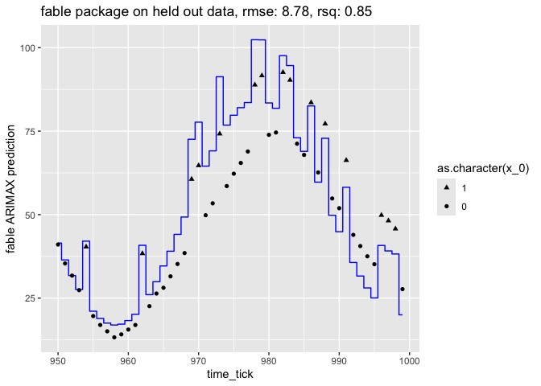
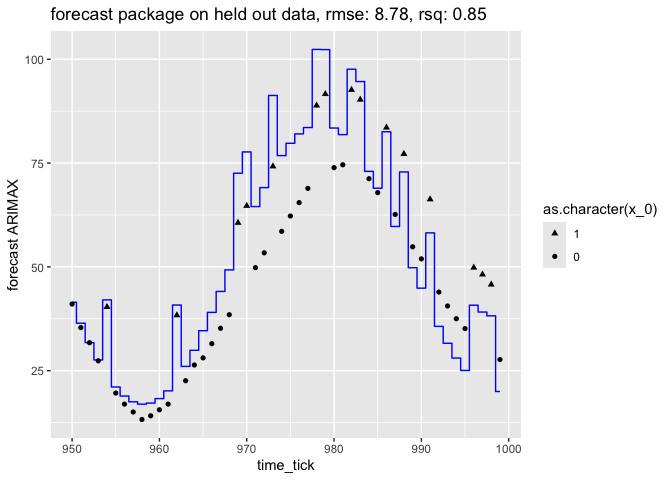

ts_example
================
2024-08-03

R packages re-doing of [our nested model time series
example](https://github.com/WinVector/Examples/blob/main/TimeSeries/nested_model_example.ipynb).

``` r
# http://fable.tidyverts.org
library(fable)
library(tsibble)
library(tsibbledata)
library(lubridate)
library(dplyr)
library(ggplot2)
library(forecast)
```

Show fitting with an external regressor using the fable package.

``` r
# https://otexts.com/fpp3/regarima.html
d_train <- read.csv('d_train.csv', stringsAsFactors = FALSE)
d_test <- read.csv('d_test.csv', stringsAsFactors = FALSE)

preds <- (
  d_train %>%
    tsibble(index=time_tick) %>%
    model(
      ARIMA(y ~ 
              1  # turn off must specify constant warning
            + z_0   # external regressor (can also use xreg(z_0))
            + x_0   # external regressor (can also use xreg(x_0))
            + pdq(2, 0, 2)   # AR=MA=2, I=0
            + PDQ(0, 0, 0)   # turn off seasonality (help(ARIMA))
            )
    ) %>%
    forecast(new_data=tsibble(d_test, index=time_tick)) 
  )
d_test['fable ARIMAX prediction'] = preds['.mean']

# Rsquared
sse <- sum((d_test[['y']] - d_test[['fable ARIMAX prediction']])**2)
sey <- sum((d_test[['y']] - mean(d_test[['y']]))**2)
rsq <- 1 - sse/sey
# RMSE
rmse <- sqrt(mean((d_test[['y']] - d_test[['fable ARIMAX prediction']])**2))

(
  ggplot(
    data=d_test,
    mapping=aes(x=time_tick)
  )
  + geom_step(mapping=aes(y=`fable ARIMAX prediction`), direction='mid', color='blue')
  + geom_point(mapping=aes(y=y, shape=as.character(x_0)), size=2)
  + guides(shape = guide_legend(reverse=TRUE))
  + ggtitle(paste0("fable package on held out data, rmse: ", 
    sprintf('%.2f', rmse), ', rsq: ', sprintf('%.2f', rsq)))
) 
```

<!-- -->

Show fitting with an external regressor using the forecast package.

``` r
# https://otexts.com/fpp3/regarima.html
d_train <- read.csv('d_train.csv', stringsAsFactors = FALSE)
d_test <- read.csv('d_test.csv', stringsAsFactors = FALSE)
model <- Arima(
  ts(d_train[['y']], start=d_train[['time_tick']][1]), 
  order=c(2, 0, 2), 
  xreg=ts(d_train[, c('z_0', 'x_0')], start=d_train[['time_tick']][1])
  )
preds <- forecast(model, xreg=ts(d_test[, c('z_0', 'x_0')], 
                                 start=d_test[['time_tick']][1]))
d_test['forecast ARIMAX'] <- as.numeric(preds$mean)

# Rsquared
sse <- sum((d_test[['y']] - d_test[['forecast ARIMAX']])**2)
sey <- sum((d_test[['y']] - mean(d_test[['y']]))**2)
rsq <- 1 - sse/sey

# RMSE
rmse <- sqrt(mean((d_test[['y']] - d_test[['forecast ARIMAX']])**2))

(
  ggplot(
    data=d_test,
    mapping=aes(x=time_tick)
  )
  + geom_step(mapping=aes(y=`forecast ARIMAX`), direction='mid', color='blue')
  + geom_point(mapping=aes(y=y, shape=as.character(x_0)), size=2)
  + guides(shape = guide_legend(reverse=TRUE))
  + ggtitle(paste0(
    "forecast package on held out data, rmse: ", 
    sprintf('%.2f', rmse), ', rsq: ', sprintf('%.2f', rsq)))
) 
```

<!-- -->
