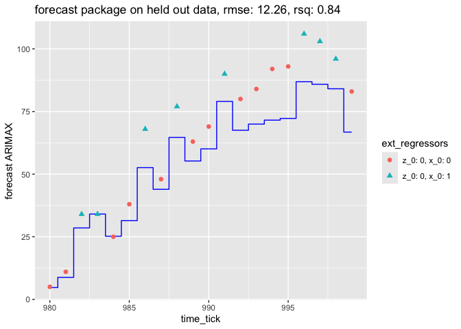

ts_example
================

R packages re-doing of [our nested model time series
example](https://github.com/WinVector/Examples/blob/main/TimeSeries/nested_model_example.ipynb).

``` r
# http://fable.tidyverts.org
library(fable)
library(tsibble)
library(tsibbledata)
library(lubridate)
library(dplyr)
library(ggplot2)
library(forecast)
library(jsonlite)
```

## The problem

We want to fit a time series with both durable and transient external
regressors.

First let’s show the generating parameters we are attempting to recover.

``` r
model_specification <- fromJSON("generating_params.json")

model_specification
```

    ## $b_auto_0
    ## [1] 1.280413
    ## 
    ## $b_auto
    ## [1]  1.975377 -1.000000
    ## 
    ## $b_z
    ## [1] 14.2
    ## 
    ## $b_x
    ## [1] 16.1
    ## 
    ## $generating_lags
    ## [1] 1 2
    ## 
    ## $modeling_lags
    ## [1] 1 2

What we hope is to find `b_x_dur ~ b_z` and `b_x_imp ~ b_x`.

The generating and modeling lags specify translate into ARIMA terms as
`p = 2, i = 0`. We take our own advice from [A Time Series
Apologia](https://github.com/WinVector/Examples/blob/main/TS/TS_example.md)
and pick `q = p`. So in ARIMAX terms we try fitting a `pdq(2, 0, 2)`
system.

We don’t have any way to specify the nature of external regressors, with
act as transient effects in the “regression with ARIMA residuals”
formulation favored by the fable and forecast packages. This will lead
to a degredation in fit quality and an inability to properly estimate
`b_z` (as we can’t specify the for of the effect we believe it has in
the data).

## Fitting with external regressors using the fable package

Fable formulation:

<code> (1 - φ<sub>1</sub> B - … - φ<sub>p</sub> B<sup>p</sup>)(1 -
B)<sup>d</sup> y<sub>t</sub> = c + (1 - θ<sub>1</sub> B - … -
θ<sub>q</sub> B<sup>q</sup>) ε<sub>t</sub> </code>

where <code>c = mean(1 - φ<sub>1</sub> - … - φ<sub>p</sub>)</code>.

This is what we meant about the chosen package specifying the modeling
recurrance equations (i.e. taking that choice out of our hands).

``` r
# https://otexts.com/fpp3/regarima.html
d_train <- read.csv('d_train.csv', stringsAsFactors = FALSE)
d_test <- read.csv('d_test.csv', stringsAsFactors = FALSE)

fable_model <- (
  d_train %>%
    tsibble(index=time_tick) %>%
    model(
      ARIMA(y ~ 
              1  # turn off must specify constant warning
            + z_0   # external regressor (can also use xreg(z_0))
            + x_0   # external regressor (can also use xreg(x_0))
            + pdq(2, 0, 2)   # AR=MA=2, I=0
            + PDQ(0, 0, 0)   # turn off seasonality (help(ARIMA))
            )
    )
)
coef(fable_model)
```

    ## # A tibble: 7 × 6
    ##   .model                            term  estimate std.error statistic   p.value
    ##   <chr>                             <chr>    <dbl>     <dbl>     <dbl>     <dbl>
    ## 1 ARIMA(y ~ 1 + z_0 + x_0 + pdq(2,… ar1     1.92      0.0112    172.   0        
    ## 2 ARIMA(y ~ 1 + z_0 + x_0 + pdq(2,… ar2    -0.951     0.0111    -85.9  0        
    ## 3 ARIMA(y ~ 1 + z_0 + x_0 + pdq(2,… ma1    -0.367     0.0345    -10.6  4.30e- 25
    ## 4 ARIMA(y ~ 1 + z_0 + x_0 + pdq(2,… ma2     0.0585    0.0327      1.79 7.43e-  2
    ## 5 ARIMA(y ~ 1 + z_0 + x_0 + pdq(2,… z_0     1.43      0.401       3.56 3.86e-  4
    ## 6 ARIMA(y ~ 1 + z_0 + x_0 + pdq(2,… x_0    16.0       0.104     154.   0        
    ## 7 ARIMA(y ~ 1 + z_0 + x_0 + pdq(2,… inte…  52.6       2.15       24.5  1.24e-103

Notice we recovered good estimates of the autoregressive terms `b_auto`
(`ar1`, `ar2`), transient external effect coefficient `b_x` (`x_0`). We
did not get a good estimate of the durable external effect coefficient
`z_0` (`b_z`), so we did not infer how changes in this variable affect
results.

We would be able to forecast, as the auto-regressive terms dominate. We
would not be able to plan, as we don’t have a good estimate of `z_0`
(`b_z`).

``` r
model_specification
```

    ## $b_auto_0
    ## [1] 1.280413
    ## 
    ## $b_auto
    ## [1]  1.975377 -1.000000
    ## 
    ## $b_z
    ## [1] 14.2
    ## 
    ## $b_x
    ## [1] 16.1
    ## 
    ## $generating_lags
    ## [1] 1 2
    ## 
    ## $modeling_lags
    ## [1] 1 2

``` r
preds <-  (
  fable_model %>%
    forecast(new_data=tsibble(d_test, index=time_tick)) 
)
d_test['fable ARIMAX prediction'] = preds['.mean']

# Rsquared
sse <- sum((d_test[['y']] - d_test[['fable ARIMAX prediction']])**2)
sey <- sum((d_test[['y']] - mean(d_test[['y']]))**2)
rsq <- 1 - sse/sey
# RMSE
rmse <- sqrt(mean((d_test[['y']] - d_test[['fable ARIMAX prediction']])**2))

(
  ggplot(
    data=d_test,
    mapping=aes(x=time_tick)
  )
  + geom_step(mapping=aes(y=`fable ARIMAX prediction`), direction='mid', color='blue')
  + geom_point(mapping=aes(y=y, shape=as.character(x_0)), size=2)
  + guides(shape = guide_legend(reverse=TRUE))
  + ggtitle(paste0("fable package on held out data, rmse: ", 
    sprintf('%.2f', rmse), ', rsq: ', sprintf('%.2f', rsq)))
) 
```

<!-- -->

## Fitting with an external regressor using the forecast package

Forecast formulation:

<code> (1 - φ<sub>1</sub> B - … - φ<sub>p</sub> B<sup>p</sup>)
(y<sup>′</sup><sub>t</sub> - μ) = c + (1 - θ<sub>1</sub> B - … -
θ<sub>q</sub> B<sup>q</sup>) ε<sub>t</sub> </code>

where <code>y<sup>′</sup><sub>t</sub> = (1 - B)<sup>d</sup>
y<sub>t</sub></code>, <code>μ = mean(y<sup>′</sup><sub>t</sub>)</code>.

``` r
# https://otexts.com/fpp3/regarima.html
d_train <- read.csv('d_train.csv', stringsAsFactors = FALSE)
d_test <- read.csv('d_test.csv', stringsAsFactors = FALSE)
forecast_model <- Arima(
  ts(d_train[['y']], start=d_train[['time_tick']][1]), 
  order=c(2, 0, 2), 
  xreg=ts(d_train[, c('z_0', 'x_0')], start=d_train[['time_tick']][1])
  )

forecast_model
```

    ## Series: ts(d_train[["y"]], start = d_train[["time_tick"]][1]) 
    ## Regression with ARIMA(2,0,2) errors 
    ## 
    ## Coefficients:
    ##          ar1      ar2      ma1     ma2  intercept     z_0      x_0
    ##       1.9209  -0.9507  -0.3669  0.0585    52.5993  1.4290  16.0277
    ## s.e.  0.0112   0.0111   0.0345  0.0327     2.1489  0.4012   0.1038
    ## 
    ## sigma^2 = 8.471:  log likelihood = -2437.45
    ## AIC=4890.9   AICc=4891.05   BIC=4930

Notice the recovered durable effect coefficient is way too low.

``` r
preds <- forecast(
  forecast_model, 
  xreg=ts(d_test[, c('z_0', 'x_0')], 
  start=d_test[['time_tick']][1]))
d_test['forecast ARIMAX'] <- as.numeric(preds$mean)

# Rsquared
sse <- sum((d_test[['y']] - d_test[['forecast ARIMAX']])**2)
sey <- sum((d_test[['y']] - mean(d_test[['y']]))**2)
rsq <- 1 - sse/sey

# RMSE
rmse <- sqrt(mean((d_test[['y']] - d_test[['forecast ARIMAX']])**2))

(
  ggplot(
    data=d_test,
    mapping=aes(x=time_tick)
  )
  + geom_step(mapping=aes(y=`forecast ARIMAX`), direction='mid', color='blue')
  + geom_point(mapping=aes(y=y, shape=as.character(x_0)), size=2)
  + guides(shape = guide_legend(reverse=TRUE))
  + ggtitle(paste0(
    "forecast package on held out data, rmse: ", 
    sprintf('%.2f', rmse), ', rsq: ', sprintf('%.2f', rsq)))
) 
```

<!-- -->
