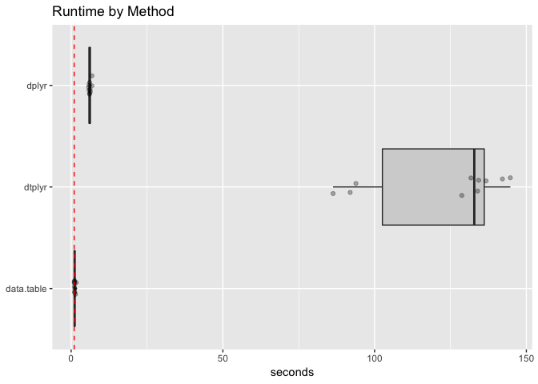
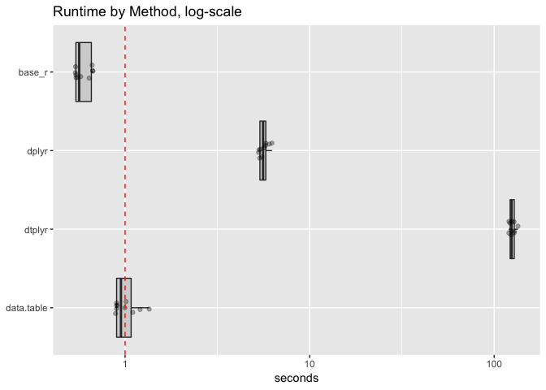

timings
================

``` r
library("microbenchmark")
library("dplyr")
```

    ## Warning: package 'dplyr' was built under R version 3.5.1

    ## 
    ## Attaching package: 'dplyr'

    ## The following objects are masked from 'package:stats':
    ## 
    ##     filter, lag

    ## The following objects are masked from 'package:base':
    ## 
    ##     intersect, setdiff, setequal, union

``` r
library("dtplyr")
library("data.table")
```

    ## 
    ## Attaching package: 'data.table'

    ## The following objects are masked from 'package:dplyr':
    ## 
    ##     between, first, last

``` r
library("ggplot2")
library("WVPlots")
```

``` r
mk_data <- function(nrow, ncol) {
  d <- data.frame(x1 = rep(0, nrow))
  for(i in seq_len(ncol)) {
    vi <- paste0("x", i)
    d[[vi]] <- rnorm(nrow)
  }
  d
}

df <- mk_data(100000, 100)
nstep <- 1000
```

``` r
dplyr_fn <- function(df) {
  dt <- df
  for(i in seq_len(nstep)) {
    dt <- mutate(dt, x1 = x1 + 1)
  }
  dt
}

dtplyr_fn <- function(df) {
  dt <- as.data.table(df)
  for(i in seq_len(nstep)) {
    dt <- mutate(dt, x1 = x1 + 1)
  }
  dt
}

data.table_fn <- function(df) {
  dt <- as.data.table(df)
  for(i in seq_len(nstep)) {
    dt[, x1 := x1 + 1]
  }
  dt[]
}
```

``` r
timings <- microbenchmark(
  dplyr = dplyr_fn(df),
  dtplyr = dtplyr_fn(df),
  data.table = data.table_fn(df),
  unit = 's',
  times = 10L
)
saveRDS(timings, file = "dtplyr_timings.RDS")
```

``` r
tdf <- as.data.frame(timings)


tdf$seconds <- tdf$time/1e+9
tdf$method <- factor(as.character(tdf$expr),
                     rev(levels(tdf$expr)))

as.data.table(tdf)[
  , .(mean_seconds = mean(seconds)), by = "method" ][
    order(mean_seconds), ]
```

    ##        method mean_seconds
    ## 1: data.table     1.201450
    ## 2:      dplyr     6.204858
    ## 3:     dtplyr   122.440178

``` r
WVPlots::ScatterBoxPlotH(tdf, "seconds","method",  
                         title="Runtime by Method") +
  geom_hline(yintercept = 1, color = "red", linetype = 2) + 
  xlab(NULL)
```



``` r
WVPlots::ScatterBoxPlotH(tdf, "seconds","method",  
                         title="Runtime by Method, log-scale") + 
  scale_y_log10() +
  geom_hline(yintercept = 1, color = "red", linetype = 2) + 
  xlab(NULL)
```


