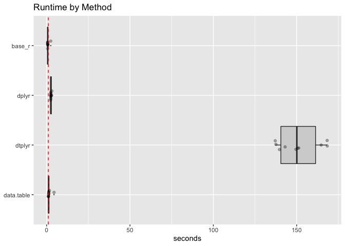
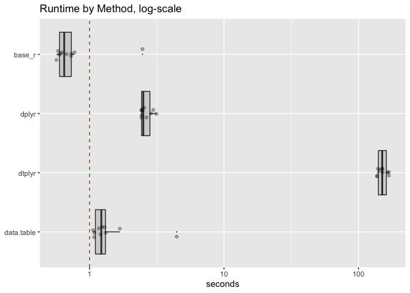

timings
================

``` r
library("microbenchmark")
library("dplyr")
```

    ## 
    ## Attaching package: 'dplyr'

    ## The following objects are masked from 'package:stats':
    ## 
    ##     filter, lag

    ## The following objects are masked from 'package:base':
    ## 
    ##     intersect, setdiff, setequal, union

``` r
library("dtplyr")
library("data.table")
```

    ## 
    ## Attaching package: 'data.table'

    ## The following objects are masked from 'package:dplyr':
    ## 
    ##     between, first, last

``` r
library("ggplot2")
library("WVPlots")

packageVersion("dplyr")
```

    ## [1] '0.8.1'

``` r
packageVersion("dtplyr")
```

    ## [1] '0.0.3'

``` r
R.version.string
```

    ## [1] "R version 3.6.0 (2019-04-26)"

``` r
mk_data <- function(nrow, ncol) {
  d <- data.frame(x1 = rep(0, nrow))
  for(i in seq_len(ncol)) {
    vi <- paste0("x", i)
    d[[vi]] <- rnorm(nrow)
  }
  d
}
```

``` r
base_r_fn <- function(df) {
  dt <- df
  for(i in seq_len(nstep)) {
    dt$x1 <- dt$x1 + 1
  }
  dt
}

dplyr_fn <- function(df) {
  dt <- df
  for(i in seq_len(nstep)) {
    dt <- mutate(dt, x1 = x1 + 1)
  }
  dt
}

dtplyr_fn <- function(df) {
  dt <- as.data.table(df)
  for(i in seq_len(nstep)) {
    dt <- mutate(dt, x1 = x1 + 1)
  }
  dt
}

data.table_fn <- function(df) {
  dt <- as.data.table(df)
  for(i in seq_len(nstep)) {
    dt[, x1 := x1 + 1]
  }
  dt[]
}
```

``` r
df <- mk_data(3, 2)
nstep <- 5

base_r_fn(df)
```

    ##         x1        x2
    ## 1 4.264622 0.5668608
    ## 2 6.353611 0.8614390
    ## 3 6.070827 1.0268441

``` r
dplyr_fn(df)
```

    ##         x1        x2
    ## 1 4.264622 0.5668608
    ## 2 6.353611 0.8614390
    ## 3 6.070827 1.0268441

``` r
dtplyr_fn(df)
```

    ##          x1        x2
    ## 1: 4.264622 0.5668608
    ## 2: 6.353611 0.8614390
    ## 3: 6.070827 1.0268441

``` r
data.table_fn(df)
```

    ##          x1        x2
    ## 1: 4.264622 0.5668608
    ## 2: 6.353611 0.8614390
    ## 3: 6.070827 1.0268441

``` r
df <- mk_data(100000, 100)
nstep <- 1000

timings <- microbenchmark(
  base_r = base_r_fn(df),
  dplyr = dplyr_fn(df),
  dtplyr = dtplyr_fn(df),
  data.table = data.table_fn(df),
  unit = 's',
  times = 10L
)
saveRDS(timings, file = "dtplyr_timings.RDS")
```

``` r
tdf <- as.data.frame(timings)


tdf$seconds <- tdf$time/1e+9
tdf$method <- factor(as.character(tdf$expr),
                     rev(levels(tdf$expr)))

as.data.table(tdf)[
  , .(mean_seconds = mean(seconds)), by = "method" ][
    order(mean_seconds), ]
```

    ##        method mean_seconds
    ## 1:     base_r    0.8367011
    ## 2: data.table    1.5592681
    ## 3:      dplyr    2.6420171
    ## 4:     dtplyr  151.0217646

``` r
WVPlots::ScatterBoxPlotH(tdf, "seconds","method",  
                         title="Runtime by Method") +
  geom_hline(yintercept = 1, color = "red", linetype = 2) + 
  xlab(NULL)
```

<!-- -->

``` r
WVPlots::ScatterBoxPlotH(tdf, "seconds","method",  
                         title="Runtime by Method, log-scale") + 
  scale_y_log10() +
  geom_hline(yintercept = 1, color = "red", linetype = 2) + 
  xlab(NULL)
```

<!-- -->
