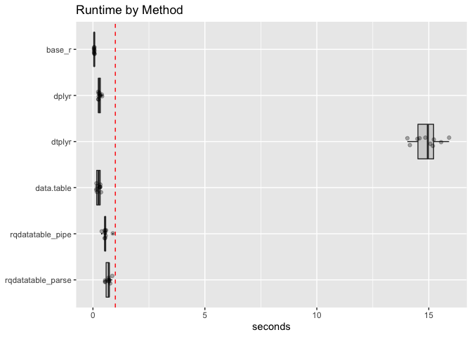
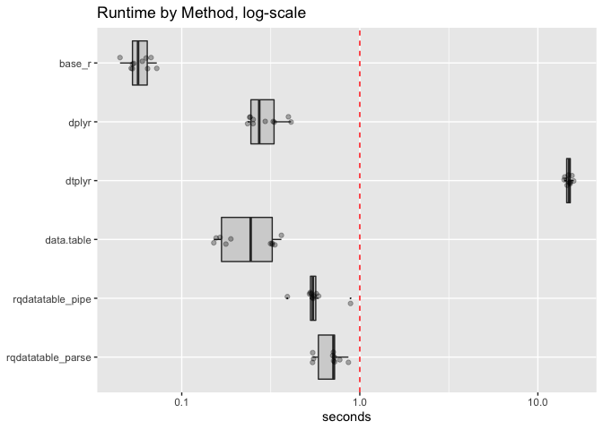

timings
================

``` r
library("microbenchmark")
library("dplyr")
```

    ## 
    ## Attaching package: 'dplyr'

    ## The following objects are masked from 'package:stats':
    ## 
    ##     filter, lag

    ## The following objects are masked from 'package:base':
    ## 
    ##     intersect, setdiff, setequal, union

``` r
library("dtplyr")
library("data.table")
```

    ## 
    ## Attaching package: 'data.table'

    ## The following objects are masked from 'package:dplyr':
    ## 
    ##     between, first, last

``` r
library("ggplot2")
library("WVPlots")
library("rqdatatable")
```

    ## Loading required package: rquery

``` r
packageVersion("dplyr")
```

    ## [1] '0.8.1'

``` r
packageVersion("dtplyr")
```

    ## [1] '0.0.3'

``` r
R.version.string
```

    ## [1] "R version 3.6.0 (2019-04-26)"

``` r
mk_data <- function(nrow, ncol) {
  d <- data.frame(x1 = rep(0, nrow))
  for(i in seq_len(ncol)) {
    vi <- paste0("x", i)
    d[[vi]] <- rnorm(nrow)
  }
  d
}
```

``` r
base_r_fn <- function(df) {
  dt <- df
  for(i in seq_len(nstep)) {
    dt$x1 <- dt$x1 + 1
  }
  dt
}

dplyr_fn <- function(df) {
  dt <- df
  for(i in seq_len(nstep)) {
    dt <- mutate(dt, x1 = x1 + 1)
  }
  dt
}

dtplyr_fn <- function(df) {
  dt <- as.data.table(df)
  for(i in seq_len(nstep)) {
    dt <- mutate(dt, x1 = x1 + 1)
  }
  dt
}

data.table_fn <- function(df) {
  dt <- as.data.table(df)
  for(i in seq_len(nstep)) {
    dt[, x1 := x1 + 1]
  }
  dt[]
}

mk_rqdatatable_pipe <- function(df, nstep) {
  ops <- local_td(df)
  for(i in seq_len(nstep)) {
    ops <- extend_nse(ops, x1 = x1 + 1)
  }
  ops
}
```

``` r
df <- mk_data(3, 2)
nstep <- 5

base_r_fn(df)
```

    ##         x1         x2
    ## 1 5.551550 -1.6453351
    ## 2 5.290844 -0.6474038
    ## 3 5.470944  0.9277007

``` r
dplyr_fn(df)
```

    ##         x1         x2
    ## 1 5.551550 -1.6453351
    ## 2 5.290844 -0.6474038
    ## 3 5.470944  0.9277007

``` r
dtplyr_fn(df)
```

    ##          x1         x2
    ## 1: 5.551550 -1.6453351
    ## 2: 5.290844 -0.6474038
    ## 3: 5.470944  0.9277007

``` r
data.table_fn(df)
```

    ##          x1         x2
    ## 1: 5.551550 -1.6453351
    ## 2: 5.290844 -0.6474038
    ## 3: 5.470944  0.9277007

``` r
ops <- mk_rqdatatable_pipe(df, nstep)
df %.>% ops
```

    ##          x1         x2
    ## 1: 5.551550 -1.6453351
    ## 2: 5.290844 -0.6474038
    ## 3: 5.470944  0.9277007

Note: due to the recursive nature of the `rquery`/`rqdatatabl` query
tools they can not operate on 1000 stage pipelines. This is a limitation
of these packages, and not one we are not likely to attempt to work
around (as `rquery` is primarily intended as a query generator, and most
`SQL` back-ends are not going to accept a query that large or complex).
So, for this test we will look at a 100 stage pipeline.

``` r
df <- mk_data(100000, 100)
nstep <- 100

ops <- mk_rqdatatable_pipe(df, nstep)

timings <- microbenchmark(
  base_r = base_r_fn(df),
  dplyr = dplyr_fn(df),
  dtplyr = dtplyr_fn(df),
  data.table = data.table_fn(df),
  rqdatatable_pipe = { df %.>% ops },
  rqdatatable_parse = { 
    opsi <- mk_rqdatatable_pipe(df, nstep)
    df %.>% opsi 
    },
  unit = 's',
  times = 10L
)
saveRDS(timings, file = "dtplyr_timings_rq.RDS")
```

``` r
tdf <- as.data.frame(timings)


tdf$seconds <- tdf$time/1e+9
tdf$method <- factor(as.character(tdf$expr),
                     rev(levels(tdf$expr)))

as.data.table(tdf)[
  , .(mean_seconds = mean(seconds)), by = "method" ][
    order(mean_seconds), ]
```

    ##               method mean_seconds
    ## 1:            base_r    0.0583806
    ## 2:        data.table    0.2492908
    ## 3:             dplyr    0.2981445
    ## 4:  rqdatatable_pipe    0.5660557
    ## 5: rqdatatable_parse    0.6841873
    ## 6:            dtplyr   14.9061524

``` r
WVPlots::ScatterBoxPlotH(tdf, "seconds","method",  
                         title="Runtime by Method") +
  geom_hline(yintercept = 1, color = "red", linetype = 2) + 
  xlab(NULL)
```

<!-- -->

``` r
WVPlots::ScatterBoxPlotH(tdf, "seconds","method",  
                         title="Runtime by Method, log-scale") + 
  scale_y_log10() +
  geom_hline(yintercept = 1, color = "red", linetype = 2) + 
  xlab(NULL)
```

<!-- -->
