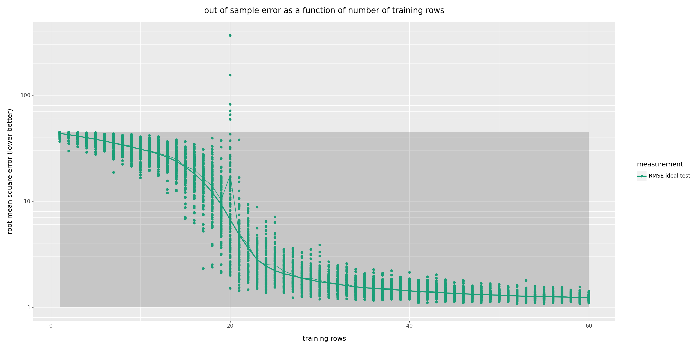

# The `m = n` Anomaly With Even a Little Error

  * John Mount
  * [Win Vector LLC](https://www.win-vector.com)
  * 4-April-2024

## Introduction

We show the `m = n` anomaly occurs with even little error a strong signal to noise ratio. An extra example for [this article](https://github.com/WinVector/Examples/blob/main/TrainingSetSize/The_m_Equals_n_Anomaly.ipynb).


```python
# import our modules and packages
import numpy as np
import pandas as pd
from overfit_fns import (
    run_training_size_modeling_experiments,
    plot_error_curves,
)
from plotnine import geom_vline
```


```python
# initialize pseudo random generator
rng = np.random.default_rng(2018)
```


```python
# pick example parameters
var_strength = 10.0
n_parameters = 20
```


```python
# our synthetic data generation process
def mk_data(
        m_row: int,
        n_variables: int,
    ):
    y = rng.normal(0, 1, m_row)
    df = dict()
    for i in range(n_variables):
        var_name = "var_" + str(i).zfill(4)
        df[var_name] = rng.normal(0, 1, m_row)
        y = y + var_strength * df[var_name]
    df['y'] = y
    return pd.DataFrame(df)

```


```python
# our large test data set we use to
# estimate true model quality
# in practice we often can not estimate
# true model quality so simply
# (must simulate using some training data 
# as hold out or cross validation methods.)
d_large_ideal_test = mk_data(100000, n_parameters)

```


```python

# expected root mean square error
# of the model that always predicts zero
# a "null" or straw man to measure our performance
# relative to.
# as our data process outcome is mean zero, this
# is a non-silly basic estimate.
rmse_null = np.sqrt(1.0 + var_strength**2 * n_parameters)

# expected root mean square error of a perfect
# model. this is the magnitude of the unexplainable
# variance in the data generation process.
rmse_perfect = 1.0
```


```python
# run all of the simulations or experiments
plot_frame = run_training_size_modeling_experiments(
    cache_file_name='strong_signal_example.parquet',
    d_large_ideal_test=d_large_ideal_test,
    example_factory=mk_data,
    rng=rng,
    rmse_null=rmse_null,
    rmse_perfect=rmse_perfect,
    n_repetitions=100,
    param_excess=3,
    alphas = [0.0],
)
```


```python
# show an excerpt
plot_frame
```


<div>
<style scoped>
    .dataframe tbody tr th:only-of-type {
        vertical-align: middle;
    }

    .dataframe tbody tr th {
        vertical-align: top;
    }

    .dataframe thead th {
        text-align: right;
    }
</style>
<table border="1" class="dataframe">
  <thead>
    <tr style="text-align: right;">
      <th></th>
      <th>training rows</th>
      <th>n variables</th>
      <th>n parameters</th>
      <th>alpha</th>
      <th>measurement</th>
      <th>value</th>
      <th>L2 regularization</th>
      <th>rmse_null</th>
      <th>rmse_perfect</th>
    </tr>
  </thead>
  <tbody>
    <tr>
      <th>0</th>
      <td>1</td>
      <td>20</td>
      <td>20</td>
      <td>0.0</td>
      <td>RMSE train</td>
      <td>0.000000e+00</td>
      <td>0.0</td>
      <td>44.732538</td>
      <td>1.0</td>
    </tr>
    <tr>
      <th>1</th>
      <td>1</td>
      <td>20</td>
      <td>20</td>
      <td>0.0</td>
      <td>RMSE train adjusted</td>
      <td>inf</td>
      <td>0.0</td>
      <td>44.732538</td>
      <td>1.0</td>
    </tr>
    <tr>
      <th>2</th>
      <td>1</td>
      <td>20</td>
      <td>20</td>
      <td>0.0</td>
      <td>RMSE train cross</td>
      <td>7.728737e+01</td>
      <td>0.0</td>
      <td>44.732538</td>
      <td>1.0</td>
    </tr>
    <tr>
      <th>3</th>
      <td>1</td>
      <td>20</td>
      <td>20</td>
      <td>0.0</td>
      <td>RMSE ideal test</td>
      <td>4.084469e+01</td>
      <td>0.0</td>
      <td>44.732538</td>
      <td>1.0</td>
    </tr>
    <tr>
      <th>0</th>
      <td>2</td>
      <td>20</td>
      <td>20</td>
      <td>0.0</td>
      <td>RMSE train</td>
      <td>1.004859e-14</td>
      <td>0.0</td>
      <td>44.732538</td>
      <td>1.0</td>
    </tr>
    <tr>
      <th>...</th>
      <td>...</td>
      <td>...</td>
      <td>...</td>
      <td>...</td>
      <td>...</td>
      <td>...</td>
      <td>...</td>
      <td>...</td>
      <td>...</td>
    </tr>
    <tr>
      <th>3</th>
      <td>59</td>
      <td>20</td>
      <td>20</td>
      <td>0.0</td>
      <td>RMSE ideal test</td>
      <td>1.299752e+00</td>
      <td>0.0</td>
      <td>44.732538</td>
      <td>1.0</td>
    </tr>
    <tr>
      <th>0</th>
      <td>60</td>
      <td>20</td>
      <td>20</td>
      <td>0.0</td>
      <td>RMSE train</td>
      <td>7.673191e-01</td>
      <td>0.0</td>
      <td>44.732538</td>
      <td>1.0</td>
    </tr>
    <tr>
      <th>1</th>
      <td>60</td>
      <td>20</td>
      <td>20</td>
      <td>0.0</td>
      <td>RMSE train adjusted</td>
      <td>9.397701e-01</td>
      <td>0.0</td>
      <td>44.732538</td>
      <td>1.0</td>
    </tr>
    <tr>
      <th>2</th>
      <td>60</td>
      <td>20</td>
      <td>20</td>
      <td>0.0</td>
      <td>RMSE train cross</td>
      <td>1.189464e+00</td>
      <td>0.0</td>
      <td>44.732538</td>
      <td>1.0</td>
    </tr>
    <tr>
      <th>3</th>
      <td>60</td>
      <td>20</td>
      <td>20</td>
      <td>0.0</td>
      <td>RMSE ideal test</td>
      <td>1.177933e+00</td>
      <td>0.0</td>
      <td>44.732538</td>
      <td>1.0</td>
    </tr>
  </tbody>
</table>
<p>24000 rows × 9 columns</p>
</div>


```python
alpha_min = np.min(plot_frame['alpha'])
plot_error_curves(
    plot_frame.loc[
        (plot_frame['measurement'] == 'RMSE ideal test')
        ,:
    ],
    draw_lines=True,
    line_function="mean",
    draw_smooth=True,
    alpha_adjust=False,
    title="out of sample error as a function of number of training rows",
    log_scale_y=True,
    ) + geom_vline(xintercept=n_parameters, alpha=0.5)
```


    

    


All code and data for this article can be found [here](https://github.com/WinVector/Examples/tree/main/TrainingSetSize).

Copyright &copy; 2018-2024 Win-Vector LLC.  All rights reserved. [http://www.win-vector.com](http://www.win-vector.com)


