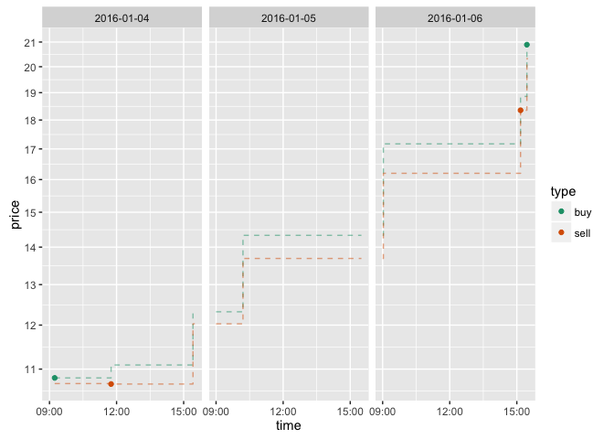

[`geom_step`](http://docs.ggplot2.org/current/geom_path.html) is an interesting geom supplied by the [R](https://cran.r-project.orgli) package [ggplot2](http://ggplot2.org). It is an appropriate rendering option for financial market data and we will show how and why to use it in this article.

Let's take a simple example of plotting market data. In this case we are plotting the "ask price" (the publicly published price an item is available for purchase at a given time), the "bid price" (the publicly published price an item is available for sale at a given time), and "trades" (past purchases and sales).

Most markets maintain these "quoted" prices as an order book and the public ask price is always greater than the public bid price (else we would have a "crossed market"). We can also track recent transactions or trades. Here is some example (made-up) data.

``` r
print(quotes)
```

    ##             quoteTime       date askPrice bidPrice
    ## 1 2016-01-04 09:14:00 2016-01-04    10.81    10.69
    ## 2 2016-01-04 11:45:17 2016-01-04    11.09    10.68
    ## 3 2016-01-04 15:25:00 2016-01-04    12.32    12.03
    ## 4 2016-01-05 10:12:13 2016-01-05    14.33    13.69
    ## 5 2016-01-06 09:02:00 2016-01-06    17.17    16.20
    ## 6 2016-01-06 15:10:00 2016-01-06    18.86    18.35
    ## 7 2016-01-06 15:27:00 2016-01-06    20.89    20.32

``` r
print(trades)
```

    ##             tradeTime       date tradePrice quantity
    ## 1 2016-01-04 09:14:00 2016-01-04      10.81      600
    ## 2 2016-01-04 11:45:17 2016-01-04      10.68      500
    ## 6 2016-01-06 15:10:00 2016-01-06      18.35      200
    ## 7 2016-01-06 15:27:00 2016-01-06      20.89      200

Notice each revision of the book (notification of a bid price, ask price, or both) happens at a specific time. Ask and bid prices are good until they are revised or withdrawn.

There is some issue as to what is the "price" of a financial instrument (say in this case a stock).

Money only changes hands on trades- so past quotes that were never "hit" or traded against in some sense never happened (in fact this is becoming a problem called "flashing"). So market participants can somewhat manipulate bids and asks as long as they don't cross. Asks and bids represent risk or a one-sided opinion on price but can not be trusted (especially when the "bid ask gap" is very large).

Trades cost fees and transfer money, so they are evidence of two parties agreeing on price for a moment. But all trades you know about are in the past. Just because somebody purchased some shares of IBM in the past for $120 a share doesn't mean you can do the same. You could only make such a purchase if there is an appropriate ask price in the market (or you place your own limit order forming a bid that somebody else hits).

What I am trying to say is the classic "ticker tape pattern" graph shown below drawing only trades and connecting them with sloping lines is not appropriate for plotting markets (especially when plotting high frequency or in-day data).

``` r
ggplot(data=trades,aes(x=tradeTime,y=tradePrice)) + 
  geom_line() + geom_point()
```


There are a lot wrong with such graphs.

-   We have plotted only past trades, so we have no idea what *we* would have had to pay to buy stock or gotten to sell stock at any time.
-   The sloped segments "leak information" from the future as right after the trade the line slope tells you if the next trade in the future is going to be at a higher or lower price than the trade at hand. It is important in graphing financial instruments to have graph of where at each time in the graph we are plotting only things that are known by that time. This is also why we should not use standard smoothing curves such as [`geom_smooth`](http://docs.ggplot2.org/current/geom_smooth.html) as the defaults use data from the past and future to perform the smoothing (instead should use a trailing window such as exponential smoothing).

(Side note: if anybody has some good code to make `geom_smooth` perform exponential smoothing in all cases, including grouping and facets I would really like a copy. Right now I have to join in smoothed data as new column as I have never completely grocked all of the implementation interface requirements for new `ggplot2` statistics in their full production complexity.)

If all that seems complicated, scary, unpleasant and technical: that is the right way to think. Markets are not safe, simple, or pleasant. They can be reasoned about and worked with, but it is wrong to think they are simple or easy.

An (unfortunately) more complicated (and slightly less legible graph) is needed to try and faithfully present the information. Since asks and bids are good until withdrawn and revised we render then with a step shape (such as generated by `ggplot2::geom_step`) and since trades happen only at a single time (and are not a promise going forward) we render them with points. Such a graph is given below.

``` r
ggplot() + 
  geom_step(data=quotes,mapping=aes(x=quoteTime,y=askPrice),
            linetype=2,color='#1b9e77',alpha=0.5) + 
  geom_step(data=quotes,mapping=aes(x=quoteTime,y=bidPrice),
            linetype=2,color='#d95f02',alpha=0.5) +
  geom_point(data=trades,mapping=(aes(x=tradeTime,y=tradePrice))) +
  ylab('price') + xlab('time') + scale_y_log10(breaks=breaks)
```


The step functions propagate flat lines forward from quote revisions, correctly indicating what ask price and bid price were in effect at all times. Trades are shown as dots since they have no propagation. Each item drawn on the graph at a given time was actually know by that time (so a person or trading strategy would also have access to such information at that time).

Trades that occur nearer the ask price can be considered "buyer initiated" and trades that occur near the bid price are considered can be considered seller initiated, which we can indicate through color.

``` r
mids <- (lastKnownValue(NA,quotes$quoteTime,quotes$askPrice,trades$tradeTime)+
          lastKnownValue(NA,quotes$quoteTime,quotes$bidPrice,trades$tradeTime))/2
trades$type <- ifelse(trades$tradePrice>=mids,'buy','sell')

ggplot() + 
  geom_step(data=quotes,mapping=aes(x=quoteTime,y=askPrice),
            linetype=2,color='#1b9e77',alpha=0.5) + 
  geom_step(data=quotes,mapping=aes(x=quoteTime,y=bidPrice),
            linetype=2,color='#d95f02',alpha=0.5) +
  geom_point(data=trades,mapping=(aes(x=tradeTime,y=tradePrice,color=type))) +
  ylab('price') + xlab('time') +  scale_y_log10(breaks=breaks) +
  scale_color_brewer(palette = 'Dark2')
```


This is a good time to point out a problem in these graphs. We are mostly plotting times when the market is closed. Most of the space is wasted. In the graph below we indicate (fictitious) market hours by shading the "market open hours" to illustrate the issue.

``` r
print(openClose)
```

    ##         date                time  what askPrice bidPrice
    ## 1 2016-01-04 2016-01-04 09:00:00  open       NA       NA
    ## 2 2016-01-04 2016-01-04 15:30:00 close    12.32    12.03
    ## 3 2016-01-05 2016-01-05 09:00:00  open    12.32    12.03
    ## 4 2016-01-05 2016-01-05 15:30:00 close    14.33    13.69
    ## 5 2016-01-06 2016-01-06 09:00:00  open    14.33    13.69
    ## 6 2016-01-06 2016-01-06 15:30:00 close    20.89    20.32

``` r
openClose %>% select(date,time,what) %>% spread(what,time) -> marketHours

ggplot() + 
  geom_step(data=quotes,mapping=aes(x=quoteTime,y=askPrice),
            linetype=2,color='#1b9e77',alpha=0.5) + 
  geom_step(data=quotes,mapping=aes(x=quoteTime,y=bidPrice),
            linetype=2,color='#d95f02',alpha=0.5) +
  geom_point(data=trades,mapping=(aes(x=tradeTime,y=tradePrice,color=type))) +
  geom_rect(data=marketHours,
            mapping=aes(xmin=open,xmax=close,ymin=0,ymax=Inf),
            fill='blue',alpha=0.3) +
  ylab('price') + xlab('time') +   scale_y_log10(breaks=breaks) +
  scale_color_brewer(palette = 'Dark2')
```


The easiest way to fix this in `ggplot2` would be to use `facet_wrap`, but this crashes (at least for `ggplot2` version `2.1.0` current on Cran 2016-06-03) with the very cryptic error message as shown below.

``` r
ggplot() + 
  geom_step(data=quotes,mapping=aes(x=quoteTime,y=askPrice),
            linetype=2,color='#1b9e77',alpha=0.5) + 
  geom_step(data=quotes,mapping=aes(x=quoteTime,y=bidPrice),
            linetype=2,color='#d95f02',alpha=0.5) +
  geom_point(data=trades,mapping=(aes(x=tradeTime,y=tradePrice,color=type))) +
   facet_wrap(~date,scale='free_x') +
  ylab('price') + xlab('time') + scale_color_brewer(palette = 'Dark2')
```

    ## Error in grid.Call.graphics(L_lines, x$x, x$y, index, x$arrow): invalid line type


Despite the message "invalid line type" the error is not the user's selection of linetype. It is easier to see what is going on if we replace `geom_step` with `geom_line` as we show below.

``` r
ggplot() + 
  geom_line(data=quotes,mapping=aes(x=quoteTime,y=askPrice),
            linetype=2,color='#1b9e77',alpha=0.5) + 
  geom_line(data=quotes,mapping=aes(x=quoteTime,y=bidPrice),
            linetype=2,color='#d95f02',alpha=0.5) +
  geom_point(data=trades,mapping=(aes(x=tradeTime,y=tradePrice,color=type))) +
   facet_wrap(~date,scale='free_x') +
  ylab('price') + xlab('time') +   scale_y_log10(breaks=breaks) +
  scale_color_brewer(palette = 'Dark2')
```

    ## geom_path: Each group consists of only one observation. Do you need to
    ## adjust the group aesthetic?
    ## geom_path: Each group consists of only one observation. Do you need to
    ## adjust the group aesthetic?


The above graph is now using sloped lines to connect ask price and bid price revisions (given the false impression that these intermediate prices were ever available and essentially "leaking information from the future" into the visual presentation). However, we get a graph and a more reasonable warning message: "geom\_path: Each group consists of only one observation." There was only one quote revision on 2016-01-05 so as `facet_wrap` treats each facet as sub-graph (and not as a portal into a single larger graph): days with fewer than 2 quote revisions have trouble drawing paths. The trouble causes the (deceptive) blank facet for 2016-01-05 if we are using simple sloped lines (`geom_line`) and seems to error out on the more complicated `geom_step`.

In my opinion this is something `geom_step` should "fail a bit gentler" on this example (as <code>geom\_line</code> already does). In any case the correct domain specific fix is to regularize the data a bit by adding market open and close information. In many markets the open and closing prices are set by specific mechanisms (such as an opening auction and a closing volume or time weighted average). For our example we will just use last known price (which we have already prepared).

``` r
openClose %>% mutate(quoteTime=time) %>% 
  bind_rows(quotes) %>%
  arrange(time) %>% 
  select(date,askPrice,bidPrice,quoteTime) -> joinedData

ggplot() + 
  geom_step(data=joinedData,mapping=aes(x=quoteTime,y=askPrice),
            linetype=2,color='#1b9e77',alpha=0.5) + 
  geom_step(data=joinedData,mapping=aes(x=quoteTime,y=bidPrice),
            linetype=2,color='#d95f02',alpha=0.5) +
  geom_point(data=trades,mapping=(aes(x=tradeTime,y=tradePrice,color=type))) +
   facet_wrap(~date,scale='free_x') +
  ylab('price') + xlab('time') +   scale_y_log10(breaks=breaks) +
  scale_color_brewer(palette = 'Dark2')
```

    ## Warning: Removed 1 rows containing missing values (geom_path).

    ## Warning: Removed 1 rows containing missing values (geom_path).



The above graph is pretty good. In fact easily producing a graph like this in R using [`dygraphs`](https://github.com/rstudio/dygraphs) is [currently an open issue](https://github.com/rstudio/dygraphs/issues/70).
