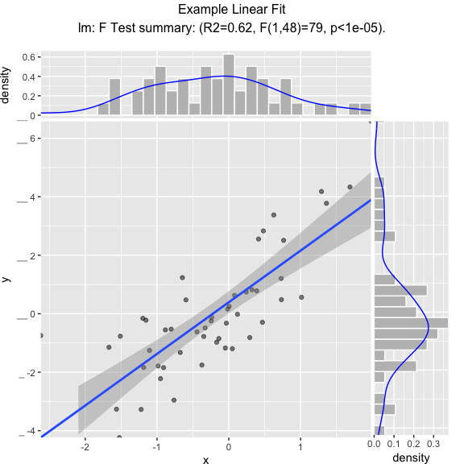
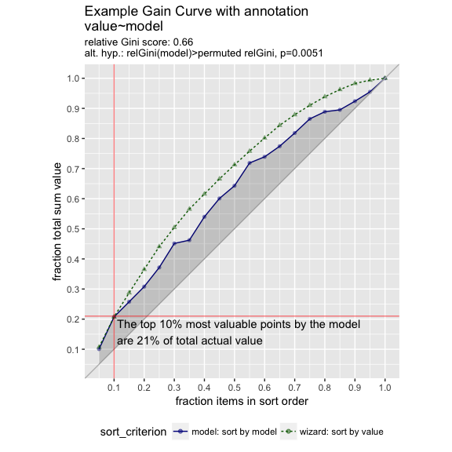
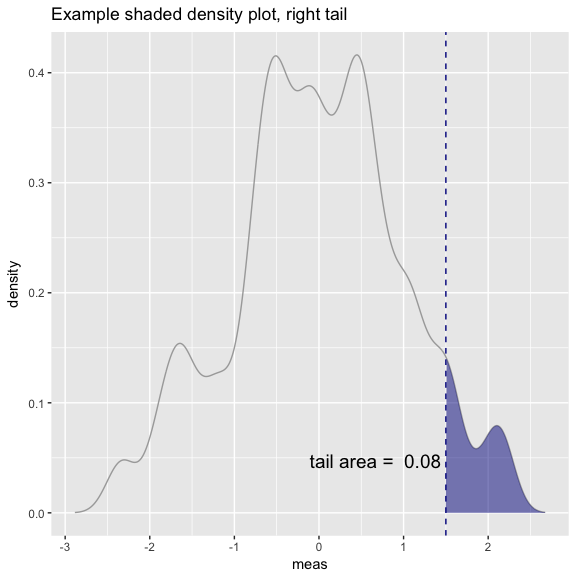
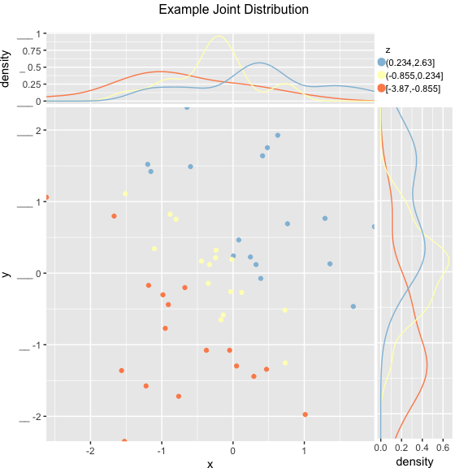
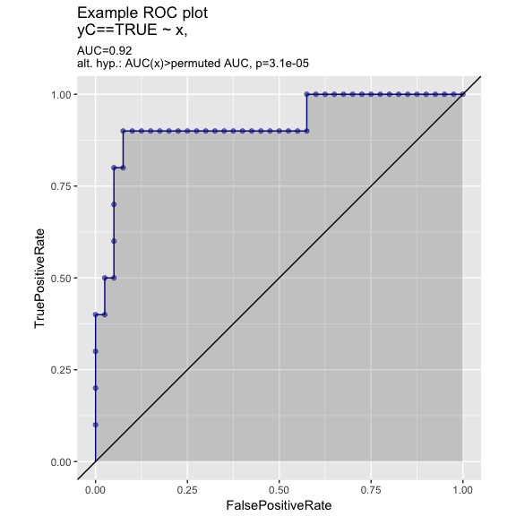

[WVPlots](https://CRAN.R-project.org/package=WVPlots) is a set of `ggplot2` [`R`](https://cran.r-project.org) plotting examples.

<a target="_blank" href="http://www.win-vector.com/site/staff/nina-zumel/">Nina Zumel</a> and <a target="_blank" href="http://www.win-vector.com/site/staff/john-mount/">I</a> have been working on packaging our <a target="_blank" href="http://www.win-vector.com/blog/2011/12/my-favorite-graphs/">favorite graphing techniques</a> in a more reusable way that emphasizes the analysis task at hand over the steps needed to produce a good visualization. The idea is: we sacrifice some of the flexibility and composability inherent to <a target="_blank" href="http://ggplot2.org">ggplot2</a> in <a target="_blank" href="https://cran.r-project.org">R</a> for a menu of prescribed presentation solutions.

For example the plot below showing both an observed discrete empirical distribution (as stems) and a matching theoretical distribution (as bars) is a built in "one liner."

``` r
set.seed(52523)
d <- data.frame(wt=100*rnorm(100))
WVPlots::PlotDistCountNormal(d,'wt','example')
```


The graph above is actually the product of a number of presentation decisions:

-   Using a discrete histogram approach to summarize data (instead of a kernel density approach) to create a presentation more familiar to business partners.
-   Using a Cleveland style dot with stem plot instead of wide bars to emphasize the stem heights represent total counts (and not the usual accidental misapprehension that bar <em>areas</em> represent totals).
-   Automatically fitting and rendering the matching (properly count-scaled) normal distribution as thin translucent bars for easy comparison (again to try and de-emphasize area).

All of these decisions are triggered by choosing which plot to use from the WVPlots library. In this case we chose <code>WVPlots::PlotDistCountNormal</code>. For an audience of analysts we might choose an area/density based representation (by instead specifying <code>WVPlots::PlotDistDensityNormal</code>) which is shown below:

``` r
WVPlots::PlotDistDensityNormal(d,'wt','example')
```


Switching the chosen plot simultaneously changes many of the details of the presentation. WVPlots is designed to make this change simple by insisting an a very simple unified calling convention. The plot calls all insist on roughly the following arguments:

-   frame: data frame containing the data to be presented.
-   xvar: name of the x variable column in the data frame.
-   yvar: name of the y variable column in the data frame (not part of the shown density plots!).
-   title: text title for the plot.

This rigid calling interface is easy to remember and makes switching between plot types very easy. We have also make <code>title</code> a required argument, as we feel all plots should be labeled.

What we are trying to do is separate the specification of exactly what plot we want from the details of how to produce it. We find this separation of concerns and encapsulation of implementation allows us to routinely use rich annotated graphics. Below are a few more examples:

``` r
set.seed(34903490)
x = rnorm(50)
y = 0.5*x^2 + 2*x + rnorm(length(x))
frm = data.frame(x=x,y=y,yC=y>=as.numeric(quantile(y,probs=0.8)))
frm$absY <- abs(frm$y)
frm$posY = frm$y > 0
WVPlots::ScatterHist(frm, "x", "y", smoothmethod="lm", 
                     title="Example Linear Fit", annot_size=2)
```



``` r
set.seed(34903490)
y = abs(rnorm(20)) + 0.1
x = abs(y + 0.5*rnorm(20))

frm = data.frame(model=x, value=y)

frm$costs=1
frm$costs[1]=5
frm$rate = with(frm, value/costs)

frm$isValuable = (frm$value >= as.numeric(quantile(frm$value, probs=0.8)))
gainx = 0.10  # get the top 10% most valuable points as sorted by the model

# make a function to calculate the label for the annotated point
labelfun = function(gx, gy) {
  pctx = gx*100
  pcty = gy*100
  
  paste("The top ", pctx, "% most valuable points by the model\n",
        "are ", pcty, "% of total actual value", sep='')
}

WVPlots::GainCurvePlotWithNotation(frm, "model", "value", 
                                   title="Example Gain Curve with annotation", 
                          gainx=gainx,labelfun=labelfun) 
```



``` r
set.seed(52523)
d = data.frame(meas=rnorm(100))
threshold = 1.5
WVPlots::ShadedDensity(d, "meas", threshold, tail="right", 
                       title="Example shaded density plot, right tail")
```



``` r
set.seed(34903490)
frm = data.frame(x=rnorm(50),y=rnorm(50))
frm$z <- frm$x+frm$y
WVPlots::ScatterHistN(frm, "x", "y", "z", title="Example Joint Distribution")
```



``` r
set.seed(34903490)
x = rnorm(50)
y = 0.5*x^2 + 2*x + rnorm(length(x))
frm = data.frame(x=x,yC=y>=as.numeric(quantile(y,probs=0.8)))
WVPlots::ROCPlot(frm, "x", "yC", TRUE, title="Example ROC plot")
```



We know this collection doesn't rise to the standard of a complete "grammar of graphics." But it can become (through accumulation) a re-usable repository of a number of specific graphing tasks done well. It is also a chance to eventually document presentation design decisions (though we haven't gotten far on that yet). The complete set of graphs is shown in the `WVPlots_example` vignette.
