[WVPlots](https://CRAN.R-project.org/package=WVPlots) is a set of `ggplot2` [`R`](https://cran.r-project.org) plotting examples.

Some example data science plots in R using `ggplot2`. See <https://github.com/WinVector/WVPlots> for code/details.

``` r
set.seed(34903490)
x = rnorm(50)
y = 0.5*x^2 + 2*x + rnorm(length(x))
frm = data.frame(x=x,y=y,yC=y>=as.numeric(quantile(y,probs=0.8)))
frm$absY <- abs(frm$y)
frm$posY = frm$y > 0
```

Scatterplots
------------

Scatterplot with smoothing line through points. Reports the square of the correlation between x and y (R-squared) and its significance.

``` r
WVPlots::ScatterHist(frm, "x", "y", title="Example Fit")
```

    ## `geom_smooth()` using method = 'loess'
    ## `geom_smooth()` using method = 'loess'

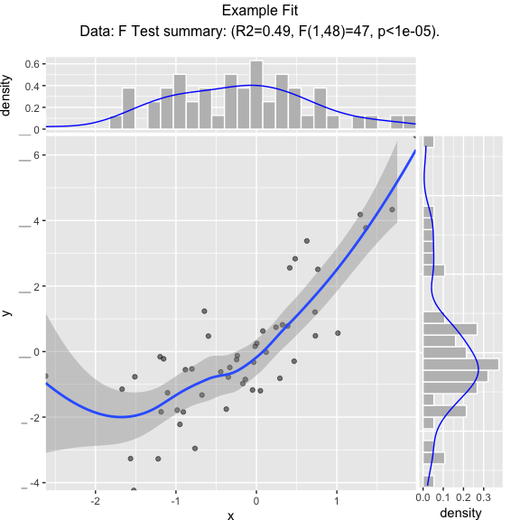

Scatterplot with best linear fit through points. Reports the R-squared and significance of the linear fit.

``` r
WVPlots::ScatterHist(frm, "x", "y", smoothmethod="lm", 
                     title="Example Linear Fit", annot_size=2)
```


Scatterplot compared to the line `x = y`. Reports the square of the correlation between x and y (R-squared) and its significance.

``` r
WVPlots::ScatterHist(frm, "x", "y", smoothmethod="identity", 
                     title="Example Relation Plot", annot_size=2)
```

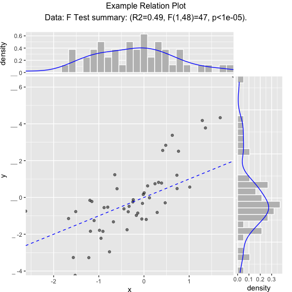

Scatterplot of *(x, y)* color-coded by category/group, with marginal distributions of *x* and *y* conditioned on group.

``` r
set.seed(34903490)
fmScatterHistC = data.frame(x=rnorm(50),y=rnorm(50))
fmScatterHistC$cat <- fmScatterHistC$x+fmScatterHistC$y>0
WVPlots::ScatterHistC(fmScatterHistC, "x", "y", "cat", title="Example Conditional Distribution")
```

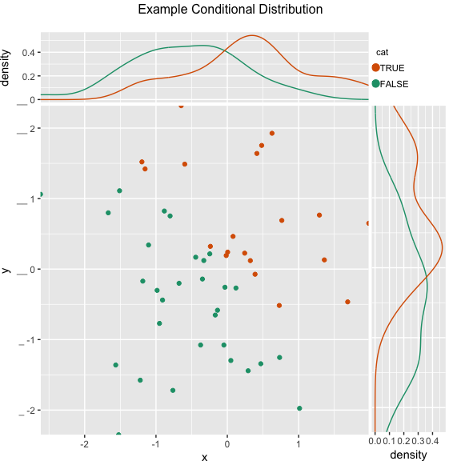

Scatterplot of *(x, y)* color-coded by discretized *z*. The continuous variable *z* is binned into three groups, and then plotted as by `ScatterHistC`

``` r
set.seed(34903490)
frmScatterHistN = data.frame(x=rnorm(50),y=rnorm(50))
frmScatterHistN$z <- frmScatterHistN$x+frmScatterHistN$y
WVPlots::ScatterHistN(frmScatterHistN, "x", "y", "z", title="Example Joint Distribution")
```

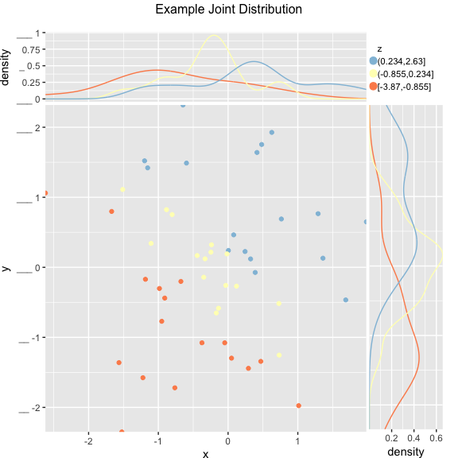

Plot the relationship *y* as a function of *x* with a smoothing curve that estimates *E*\[*y*|*x*\]. If *y* is a 0/1 variable as below (binary classification, where 1 is the target class), then the smoothing curve estimates *P*(*y*|*x*). Since *y* ∈ {0, 1} with *y* intended to be monotone in *x* is the most common use of this graph, `BinaryYScatterPlot` uses a `glm` smoother by default (`use_glm=TRUE`, this is essentially Platt scaling), as the best estimate of *P*(*y*|*x*).

``` r
WVPlots::BinaryYScatterPlot(frm, "x", "posY", use_glm=FALSE,
                            title="Example 'Probability of Y' Plot (ggplot2 smoothing)")
```

    ## `geom_smooth()` using method = 'loess'

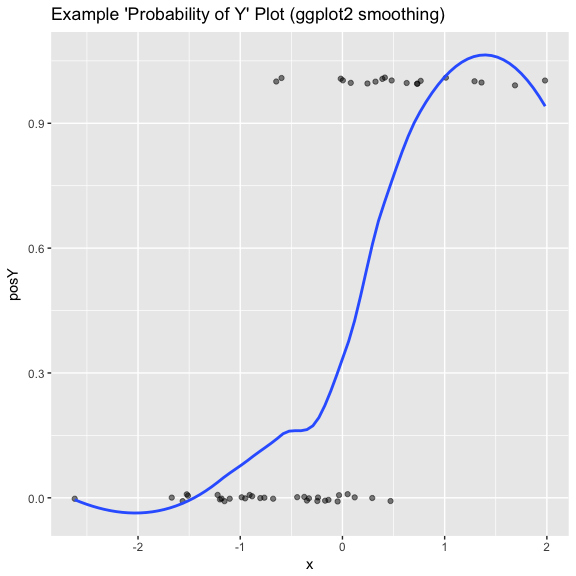

``` r
WVPlots::BinaryYScatterPlot(frm, "x", "posY", use_glm=TRUE, 
                            title="Example 'Probability of Y' Plot (GLM smoothing)")
```

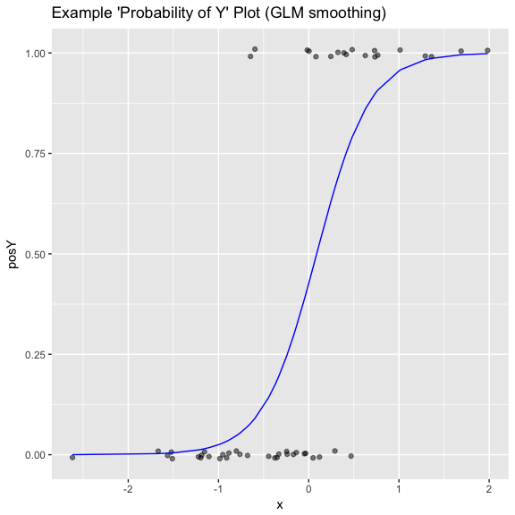

Gain Curves
-----------

``` r
set.seed(34903490)
y = abs(rnorm(20)) + 0.1
x = abs(y + 0.5*rnorm(20))

frm = data.frame(model=x, value=y)

frm$costs=1
frm$costs[1]=5
frm$rate = with(frm, value/costs)

frm$isValuable = (frm$value >= as.numeric(quantile(frm$value, probs=0.8)))
```

Basic curve: each item "costs" the same. The wizard sorts by true value, the x axis sorts by the model, and plots the fraction of the total population.

``` r
WVPlots::GainCurvePlot(frm, "model", "value", title="Example Continuous Gain Curve")
```

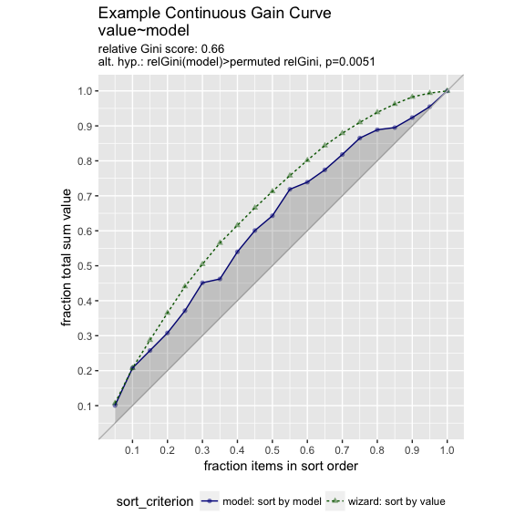

We can annotate a point of the model at a specific x value

``` r
gainx = 0.10  # get the top 10% most valuable points as sorted by the model

# make a function to calculate the label for the annotated point
labelfun = function(gx, gy) {
  pctx = gx*100
  pcty = gy*100
  
  paste("The top ", pctx, "% most valuable points by the model\n",
        "are ", pcty, "% of total actual value", sep='')
}

WVPlots::GainCurvePlotWithNotation(frm, "model", "value", 
                                   title="Example Gain Curve with annotation", 
                          gainx=gainx,labelfun=labelfun) 
```

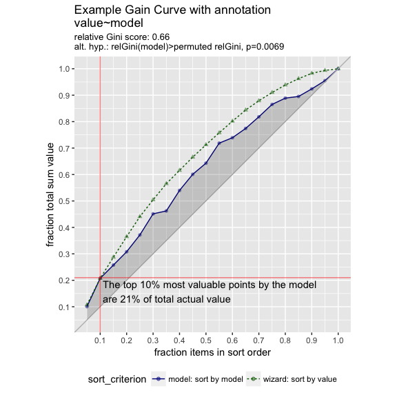

When the `x` values have different costs, take that into account in the gain curve. The wizard now sorts by value/cost, and the x axis is sorted by the model, but plots the fraction of total cost, rather than total count.

``` r
WVPlots::GainCurvePlotC(frm, "model", "costs", "value", title="Example Continuous Gain CurveC")
```

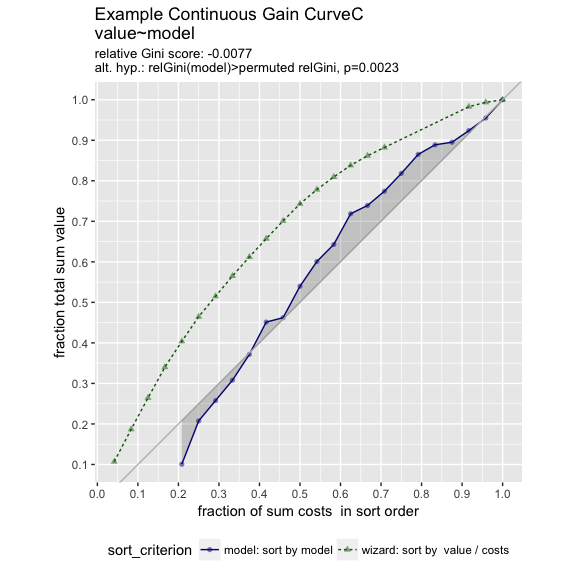

ROC Plots
---------

``` r
WVPlots::ROCPlot(frm, "model", "isValuable", TRUE, title="Example ROC plot")
```

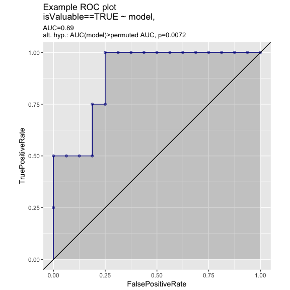

``` r
set.seed(34903490)
x1 = rnorm(50)
x2 = rnorm(length(x1))
y = 0.2*x2^2 + 0.5*x2 + x1 + rnorm(length(x1))
frmP = data.frame(x1=x1,x2=x2,yC=y>=as.numeric(quantile(y,probs=0.8)))
# WVPlots::ROCPlot(frmP, "x1", "yC", TRUE, title="Example ROC plot")
# WVPlots::ROCPlot(frmP, "x2", "yC", TRUE, title="Example ROC plot")
WVPlots::ROCPlotPair(frmP, "x1", "x2", "yC", TRUE, title="Example ROC pair plot")
```

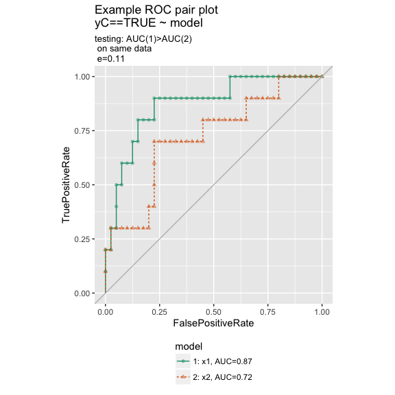

Precision-Recall Plot
---------------------

``` r
WVPlots::PRPlot(frm, "model", "isValuable", TRUE, title="Example Precision-Recall plot")
```

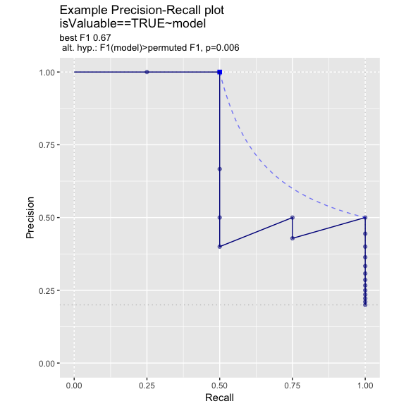

Double Density Plot
-------------------

``` r
WVPlots::DoubleDensityPlot(frm, "model", "isValuable", title="Example double density plot")
```

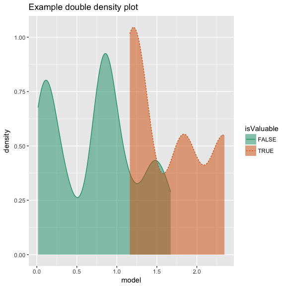

Double Histogram Plot
---------------------

``` r
WVPlots::DoubleHistogramPlot(frm, "model", "isValuable", title="Example double histogram plot")
```

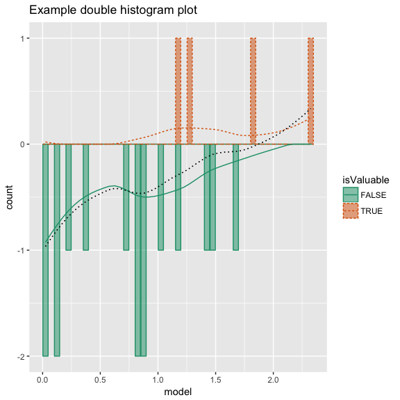

Cleveland Style Dotplots
------------------------

``` r
set.seed(34903490)

# discrete variable: letters of the alphabet
# frequencies of letters in English
# source: http://en.algoritmy.net/article/40379/Letter-frequency-English
letterFreqs = c(8.167, 1.492, 2.782, 4.253, 12.702, 2.228,
                2.015, 6.094, 6.966, 0.153, 0.772, 4.025, 2.406, 6.749, 7.507, 1.929,
                0.095, 5.987, 6.327, 9.056, 2.758, 0.978, 2.360, 0.150, 1.974, 0.074)
letterFreqs = letterFreqs/100
letterFrame = data.frame(letter = letters, freq=letterFreqs)

# now let's generate letters according to their letter frequencies
N = 1000
randomDraws = data.frame(draw=1:N, letter=sample(letterFrame$letter, size=N, replace=TRUE, prob=letterFrame$freq))

WVPlots::ClevelandDotPlot(randomDraws, "letter", title = "Example Cleveland-style dot plot")
```

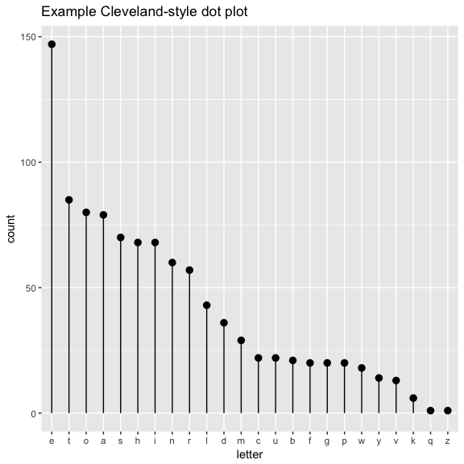

``` r
WVPlots::ClevelandDotPlot(randomDraws, "letter", limit_n = 10,  title = "Top 10 most frequent letters")
```


``` r
WVPlots::ClevelandDotPlot(randomDraws, "letter", sort=0, title="Example Cleveland-style dot plot, unsorted")
```

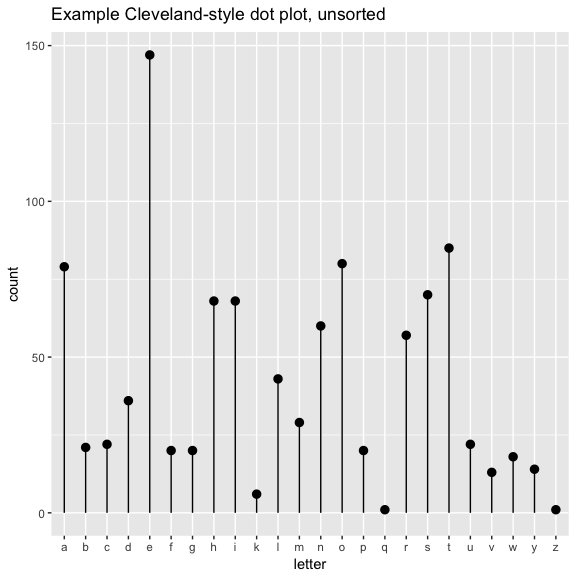

``` r
WVPlots::ClevelandDotPlot(randomDraws, "letter", sort=1, stem=FALSE, title="Example with increasing sort order + coord_flip, no stem") + ggplot2::coord_flip()
```

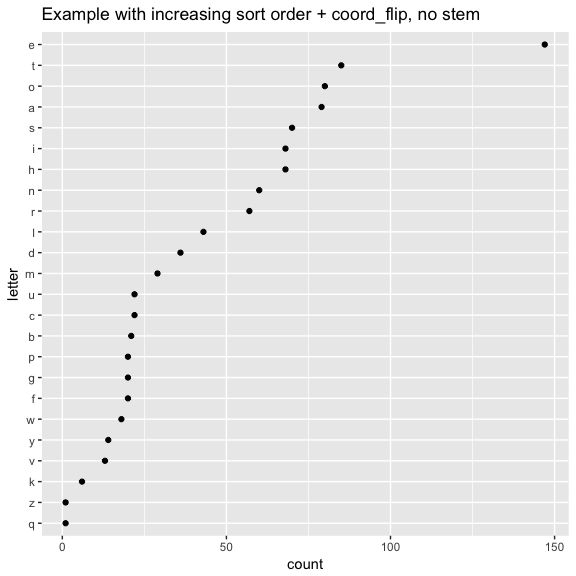

ScatterBox Plots
----------------

``` r
classes = c("a", "b", "c")
means = c(2, 4, 3)
names(means) = classes
label = sample(classes, size=1000, replace=TRUE)
meas = means[label] + rnorm(1000)
frm2 = data.frame(label=label,
                  meas = meas)

WVPlots::ScatterBoxPlot(frm2, "label", "meas", pt_alpha=0.2, title="Example Scatter/Box plot")
```

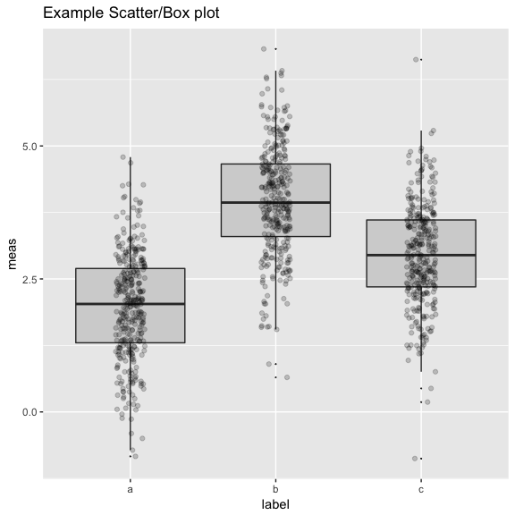

``` r
WVPlots::ScatterBoxPlotH(frm2, "meas", "label",  pt_alpha=0.2, title="Example Scatter/Box plot")
```

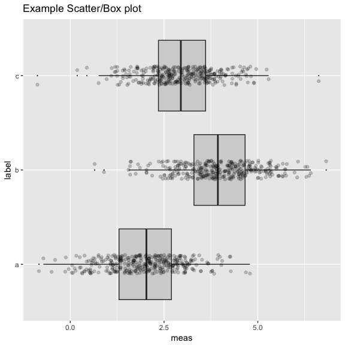

Discrete Distribution Plot
--------------------------

``` r
frmx = data.frame(x = rbinom(1000, 20, 0.5))
WVPlots::DiscreteDistribution(frmx, "x","Discrete example")
```

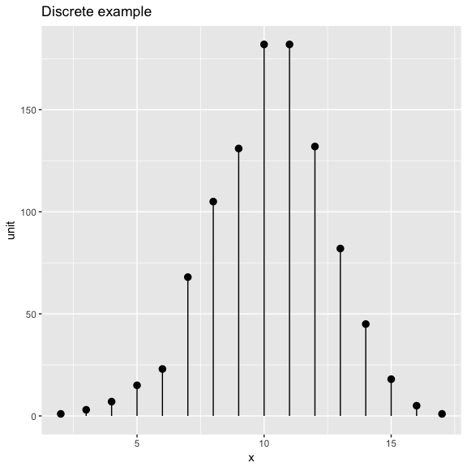

Distribution and Count Plot
---------------------------

``` r
set.seed(52523)
d <- data.frame(wt=100*rnorm(100))
WVPlots::PlotDistCountNormal(d,'wt','example')
```

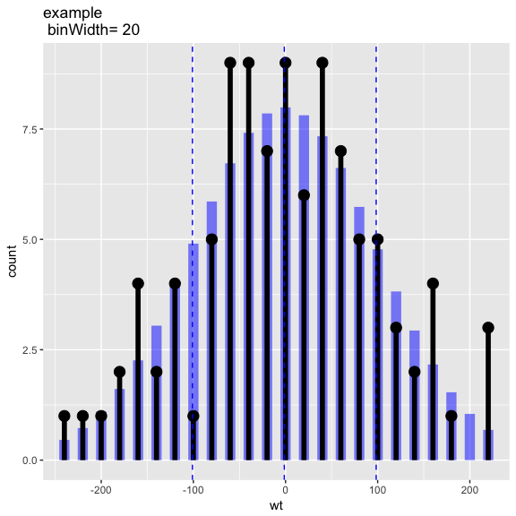

``` r
WVPlots::PlotDistDensityNormal(d,'wt','example')
```

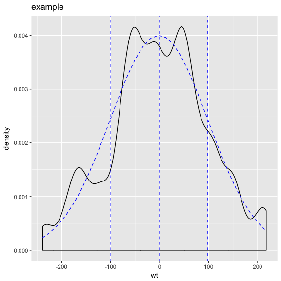

Smoothed Scatterplots
---------------------

``` r
y = c(1,2,3,4,5,10,15,18,20,25)
x = seq_len(length(y))
df = data.frame(x=x,y=y)

WVPlots::ConditionalSmoothedScatterPlot(df, "x", "y", NULL, title="centered smooth, one group")
```

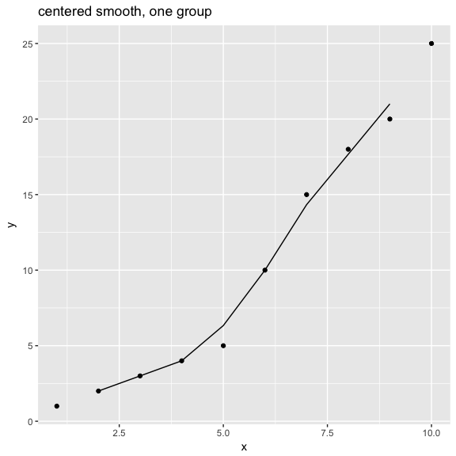

``` r
WVPlots::ConditionalSmoothedScatterPlot(df, "x", "y", NULL, title="left smooth, one group", align="left")
```

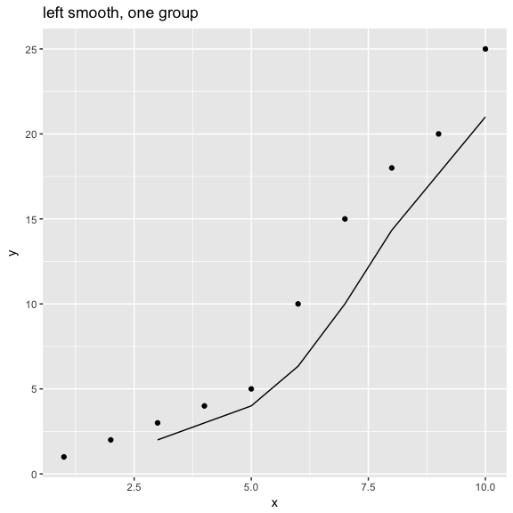

``` r
WVPlots::ConditionalSmoothedScatterPlot(df, "x", "y", NULL, title="right smooth, one group", align="right")
```

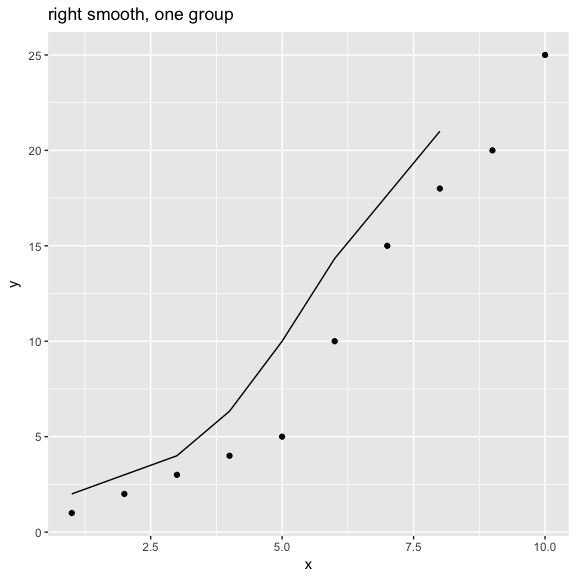

``` r
n = length(x)
df = rbind(data.frame(x=x, y=y+rnorm(n), gp="times 1"),
           data.frame(x=x, y=0.5*y + rnorm(n), gp="times 1/2"),
           data.frame(x=x, y=2*y + rnorm(n), gp="times 2"))

WVPlots::ConditionalSmoothedScatterPlot(df, "x", "y", "gp", title="centered smooth, multigroup")
```

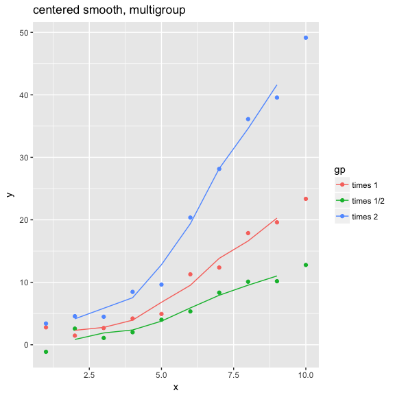

``` r
WVPlots::ConditionalSmoothedScatterPlot(df, "x", "y", "gp", title="left smooth, multigroup", align="left")
```

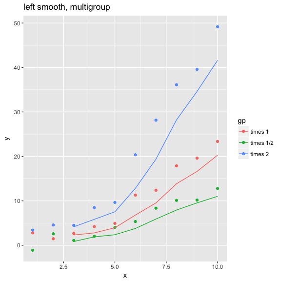

``` r
WVPlots::ConditionalSmoothedScatterPlot(df, "x", "y", "gp", title="right smooth, multigroup", align="right")
```

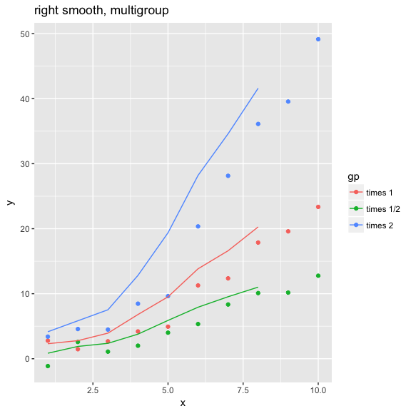

Density Plot with Shaded Tail
-----------------------------

``` r
set.seed(52523)
d = data.frame(meas=rnorm(100))
threshold = -1.5
WVPlots::ShadedDensity(d, "meas", threshold, 
                       title="Example shaded density plot, left tail")
```

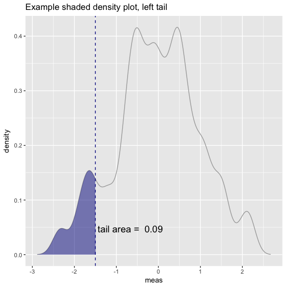

``` r
WVPlots::ShadedDensity(d, "meas", -threshold, tail="right", 
                       title="Example shaded density plot, right tail")
```


