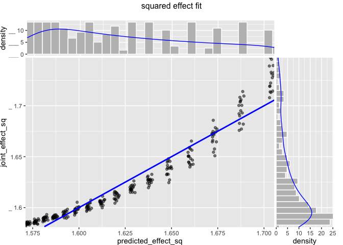
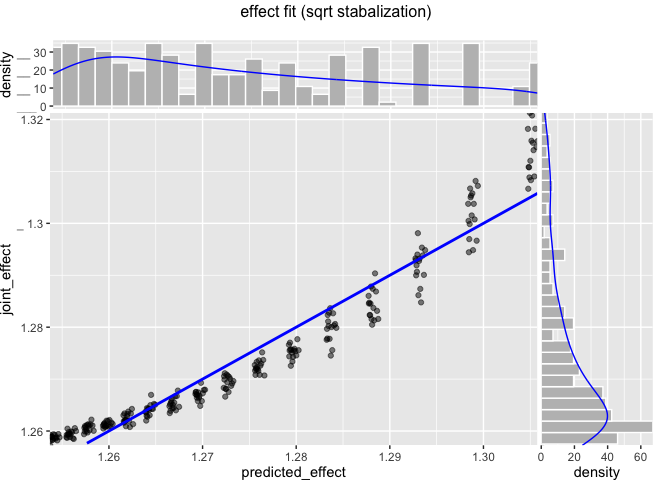

Data Allocation
================

Supporting example for [“What is a Good Test Set
Size?”](What_is_a_Good_Test_Set_Size.md).

``` r
orig_state <- ls()

attach_all <- function() {
  library(glmnet)
  library(wrapr)
}

attach_all()
```

    ## Loading required package: Matrix

    ## Loaded glmnet 4.0-2

    ## 
    ## Attaching package: 'wrapr'

    ## The following objects are masked from 'package:Matrix':
    ## 
    ##     pack, unpack

``` r
library(parallel)
library(WVPlots)
library(rqdatatable)
```

    ## Loading required package: rquery

``` r
source('Data_Allocation_fns.R')
after_state <- ls()
to_share <- setdiff(after_state, c(orig_state, 'orig_state', 'after_state'))
```

Our Example Data
----------------

We define our synthetic data. We are using synthetic data because for
synthetic data:

-   We know the right answer.
-   We can generate as much of it as we want.

``` r
set.seed(2021)
```

``` r
cache_file <- 'tests.csv'
if(!file.exists(cache_file)) {
  model_def <- glm_model_def
  pop_size <- 1000000
  # get a simulation of infinite population
  simulated_pop <- mk_data(pop_size)
  # fit on full population
  outcome_name <- 'y'
  vars <- setdiff(colnames(simulated_pop), outcome_name)
  full_model <- model_def$fit(
    vars = vars, 
    outcome_name = outcome_name, 
    d = simulated_pop
  )
  full_pred <- full_model$predict(simulated_pop)
  full_model <- NULL
  idea_dev <- deviance_per_row(
    pred = full_pred, 
    truth = simulated_pop[[outcome_name]])
  full_pred <- NULL
  
  # run various train/test sizes
  train_sizes <- seq(300, 600, by = 20)
  test_sizes <- train_sizes
  experiment <- expand.grid(train_size = train_sizes, test_size = test_sizes)
  experiment <- do.call(
    rbind,
    rep(list(experiment), 50))
  
  cl <- makeCluster(detectCores())
  clusterExport(
    cl, 
    c(to_share, 
      'model_def', 'experiment', 'simulated_pop'))
  report <- clusterCall(cl, attach_all)
  
  tests <- parLapply(
    cl = cl,
    seq_len(nrow(experiment)), 
    function(i) {
      run_experiment(
        model_def = model_def,
        m_train = experiment$train_size[[i]], 
        m_test = experiment$test_size[[i]],
        simulated_pop = simulated_pop)
    }
  )
  stopCluster(cl)
  cl <- NULL
  tests <- Filter(function(x) {!is.null(x)}, tests)
  tests <- do.call(rbind, tests)
  tests$ideal_dev <- idea_dev
  tests$pop_size <- pop_size
  
  write.csv(tests, file = cache_file, row.names = FALSE)
} else {
  tests <- read.csv(cache_file, strip.white = TRUE, stringsAsFactors = FALSE)
}
```

``` r
tests$joint_effect_sq <- (tests$pop_deviance - tests$test_deviance)^2 + 
                          (tests$pop_deviance - tests$ideal_dev)^2 +
                          tests$ideal_dev^2
tests$one_over_m_train <- 1/tests$m_train
tests$one_over_m_test <- 1/tests$m_test
```

Try to fit linear form.

``` r
joint_effect_sq <- lm(
    joint_effect_sq ~ one_over_m_train + one_over_m_test, 
    data = tests)

tests$predicted_effect_sq <- predict(joint_effect_sq, newdata = tests)

summary(joint_effect_sq)
```

    ## 
    ## Call:
    ## lm(formula = joint_effect_sq ~ one_over_m_train + one_over_m_test, 
    ##     data = tests)
    ## 
    ## Residuals:
    ##      Min       1Q   Median       3Q      Max 
    ## -0.11022 -0.01968 -0.00219  0.01251  0.71581 
    ## 
    ## Coefficients:
    ##                   Estimate Std. Error t value Pr(>|t|)    
    ## (Intercept)       1.436581   0.002347 612.160   <2e-16 ***
    ## one_over_m_train 79.080164   0.706083 111.998   <2e-16 ***
    ## one_over_m_test   1.630087   0.706083   2.309    0.021 *  
    ## ---
    ## Signif. codes:  0 '***' 0.001 '**' 0.01 '*' 0.05 '.' 0.1 ' ' 1
    ## 
    ## Residual standard error: 0.04009 on 12797 degrees of freedom
    ## Multiple R-squared:  0.4951, Adjusted R-squared:  0.495 
    ## F-statistic:  6274 on 2 and 12797 DF,  p-value: < 2.2e-16

``` r
test_plot <- tests %.>%
  project(.,
          joint_effect_sq = mean(joint_effect_sq),
          predicted_effect_sq = mean(predicted_effect_sq),
          groupby = c('m_train', 'm_test'))

ScatterHist(
  test_plot,
  xvar = 'predicted_effect_sq',
  yvar = 'joint_effect_sq',
  title = 'squared effect fit')
```

    ## Warning: Removed 6 rows containing missing values (geom_smooth).

<!-- -->

Suggested test fraction.

``` r
sqrt(joint_effect_sq$coefficients['one_over_m_test']) / (sqrt(joint_effect_sq$coefficients['one_over_m_test']) + sqrt(joint_effect_sq$coefficients['one_over_m_train']))
```

    ## one_over_m_test 
    ##       0.1255474

Try sqrt y-transform to try and stabalize variation (
<https://www.jstor.org/stable/2236611?seq=1> ).

``` r
joint_effect <- lm(
    sqrt(joint_effect_sq) ~ one_over_m_train + one_over_m_test, 
    data = tests)

tests$predicted_effect <- predict(joint_effect, newdata = tests)

summary(joint_effect)
```

    ## 
    ## Call:
    ## lm(formula = sqrt(joint_effect_sq) ~ one_over_m_train + one_over_m_test, 
    ##     data = tests)
    ## 
    ## Residuals:
    ##       Min        1Q    Median        3Q       Max 
    ## -0.042733 -0.007608 -0.000861  0.004890  0.251424 
    ## 
    ## Coefficients:
    ##                   Estimate Std. Error  t value Pr(>|t|)    
    ## (Intercept)      1.202e+00  8.894e-04 1351.076   <2e-16 ***
    ## one_over_m_train 3.064e+01  2.676e-01  114.484   <2e-16 ***
    ## one_over_m_test  6.184e-01  2.676e-01    2.311   0.0209 *  
    ## ---
    ## Signif. codes:  0 '***' 0.001 '**' 0.01 '*' 0.05 '.' 0.1 ' ' 1
    ## 
    ## Residual standard error: 0.01519 on 12797 degrees of freedom
    ## Multiple R-squared:  0.5061, Adjusted R-squared:  0.506 
    ## F-statistic:  6556 on 2 and 12797 DF,  p-value: < 2.2e-16

``` r
test_plot <- tests %.>%
  project(.,
          joint_effect = mean(sqrt(joint_effect_sq)),
          predicted_effect = mean(predicted_effect),
          groupby = c('m_train', 'm_test'))

ScatterHist(
  test_plot,
  xvar = 'predicted_effect',
  yvar = 'joint_effect',
  title = 'effect fit (sqrt stabalization)')
```

    ## Warning: Removed 6 rows containing missing values (geom_smooth).

<!-- -->

Suggested test fraction.

``` r
sqrt(joint_effect$coefficients['one_over_m_test']) / (sqrt(joint_effect$coefficients['one_over_m_test']) + sqrt(joint_effect$coefficients['one_over_m_train']))
```

    ## one_over_m_test 
    ##       0.1244002
