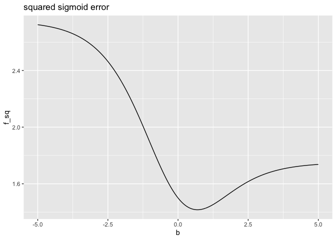
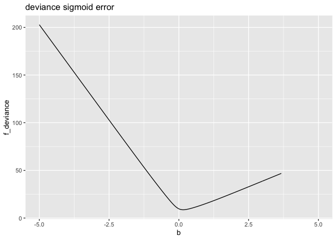

Square Error Example
================

``` r
library(ggplot2)
```

``` r
sigmoid <- function(x) {
  1/(1 + exp(-x))
}

d <- data.frame(
  x = c(0, 0, 0, 1, 1, 1),
  y = c(0, 0, 1, 0, 1, 1)
)

f_sq <- function(b, d) {
  sum( (d$y - sigmoid(b * d$x))^2 )
}

f_deviance <- function(b, d) {
  -2 * sum( d$y * log(sigmoid(b * d$x)) + 
            (1-d$y) * log(1 - sigmoid(b * d$x)) )
}
```

``` r
plt_frame = data.frame(
  b = seq(-5, 5, by = 0.01)
)

plt_frame$f_sq <- vapply(
  plt_frame$b,
  function(b) { f_sq(b, d) },
  numeric(1)
)

plt_frame$f_deviance <- vapply(
  plt_frame$b,
  function(b) { f_deviance(b, d) },
  numeric(1)
)
```

``` r
ggplot(data = plt_frame, aes(x = b, y = f_sq)) + 
  geom_line() +
  ggtitle("squared sigmoid error")
```

<!-- -->

``` r
ggplot(data = plt_frame, aes(x = b, y = f_deviance)) + 
  geom_line() +
  ggtitle("deviance sigmoid error")
```

<!-- -->
