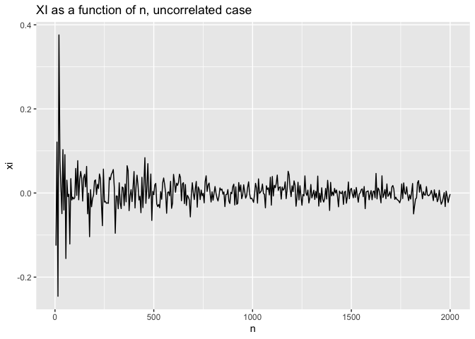

Exploring the XI Correlation Coefficient
================
Nina Zumel
12/27/2021

Recently, we’ve been reading about a new correlation coefficient, *ξ*
(“xi”), which was introduced by Professor Sourav Chatterjee in his
paper, [“A New Coefficient of
Correlation”](https://arxiv.org/abs/1909.10140).

The *ξ* coefficient has the following properties:

-   If *y* is a function of *x*, then *ξ* goes to 1 asymptotically as
    *n* (the number of data points, or the length of the vectors *x* and
    *y*) goes to Infinity.

-   If *y* and *x* are independent, then *ξ* goes to 0 asymptotically as
    *n* goes to Infinity.

Unlike traditional correlation coefficients, *ξ* does not assume that
the relationship between *x* and *y* is linear (or “linear-ish”); in
principle, it can be any functional relationship. This sounds useful!
Note, however, that *ξ* is **not** symmetric, and that *ξ* has no
concept of “anti-correlation.” The value of *ξ* can be negative, but
this negativity does not have any innate significance (other than being
“close to zero,” as we will discuss later).

So perhaps, rather than thinking of *ξ* as a “correlation,” we might
find it more useful to think of it as a measure of *dependence*:
specifically, the degree to which *y* is dependent on *x*.

In this post, we’ll run through some informal experiments to try to get
a sense of what different values of *ξ* might mean.

The questions we are interested in are:

-   How large does *n* have to be before we observe the asymptotic
    estimate?
-   What happens when the relationship between *x* and *y* is noisy?
-   Can we put a meaningful interpretation on values of *ξ* that are not
    0 or 1?

We’ll do our experiments in R, using the `calculateXI()` function from
the [`XICOR`](https://CRAN.R-project.org/package=XICOR) package.

## The Base Case: Functional relationship between *x* and *y*

We’ll take as our baseline the case *y* = cos (*x*), over two periods.
We chose this function because it’s a simple case that linear
correlation coefficients can’t handle: there is a clear relationship
between *y* and *x*, but it is highly non-monotonic (let alone linear).
In fact, for our selected range, the linear correlation between *x* and
cos (*x*) is zero.

<!-- -->

## The Test Case: Functional but noisy relationship between *x* and *y*

Now let’s add some noise to the base case; the noise is normally
distributed with zero mean and standard deviation *ϵ*. We’ll look at *ϵ*
in the range from 0.01 (very low amplitude noise) to 1 (high amplitude
noise, relative to the range of cos (*x*)). We’ll also add the noiseless
case, and the completely uncorrelated case, where *y* is normally
distributed noise, with no relationship to *x* whatsoever.

<!-- -->

In addition to varying *ϵ*, we’ll also vary *n*, the number of data
points, so that we can examine the relationship between *ξ* and the
amount of available data.

We’ll also estimate the asymptotic value of *ξ* (as *n* gets larger) for
each situation.

The R code to replicate these experiments is
[here](https://github.com/WinVector/Examples/blob/main/XICOR/xicor_explore.Rmd).
We use the function `XICOR::calculateXI()` to calculate *ξ*:

    # By default, the function sets a random seed
    # for reproducible results. seed=NULL
    # reinitializes the seed. It's not really what
    # I want, but <shrug>.

    xi = calculateXI(df$x, df$y, seed=NULL)

Here are the results:

<!-- -->

| eps          |    xi |
|:-------------|------:|
| 0            | 0.989 |
| 0.01         | 0.973 |
| 0.1          | 0.837 |
| 0.5          | 0.462 |
| 1            | 0.208 |
| uncorrelated | 0.000 |

Approximate asymptotic values of XI

From the noiseless and low noise (*ϵ* = 0.01) cases, we can see that *ξ*
asymptotes to a value very near 1 for *n* &gt; 500. In fact, I’d say
that *n* larger than about 250 is sufficient to get a good estimate of
*ξ* in the situations that we are looking at.

As the relationship between *x* and *y* gets noisier, *ξ* gets smaller,
but still converges to a value bounded away from zero. The general
interpretation seems to be that the closer *ξ* is to 1, the stronger the
functional relationship between *x* and *y* — but the important thing is
that *ξ* be bounded away from zero (and positive).

In the uncorrelated case, *ξ* converges to a value very near zero.

## The uncorrelated case

Let’s take a closer look at the uncorrelated case as *n* → ∞.

<!-- -->

The first observation is that *ξ* is negative about half the time in
this experiment. Overall, *ξ* varies symmetrically around zero, with the
bandwidth of the variation decreasing as *n* increases. This is
consistent with Theorem 2.1 of Professor Chatterjee’s paper:

> Suppose that *X* and *Y* are independent and *Y* is continuous. Then
> √*n* ξ → *N*(0, 2/5) in distribution as *n* → ∞

Prof. Chatterjee goes on to say, “It \[the convergence\] is roughly
valid even for *n* as small as 20.” Looking at the chart above, I might
still stick to *n* larger than about 250 or so.

## Significance tests

Of course, an actual significance test is more precise than eyeballing a
graph. The `XICOR::xicor()` function provides a significance test for
*ξ*, under the null hypothesis that *x* and *y* are independent.

Let’s try it on some large and small noisy data sets.

``` r
# function to pretty print the results from xicor()
# pval is the threshold for rejecting 
# the null hypothesis
xitest = function(x, y, pval) {
  xc = xicor(x, y, pvalue=TRUE)
  if(xc$pval < pval) 
    decision = 'REJECT'
  else
    decision = "DON'T REJECT"
  
  print(paste('xi =', xc$xi, ', p =', xc$pval))
  print(paste(decision, 'independence of x and y'))
  
}

# x and y uncorrelated
# tiny dataset, bigger dataset
uc_10 = nocorr_set(10)
uc_500 = nocorr_set(500)

# y noisily dependent on x
# tiny dataste, bigger dataset
noisy_10 = noisy_simple_set(10, eps=1)
noisy_500 = noisy_simple_set(500, eps=1)

# threshold for rejecting null hypothesis
p = 0.025
```

### *x* and *y* uncorrelated

Here, we don’t want to reject the hypothesis that *x* and *y* are
independent.

``` r
xitest(uc_10$x, uc_10$y, p)
```

    ## [1] "xi = -0.0606060606060606 , p = 0.616526035964085"
    ## [1] "DON'T REJECT independence of x and y"

``` r
xitest(uc_500$x, uc_500$y, p)
```

    ## [1] "xi = 0.0194040776163106 , p = 0.246346600669428"
    ## [1] "DON'T REJECT independence of x and y"

### *y* noisily dependent on *x*

Here, we’d like to reject the hypothesis that *x* and *y* are
independent.

``` r
xitest(noisy_10$x, noisy_10$y, p)
```

    ## [1] "xi = 0.0606060606060607 , p = 0.383473964035915"
    ## [1] "DON'T REJECT independence of x and y"

``` r
xitest(noisy_500$x, noisy_500$y, p)
```

    ## [1] "xi = 0.255445021780087 , p = 0"
    ## [1] "REJECT independence of x and y"

Notice that the `xicor` significance test didn’t successfully identify
the dependency between *x* and *y* in the tiny (*n* = 10) data set,
suggesting *n* less than 10 may be too small to guarantee convergence to
*ξ*’s asymptotic value with any statistical certainty.

## So what does this all mean?

Informally speaking:

-   If *n* is large enough (let’s say greater than 250), and *ξ* is
    large enough (say, greater than 0.25), then one can probably safely
    assume that *y* is dependent on *x*. Note that I am picking the
    values for “large enough” by unscientifically eyeballing the graphs
    above.

-   The closer to 1 that *ξ* is (for large enough *n*), the stronger the
    dependency.

-   If *n* or *ξ* are fairly small, one should use the *ξ*-based test of
    independence to decide.

Overall, the *ξ* correlation coefficient seems to be an effective and
fairly general score for determining the directional dependency of two
variables. While the paper does admit that the *ξ*-based significance
test for independence is not as powerful (in the statistical sense) as
other standard methods when the relationship between two variables is
smooth and non oscillatory, the method does excel at identifying
oscillatory and highly non-monotonic dependencies.

To quote the paper, the relative lack of power in identifying
non-oscillatory dependencies “is a matter of concern only when the
sample size is small,” which is a situation that tends not to arise in
data science and other “large data” applications. Furthermore, the *ξ*
calculations are fairly efficient (*n*log *n*, compared to some more
powerful methods, which are *n*<sup>2</sup>), giving them an advantage
in larger-data situations.

There are other aspects of *ξ* that might be considered disadvantages.
The calculation is not symmetric; it measures dependency in one
direction only. It also doesn’t have a notion of “anti-correlation”: it
will tell you if *y* is dependent on *x*, but not whether the
correlation between them is direct or inverse.

From a data science perspective, the *ξ* correlation and associated
significance test may prove to be useful for tasks like variable
selection, an application we hope to cover in a future post.
